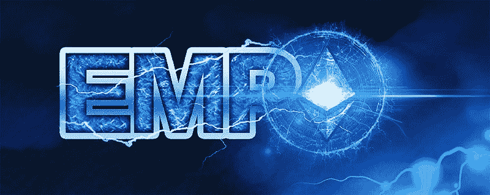
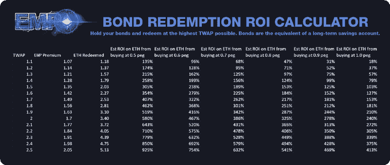
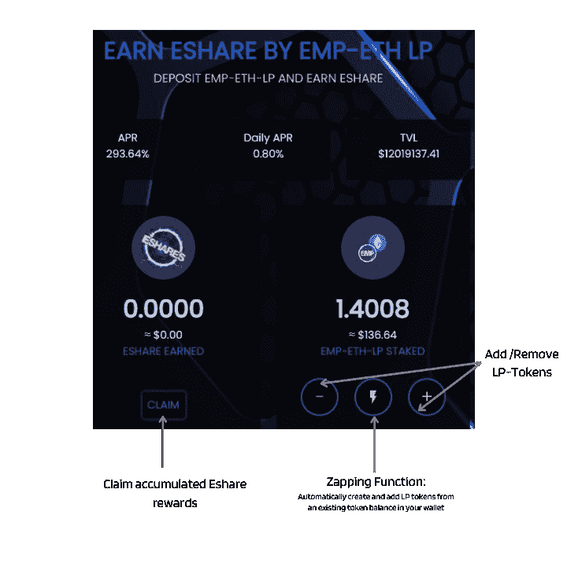
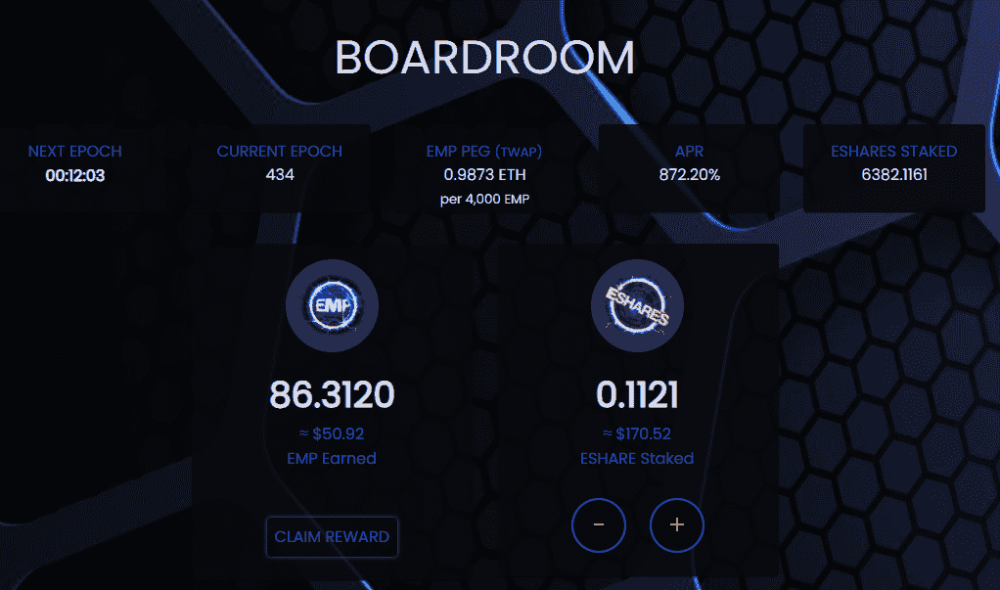
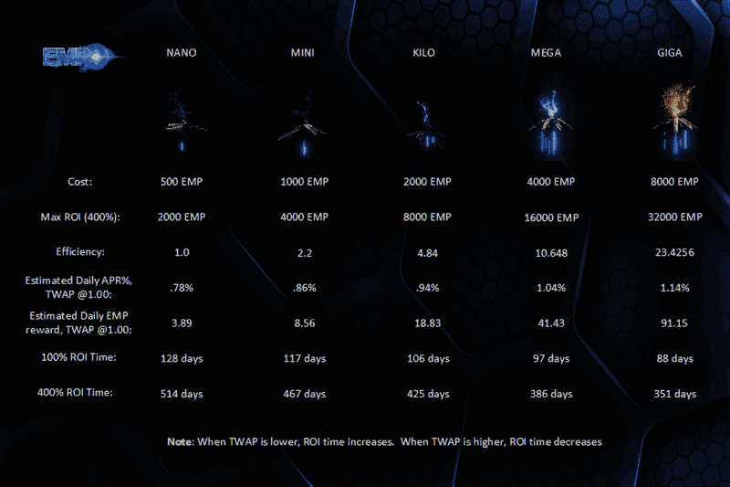
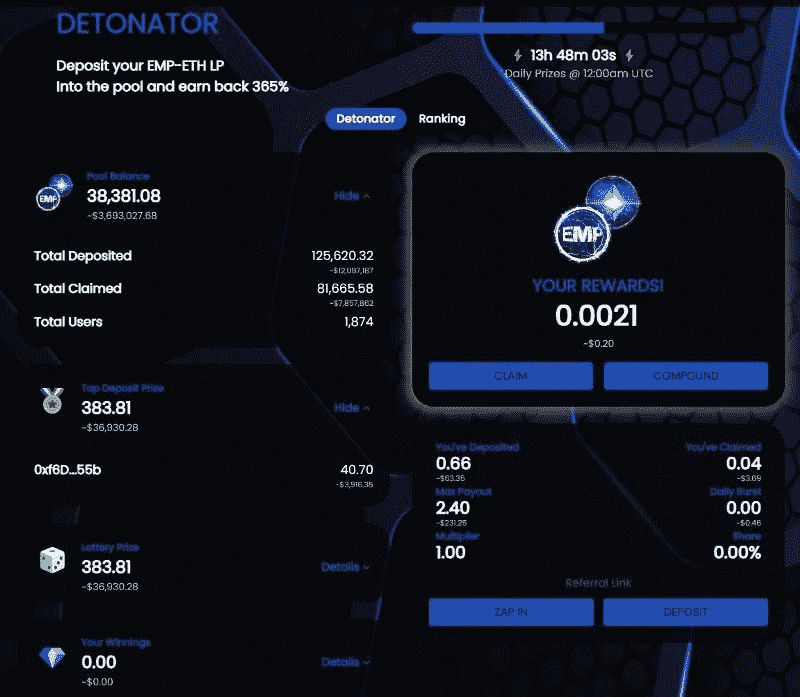
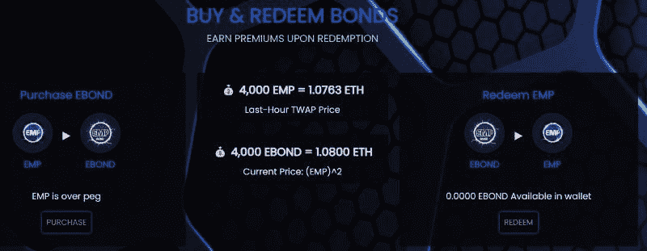
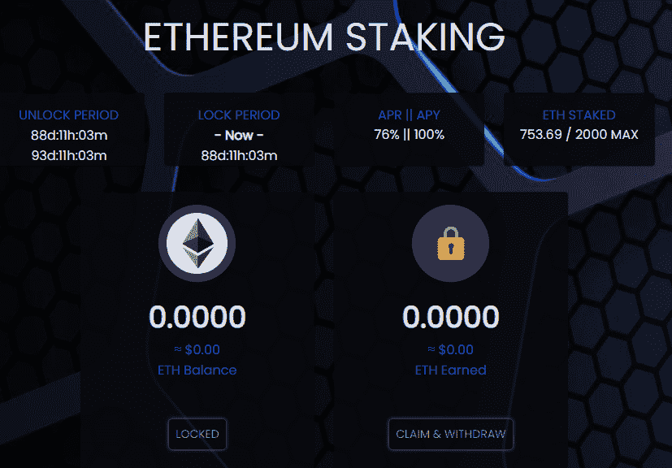
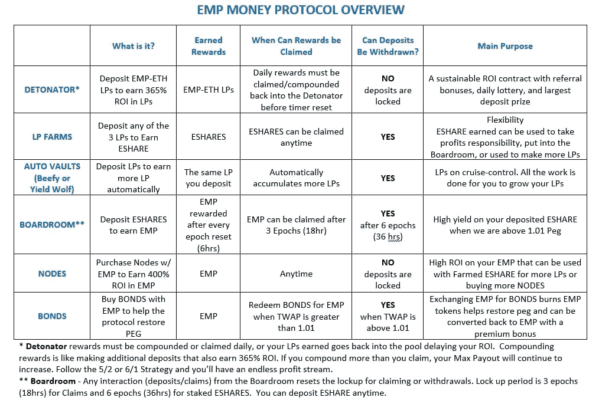

# EMP——一个值得关注的 DeFi 项目？

> 原文：<https://medium.com/coinmonks/emp-a-defi-project-worth-looking-at-561764f9e44f?source=collection_archive---------5----------------------->

## 一个 ETH 挂钩的 DeFi 项目，拥有一个令人惊叹的社区，持续的流动性和 1%的平均日 APR。了解它是什么，它是如何进行的，以及会发生什么。

首先，这篇文章的目的不是促销或财务建议。但是偶尔你会遇到一个有趣的项目，值得分享。在这篇文章中，我将提出一个新的和有前途的 DeFi 项目。是的，我个人也投入其中。我把我的嘴放在我的钱在的地方。

对于所有不熟悉 DeFi 的人，请查看我的区块链初学者指南！

 [## 区块链初学者指南——去中心化金融(DeFi)

### 了解你需要知道的关于 DeFi 的一切。了解术语、工作原理、优点和局限性。

medium.com](/coinmonks/the-blockchain-beginners-guide-decentralized-finance-defi-471e487f9d6c) 

# 什么是 EMP。钱？

简单地说，EMP 是一个 DeFi 项目，**将其本机令牌与以太坊**挂钩，并让你**通过**锁定流动性和赌注**支持协议**来获得被动收入。

开发者在他们的[白皮书](https://empmoneyv2.gitbook.io/emp.money/about/introduction)中这样描述这个项目:

> EMP Money 在币安智能链上提供了第一个分散的算法稳定硬币，通过铸币税以 4000 EMP: 1 ETH 的比率与以太坊的价格挂钩。
> 
> 该协议的底层机制旨在实现以下功能:
> 
> 确保实现 EMP:ETH 的挂钩
> 
> 维护它是为了将$EMP 建立为$ETH 的镜像流动资产。
> 
> 该协议通过其三个令牌和一个高级方法将独特的经济和以博弈论为中心的动态引入市场来实现这一点。
> 
> 该项目打算采用坟墓金融的理念，并通过避免 DeFi 的常见陷阱将其提升到一个新的水平。电磁脉冲。Money 寻求成为一个可持续的、缓慢增长的长期项目，而不是创始人的快速致富计划(由社区支付)。

# 令牌组学

该协议在币安智能链上运行，并使用两个本地令牌[**EMP**](https://bscscan.com/token/0x3b248cefa87f836a4e6f6d6c9b42991b88dc1d58)**和 [**EShares**](https://bscscan.com/token/0xDB20F6A8665432CE895D724b417f77EcAC956550) 。在某些条件下，该协议可以发布第三个令牌，称为 **EBonds。****

## **电磁脉冲(electromagnetic pulse)**

**EMP 是该协议的核心令牌和主力。通过算法以 4000:1 的比例与 ETH 挂钩(即 ETH 的 ETH = 1 EMP)。EMP 令牌的目标是为协议带来稳定性并减少价格波动。**

**通过锁定和下注不同的农场和池，EMP 令牌可用于赚取额外的 EMP 和 EShare。**

**由于 EMP 对生态系统至关重要，因此不建议大量出售或积极交易令牌。EMP 的负价格压力破坏了 EMP/ETH 的 peg 比率，并影响了协议的奖励系统。在“策略”部分会有更多的介绍。**

***注:这没有通过国债进行硬挂钩。钉住是基于一种算法，因此 EMP 不被认为是稳定的硬币！***

## **EShare**

**第二个令牌 EShare 可以看作是交易令牌。EShares 完全暴露于需求和供应，因此充当项目的“估价”令牌。他们的供应仅限于 28k 代币，所有代币将在项目的前 12 个月通过流动性池发行。**

**EShares 可以被押在一个叫做“会议室”的农场，在那里他们将获得可变的 APY，以 EMP 支付。**

**与 EMP 不同，买卖 EShares 不会影响协议的其余部分。**

## **电子书**

**电子债券仅在 EMP/ETH peg 低于 1.00 时生效，其目的是对 EMP 产生积极的价格压力，以收回积极的 peg。**

**一旦挂钩价格回升到 1.00 以上，这些债券就可以再次出售，如果一直持有到挂钩价格高于 1.10，它们将支付额外的红利**

****

**来源:[https://EMP money v2 . git book . io/EMP . money/protocol/bond-mechanism](https://empmoneyv2.gitbook.io/emp.money/protocol/bond-mechanism)**

**该债券的目的是为 EMP 代币创造积极的价格压力，同时锁定它们，直到 peg 恢复。**

**现在我们已经理解了记号组学，让我们看看我们可以用这些记号做什么。首先，我们将看看不同的农场和游泳池，然后是一些关于如何参与协议的提示以及我的个人策略。**

# **农场和游泳池**

**电磁脉冲。金钱提供了多种赚取收益的方式，无论是通过单一令牌赌注、流动性池还是节点。在这一节中，我们将分别看一下每个农场和游泳池。**

## **农场**

**[农场](https://empmoneyv2.gitbook.io/emp.money/protocol/platform)是该协议的流动性提供者。在这里，ETH 和 BNB 与协议本地令牌配对，允许市场中有足够的流动性。**

**该协议目前提供三种农场:**

## ****EMP-ETH-LP/EShare-BNB-LP/EMP-EShare-LP****

**顾名思义，您将协议本机令牌 EMP & EShare 与它们自己配对，或者与 ETH 和 BNB 配对。**

**由于农场使用 LP 令牌，因此熟悉非永久性损失这一主题非常重要。这个话题很重要，特别是对于易变的配对，比如 EShare-BNB LP。你可以在[币安学院](https://academy.binance.com/en/articles/impermanent-loss-explained)上找到关于这个话题的很好的教程。**

**为了与农场合作，你需要通过 EMP 上每个农场的“切换”功能来配对现有的代币余额。货币用户界面(UI)，或手动通过 PancakeSwap。**

****

**Farm UI ([https://emp.money/farm](https://emp.money/farm))**

**根据潜在 LP 的波动性，每个农场每天支付可变的 APR，并将向你支付**EShare**——在你方便的时候可以要求出售或再投资到董事会的代币。**

**主要特点:**

*   ***无流动性锁定***
*   ***相对较低但稳定的 4 月份***
*   ***赚 EShare***

## ****董事会会议室****

**董事会会议室是会议的心脏，也是你唯一可以分享自己经历的地方。与农场相反，会议室会奖励你 EMP 代币。**

**为了稳定起见，会议室有一个时间锁定功能。对于提款，锁定期为 36 小时，对于奖励申请，锁定期为 18 小时。存款可以在任何时候进行，但是他们会重置 36 小时取款计时器。**

**董事会拥有最高的 APR，但鉴于 APR 和 EShare 价格的波动性，其风险也最高。董事会是挂钩比率真正发挥作用的地方。只有当 PEG > 1 时，才会支付赌注奖励。一旦钉住汇率低于这个阈值，它将停止支付，直到钉住汇率恢复。此外，电子股票的高波动性会影响你的投资价值。**

**董事会会议室有退出锁定期，每次互动后生效；**

*   **将 ESHARE 存入/取出董事会会议室将锁定 ESHARE 6 个时代(36 小时)和 EMP 奖励 3 个时代(18 小时)。**
*   **EMP 奖励将重新锁定 6 个时期，下一次 EMP 奖励只能在 3 个时期后获得**

****

**Boardroom UI ([https://emp.money/boardroomV2](https://emp.money/boardroomV2))**

## **节点**

**[节点](https://empmoneyv2.gitbook.io/emp.money/protocol/nodes)被引入 EMP。钱只是最近，并以某种方式运作，你承诺锁定初始数量的雇员令牌。作为回报，该协议将奖励您稳定的回报(ROI)和最高 400%的支出。**

***需要注意的是* ***锁定的金额是无法取回的！*****

*****最大利润= Max。支付—存款*****

**节点有不同的大小，即最小。存款要求。尽管每个节点都具有相同的特征，并且最多支付 4 倍的存款，但较大节点上的内置乘数可达到最大值。付款更快。下图很好地展示了不同的节点大小如何影响最大时间。支付。**

****

**Source: [https://empmoneyv2.gitbook.io/emp.money/protocol/nodes](https://empmoneyv2.gitbook.io/emp.money/protocol/nodes)**

**节点的锁定功能起初看起来令人恼火，但背后的原因是减少电磁脉冲的流通，同时鼓励人们持有电磁脉冲。**

**主要特点:**

*   ***永久性流动性锁定***
*   ***四月平均稳定***
*   ***麦克斯。400%的投资回报率***
*   ***较大的节点达到最大。投资回报率更快***

## **雷管**

**[Detonato](https://empmoneyv2.gitbook.io/emp.money/protocol/detonator)r 基本上是一个流动性锁定池，具有最大值。并与每日彩票相结合。这也是唯一一个在转介系统上工作的池，如果转介将资产存入雷管合同，该系统将提供额外的好处。**

**工作很简单。通过 Zap-In 或存款按钮存款 EMP-ETH-LP 代币，并在世界协调时上午 12 点计时器重置之前，每天申领或计算您的奖励。**

**与 Nodes 类似，您的初始资本被永久锁定，只有 EMP 代币中的利息和奖金可以兑现，直到您获得 365%的投资回报率。**

**雷管唯一的缺点是依赖 UTC 时区，这对于作为欧洲公民的我来说是一个小小的不便。**

****

**Detonator UI ([https://emp.money/detonator](https://emp.money/detonator))**

**主要特点:**

*   ***永久性流动性锁定***
*   ***每日彩票价格***
*   ***每日最大新存款奖励***
*   ***稳定的平均 APR，乘数取决于您的池份额***
*   ***引荐奖励制度***

**如果你考虑使用雷管，请随时使用我下面的推荐代码:**

**[https://emp.money/detonator?ref = 0x86b 1175153 E1 ed 7 B1 C2 e 61 cc7 DC 6 f 370 CB 00 BD 19](https://emp.money/detonator?ref=0x86B1175153e1ED7b1C2E61cC7dc6F370cb00bD19)**

## **结合**

**如前所述，[债券](https://empmoneyv2.gitbook.io/emp.money/protocol/bond-mechanism)仅在挂钩比率低于 1.00 时发挥作用。**

**债券提供了将 EMP 代币兑换成电子书的可能性。一旦钉住汇率恢复并移动到 1.01 以上，这些债券就可以被出售以取回 EMP 代币。挂钩越高，奖励越高。**

**电子书有助于为生态系统带来稳定，并刺激 EMP 持有者不出售他们的代币，从而产生额外的价格压力。**

****

**Bond UI ([https://emp.money/bond](https://emp.money/bond))**

## **自动保管库**

**电磁脉冲。Money 与 YieldWolf 合作，在 ETH-EMP、BNB-EShare 和 EMP-Eshare 上提供[auto vault](https://yieldwolf.finance/bsc/emp-money)。**

**背后的想法是，用户不必要求他们的和手动复合他们的奖励。取而代之的是，您将 LP 代币存入保险库，复利会自动为您完成。**

**对于那些不想持续与协议交互的人来说，这是一个理想的解决方案。**

## **ETH 打桩**

**ETH 单令牌桩是 EMP 团队的最新成员。该农场旨在通过为 ETH (BEP-20)令牌提供 90 天固定利息赌注来进一步加强协议的资金。**

**资金池每季度支付 19%的固定利率。锁定期过后，用户有 5 天的索赔窗口。无人认领的股份和利息将自动续期 90 天。**

**锁定期间有紧急提现功能。然而，这是以 50%的存款资产和任何应计利息被放弃的陡峭价格。**

**该农场的限额为 2.000 ETH，超过该限额后，它将不再接受任何额外的存款。**

****

**ETH Staking UI ([https://emp.money/stake](https://emp.money/stake))**

# **社区**

**在考察 DeFi 项目时，项目背后的社区是关键。在我看来这就是 EMP。钱比其他的多。**

**我个人从第一天起就对该协议投入了大量的精力，确切地说，是在撰写本文的第 105 天。从那以后，社区从未失望过。无论是通过开发人员的“问我任何事情”( AMA)会议，还是简单地通过 Discord 和电报从其他成员那里获得信息。**

## **电报聊天&不和谐**

**自从协议和社区交付了。虽然只有大约 4200 名成员，但[电报组](https://t.me/empmoney)非常活跃。与其他项目不同，聊天室里充满了有用的信息，背后有一个高度响应的开发团队。任何关注和问题都会得到迅速解决，团队承诺每周 AMA 的。**

**到目前为止，聊天已经幸免于垃圾邮件和废话，整个社区有一个非常积极的感觉。没有谈论通常的“当蓝宝”或“当月亮”，而是关于可持续性和参与战略。**

**事实上，该协议对推荐人没有什么激励，这使得“Shill-Army”至今敬而远之。对作为投资者的我来说，这正是我对一个成熟的 DeFi 协议、可持续性和通过创新创造价值的期望，而不是通过膨胀的营销计划。**

**还有一个非常活跃的[不和组](https://discord.gg/VEYuT395hD)，值得去看看，并与开发者和其他社区成员联系起来。**

## **创新ˌ革新**

**开发团队已经多次证明听取社区反馈，并大力推动功能的可访问性和易用性:**

*   ****Zap-in** 功能可让您自动创建 LP 代币，而无需手动配对代币**
*   **通过**“执行策略”**按钮，您可以创建 LP 令牌，并在农场和会议室之间自动分配它们**
*   **一个全新的完全重新设计的**UI**正在制作中，应该会在未来几周内发布。预告视频[此处](https://www.youtube.com/watch?v=92iBLGH4IFw)。**
*   **EMP 学院 ，这是一个完全免费的在线教程，向新人介绍该协议的所有功能和福利。**

# **总结和结论**

**在参与这个项目 100 多天之后，我真的建议你去看看。**

**对我来说，这个项目拥有一个坚实的 DeFi 项目所需要的所有关键要素。Dev 的开放性和透明性是一个巨大的舒适因素，迄今为止从未令人失望。**

**有人可能会说，有两个本机令牌和多个农场和池可供选择的设置一开始可能会令人望而生畏。我不会撒谎，一开始我也是这样。但是 EMP 学院是熟悉这个过程的一个很好的工具。如果这还不够，请求助于非常有用的社区。**

**以下协议概述是社区贡献的一个很好的例子，最近在 telegram group 上分享。**

****

**Source: [https://empmoneyv2.gitbook.io/emp.money/getting-started/emp.money-overview](https://empmoneyv2.gitbook.io/emp.money/getting-started/emp.money-overview)**

**不仅仅是财务建议，EMP 团队甚至推出了一个流程图[来说明如何成为生态系统的一部分以及如何执行协议。](https://www.youtube.com/watch?v=8qd49DgG_h0)**

**该协议的回报符合承诺，从一开始我平均每天跑大约 1%。肯定还有更有利可图的 DeFi 项目。但作为一名投资者，你必须经常问自己，承诺的回报会带来多大的风险？这是普遍适用的，无论是传统的金融、房地产还是在这种情况下的加密。**

**好了，这就是 EMP DeFi 项目的概要。我相信这篇文章对你有帮助，如果你有任何问题或建议，请随时使用评论区或给我发邮件。**

****作者的一句话:**
欢迎随时联系我或者在评论区发起对话！**

**请务必订阅并访问我们关于 Medium.com 的其他文章**

**加入 Telegram、脸书、Instagram 和 Twitter 上的“街区内部”,了解 crypto 和区块链。(下面的链接)**

** [## 在块内部|链接树

### 穿越噪音&提供关于区块链、Web 3.0、NFTs 和 DeFi 的信息

linktr.ee](https://linktr.ee/Insidetheblock) 

[在社交媒体上联系 Block 内部和真实所有可用的文章](https://linktr.ee/Insidetheblock)！

*免责声明:本文中的任何信息都是基于我的个人经验，并根据我的知识和能力出于个人兴趣而撰写的。本文没有宣传目的，不代表投资建议，文中提到的任何名称、品牌和报价仅用于说明目的。小心使用任何相关链接，风险自负。永远做你自己的研究。*

> 加入 Coinmonks [电报频道](https://t.me/coincodecap)和 [Youtube 频道](https://www.youtube.com/c/coinmonks/videos)了解加密交易和投资

# 另外，阅读

*   [加密货币储蓄账户](/coinmonks/cryptocurrency-savings-accounts-be3bc0feffbf) | [YoBit 审核](/coinmonks/yobit-review-175464162c62)
*   [Botsfolio vs nap bots vs Mudrex](/coinmonks/botsfolio-vs-napbots-vs-mudrex-c81344970c02)|[gate . io 交流回顾](/coinmonks/gate-io-exchange-review-61bf87b7078f)
*   [CoinFLEX 评论](https://coincodecap.com/coinflex-review) | [AEX 交易所评论](https://coincodecap.com/aex-exchange-review) | [UPbit 评论](https://coincodecap.com/upbit-review)
*   [AscendEx 保证金交易](https://coincodecap.com/ascendex-margin-trading) | [Bitfinex 赌注](https://coincodecap.com/bitfinex-staking) | [bitFlyer 点评](https://coincodecap.com/bitflyer-review)
*   [Bitget 回顾](https://coincodecap.com/bitget-review)|[Gemini vs block fi](https://coincodecap.com/gemini-vs-blockfi)cmd |[OKEx 期货交易](https://coincodecap.com/okex-futures-trading)
*   [AscendEx Staking](https://coincodecap.com/ascendex-staking)|[Bot Ocean Review](https://coincodecap.com/bot-ocean-review)|[最佳比特币钱包](https://coincodecap.com/bitcoin-wallets-india)**