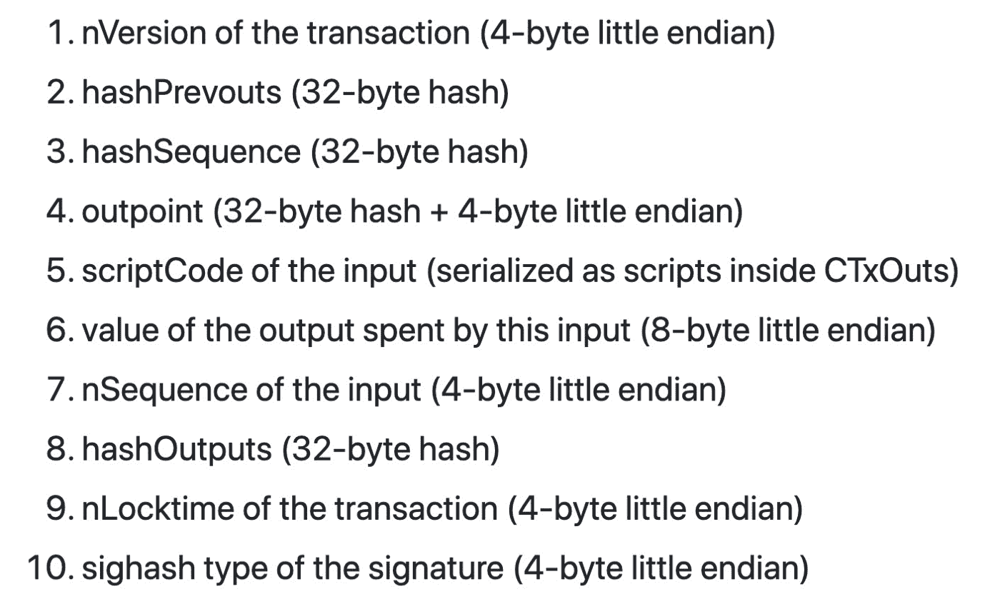
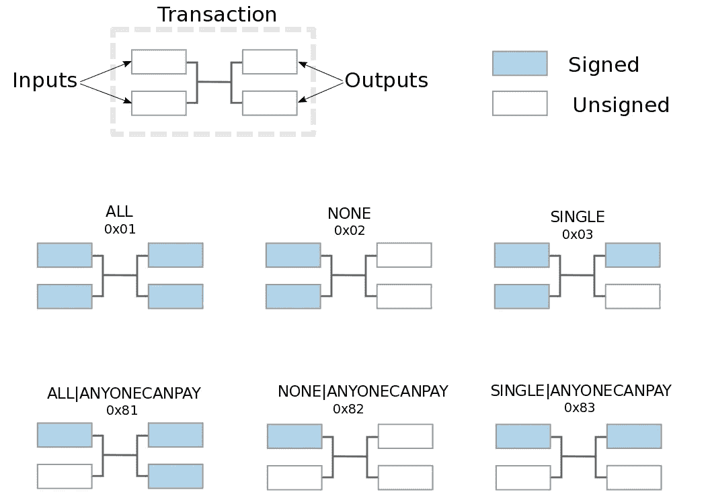

# 模拟任何不带分叉的 SIGHASH 标志

> 原文：<https://medium.com/coinmonks/emulate-any-sighash-flag-without-a-fork-568fa624039f?source=collection_archive---------5----------------------->

## 通过在智能合同中对其进行编程

我们开发了一种新的方法来模拟任何 SIGHASH 标志，只需在智能契约中简单地编码逻辑。它不需要更改协议，因此比每次构思新的用例时通过 fork 添加硬编码标志更加实用和灵活。

# SIGHASH 标志

一个 [SIGHASH](https://wiki.bitcoinsv.io/index.php/SIGHASH_flags) 标志决定签名对事务的哪一部分进行签名。具体来说，它控制签名涵盖以下 10 项中的哪一项。

[SigHash Preimage Format](https://github.com/bitcoin-sv/bitcoin-sv/blob/master/doc/abc/replay-protected-sighash.md#digest-algorithm)

有三个基本标志: *SIGHASH_ALL、SIGHASH_NONE 和 SIGHASH_SINGLE* 。还有一个修改器标志 *SIGHASH_ANYONECANPAY* ，产生六种组合。

[Summary of different sighash combinations](https://github.com/bitcoinbook/bitcoinbook/blob/develop/ch06.asciidoc#signature-hash-types-sighash)

有人提议添加更多的标志，以定制在现有标志下不可能签署的交易的各个部分。下面列出了一个例子:

[Proposed Flags](https://github.com/scmorse/bitcoin-misc/blob/master/sighash_proposal.md)

然而，它们中的每一个都必须在节点软件中硬编码，因此需要一个潜在的有争议的分支。

# 模拟任何 SIGHASH 标志

我们提供了一个框架来模拟任意的 SIGHASH 标志。新的 SIGHASH 标志可以简单地以智能合约的形式添加，因此根本不需要升级比特币。总的来说，它分三步工作:

1.  使用 [OP_PUSH_TX](http://OP_PUSH_TX) 获取当前 sighash
2.  根据新的标志语义修改/屏蔽 sighash
3.  使用 ECDSA 签名算法，对照新的 sighash 检查签名。

作为一个例子，我们实现了 *SIGHASH_ANYPREVOUT* 。

## SIGHASH _ ANYPREVOUT

在 [BIP-118](https://github.com/bitcoin/bips/blob/master/bip-0118.mediawiki) 中的 *SIGHASH_ANYPREVOUT* (之前命名为 *SIGHASH_NOINPUT* )从签名中排除了正在使用的 UTXO 的标识符。与之签署的交易不链接到特定的 UTXO，并且可以花费来自具有相同公钥(或花费条件)的地址的任何 UTXO。

例如，当用户想要授权第三方应用程序使用她的硬币时，可以使用这种方法。她可以使用 *SIGHASH_ANYPREVOUT* 进行预签名，当她不在时，应用程序可以重复使用该签名。

下面的契约检查输入签名(即 *Sig sig* )没有覆盖正在花费的 UTXO，相当于使用 *SIGHASH_ANYPREVOUT* 进行签名。

UniversalSighash Contract

第 1 步:第 10 行确保 *sighash* 用于使用 OP_PUSH_TX 的当前事务。

第 2 步:第 13–17 行将 *sighash* 的第 2、3 和 4 项设置为全 0，即消除输入 UTXO。

步骤 3:第 20 行使用[椭圆曲线库](https://xiaohuiliu.medium.com/elliptic-curve-arithmetic-in-script-cb0ab37e4f63)确保签名完全覆盖新的 sighash。相当于 BTC 上的 [OP_CHECKSIGFROMSTACK](https://diyhpl.us/wiki/transcripts/bitcoin-core-dev-tech/2019-06-06-noinput-etc/) 或者 BCH 上的[OP _ DATASIGVERIFY](https://github.com/bitcoincashorg/bitcoincash.org/blob/master/spec/op_checkdatasig.md)/[OP _ CHECKDATASIG](/@Mengerian/the-story-of-op-checkdatasig-c2b1b38e801a)。

## 展开性

同样的方法可以扩展到模拟任何标志。比如消隐项 2 和 3 等于 *SIGHASH_ANYONECANPAY* ，消隐项 6 本质上是 SIGHASH_WITHOUT_PREV_VALUE。比特币智能合约的表现力启用任意标志。

> 加入 Coinmonks [电报频道](https://t.me/coincodecap)和 [Youtube 频道](https://www.youtube.com/c/coinmonks/videos)了解加密交易和投资

# 另外，阅读

*   [8 大加密附属计划](https://coincodecap.com/crypto-affiliate-programs) | [eToro vs 比特币基地](https://coincodecap.com/etoro-vs-coinbase)
*   [最佳以太坊钱包](https://coincodecap.com/best-ethereum-wallets) | [电报上的加密货币机器人](https://coincodecap.com/telegram-crypto-bots)
*   [交易杠杆代币的最佳交易所](https://coincodecap.com/leveraged-token-exchanges) | [购买 Floki](https://coincodecap.com/buy-floki-inu-token)
*   [3Commas 对 Pionex 对 Cryptohopper](https://coincodecap.com/3commas-vs-pionex-vs-cryptohopper) | [Bingbon 评论](https://coincodecap.com/bingbon-review)
*   [加密复制交易平台](/coinmonks/top-10-crypto-copy-trading-platforms-for-beginners-d0c37c7d698c) | [如何在 WazirX 上购买比特币](/coinmonks/buy-bitcoin-on-wazirx-2d12b7989af1)