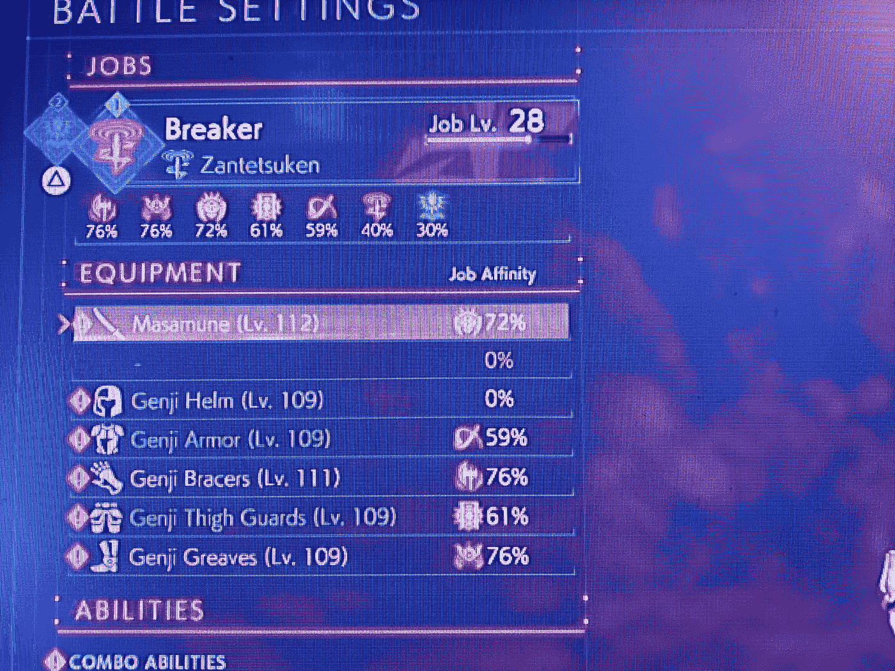

# 残局和无限混沌；FF 起源的强大。

> 原文：<https://medium.com/coinmonks/endgame-and-infinite-chaosbringer-the-overpower-in-ff-origins-f8cb8fe152ce?source=collection_archive---------8----------------------->

*在此之前，赞铁拳！*

好了，伙计们，我有很多要讲的，但首先，我今天早上在 4a 后一点点打败了最终幻想起源:天堂的陌生人。游戏的最后两关很棒，但我超越了自己。

首先，我有一些建议给你，如果你开始掌握你的最后两份工作和他们的…