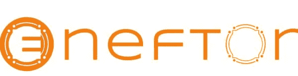

# ENEFTOR |埃尔隆德区块链上的首个 NFT 生态系统

> 原文：<https://medium.com/coinmonks/eneftor-first-nft-ecosystem-on-elrond-blockchain-4cb727e4e5fd?source=collection_archive---------36----------------------->

今天我们将谈论一个来自埃尔隆德·区块链的非常有趣的项目，我希望这篇文章能帮助你更清楚地了解 Eneftor，这是一个通用平台，旨在成为每个爱好者在埃尔隆德网络上铸造收藏品、创建、购买和销售 NFT 所需的中心。

Eneftor 带有生成集合的工具和一个 NFT 人工智能生成器。因为 Eneftor 是关于人类的，从人类到人类，该团队希望通过我们的 NFT 超级英雄社区，通过创建和维持特殊的收藏和拍卖，为慈善事业筹集资金。

**市场**

Eneftor 生态系统承诺将汇集 NFT 区一些最常见的活动。在我们看来，作为一名 Eneftor 用户，您可以在一个地方完成与 NFTs 交互所需的一切工作，而不需要开发团队:

*   使用我们的 creator 工具创建集合和 NFT
*   启动和管理您的可铸造收藏
*   直接或通过拍卖买卖
*   从众筹版块为慈善活动捐款
*   轻松接触和管理您的社区
*   进入空投的黄金地带
*   投资 launchpad 的项目或列出你自己的 NFT 项目

Eneftor 生态系统的核心组成部分之一是市场。在这里，他们希望建立一个简单有效的 NFT 交易平台。市场仪表板在电子市场仪表板中，您可以找到埃尔隆德网络上的所有 NFT，并直观显示它们的详细信息。此外，在“待售”过滤器的帮助下，你可以找到你能在市场上买到的 NFT。

**创建者仪表板**

在 Eneftor 平台中，他们将包括一个 creator dashboard，使用户能够在没有编码知识的情况下创建集合及其 NFTs。这听起来很棒，也很简单。它让艺术家能够在区块链上发布他们的创作，而不需要开发团队，因此他们可以完全专注于创作和推广他们的艺术。因此他们希望帮助和推广有才华的艺术家。

**NFT 人工智能生成器**

因为每个人都相信 NFT 有可能在未来被全世界采用，所以他们希望在我们的人工智能生成器的帮助下，帮助人们生成所有类型的媒体 NFT。

**Launchpad Investo**

Eneftor Launchpad 将汇集投资者和 NFT 的项目。他们希望建立一个地方来集中相关的 NFT 项目，通过向投资者成员提供从一开始就支持和参与未来项目的机会来帮助他们取得成功。该平台将为创始人和投资者提供安全保障，因为所有上市项目都将接受详细而严格的验证。

**众筹行善**

因为 Eneftor 是关于连接人们的，他们将专门为慈善事业筹集资金的平台的一部分。在 Unified platform 的这一部分，团队打算通过帮助个人和非营利组织通过使用区块链和社区筹集资金来帮助解决现实世界的问题，而不仅仅是商业项目，而不收取额外的费用。从视频描述中去检查我们的社交媒体频道，并跟随那里获得我们发布的最新信息和新闻。

**记号组学**

Eneftor 令牌是 EFTR，它将成为统一 NFT 生态系统中的主要货币，因为它的使用将带来许多好处和折扣，如下文所述。最大供应量为 400，00 0，000 EFTR，并且不能铸造更多的代币，因此其价格可以根据 Eneftor 项目的增长而增加。EFTR 令牌是生态系统的核心部分，它的一些实用程序是:免费办理 NFTs 为了鼓励采用 EFTR 令牌，所有通过 EFTR 令牌完成的 NFT 交易将永远免费。EGLD 交易将是免费的，直到 EFTR 在 Maiar 交易所上市，在此之前，使用 EGLD 的每笔 NFT 交易将收取 1%的费用。

**赌注**将有特别的社区空投，每个 EFTR 持有者将自动成为参与者。考虑到每位参与者拥有的 EFTR 代币数量，礼物和奖励将通过伪随机算法进行分配。

**独家系列**

我们的目标是为我们的社区创建几个 NFT 收藏，并将它们分发给成员，因此只有 EFTR 令牌持有者才能访问这些独家收藏，并能够参加私人活动。

获得分配并投资于我们的启动板上列出的 NFT 项目。启动板将使 NFT 项目更接近社区，展示并帮助他们有一个良好的开端。每个参与者的分配将主要取决于他们持有的 EFTR 的数量。

**获取早期用户优惠**

EFTR 持有者会有一些优势和好处。该团队的目标是鼓励采用令牌，因此第一个 EFTR 持有者将有资格早期采用神秘的优惠。

**关于预售**

将有 3 轮销售:种子销售、售前 1 和售前 2，共计 10%的代币。为了避免价格倾销或操纵，团队将有一个令牌的归属期。所有 3 个回合之后将是 EFTR 的 Maiar 交易所上市。为了不厌烦许多数字和细节，所有关于预售和 tokenomics 的信息都可以在该项目的白皮书中找到，在我们的描述中。我要告诉你一件重要的事情，售前第 2 部分正在进行。

**关于团队**

该团队在网站上是可见的，开发人员的名字附有他们的照片，值得欣赏的东西，关于他们的更多细节，你可以在 LinkedIn 上看到。共同创始人是纳西斯·奇特斯库和埃里克·亨宁。他们基本上是工程师。除了这两个人，团队还包括软件工程师和业务顾问。

该项目似乎非常雄心勃勃，前景广阔，到目前为止，该团队已经完成了路线图中的所有计划，当然还会有其他计划。在这个项目的好处中，我们想指出的是:

*   恩夫托是一个完整的生态系统
*   EGLD 交易费用低，EFTR 交易费用为零
*   创建收藏不收取额外费用
*   NFT 收藏创作工具
*   社区管理工具

在他们的网站上，你可以看到我向你展示的一切，他们制定了什么计划，以及他们想要实现什么。我们祝愿他们成功。

感谢您的阅读，下次见，请保管好您的钱！

**|** [**网站**](https://www.b-successful.com/)**|**[**YouTube**](https://www.youtube.com/channel/UCWrfC_w5wVnrOr8jy0ICoDw)**|**[**推特**](https://twitter.com/BSuccessful_)**|**[**insta gram**](https://www.instagram.com/bsuccessful.crypto/)**|**[**电报**](https://t.me/+NQbP3V_iaKQwMDYy) **|** [**脸书**](https://www.facebook.com/Bsuccesful/?_rdc=2&_rdr)

> 加入 Coinmonks [电报频道](https://t.me/coincodecap)和 [Youtube 频道](https://www.youtube.com/c/coinmonks/videos)了解加密交易和投资

# 另外，阅读

*   [如何在 Uniswap 上交换加密？](https://coincodecap.com/swap-crypto-on-uniswap) | [A-Ads 评论](https://coincodecap.com/a-ads-review)
*   [加密货币储蓄账户](/coinmonks/cryptocurrency-savings-accounts-be3bc0feffbf) | [YoBit 评论](/coinmonks/yobit-review-175464162c62)
*   [Botsfolio vs nap bots vs Mudrex](/coinmonks/botsfolio-vs-napbots-vs-mudrex-c81344970c02)|[gate . io 交流回顾](/coinmonks/gate-io-exchange-review-61bf87b7078f)
*   [CoinFLEX 评论](https://coincodecap.com/coinflex-review) | [AEX 交易所评论](https://coincodecap.com/aex-exchange-review) | [UPbit 评论](https://coincodecap.com/upbit-review)
*   [AscendEx 保证金交易](https://coincodecap.com/ascendex-margin-trading) | [Bitfinex 赌注](https://coincodecap.com/bitfinex-staking) | [bitFlyer 审核](https://coincodecap.com/bitflyer-review)