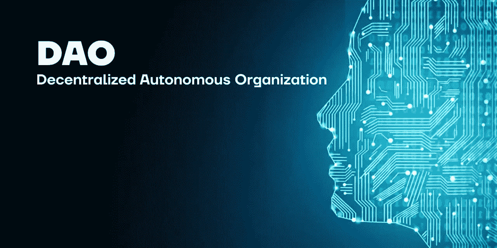

# 工程阿卡拉道

> 原文：<https://medium.com/coinmonks/engineering-the-acala-dao-9053c7c1317d?source=collection_archive---------46----------------------->

~dwulf

DAO

随着目前 DOT 的增加，DOT 的抵押品现在有更多的灵活性来铸造澳元和支撑 Acala 网络上的流动性池。然而，如果没有 XCM，很难将液体移出 Acala 副链，除非一只猴子分支并切换到 ACA，并将该 ACA 移动到外部网络。

但我对 DAO capital seed 的情况感到满意，4 月份 ACA-aUSD 流动性对的上涨促使我校准我的资本效率，铸造更多的 aUSD，并用其中的 50%交换 ACA 硬币/代币，并增加我的 ACA-aUSD 流动性对。

我非常小心地在我的抵押品比率上保持一个宽的保证金阈值，我们毕竟处于混乱的时代，所以 Acala 神谕的任何波动都可以在很大程度上避免。

**ACA 奖励的 ACA 赌注**

当然，任何不属于 ACA-aUSD 流动性对的 ACA 都被放入其自己的抵押品库，用于下注和赚取更多 ACA 回报，相当稳定地保持在 13%左右，仍然超过 8%的美元通胀率。

更有可能的是，我将美元成本平均，更多的点，以增加抵押品比率，并获得更多的澳元，更多的点，LCDOT，和 ACA。为它们各自的货币对注入流动性池，并将其余资金投入 ACA。

ACA 赌注的忠诚度奖励将于 6 月份发放，其他流动性组合 ACA-aUSD、aUSD-LCDOT 和 DOT-LCDOT 的忠诚度奖励将于 8 月份发放。我没有理由去碰那些股份，他们需要在我从他们那里借钱用于除了加密再投资之外的任何事情之前建立更多的股份。

**1/3 债务，2/3 资本缓冲**

一直徘徊在一个强大的担保地位，为道，1/3 的资产债务和 2/3 的资本缓冲。当头寸变得如此庞大时，贷款就可以作为真实资产的杠杆(B&B 航空公司的租赁资产、商业设备、库存资本等)。)，那么那些现实世界的资产将是绿妖道的一部分。

我认为这种债务与流动资本的比率是安全的，可以保持道的流动性，对具有强大效用和坚实估值的新硬币/代币具有充足的购买力。DAO 的重点是寻找和实现创收的加密资产，这将包括 NFT、加密游戏资产和更奇特的硬币/代币(又名狗屎硬币)。

**硬币/代币价差**

DOT 是最大的，支持大部分抵押品。当然，Acala、Astar 和 Nodle 平台令牌都赢得了各自的 parachain slot，并在 Polkadot 区块链上有坚实的参考。

宇宙和渗透也在我的轮桶中，当到宇宙网络的适当桥梁被敲定并链接到 Polkadot 时，它将使对 DAO 的那些加密资产的管理更加集中并且更容易管理。目前，我的 Cosmos 持股分散在 Atomic、Keplr 和 Osmosis DEX，当一切就绪时，我会咬紧牙关，在 21 天的冷却时间内解散，并将它们分配到更有利可图、更高收益率的流动性对池中。就目前而言，我不希望他们停止生产目前的产量。

以太坊正在扮演更多的实用气体角色，所以我在以太坊拥有的大量财富现在大部分是点和原子。

当然，随着 BTC stack sat 的每日提示，直到 BTC 包装在波尔卡多特变得更加主流，所以我可以更容易地使用我的 BTC 作为抵押品，因为我曾经大步成为 1 BTC 俱乐部的一部分。老实说，我已经掌握了资本财富交易的关键，并在替代硬币中搅动价值，以积累财富，并利用赌注和流动性池回报。

**结论**

继续耕种的产量和赌注奖励，美元成本平均 a 你可以。大事情正在发生，绿女巫道正在被拼凑起来，并考虑到资本生成。

构建 DAO 的思想，加强其神经网络和自动化交易是游戏的名称，DAO 承包商和代理人的菲亚特桥梁仍需要解决，但混乱的监管系统使其成为一个工程问题，而更多的是人的问题，主要是使其成为问题的人(即监管机构、IRS、SEC、律师等)。).

集中式 KYC 授权给个人隐私留下了一个巨大的攻击媒介，并且是一个严重的问题，以至于 DAO 不利用任何需要 KYC 的集中式加密交换，并且直接在第 1 层和第 2 层上交换并滚动它自己的事务。

分散的身份令牌可以满足要求，而不会过度暴露所有个人身份数据，但我知道有几个项目包含这一点，Kilt 是我想到的唯一一个，但它不是 DAO 的优先事项，它更多地是希望在日常非加密相关交易中使用信用卡/借记卡的人类承包商的问题。

Riodefi 的系统与香港法规及其第三方托管服务之间有着牢固的桥梁，因此它是集成的有力竞争者，而 DAO 可以提供一个隔离层，因此私有数据可以保持私密和加密。

有了 Polkadot 托盘，带锈的加密乐高变得越来越元扩展到所有 Dao，包括你的。

> 加入 Coinmonks [电报频道](https://t.me/coincodecap)和 [Youtube 频道](https://www.youtube.com/c/coinmonks/videos)了解加密交易和投资

# 另外，阅读

*   [Exness 回顾](https://coincodecap.com/exness-review)|[moon xbt Vs bit get Vs Bingbon](https://coincodecap.com/bingbon-vs-bitget-vs-moonxbt)
*   [如何开始用加密贷款赚取被动收入](https://coincodecap.com/passive-income-crypto-lending)
*   [BigONE 交易所评论](/coinmonks/bigone-exchange-review-64705d85a1d4) | [电网交易机器人](https://coincodecap.com/grid-trading)
*   [氹欞侊贸易评论](https://coincodecap.com/anny-trade-review) | [CoinSpot 评论](https://coincodecap.com/coinspot-review)
*   [新加坡十大最佳加密交易所](https://coincodecap.com/crypto-exchange-in-singapore) | [购买 AXS](https://coincodecap.com/buy-axs-token)
*   [投资印度的最佳加密软件](https://coincodecap.com/best-crypto-to-invest-in-india-in-2021) | [WazirX P2P](https://coincodecap.com/wazirx-p2p)