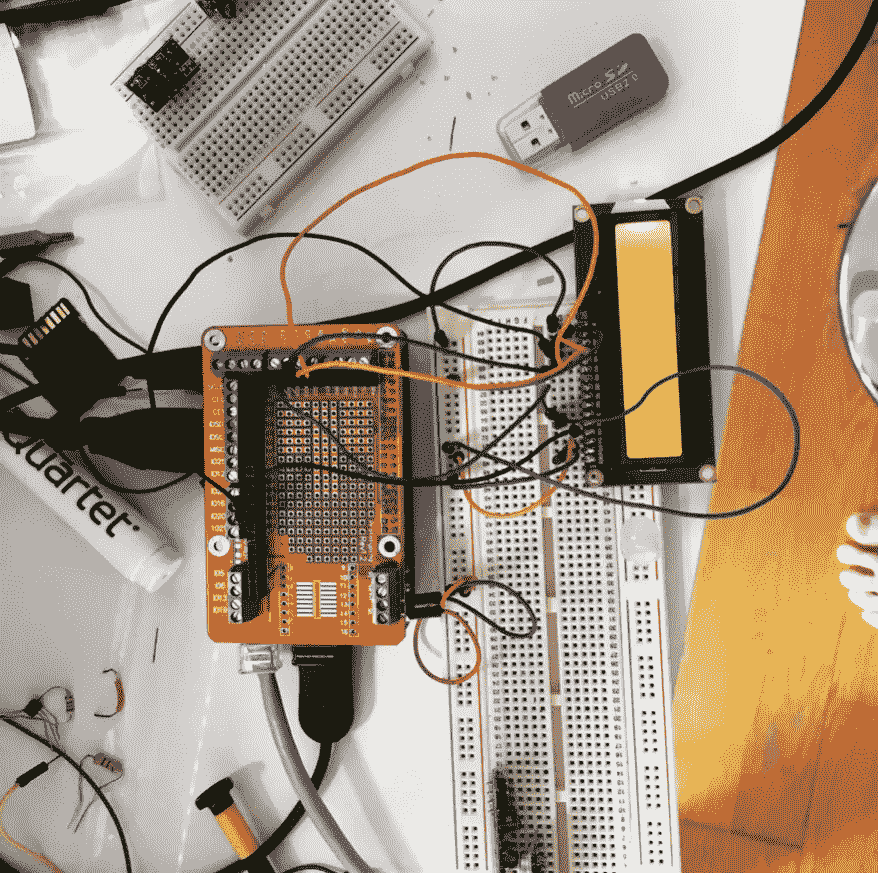

# 工程 vs 科学

> 原文：<https://medium.com/coinmonks/engineering-vs-science-fbd5d6ef6526?source=collection_archive---------72----------------------->

[https://www.instagram.com/p/CbgjjRpLT3k/?utm_source=ig_web_copy_link](https://www.instagram.com/p/CbgjjRpLT3k/?utm_source=ig_web_copy_link)

当我翻看我的一些旧照片时，我笑了。

很多人没有意识到，你实际上不能只在麻省理工学院学习计算机科学。它总是“电子工程和计算机科学”这门更广泛的学科的一部分

感谢那些在周五晚上折磨我们的虐待狂助教们，他们让我们无休止地制造电路板，同时把烧毁的 mosfets 拆下来扔进越来越大的堆里——谢谢。这是重要的一课。

现实生活很乱，更像 EE 而不是，计算机科学。复杂性界限的理论概念永远不会衰退，但电路元件肯定会衰退。电阻器今天不准备好了吗？累吗？我又给这东西加了多少电压？

对于一个只想写代码而不想面对物理事物在我面前毫无理由地腐烂的现实的人来说，这是令人抓狂的。但现在回想起来，这是一个比我当时认为的更重要的想法。

我有时候在管理一家公司时也有这种感觉——这个人/部门只是累了吗？我们必须把它换出来吗？这不是一次轻松的对话，但却是一次现实的对话。

构建和维护东西总是一个混乱的过程。从来没有你想象的那么优雅，但最终还是值得的，当那该死的电路板终于播放出你被分配去展示的音乐。

> *加入 Coinmonks* [*电报频道*](https://t.me/coincodecap) *和* [*Youtube 频道*](https://www.youtube.com/c/coinmonks/videos) *了解加密交易和投资*

# 另外，阅读

*   [Bookmap 评论](https://coincodecap.com/bookmap-review-2021-best-trading-software) | [美国 5 大最佳加密交易所](https://coincodecap.com/crypto-exchange-usa)
*   最佳加密[硬件钱包](/coinmonks/hardware-wallets-dfa1211730c6) | [Bitbns 评论](/coinmonks/bitbns-review-38256a07e161)
*   [新加坡十大最佳加密交易所](https://coincodecap.com/crypto-exchange-in-singapore) | [购买 AXS](https://coincodecap.com/buy-axs-token)
*   [红狗赌场评论](https://coincodecap.com/red-dog-casino-review) | [Swyftx 评论](https://coincodecap.com/swyftx-review) | [CoinGate 评论](https://coincodecap.com/coingate-review)
*   [投资印度的最佳密码](https://coincodecap.com/best-crypto-to-invest-in-india-in-2021)|[WazirX P2P](https://coincodecap.com/wazirx-p2p)|[Hi Dollar Review](https://coincodecap.com/hi-dollar-review)