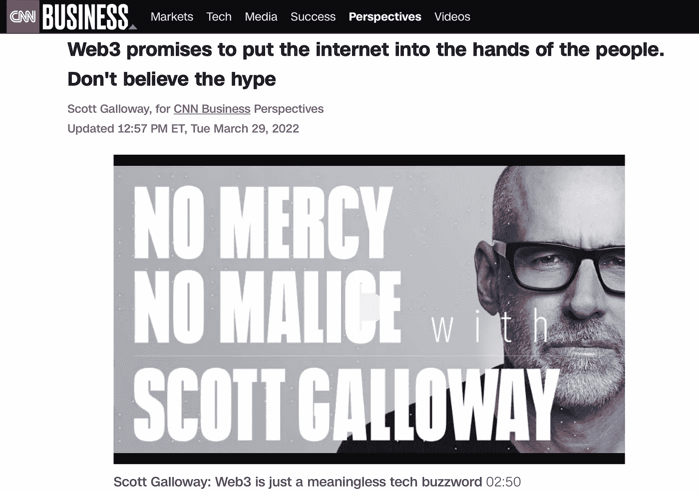

# 受够了 Web3 热门歌曲

> 原文：<https://medium.com/coinmonks/enough-with-the-web3-hit-pieces-519eb9046777?source=collection_archive---------24----------------------->

我们收到了如此多批评 Web3 的热帖，以至于它变成了一个家庭手工业。最近发布的一些对 Web3 的攻击包括:

*   [网络 3 的非理性繁荣](https://techcrunch.com/2021/12/14/the-irrational-exuberance-of-web3/)
*   [加密反弹正在蓬勃发展](https://www.theatlantic.com/technology/archive/2022/02/crypto-nft-web3-internet-future/621479/)
*   [Web3 是扯淡](https://www.stephendiehl.com/blog/web3-bullshit.html)

另一位 Web3 评论家斯科特·加洛韦(Scott Galloway)在 crypto 之外有一些有趣的观点，比如将精英大学重新定义为终极奢侈品牌。但是他最近在 Web3 上的热门文章揭示了对 Web3 的误解，只关注代币而不是代币背后的项目。让我们看看他文章中的一些引文，并讨论什么是 Web3，什么不是 web 3。

# Web3 是什么，我们为什么要争论它？

Web3 热门作品的典型之处在于，它们专注于 Web3 中自己不喜欢的一个方面，然后假定整个空间都因此而注定失败。从根本上来说，Web3 通过一个节点协作网络为应用和数据分配主机。它标志着互联网基础设施从科技巨头(亚马逊和谷歌)运营的集中式服务器向分散节点网络的转移。这不一定是一个非此即彼的论点，因为 web 2.0 和 Web3 最终将共存。问题是 Web3 将会占据多少集中式服务器市场份额？虽然我不能给出一个明确的答案，但我可以说，这比这些过度批评的文章让你相信的要多得多。

让我们从引用斯科特的文章开始:

> *这种所谓的权力从少数人手里下放，实际上是权力重新集中到更少的人手里。以比特币为例。前 2%的账户地址拥有超过 8000 亿美元比特币供应量的 95%。*

这里的第一个错误是混淆了平台的令牌分发与平台用户如何获得好处。加洛韦先生是一名商学教授，这或许可以解释他对经济学的执着高于一切。但有些人不一定要成为比特币巨鲸才能享受它作为价值储存手段的好处。同样，一个人对以太坊网络的总体所有权不会影响他们从以太坊 dApps 中获得的利益。对于投资组合较小的以太坊用户来说，汽油费确实是一个主要障碍。尽管如此，仍有第二层解决方案和 EVM 兼容链允许任何规模的投资组合参与 DeFi。

此外，我不会说比特币和以太坊是 Web3(以太坊最常被混淆为 Web3 )。他提到的以下市场也不是:

> *全球最大的 NFT 市场 OpenSea……从每笔交易中抽取 2.5%的佣金。最大的密码交易所比特币基地也是如此。*

比特币基地是一个集中的交易所，除了交换各种 Web3 令牌之外，与 Web3 没有太多关系。Scott 再次被令牌挂住，而不是对项目进行评论，这需要更多的时间来理解。Scott 引用 OpenSea 的行为是不诚实的，因为他们降低了费用。但是关注经济会忽略更大的批评，即 [OpenSea 审查内容](https://twitter.com/theweb3god/status/1501971101005529092)。

# 风险投资的论点

斯科特在各种令牌经济学模型中提出的对权力集中的担忧，延伸到了他对风投是 Web3 项目主要受益者的批评。这呼应了杰克·多西关于风投拥有 Web3 而非用户的批评。

> *通过拥有铁路建立垄断力量的潜力——即集中化——越来越成为风险投资基金寻求和资助的对象。这是 Web3 的真实协议。*

这也是对 Web3 的一个根本性误解。我们可以说唯一拥有 rails 的实体是提供 Web3 的去中心化基础设施的矿工。至于风险投资家的角色，项目必须给风投代币，以换取投资资本和提供指导。一个好的项目合作伙伴与风投们的目标一致，以最大化项目成功的机会。所以我会回答 Scott，是的，Web3 项目的投票权集中在核心团队和早期风险投资者身上。这最大化了项目繁荣的长期可能性，并能为 Web3 用户提供持久的价值。

Web3 将有无数的隐私和数据分散的好处。将市场份额输给 Web3 dApps 的集中式应用程序只在集中式服务器上运行，因为这是当时可用的最佳基础设施。Web3 将允许新的去中心化应用的繁荣，这些应用要么不适合旧的中心化架构，要么在中心化模式下甚至不可能实现。这是一个令人高兴的演变，Web3 将做它最擅长的事情，而传统的应用程序将继续在集中式服务器上运行。

*这篇文章是由*[*the TEA Project*](https://teaproject.org)*撰写的，这是一个双层 Web3 基础设施项目，它允许分散的应用程序以云的速度运行。*

*是的，我们目前正在* [*寻找 A 轮投资人*](mailto:info@teaproject.org) *:)*

> 加入 Coinmonks [电报频道](https://t.me/coincodecap)和 [Youtube 频道](https://www.youtube.com/c/coinmonks/videos)了解加密交易和投资

# 另外，阅读

*   [CoinFLEX 评论](https://coincodecap.com/coinflex-review) | [AEX 交易所评论](https://coincodecap.com/aex-exchange-review) | [UPbit 评论](https://coincodecap.com/upbit-review)
*   [AscendEx 保证金交易](https://coincodecap.com/ascendex-margin-trading) | [Bitfinex 赌注](https://coincodecap.com/bitfinex-staking) | [bitFlyer 审核](https://coincodecap.com/bitflyer-review)
*   [麻雀交换评论](https://coincodecap.com/sparrow-exchange-review) | [纳什交换评论](https://coincodecap.com/nash-exchange-review)
*   [支持卡审核](https://coincodecap.com/uphold-card-review) | [信任钱包 vs 元掩码](https://coincodecap.com/trust-wallet-vs-metamask)
*   [Exness 回顾](https://coincodecap.com/exness-review)|[moon xbt Vs bit get Vs Bingbon](https://coincodecap.com/bingbon-vs-bitget-vs-moonxbt)