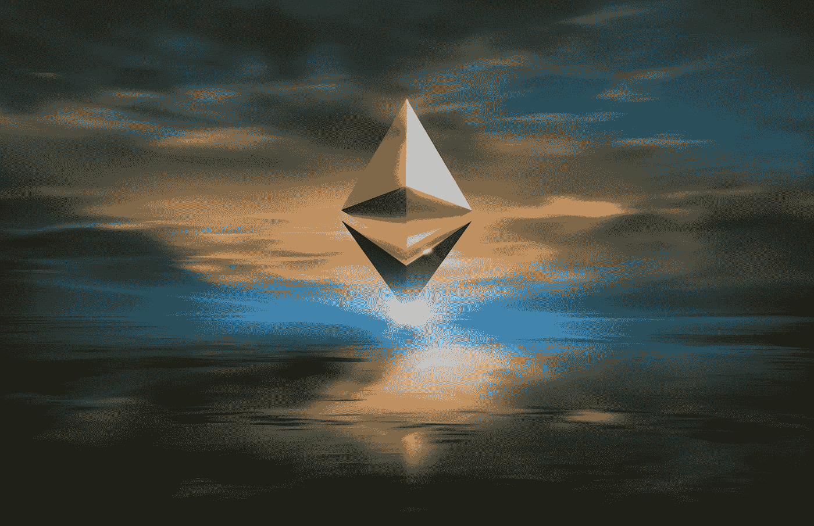
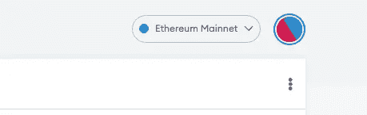
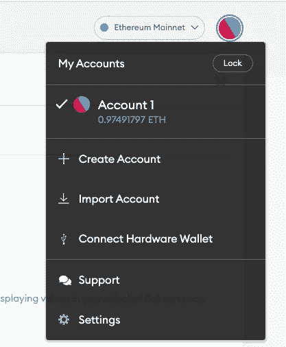
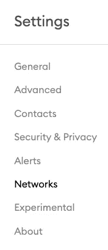
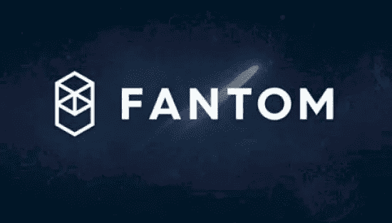
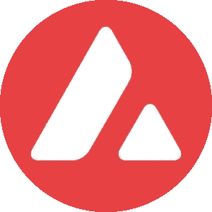
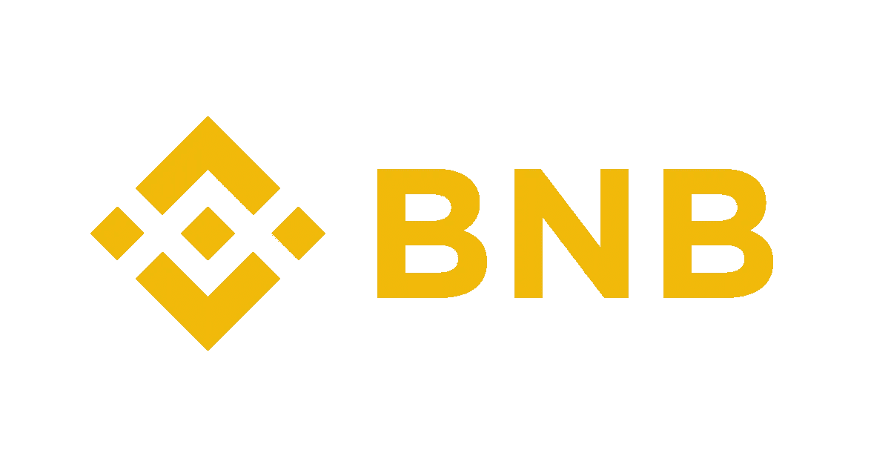
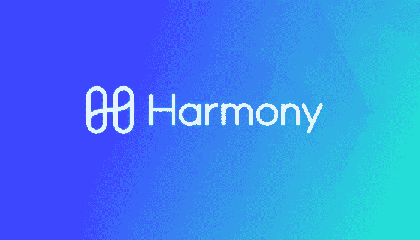
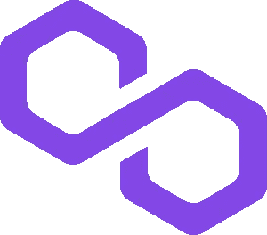

# 输入 DeFi 第 2 部分

> 原文：<https://medium.com/coinmonks/enter-defi-part-2-80a649a68c8?source=collection_archive---------16----------------------->

*将区块链配置为元掩码并添加原生硬币*

本文是 [Enter DeFi Part 1](https://jamiewarm.medium.com/enter-defi-part-1-7894f99b099b) 的续篇，旨在解释如何用各种区块链配置 Metamask 钱包，并添加本地令牌来支付汽油费。一旦区块链被配置，你将能够在区块链上购买硬币，并使用桥梁链接到各种 DeFi 项目。本文中的区块链配置有以太坊(ETH)、Fantom (FTM)、雪崩(AVAX)、币安智能链(BNB)、和谐(ONE)和多边形(MATIC)。有许多其他区块链可以添加到元掩码钱包中，大多数第 1 层区块链都有一个网站，提供配置区块链的元掩码或任何其他非托管钱包所需的信息。Metamask 的所有兼容区块链都在以太坊虚拟机(EVM)上运行。

**以太坊**

Photo by [Zoltan Tasi](https://unsplash.com/@zoltantasi?utm_source=medium&utm_medium=referral) on [Unsplash](https://unsplash.com?utm_source=medium&utm_medium=referral)

先说以太坊。当您创建 Metamask 钱包时，它默认为以太坊区块链。利用以太坊区块链，你不需要做更多的事情。

要添加额外的区块链，请单击以太坊主网下拉列表旁边的圆圈图标。

然后单击设置

然后单击网络

在此屏幕上，有一个添加网络名称、新的 RPC URL、链 ID、货币符号和块浏览器 URL 的选项。

**Fantom (FTM)**

我们现在要从我最喜欢的区块链开始，范顿。添加以下数据:

**网名:**番剧

**RPC Url**:[https://rpc.ftm.tools/](https://rpc.ftm.tools/)

**链号** : 250

**符号** : FTM

**屏蔽浏览器网址【https://ftmscan.com/】:**

然后点击下面的“保存”按钮。范顿歌剧《区块链》现已加入元蒙版。现在，当点击 Fantom Opera 图标时，会出现一个下拉菜单，其中有以太坊和 Fantom Opera 区块链作为选项。

附件是一个到 Fantom 基金会的超级链接，以获得更多的背景和验证。

现在，您需要添加原生硬币 FTM，以便进行交易。我发现的最好的方法是购买初始 FTM，在 [Binance.us](https://www.binance.us/en/home) 上，FTM 可以直接发送到 Metamask 帐户。为此，复制元掩码地址。然后点击 Binance.us 上的 withdrawl，然后将地址粘贴到 Binance.us 上，当从 binance.us 账户撤销和发送 FTM 时，一定要点击 FTM 扫描选项。如果选择了 ERC20，FTM 硬币将会被送到以太坊区块链，而且通过一座桥把它从链条上移走将会产生不必要的油费。

**雪崩(AVAX)**

接下来，我们将配置雪崩(AVAX)区块链。再次点击右上角的圆圈图标->设置->网络

添加以下数据:

**网络名:**雪崩

**RPC Url**:[https://API . avax . network/ext/BC/C/RPC](https://api.avax.network/ext/bc/C/rpc)

**ChainID** : 43114

**符号** : AVAX

**屏蔽浏览器网址**:[https://snowtrace.io/](https://snowtrace.io/)

附上一个链接到 [Avalanche 网站](https://support.avax.network/en/articles/4626956-how-do-i-set-up-metamask-on-avalanche)的超链接，以获得额外的背景和验证。

要让 AVAX 进入 Metamask，请在 coinbase 上购买。然后发送到您的 metamask 钱包。与 binance.us 类似，单击元掩码地址的复制，并在比特币基地单击发送时将其粘贴到地址栏中。对于 AVAX，没有其他步骤

**币安智能连锁(BNB)**

接下来，我们将配置币安智能链(BNB)。再次点击右上角的圆圈图标->设置->网络

添加以下数据:

**网络名:**币安

**RPC Url**:[https://bsc-dataseed.binance.org/](https://bsc-dataseed.binance.org/)

**链号** : 56

**符号** : BNB

**屏蔽浏览器网址**:【https://bscscan.com 

附上一个链接到[币安网站](https://support.binance.us/hc/en-us/articles/4423865255319-Configuring-MetaMask-with-Binance-Smart-Chain)的超链接，以获得额外的背景和验证。

对 BNB 来说，直接从 Binance.us 账户发送最为简单。在 Binance.us 上购买 BNB 并将其发送到 Metamask 钱包。请确保选择 BEP20 令牌，以便将其发送到为您的元掩码 wallet 配置的 BSC。

**和谐(一)**

接下来，我们将配置和谐(一)区块链。再次点击右上角的圆圈图标->设置->网络

添加以下数据:

**网名:**和谐

**RPC Url**:https://API . harmony . one

**ChainID** : 1666600000

**符号**:一个

**拦截浏览器网址**:[https://explorer.harmony.one/](https://explorer.harmony.one/)

附上一个到 [Harmony ONE](https://docs.harmony.one/home/network/wallets/browser-extensions-wallets/metamask-wallet) 网站的超链接，以获取更多信息和配置验证。

我发现把一个放入 Metamask 的最好方法是在 KuCoin 上购买。为此，请在比特币基地上购买 USDT，并将其发送到 KuCoin 钱包。然后在 KuCoin 上找到 USDT/ONE 的那双，买一双。然后复制元掩码地址，粘贴到 KuCoin，把那个发送到元掩码地址。要实现这一点，你需要在上面的块资源管理器中复制你的元掩码地址:[https://explorer.harmony.one/](https://explorer.harmony.one/)然后你需要在块资源管理器中添加你的元掩码地址，这会给你一个以 1 而不是 Ox 开头的地址。这是您在 KuCoin 中需要使用的地址。为了在 KuCoin 上购买一个，不要购买另一个稳定的硬币。KuCoin 上唯一的一双是 USDT/一双。

**多边形(MATIC)**

接下来，我们将配置和谐(一)区块链。再次点击右上角的圆圈图标->设置->网络

添加以下数据:

**网络名称:** MATIC

**RPC Url**:[https://polygon-rpc.com/](https://polygon-rpc.com/)

**链号** : 137

**符号** : MATIC

**屏蔽浏览器网址**:[https://Explorer . matic . network](https://explorer.matic.network)

附上一个到 [Polygon](https://docs.polygon.technology/docs/develop/metamask/config-polygon-on-metamask/) 网站的超链接，以获取更多信息和配置验证。

Matic 可以在 binance.us 上购买，并发送到 Metamask 钱包。从 Binance.us 发送 MATIC 时，确保选择多边形网络。我应该指出，我有很多错误，所以如果它不发送，可以选择 binance.us 上的 ERC20，它会将 MATIC 发送到 Metamask 中的以太坊链。一旦它着陆，你将需要从以太坊到多边形的桥梁。

一些重要的细节:

1.  一定要确保你的钱包里有足够的本地硬币来交易。正如你所看到的，这需要几个步骤，如果你用完了汽油，你必须回到 CeFi，用本地令牌加满油。购买本国硬币最简单的方法就是在区块链上使用 DEX。你应该只需要在 CeFi 上购买一次原币。
2.  在购买原币之前，请务必在您的 CeFi 账户上结算您的交易。如果你没有，而你在比特币基地直接购买了 AVAX，你必须等待 6 天来结算你的交易，并将 AVAX 转移到你的 Metamask 钱包中。在此期间，硬币可能会贬值。如果你从来没有打算用你的 AVAX 在 Metamask 上购买任何其他硬币，这很好，但是如果你打算购买 PTP，你来到 DeFi 的价值比你留在 CeFi 上的美元或稳定硬币的价值要低，并进行快速交易以降低投机性第一层资产的价格波动。我鼓励每个人在 CeFi 结算交易时，让他们的美元留在美元或购买稳定的硬币。
3.  这需要很多步骤。一步一步来。不要不知所措，同时也不要懒惰。你是一个早期采用者。如果很简单，每个人都会去做。事实上，学习 DeFi 并不容易，而且你正在努力学习，这就是为什么你会获得丰厚回报的原因。下一篇文章，进入 DeFi 第 3 部分，将详细介绍每个链上推荐的 DEX，DEX 的功能，向你的 Metamask 帐户添加新硬币，以及使用桥来链跳。

如果这篇文章是有帮助的，请点击下面的按钮。

干杯！

> 加入 Coinmonks [电报频道](https://t.me/coincodecap)和 [Youtube 频道](https://www.youtube.com/c/coinmonks/videos)了解加密交易和投资

# 另外，阅读

*   XT.COM 评论 | [币安评论](https://coincodecap.com/xt-com-review)
*   [SmithBot 评论](https://coincodecap.com/smithbot-review) | [4 款最佳免费开源交易机器人](https://coincodecap.com/free-open-source-trading-bots)
*   [比特币基地僵尸程序](/coinmonks/coinbase-bots-ac6359e897f3) | [AscendEX 审查](/coinmonks/ascendex-review-53e829cf75fa) | [OKEx 交易僵尸程序](/coinmonks/okex-trading-bots-234920f61e60)
*   [如何在印度购买比特币？](/coinmonks/buy-bitcoin-in-india-feb50ddfef94) | [瓦济克斯审查](/coinmonks/wazirx-review-5c811b074f5b)
*   [隐翅虫替代品](/coinmonks/cryptohopper-alternatives-d67287b16d27) | [HitBTC 审查](/coinmonks/hitbtc-review-c5143c5d53c2)
*   [CBET 评论](https://coincodecap.com/cbet-casino-review) | [库科恩 vs 比特币基地](https://coincodecap.com/kucoin-vs-coinbase)
*   [折叠 App 审核](https://coincodecap.com/fold-app-review) | [Kucoin 交易机器人](/coinmonks/kucoin-trading-bot-automate-your-trades-8cf0ca2138e0) | [Probit 审核](https://coincodecap.com/probit-review)
*   [如何匿名购买比特币](https://coincodecap.com/buy-bitcoin-anonymously) | [比特币现金钱包](https://coincodecap.com/bitcoin-cash-wallets)
*   [币安 vs FTX](https://coincodecap.com/binance-vs-ftx) | [最佳(索尔)索拉纳钱包](https://coincodecap.com/solana-wallets)