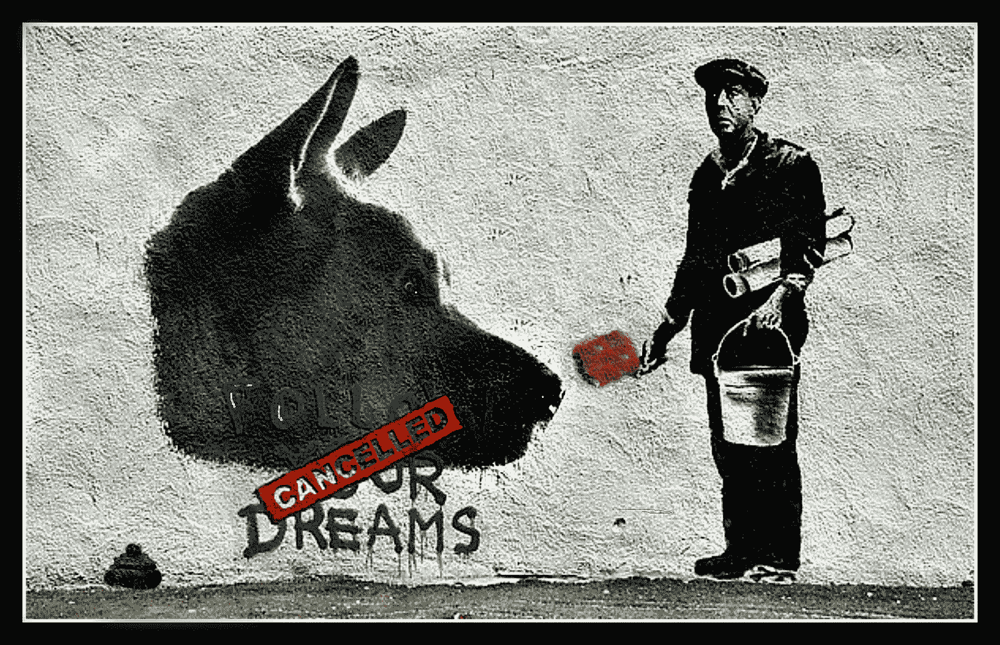
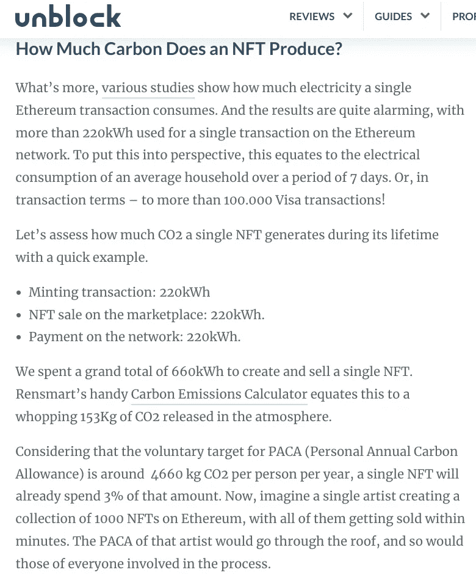

# 环境污染和投资者的焦虑取消了 NFT

> 原文：<https://medium.com/coinmonks/enviro-stains-investor-anxiety-cancel-the-nft-546ade685c68?source=collection_archive---------20----------------------->

Image Credit: [Patrick Verstappen](https://www.flickr.com/photos/56393389@N05/46463176974)

NFT 会过时吗？那是，什么，也许是一年之久？多无聊啊，嗯？作为技术和艺术的交叉创新，NFT 的丑陋是独一无二的美丽。它给了通常在佳士得拍卖行购物的漂亮艺术顾客一个有趣的猿 jpegs 图片世界的介绍，并分散了提供惊人投资回报率的投资机会。与此同时，NFTs 也为一群丑陋的金融诈骗犯、小偷和洗钱者提供了完美的平台，他们可以在没有多少追索权的情况下偷窃和获利。

NFT 成为“事物”的速度如此之快，尤其是在两周前有了影响者和名人之后，它们会因为丑陋的部分而迅速消失吗？在你回答之前，你准备好接受最糟糕的 NFT 新闻了吗？NFT 的产生和存在正在摧毁我们的星球。即使作为一个永远不会投资 NFT 的人，我也是一个粉丝，是墙上的一只苍蝇，希望我假设会发生的事情(这种事情正在金融犯罪领域发生)永远不会发生。和 crypto 一样，我也知道 NFTs 也有环境黑暗的一面，但是在查看数据之前，我永远也不会猜到这个问题有多严重。

创新在分散的土地上迅速兴起和衰落(见 [ICO](https://www.investopedia.com/terms/i/initial-coin-offering-ico.asp) )。这就是为什么我认为 NFT 将很快陷落:NFT 创造的环境成本是不可持续的；越来越多的欺诈性代币销售的财务成本太大，无法准确评估；事实上，我的婆婆，上帝保佑她，可以轻而易举地清洗出售昂贵、稀有的 NFT 的利润，这是一个糟糕的笑话。NFT 的承诺是能够以底价购买一些潜在的稀有物品，然后以荒谬的价格出售，而不是玩[拉地毯](https://cointelegraph.com/explained/crypto-rug-pulls-what-is-a-rug-pull-in-crypto-and-6-ways-to-spot-it)俄罗斯轮盘赌。

因此，如果每个月继续保持目前的速度，未来的代币销售将吸引越来越少的投资者。即使代币创造者首先被审查，投资者仍然会退出，因为这种策略已经被使用过了，而且很快就失败了——见最近的[大猿爸爸的崩溃](https://markets.businessinsider.com/news/currencies/nft-scam-solana-big-daddy-ape-club-rug-pull-civic-2022-1)。投资者不会再冒这些巨大损失的风险了，至少一旦他们被告知。在故事的环境破坏角度，这是一个坏光学的经典案例，突然 NFT 变得不可触摸。在有影响力的人和名人卖掉他们的 NFT 并把他们疯狂的巨额利润投入到 DAO 之前，我们还有多长时间？

关于非食物疗法的环境新闻到底有多糟糕？出于数据参考的目的，我在下面附上了伊万·德约杰维奇写的[故事的截图，他是一名专注于解密的记者，为 Unblock 撰稿。](https://unblock.net/nft-environmental-impact/)

德约杰维奇是一名专业的加密专家，但是正如你所看到的，他毫不犹豫地向他的读者展示了关于非加密技术的可怕事实。他展示的数据显示了每个 NFT 生命周期中消耗的大量能量，加上每个以太坊交易所需的能量(NFT 建立在以太坊区块链上)。

我不是一个“环保主义者”，但我确实非常关心我们的环境，这就是这些数字让我害怕的原因。那些参与 NFT 创造、买卖的人应该感到羞耻。这和买卖血钻一样糟糕。一方面，去中心化的支持者希望得到足够的重视，以获得真正的数字和金融自由，但另一方面，他们忽视了数字和金融自由对人类和环境的影响。这怎么会不是 [TechCrunch](https://techcrunch.com/) 的头条新闻呢？

然而，这种虚伪并不是科技行业的新趋势——希望你已经知道你的旧电脑、智能手机、笔记本电脑和平板电脑会发生什么？如果是这样的话，那么你就知道对于那些必须应对我们快速创新的人来说，情况有多糟糕。科技行业以其引人注目的昂贵产品发布而闻名。一旦这些产品上市，就好像科技公司忘记了它们的存在。这种忽视产品生命周期后端或将其外包给中国和印度的趋势是不负责任和危险的，因为后端涉及人类痛苦和对我们星球的破坏。

如果事实如此，我认为这是一种技术趋势，直接违背了史蒂夫·乔布斯的关键设计原则之一:

> “当你是一名木匠制作一个漂亮的抽屉柜时，你不会在背面使用一块胶合板，即使它面向墙壁，没有人会看到它，你也会知道它在那里，所以你会在背面使用一块漂亮的木头。为了让你晚上睡个好觉，审美和品质必须贯穿始终。”—史蒂夫·乔布斯 1985 年接受《花花公子》杂志采访

这种趋势直接违反了谷歌著名的使命*不作恶。*

我不认为大多数加密货币所有者或矿工，或 NFT 创造者和买家/卖家或以太坊所有者目前了解他们的分散行动对我们星球的真正影响。如果他们这样做了，也许他们可以强迫改变，比如通过社区压力的解决方案/构建？

就像我上面说的，一旦有影响力的人、名人和运动员发现这个消息，他们会卖掉他们在 NFT 的投资还是继续生产和销售新的 NFT 来利用知名度和利润，或者他们会撤回他们在 NFT 市场的参与以保护环境？这两条道路都将对 NFT 世界产生深远的影响。

最终，选择取决于我们每一个作为艺术品收藏家和投资者的人，我们是否想参与其中。一个大问题是，随着非专利技术对环境的影响越来越透明，以及对快速赚钱的追求不断出现——非专利技术是会继续存在下去，还是会像国际专利组织那样开始消失？

表示“受到某种对待的人”:dividend | reverend

> *加入 Coinmonks* [*电报频道*](https://t.me/coincodecap) *和* [*Youtube 频道*](https://www.youtube.com/c/coinmonks/videos) *了解加密交易和投资*

# 另外，阅读

*   [7 大副本交易平台](https://coincodecap.com/copy-trading-platforms) | [BuyCoins 点评](https://coincodecap.com/buycoins-review)
*   [my constant Review](https://coincodecap.com/myconstant-review)|[8 款最佳摇摆交易机器人](https://coincodecap.com/best-swing-trading-bots)
*   [Godex.io 审核](/coinmonks/godex-io-review-7366086519fb) | [邀请审核](/coinmonks/invity-review-70f3030c0502) | [BitForex 审核](https://coincodecap.com/bitforex-review)
*   [10 本关于加密的最佳书籍](https://coincodecap.com/best-crypto-books) | [英国 5 个最佳加密机器人](https://coincodecap.com/uk-trading-bots)
*   [Koinly 点评](https://coincodecap.com/koinly-review) | [Binaryx 点评](https://coincodecap.com/binaryx-review) | [Hodlnaut vs CakeDefi](https://coincodecap.com/hodlnaut-vs-cakedefi-vs-celsius)
*   [MoonXBT vs Bybit vs 币安](https://coincodecap.com/bybit-binance-moonxbt) | [硬件钱包](/coinmonks/hardware-wallets-dfa1211730c6)
*   [火币交易机器人](https://coincodecap.com/huobi-trading-bot) | [如何购买 ADA](https://coincodecap.com/buy-ada-cardano) | [Geco。一次回顾](https://coincodecap.com/geco-one-review)
*   [币安 vs 比特邮票](https://coincodecap.com/binance-vs-bitstamp) | [比特熊猫 vs 比特币基地 vs Coinsbit](https://coincodecap.com/bitpanda-coinbase-coinsbit)
*   [如何购买 Ripple (XRP)](https://coincodecap.com/buy-ripple-india) | [非洲最好的加密交易所](https://coincodecap.com/crypto-exchange-africa)
*   [非洲最佳加密交易所](https://coincodecap.com/crypto-exchange-africa) | [Hoo 交易所评论](https://coincodecap.com/hoo-exchange-review)
*   [eToro vs robin hood](https://coincodecap.com/etoro-robinhood)|[MoonXBT vs by bit vs Bityard](https://coincodecap.com/bybit-bityard-moonxbt)
*   [有哪些交易信号？](https://coincodecap.com/trading-signal) | [比特斯坦普 vs 比特币基地](https://coincodecap.com/bitstamp-coinbase)
*   [ProfitFarmers 回顾](https://coincodecap.com/profitfarmers-review) | [如何使用 Cornix 交易机器人](https://coincodecap.com/cornix-trading-bot)
*   [如何在势不可挡的域名上购买域名？](https://coincodecap.com/buy-domain-on-unstoppable-domains)
*   [印度的加密税](https://coincodecap.com/crypto-tax-india) | [altFINS 审查](https://coincodecap.com/altfins-review) | [Prokey 审查](/coinmonks/prokey-review-26611173c13c)
*   [赢取注册奖金——10 大最佳加密平台](https://coincodecap.com/earn-sign-up-bonus)
*   [Blockfi vs 比特币基地](https://coincodecap.com/blockfi-vs-coinbase) | [BitKan 点评](https://coincodecap.com/bitkan-review) | [Bexplus 点评](https://coincodecap.com/bexplus-review)