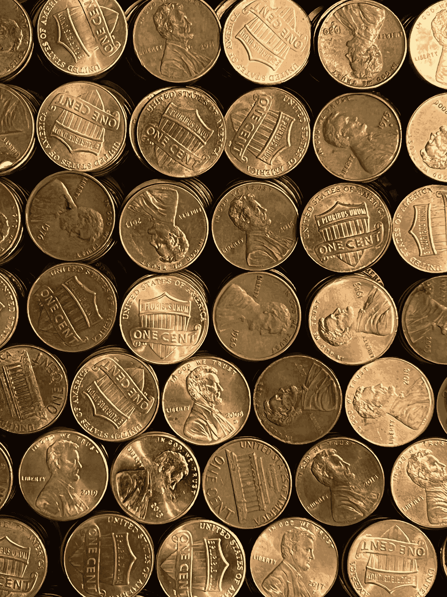
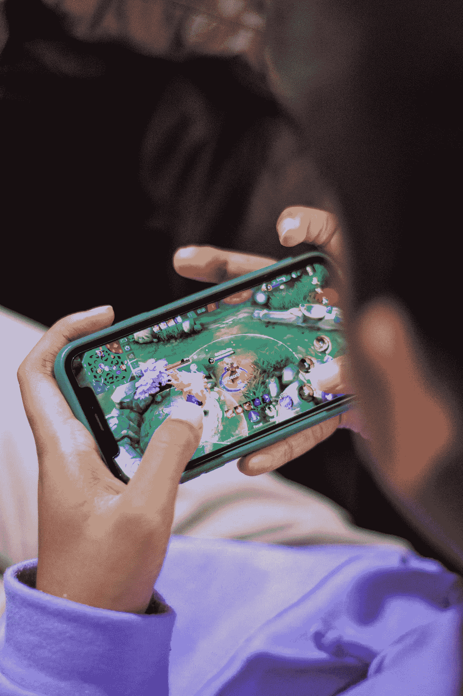
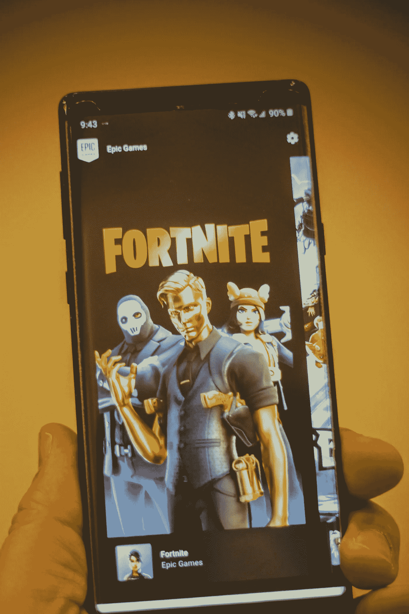

# 史诗游戏、Axie Infinity 和 GameFi 行业面临的障碍

> 原文：<https://medium.com/coinmonks/epic-games-axie-infinity-and-the-hurdle-ahead-of-the-gamefi-industry-5f0d80993f35?source=collection_archive---------29----------------------->

区块链已经使世界和世界的许多部门变得激进。它改变了做事的方式和人们对事物的看法，因为在安全性、分散化和透明度方面出现了更好的替代方案。比特币是区块链最重大的创新。区块链 60%的全球市场份额可以追溯到加密货币、代币和其他金融解决方案的金融/银行业。大多数加密货币仍然难以发挥重要作用，因为它们无法找到现实生活中的应用。剩下的百分比留给不同的行业去分享；几乎每个行业都采用了区块链技术，制造业以 17.6%的比例位居第二。许多其他行业开始合并，以向他们的观众提供更丰富的体验，调整他们的优先事项。这些新的混合产业正在被广泛采用。GameFi 行业就是这样一个混合行业。

GameFi 是 Game + Finance 的缩写，是区块链的另一项创新，它彻底改变了游戏行业。它结合了加密货币、区块链、NFTs 和游戏机制来奖励玩家的参与。大多数 GameFi 项目的模型在于游戏中的物品是 NFTs 从这里开始，它们可以在交易平台上进行法定货币交易。NFT 展示了拥有游戏内物品的丰富经验，拥有的物品可以在游戏间转移；互操作性。

大多数加密货币和 NFTs 的问题在于它们中的一些不具有现实生活中的效用。GameFi 现在的定位是解决这些“效用”问题。在游戏世界中购买的物品现在可以互操作，并且在他们的游戏世界之外也可以使用，由于有了 NFTs，它们变得更加强大。

Axie Infinity 是最受欢迎和最受欢迎的 GameFi 游戏，在菲律宾拥有最多的玩家。游戏月活跃用户约 200 万，总玩家约 1000 万。P2E 是业内实践最多的模式。它确保玩家的时间得到回报。这个国家的运动员每月收入高达 1200 美元。这对于那些货币没有美元坚挺、高于最低工资的国家来说意义重大。

Statista 透露，全球有 23 亿游戏玩家，只有一小部分属于 GameFi 社区。与《我的世界》每月 1.26 亿活跃用户相比，所有这些都相形见绌。或者说堡垒之夜，它在头两周就有 1000 万活跃用户，此后一直在增长。

> 那么，GameFi 行业和游戏如何在全球范围内扩大规模并获得大众支持呢？

GameFi 行业必须寻找欢迎非加密用户的方式，而不是创造一个大多数人因为注册的技术性问题而无法访问的产品，因为目前的情况是，在 2021 年底只有 3 亿人是加密用户。这一数字预计将在 2022 年年中攀升至 5 亿，并在 2022 年达到 10 亿。尽管有中央银行和世界各地不同政府的监管，但世界见证了乌克兰如何通过戒严令削弱其金融活动。他们从 crypto、NFTs 和其他形式的区块链捐赠中筹集了 1 亿美元。所有这些都有助于增加这些数字。这些都是通过 NFT 和加密货币实现的，这是区块链最常用的解决方案。

蒂姆·斯维尼的第一款游戏《ZZT》于 1991 年发布，这款游戏在共享软件分发模式下获得了巨大的成功。蒂姆免费赠送了基础版，而玩家们则希望游戏为额外的功能付费。此外，玩家可以编辑 ZZT 游戏，创造他们的水平。在接下来的三十年里，蒂姆的公司开发了几款游戏，如《杀出重围》、《生化奇兵》、《分裂细胞》和《战争机器》。最终，他们发行了《堡垒之夜》,直到被 PUBG 之类的网站改写后才获得如此大的成功。这两个游戏都是开放世界游戏，玩家在一个无限的世界中与自己战斗；皇家战役。它们让我想起元宇宙的照片。

Epic 向使用虚幻引擎开发游戏的开发者收取 5%的版税。许多其他成功获奖的游戏专营权，如边境和质量效应，利用虚幻引擎来建立他们的游戏。这一切都可以追溯到 Epic 在吸引用户和留住用户方面的矫揉造作。

Epic 最成功的游戏《堡垒之夜》在头两年就赚了 90 多亿美元。Epic 的游戏商店是 Epic 的另一个奇迹，它也在游戏行业发展壮大。与占主导地位的游戏发行商 Steam 不同，它们收取 12%的版税费用，后者从游戏开发商那里收取 30%的版税。这导致了游戏开发者纷纷涌向平台。在游戏成功的众多原因中，堡垒之夜可以自由游戏是一个重要因素。热爱游戏的玩家会为额外的功能付费。GameFi 行业明白，不是每个 GameFi 项目都可以或者应该像 Axie Infinity 一样，玩家在玩游戏之前需要拥有基本的 NFT，这是神圣不可侵犯的。虽然 Axie Infinity 正试图通过他们的奖学金计划来纠正这一点，但这是一剂毒药。“基本 NFT 玩”模式减少了玩游戏的人数，影响了采用。这给 GameFi 行业带来了更加巨大的后果，因为大多数人都将试图采用 Axie 的“基本 NFT 游戏”模式。

这种模式的缺点在于大多数人进入这种游戏的难度。Axie Infinity 的奖学金计划试图解决这一问题，在该计划中，新玩家可以获得启动游戏所需的 NFT 贷款。然而，更多可以搭载非加密用户的解决方案必须开始流动，如免费玩的基本版本(如堡垒之夜)或提供游戏的演示版本。Ethlas 是一家免费游戏 GameFi 公司；他们目前关注的是，每个人都能够在不到一分钟的时间内在他们的平台上玩游戏。他们只需一键登录钱包 MetaMask 就能做到这一点。虽然他们的游戏是休闲的，但他们正在考虑采用更复杂的游戏，因为他们最近推出的 KOMO NFTs 已经售罄。它们在 Ethlas 生态系统中授予所有者溢价效用，并且它们也是资产支持的。

埃思拉斯和堡垒之夜为 GameFi 项目展示了一条避免陷阱的合适途径。GameFi 社区面临的障碍在于吸引非加密用户，通往这一目标的道路不应该被技术细节所掩盖。这些非加密用户必须在中间相遇。随着更多令人兴奋的 GameFi 项目成为人们关注的焦点，GameFi 玩家的数量也必须增加。随着这个行业的成熟，用户将开始被满足他们的游戏所吸引，权衡他们想要的去中心化程度、类型和支付方式。目前，GameFi 行业必须吸收尽可能多的非加密用户。

值得注意的是，索尼已经深入研究了元宇宙；通过他们收集的大量游戏和粉丝群，很容易看出他们的发展方向。翻译成元宇宙就是脸书，也改成了 Meta，为了成为元宇宙的首选，他们甚至在这个过程中收购了暴雪。据报道，苹果公司也投资了 VR/AR 硬件设计和生产。因此，该行业正在与这些大公司对抗，并将赢得胜利，因为区块链已经是它们的一部分。尽管如此，他们不能轻率对待。

Fornite 已经超越了仅仅是一个游戏，成为一种迷你诗，著名的现实生活中的明星如特拉维斯·斯科特举行音乐会。考虑到自新冠肺炎出现以来世界发生了多么大的变化，这真是令人惊讶。所有这一切都是可能的，因为该公司使许多人能够访问他们的游戏和商店。大力士面临许多挑战，他克服了每一个。GameFi 行业仍然是一个幼稚的行业；因此，我们必须监控我们如何成长。因为这可能成就也可能毁掉这个行业。

照片致谢: [Unsplash](https://medium.com/u/2053395ac335?source=post_page-----5f0d80993f35--------------------------------)

> 加入 Coinmonks [电报频道](https://t.me/coincodecap)和 [Youtube 频道](https://www.youtube.com/c/coinmonks/videos)了解加密交易和投资

# 另外，阅读

*   [Bitsgap 审核](/coinmonks/bitsgap-review-a-crypto-trading-bot-that-makes-easy-money-a5d88a336df2) | [Quadency 审核](/coinmonks/quadency-review-a-crypto-trading-automation-platform-3068eaa374e1) | [Bitbns 审核](/coinmonks/bitbns-review-38256a07e161)
*   [加密复制交易平台](/coinmonks/top-10-crypto-copy-trading-platforms-for-beginners-d0c37c7d698c) | [Coinmama 审核](/coinmonks/coinmama-review-ace5641bde6e)
*   [印度的加密交易所](/coinmonks/bitcoin-exchange-in-india-7f1fe79715c9) | [比特币储蓄账户](/coinmonks/bitcoin-savings-account-e65b13f92451)
*   [OKEx vs KuCoin](https://coincodecap.com/okex-kucoin) | [摄氏替代品](https://coincodecap.com/celsius-alternatives) | [如何购买 VeChain](https://coincodecap.com/buy-vechain)
*   [币安期货交易](https://coincodecap.com/binance-futures-trading)|[3 commas vs Mudrex vs eToro](https://coincodecap.com/mudrex-3commas-etoro)