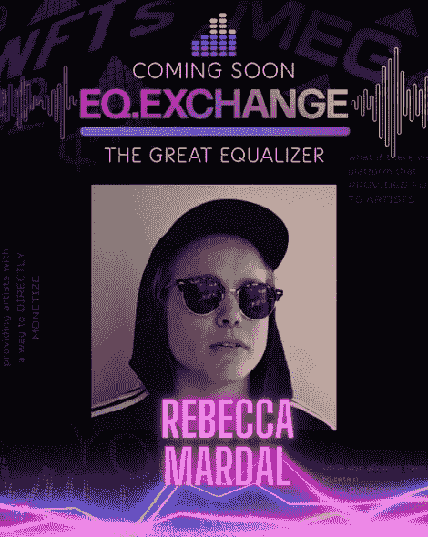

# 情商交流在音乐 NFT 平台迎来两位新艺人。

> 原文：<https://medium.com/coinmonks/eq-exchange-welcomes-2-new-artists-on-music-nft-platform-fc087e3a9882?source=collection_archive---------62----------------------->

在第六周的新音乐 NFT 下降中，EQ Exchange 将于 5 月 18 日和 5 月 22 日推出两位新艺术家:LXNNY 和 Rebecca Mardal。

这些新成员加入了 EQ Exchange，因为该公司继续削减中间人，同时为粉丝提供独特的机会，如音乐会门票和见面问候的机会。

这种通过数字资产赋予艺术家权力的创新运动为粉丝和艺术家之间的关系改革奠定了基础。

除了直接从粉丝群中获得资金，EQ Exchange 还允许艺术家以一种切实的方式展示他们的内容。从获得独一无二的机会到真正拥有他们最喜欢的艺术家的作品，情商赞助人可以培养他们自己和他们热爱的音乐之间的真正联系。

EQ 团队致力于在音乐行业实现真正的无障碍，寻求在艺术家和音乐爱好者之间架起一座桥梁。以完全透明的方式运作，“EQ 对 EQ 资助的项目收取简单的 3%的费用，”[首席执行官贾尼斯·泰勒](https://www.youtube.com/watch?v=pT8MkDYcSMg&feature=youtu.be)说。"没有知识产权，没有版税."

这些努力为技术、音乐爱好者和艺术家之间通过 Web3 空间革新音乐产业的最终合作奠定了基础。

“Web3 是关于财务授权、透明度和协作的，”泰勒说。

成为已经属于你的一部分。平等、公平、均衡。
不要被吓倒。在我们的[情商库](https://eq.exchange/eq-library/)自学。
加入[不和](https://discord.com/invite/suJWVA9RQp)的任何进一步讨论。
有问题在任何社交平台关注我们@EQ_Exchange。

一路上欣赏不可思议的音乐才华。

这只是开始。查看更多艺术家，包括 B.L.A.C .和 Quinn Oulton [即将推出](https://web.eq.exchange/coming-soon)！

**快速浏览新艺人**

**LXNNY**

LXNNY 是一位来自北卡罗来纳州的艺术家，他混合、掌握和制作所有自己的材料。随着他 2022 年专辑的发行*上帝，保护我们*，这位艺术家继续探索他的创作自由，并为粉丝提供了一种新的声音。

“这张专辑是一种感觉的万花筒…所有的背景都是丝般平滑的节奏，交替有意和蜿蜒的流动以及蓝调、爵士音乐的飞溅，”听众艾琳·邓恩说。“这是一个非常独特的创作——它强化了独立嘻哈音乐的力量和必要性。”

[**Instagram**](https://www.instagram.com/lxnny/?hl=en) **或** [**Twitter**](https://twitter.com/lxnnymusic?ref_src=twsrc%5Egoogle%7Ctwcamp%5Eserp%7Ctwgr%5Eauthor)

[**https://lxnny.bandcamp.com/**](https://lxnny.bandcamp.com/)

丽贝卡·马达尔

丽贝卡·马达尔是一位多才多艺的吉他手，他那亲切的高保真音乐能让人一时想起吉米·亨德里克斯，一时又想起乔尼·米切尔。

"马达尔说:“我为压力大的人制作冷静的音乐.”"对我来说，弹吉他就像冥想一样。什么想法都没有。这真的是唯一一次我的心灵完全安静下来，所以每一首曲目都真实地代表了当时的情绪。没有思想，只有情绪。"

Mardal 说，她对与 EQ 的合作以及艺术家和粉丝双方的发展潜力充满热情。

“让我兴奋的是，你也能分到一份。也就是说，当你最喜欢的艺术家爆发时，你也能从中分一杯羹。”

[**insta gram**](https://www.instagram.com/rebeccamardal/?hl=en)**或**[**Twitter**](https://twitter.com/rebeccamardal)**和** [**YouTube**](https://www.youtube.com/channel/UCXRbfOS6BNCzyYc6qzdeJHA)