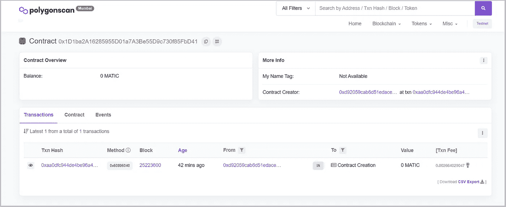

# ERC-1155 NFT 智能合同部署—使用安全帽

> 原文：<https://medium.com/coinmonks/erc-1155-nft-smart-contract-deployment-using-hardhat-7425fca60334?source=collection_archive---------1----------------------->

## NFT 系列

## 关于如何编写和部署 ERC-1155 标准智能合同的指南

作为本文的一部分，我们正尝试使用 Hardhat 配置在 Polygon Mumbai Testnet 上编写和部署 ERC-1155 标准智能合同。


# ERC 1155

ERC-1155 支持可替换和不可替换的令牌。一个已部署的契约可以管理多种令牌类型，因此它在区块链上只占用较少的空间。ERC-1155 还支持批量转移，因此，通过一次转移，我们可以将多个令牌转移给多方。一个所有者可以拥有多个具有相同令牌 Id 的令牌。

*让我们开始有趣的部分吧！*

# 步骤 1:初始化项目

```
npm init
```

它将创建一个新的 package.json 文件，您可以对其进行相应的编辑。

```
{   
   "name": "MyERC1155NFT",   
   "version": "1.0.0",  
   "description": "",  
   "main": "index.js",  
   "engines": 
    {     
       "node": "12.19.0"    
    },   
   "scripts": 
    {     
       "test": "echo \"Error: no test specified\" && exit 1",
       "start": "nodemon index.js"    
    },    
   "keywords": [],    
   "author": "",    
   "license": "ISC",
}
```

# 步骤 2:编写智能合同

创建一个文件夹 ***contracts/*** 并新建一个名为***myerc 1155 NFT . sol .***的文件

确保安装 [OpenZeppelin](https://docs.openzeppelin.com/contracts/3.x/erc721#:~:text=ERC721%20is%20a%20standard%20for,across%20a%20number%20of%20contracts.) 库，因为我们正在从 OpenZeppelin 契约库扩展类。***NPM install @ open zeppelin/contracts。***

将以下代码复制到您的智能协定文件中。

```
// SPDX-License-Identifier: MITpragma solidity >=0.8.0 <0.9.0;import “@openzeppelin/contracts/token/ERC1155/ERC1155.sol”;import “@openzeppelin/contracts/utils/Counters.sol”;import “@openzeppelin/contracts/access/Ownable.sol”;contract MyERC1155NFT is ERC1155, Ownable { using Counters for Counters.Counter; Counters.Counter private _tokenIds; mapping(uint256 => string) private _tokenURIs; constructor() ERC1155(“”) {} function _setTokenURI(uint256 tokenId, string memory _tokenURI) internal virtual { _tokenURIs[tokenId] = _tokenURI; } function mintNFT(address recipient, string memory _tokenURI) public onlyOwner returns (uint256) { _tokenIds.increment(); uint256 newItemId = _tokenIds.current(); _mint(recipient, newItemId, 1, “”); _setTokenURI(newItemId, _tokenURI); return newItemId; }}
```

# 步骤 3:安装 Hardhat & Ethers.js

```
npm install --save-dev hardhat 
npm install --save-dev @nomiclabs/hardhat-ethers 'ethers@^5.0.0'
```

# 步骤 4:创建安全帽项目

```
npx hardhat
```

你会得到如下提示，选择“**创建一个空的 hardhat.config.js** ”。它将在您的项目文件夹中创建一个空的 hardhat.config.js 文件。

```
888    888                      888 888               888
888    888                      888 888               888   
888    888                      888 888               888   
8888888888  8888b.  888d888 .d88888 88888b.   8888b.  888888
888    888     "88b 888P"  d88" 888 888 "88b     "88b 888   
888    888 .d888888 888    888  888 888  888 .d888888 888   
888    888 888  888 888    Y88b 888 888  888 888  888 Y88b. 
888    888 "Y888888 888     "Y88888 888  888 "Y888888  "Y888Welcome to Hardhat v2.8.0? What do you want to do? ...
  Create a basic sample project
  Create an advanced sample project
  Create an advanced sample project that uses TypeScript
> Create an empty hardhat.config.js
  Quit
```

# 步骤 5:更新 hardhat.config.js

```
/**
 * [@type](http://twitter.com/type) import(‘hardhat/config’).HardhatUserConfig
 */
require(“dotenv”).config();
require(“[@nomiclabs/hardhat-ethers](http://twitter.com/nomiclabs/hardhat-ethers)”);
const { API_URL, PRIVATE_KEY } = process.env;
module.exports = {
   solidity: “0.8.9”,
   defaultNetwork: “mumbai”,
   networks: {
     hardhat: {},
     mumbai: {
       url: API_URL,
       accounts: [`0x${PRIVATE_KEY}`],
     },
   },
};
```

确保你的。env 文件包含 ***API_URL*** 和 ***私钥*** 。

根据您用来请求区块链的节点提供者，API_URL 会有所不同。可以使用 [**Infura**](https://infura.io/) 、 [**Alchemy**](https://www.alchemy.com/) ，或者 [**Moralis**](https://moralis.io/) 作为节点提供者。以上所有的节点提供者都提供免费的帐号，你可以创建一个并获得 RPC URL 来连接。

你的。env 文件应该如下所示:

```
API_URL = "RPC Node URL"
PRIVATE_KEY = "Metamask Private Key"
```

# 步骤 6:编译智能合同

```
npx hardhat compile
```

# 步骤 7:编写部署脚本

创建另一个名为 ***scripts/*** 的文件夹，创建一个名为 ***deploy.js*** 的新文件，向其中添加以下内容。

```
async function main() { const MyNFT = await ethers.getContractFactory("MyERC1155NFT"); const myNFT = await MyNFT.deploy(); const txHash = myNFT.deployTransaction.hash; const txReceipt = await ethers.provider.waitForTransaction(txHash); console.log("Contract deployed to address:", txReceipt.contractAddress);}main().then(() => process.exit(0)).catch((error) => { process.exit(1);});
```

# 第八步:买一些假 MATIC

由于区块链交易与汽油费有关，我们需要收集一些假的 MATIC 来部署我们的智能合同。

从这里拿一些假的 MATIC:[https://faucet.polygon.technology/](https://faucet.polygon.technology/)。

其他可用的自动水龙头:

1.  https://faucet.pearzap.com/
2.  【https://matic.supply/ 
3.  [https://www.coinclarified.com/tools/faucets/polygon](https://www.coinclarified.com/tools/faucets/polygon)
4.  [https://faucet.firebird.finance/](https://faucet.firebird.finance/)

# 步骤 9:部署智能合同

```
npx hardhat run scripts/deploy.js --network mumbai
```

您将得到如下所示的控制台输出:

```
Contract deployed to address: 0x1D1ba2A16285955D01a7A3Be55D9c730f85FbD41
```

现在你可以在 mumbai [polygonscan](https://mumbai.polygonscan.com/) 上验证部署的合同地址。该事务看起来如下所示:



Transaction on Mumbai Polygonscan

太好了！您已经在 Polygon Mumbai testnet 上成功部署了您的 ERC-1155 智能合约。

**快乐 DEPYLOYing:)**

> 加入 Coinmonks [电报频道](https://t.me/coincodecap)和 [Youtube 频道](https://www.youtube.com/c/coinmonks/videos)了解加密交易和投资

# 另外，阅读

*   [加密套利](/coinmonks/crypto-arbitrage-guide-how-to-make-money-as-a-beginner-62bfe5c868f6)指南| [如何做空比特币](/coinmonks/how-to-short-bitcoin-568a2d0b4ae5)
*   [如何在加拿大购买加密货币？](https://coincodecap.com/how-to-buy-cryptocurrency-in-canada)
*   [无聊猿游艇俱乐部(BAYC)回顾](https://coincodecap.com/bored-ape-yacht-club-bayc-review) | [拜比特 vs 比特币基地](https://coincodecap.com/bybit-vs-coinbase)
*   [5 款最佳加密交易终端](https://coincodecap.com/crypto-trading-terminals) | [最佳 DeFi 应用](https://coincodecap.com/best-defi-apps)
*   [比特币基地 vs 瓦济克斯](https://coincodecap.com/coinbase-vs-wazirx) | [比特鲁点评](https://coincodecap.com/bitrue-review) | [波洛涅克斯 vs 比特克斯](https://coincodecap.com/poloniex-vs-bittrex)
*   [德国最佳加密交易所](https://coincodecap.com/crypto-exchanges-in-germany) | [Arbitrum:第二层解决方案](https://coincodecap.com/arbitrum)