# ERC-20:构建可替换的令牌智能合约

> 原文：<https://medium.com/coinmonks/erc-20-building-a-fungible-token-smart-contract-936bf55e7ab?source=collection_archive---------4----------------------->

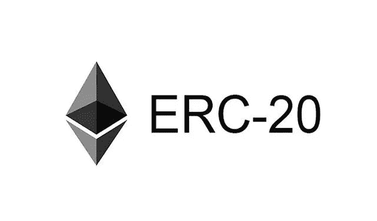

在我们上一篇[帖子](https://coinsbench.com/smart-contracts-the-hitchhikers-guide-to-the-protocols-f3857d351e4c)中，我们详细介绍了各种 ERC 协议的种类和用途。它们为我们提供了创建相互对话的契约的模式，帮助社区开发和使用区块链服务。

在本文中，我们将使用 ERC-20 协议构建一个用于可替换令牌的契约，使用 [**Solidity**](https://docs.soliditylang.org/en/v0.8.14/) 作为我们的契约编程语言，使用开发工具 [**Hardhat**](https://hardhat.org/) ，一些 [**OpenZeppelin**](https://www.openzeppelin.com/) 库， [**Chai**](https://www.chaijs.com/) 进行测试，使用[**CoinMarketCap**](https://coinmarketcap.com/api/)API 检索真实的天然气成本估计

## **1。配置**

第一步是[在你的电脑上安装](https://docs.npmjs.com/downloading-and-installing-node-js-and-npm)(如果还没有安装) [Node.js](https://nodejs.org/en/) 和 [npm](https://www.npmjs.com/) 。接下来，我们将打开一个终端窗口，创建我们的目录，启动一个新的 npm 项目，并在其中安装 hardhat 包。

```
mkdir erc20-fungible-token-contract
cd erc20-fungible-token-contract/
npm init --yes
npm install hardhat
```

现在是时候用命令创建一个新的 hardhat 项目了

```
npx hardhat
```

它会提示一系列的选项，现在，让我们选择创建一个示例项目

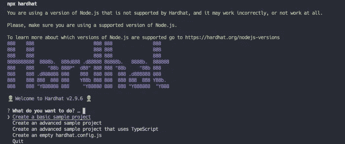

接下来我们将确认项目将被插入的目录，并在选项中选择“是”以添加一个*。gitignore* 文件并安装项目的依赖项。

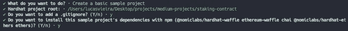

用代码编辑器打开目录我们可以看到创建了一堆类似 ***契约的文件。sol*** ，一个 ***部署脚本*** 和一个 ***测试脚本*** 。

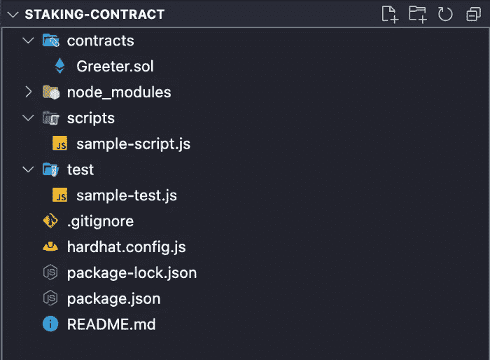

让我们首先将合同文件重命名(或删除它并创建一个新的)为 **Token.sol** ，并在其中添加以下内容。

对于一个兼容 ERC-20 协议的合同，我们至少需要具备**转账**、**结算**、**总供**、**转账自**、**审批**和**津贴**的功能。除了事件**转移**和**审批**之外。此时，我们可以简单地导入并使用 [OpenZeppeling ERC20 库](https://github.com/OpenZeppelin/openzeppelin-contracts/blob/master/contracts/token/ERC20/ERC20.sol)。但是由于这篇文章有教育目的，我们将卷起袖子自己写代码。让我们开始定义所需的变量、事件和契约构造函数。

首先，我们使用 ***_totalSupply*** 变量来存储可用的令牌数量，使用映射 ***_balances*** 和***_ allowments***来存储每个地址拥有的令牌数量，以及第三方地址可以管理多少个属于某个地址的令牌。除此之外，我们还有事件**传送**和**批准**，它们必须在令牌传送发生时或所有者批准第三个地址管理其部分令牌时发出。最后，我们有我们的合同建筑商。 ***构造函数*** 内的代码块在契约创建时只执行一次。在这种情况下，我们收到一个带有初始令牌数量的参数，我们更新存储该信息的变量，将该数量传输到执行合同创建的地址( ***msg.sender*** )，最后，我们发出一个事件，表明该数量的令牌已传输到该地址。接下来，我们将创建视图函数，这些函数不会改变存储在区块链上的数据的状态，它们只会返回该信息

所以现在我们定义函数 **totalSupply** 、 **balanceOf** 和 **allowance** ，它返回可用的令牌数量、一个地址拥有的令牌数量以及第三方地址可以从另一个地址管理的令牌数量。下一步将是定义内部函数(仅由契约本身调用),该函数执行令牌的传输和批准操作。然后我们将定义外部函数(可以被用户调用)来执行各自的功能。

function _transfer 允许将 ***数量*** 的令牌从地址*传送到地址 ***接收者*** 并发出一个**传送**事件，表明操作已完成。 **_approve** 功能允许地址 ***所有者*** 授予地址 ***消费者*** 管理其代币 ***数量*** 的权限。最后，我们有外部函数 **transfer** 、 **approve** 和 **transferFrom** ，用户可以执行这些函数，并使用带有正确参数的内部函数。*

> ***注**:到目前为止，我们已经有了一份与 ERC-20 协议兼容的最低要求的合同！*

## *2.用户化*

*现在是时候定制这个合同，并为我们的项目包括其他重要的功能。让我们从包括 ERC-20 协议的可选元数据扩展开始，它允许我们附加一个名称，一个符号，我们令牌的小数位数。*

*我们在这里所做的是在合同创建时将定义值之外的变量 ***_decimals*** ， ***_symbol*** 和 ***_name*** 包含到它们中。我们还包括视图函数**小数**、**符号**和**名称**，它们返回存储在这些变量上的值。现在让我们加入一些函数，允许我们用 **mint** 函数创建新令牌，用 **burn** 函数销毁现有令牌。这些功能是敏感的，我们需要包含一个逻辑，以便只有合同的所有者才能执行它们。为此，这一次，我们将使用 OpenZeppelin 访问控制库 [Ownable](https://docs.openzeppelin.com/contracts/2.x/access-control) 。在其他特性中，这个库给了我们修饰符 ***onlyOwner*** ，它可以附加到任何函数上。具有此修饰符的功能只能由合同所有者执行。现在让我们用下面的命令安装 OpenZeppelin 包。*

```
*npm install [@openzeppelin/contracts](http://twitter.com/openzeppelin/contracts)*
```

*要在契约文件中使用这个库，我们需要导入它，并在契约定义中包含它的继承，如下所示。*

```
*import "@openzeppelin/contracts/access/Ownable.sol";contract *Token* is *Ownable* {}*
```

*在**造币**和**刻录**功能中，我们需要记住从 *_totalSupply* 和参考地址余额中增加/减少要创建/销毁的令牌数量。并且还发出一个**传输**事件。*

> ***注**:可以看到公共函数 **mint** 和 **burn** 只有***owner***修饰符。这样只有合同创建者(执行部署的 ***msg.sender*** )可以执行。Ownable 库还允许我们使用函数 **transferOwnership** 更改合同所有者。*

## *3.试验*

*现在，我们的代币合同写好了，让我们去测试吧！让我们使用[柴](https://www.chaijs.com/)库来帮助我们完成这个过程。首先让我们重命名文件 **test/sample-test.js** 并开始重写它。*

*我们开始测试，确保一旦执行了部署，契约就有了正确的设置。首先，我们使用 [ethers](https://docs.ethers.io/v5/) 库中的 [getSigners](https://docs.ethers.io/v5/api/signer/) 函数，它返回给我们一个包含 20 个以太坊账户的数组。每当我们在与库交互时没有明确提到我们使用的是哪个帐户，就像在接下来的几行中我们使用 **contractFactory** 并让契约 **deploy** 时，库默认不理解位于 0 位置的帐户是谁在进行调用。因此，当 0 帐户调用 deploy 时，它将被视为我们测试中的合同所有者。*

*在部署函数中，我们传递以下参数( **5000000** 、 **"NiceToken"** 、 **"NTKN"** 、 **18** )，它们分别是***token total supply***、****token name***、****token symbol*接下来，我们调用视图函数，并从 Chai 运行 **assert** 函数，以确保它们是用正确的值定义的！此外，我们检查合同所有者的余额是否收到了所有创建的令牌。为了运行测试，我们使用以下命令:*****

```
**npx hardhat test**
```

**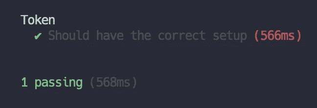**

**现在，让我们通过测试来检查令牌传输功能是否正常工作。为了让我们的测试目录保持有序，让我们为这个特性的测试创建一个新文件。然后我们创建了 **test/tokenTransfers.js** 文件。**

**我们已经包括了 3 个以上的测试。在第一个例子中，我们检查最初有 5000000 代币的合同是否可以将 10000 代币从 Lucas 转移到第二个帐户。接下来，我们测试当 Lucas 试图将 15000 个代币(多于他的余额)转移给 joo 时，合同是否返回错误。最后，Lucas 是否可以成功地将 5000(少于他的余额)转移给 Carol。总是确认 blanaces 是否被正确更新。让我们再次运行 tests 命令，检查是否一切正常。**

**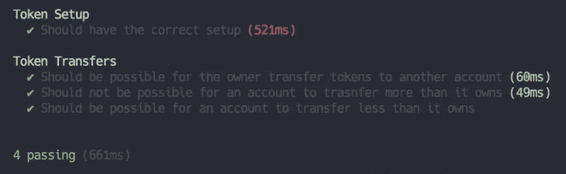**

**让我们看看最后一个测试文件中的一些要点。当我们想使用不同于 0 账户(所有者账户)的账户执行合同中的某些功能时，我们可以使用**连接**功能。**

```
**await token.connect(lucas).transfer(await carol.getAddress(), 5000);**
```

**我们还以下面的方式使用 Chai 库中的 expect 函数来检查是否发出了错误。**

```
**await expect(token.connect(lucas).transfer(await joao.getAddress(), 15000)).to.be.revertedWith("Token: cannot transfer more than account owns");**
```

**主要检查返回的错误消息是否与契约内**trans snfer**函数的 ***require*** 上定义的消息相同。**

```
**require(_balances[sender] >= amount, "Token: cannot transfer more than account owns");**
```

**另一个要点是，如果我们从**断言**函数中改变一些参数，检查测试是否失败。让我们以下面的方式更改最后一个，并再次运行测试。**

```
**assert.equal(carolBalance.toNumber(), 10000, "Carol balance was not updated correctly");**
```

**我们可以看到测试不出所料地失败了。**

**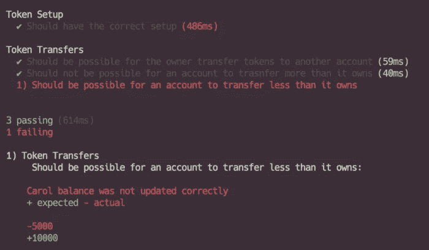**

**下面的测试组将为我们检查允许一个地址可以管理其他令牌的特性。所以让我们从创建一个新文件开始，**test/token allowments . js**。**

**在这个文件中，我们执行了 3 个测试。第一个批准地址以管理您的令牌数量的人。第二个用于检查当此地址尝试传输的令牌数量超过允许数量时是否返回错误。最后检查金额小于或等于允许总额的转账是否通过经理地址成功转账。现在让我们编写最后两个测试文件来检查令牌 **mint** 和 **burn** 特性。让我们创建 **test/tokenMint.js** 和 **test/tokenBurn.js** 文件。**

**这两个文件各有两个测试。一个用于测试合同所有者是否成功执行了铸币/刻录，以及代币的可用数量和收到/丢失代币者的余额是否正确更新。第二个测试检查其他帐户(不是所有者)不能执行这些功能。现在我们已经对我们所有的特性进行了测试，我们可以检查它们是否如预期的那样通过了。**

**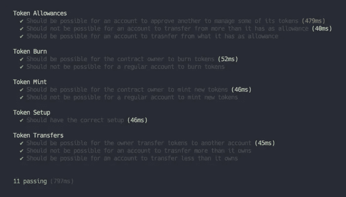**

**测试中的另一个极其重要的点，对于将在生产中运行的项目更是如此，它包括了 ***gas reporter*** 来估计合同功能的实际成本。为此，让我们通过下面的命令安装软件包[*hard hat-gas-reporter*](https://www.npmjs.com/package/hardhat-gas-reporter)。**

```
**npm install hardhat-gas-reporter --save-dev**
```

**接下来的步骤是将库导入包含在项目根目录上定义的 hardhat 配置文件 hard hat****hard at . config . j*s**中。***

```
**require("hardhat-gas-reporter");**
```

**现在我们可以看到，当我们在终端上运行该命令时，我们会收到一个摘要，其中显示了在测试中执行的每个函数的平均气体成本。**

**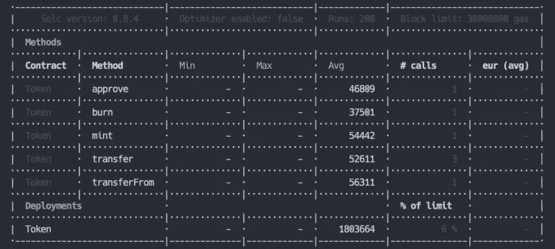**

**为了做得更好，我们可以使用***CoinMarketCap API***来返回值，并自动计算每个函数在任何货币中的天然气成本及其当前市场价格。为此，我们需要在这个[站点](https://pro.coinmarketcap.com/signup)上创建一个帐户。验证电子邮件后，我们将有权访问该网站和我们的 API 密钥，我们将复制这些信息用于该项目。**

**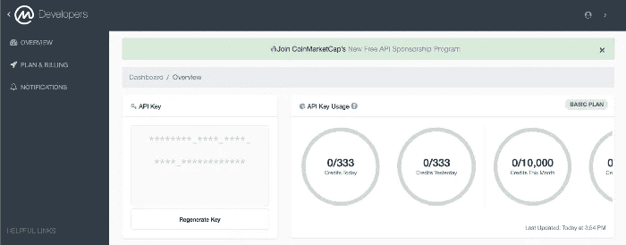**

**有了这个密钥，我们回到 hardhat 配置文件，并在文件 *export* 中包含以下对象。**

**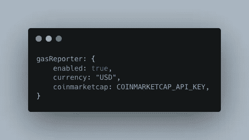**

**其中 **COINMARKETCAP_API_KEY** 是从站点复制的密钥。之后，我们还要选择汇总所用的货币。最终的配置文件应该如下所示。**

**现在，如果我们在终端上运行 tests 命令，我们将得到以下摘要。**

**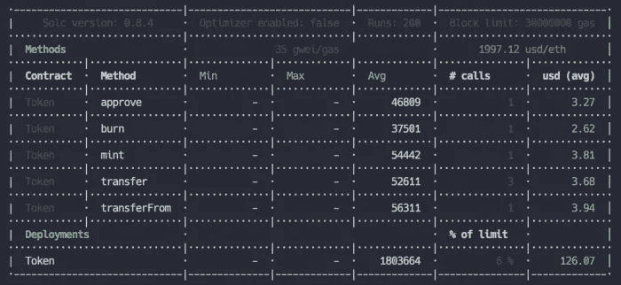**

**所选货币的平均成本。如果我们在 ***货币*** 参数中使用 **BRL** ，我们就有了以巴西雷亚尔为单位的平均成本。**

**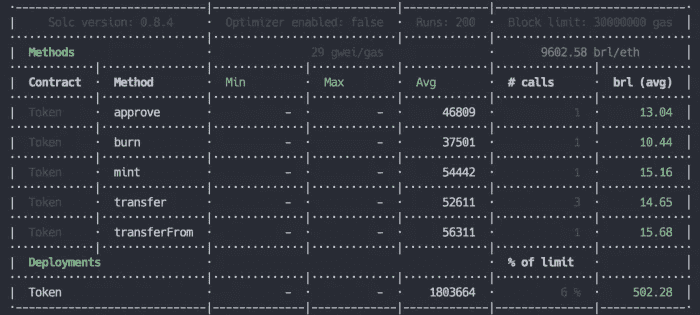**

## **4.部署**

**现在，我们将编写脚本来部署我们的合同。部署完成后，我们实际上将合同从以太坊上传到 Mainnet、Rinkeby 和 Goerli 等网络，甚至从 Polygon 上传到 Mainnet 和 Mumbai。**

**在 **scripts/** 目录中，我们有一个 **sample-script.js** 文件，它是在我们用 hardhat 启动一个项目时自动生成的。让我们删除这个文件并创建另一个名为 **deploy.js** 的文件。最初，该文件将具有以下格式。**

**首先，我们将从 irs 配置库中导入 hardhat **task** 函数，这允许我们设置一个可以用以下命令执行的动作**

```
**npx hardhat deploy**
```

**该命令的参数*是在**任务**函数中定义的第一个参数。因此，如果我们将它设置为“**口袋妖怪**”，我们应该使用***

```
***npx hardhat pokemon***
```

***去执行它。接下来，我们将包括合同部署所需的逻辑。***

***这里要注意的第一点是，我们返回了一个 ***deployer*** 变量，该变量将在部署的后续步骤中使用。这个变量是在 hardhat 配置文件中定义的，我们将会进一步介绍。函数 **getContractFactory** 的第一个参数是在 **Token.sol** 内的合同类中定义的合同名称(“Token”)。***

**另一个要点是，在我们部署我们的契约之前，我们需要**编译**它。上述函数将检查合同编译后生成的**工件/** 目录中的合同名称。我们可以使用以下命令运行编译:**

```
**npx hardhat compile**
```

**接下来，我们使用希望传递给契约构造函数的值来执行部署，并放置一个日志来标识已部署契约的地址(记住要复制这个值！).**

**如果我们现在执行 deploy 命令，我们会发现它不起作用。这是因为我们仍然需要对我们的配置文件 **hardhat.config.js** 进行一些修改。首先，我们删除默认的 accounts 任务，它与项目样例创建一起出现。在我们包含了创建的部署脚本的导入文件之后。**

```
**require("./scripts/deploy.js");**
```

**我们还必须将对象 ***networks*** 添加到配置文件导出中，其中包含我们要进行部署的网络的信息。**

**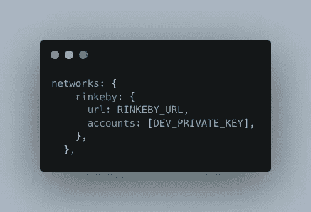**

**如果我们想将我们的契约部署到不同的网络，这个对象内部可以有多个对象。在这种情况下，我们将把它部署到 [Rinkeby](https://www.rinkeby.io/#stats) 网络。我们可以在[安全帽文档](https://hardhat.org/tutorial/deploying-to-a-live-network.html)中看到这个物体的更多细节。变量 **RINKEBY_URL** 必须填充所使用的区块链节点提供者的值。最著名的是[炼金术](https://www.alchemy.com/)和[因夫拉](https://infura.io/)。在本教程中，我们将使用炼金术。我们只需要在那里创建一个帐户，选择以太坊链，并在 Rinkeby 网络上创建一个新的应用程序。**

**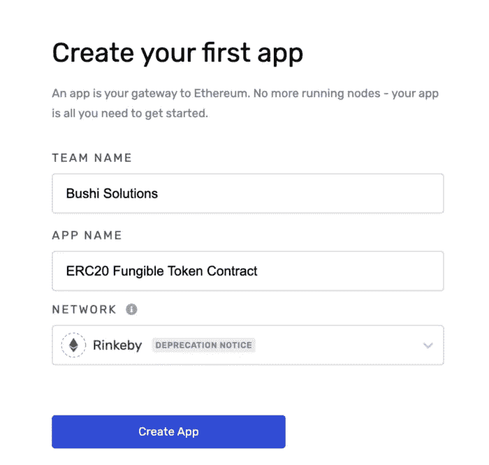**

**在创建应用程序后，您只需复制 HTTP 格式的 API 密钥，并将其插入配置文件中的 ***url*** 参数。看，我们有另一个参数 ***帐户*** ，它是一个数组，包含由部署脚本中的函数 **getSigners** 返回的帐户。此变量必须具有用于部署合同的 wallet 的私钥。请记住，要正确地做到这一点，我们必须在你的钱包里有一些 ETH。我推荐 [Metamask](https://metamask.io/) 。复制您的私钥并粘贴到 **DEV_PRIVATE_KEY** 的位置。最后，我们的配置文件必须具有以下格式:**

**如前所述，要部署合同，我们需要在钱包中放入来自 Rinkeby network 的 ETH(假 ether)。我们可以通过使用可用的水龙头( [1](https://rinkebyfaucet.com/) 、 [2](https://faucet.rinkeby.io/) 、 [3](https://faucets.chain.link/rinkeby) )来获得一些。现在我们只需要编译我们的契约，然后通过定义的网络运行 deploy 命令。**

```
**npx hardhat deploy --network rinkeby**
```

**我们可以看到，我们的合同已成功更新到 Rinkeby 网络，地址如下:**

**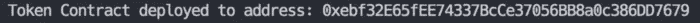**

**我们可以通过查看 Rinkeby network 的 Etherscan 页面上的地址来确认这一点！我们只需要把它粘贴到搜索框上。就这份合同而言，这里的[是](https://rinkeby.etherscan.io/address/0xebf32E65fEE74337BcCe37056BB8a0c386DD7679)。**

**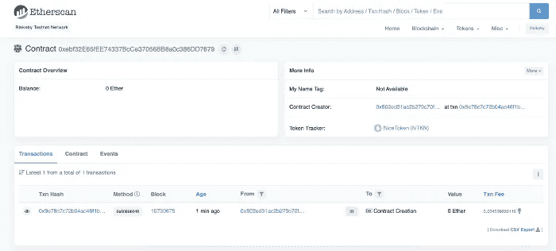**

**现在，此合同中执行的所有交易都可以在此页面上跟踪。**

**本教程到此结束。最终代码可以在我的 [Github](https://github.com/lucasvieira94/erc20-fungible-token-contract) 中找到。**

**感谢您的关注，我希望这对正在阅读的您有用:)**

> **加入 Coinmonks [电报频道](https://t.me/coincodecap)和 [Youtube 频道](https://www.youtube.com/c/coinmonks/videos)了解加密交易和投资**

# **另外，阅读**

*   **[面向开发者的 8 个最佳加密货币 API](https://coincodecap.com/best-cryptocurrency-apis)**
*   **[7 个最佳零费用加密交易平台](https://coincodecap.com/zero-fee-crypto-exchanges)**
*   **[最佳网上赌场](https://coincodecap.com/best-online-casinos) | [期货交易机器人](/coinmonks/futures-trading-bots-5a282ccee3f5)**
*   **[分散交易所](https://coincodecap.com/what-are-decentralized-exchanges) | [比特恩斯 FIP](https://coincodecap.com/bitbns-fip) | [宾邦评论](https://coincodecap.com/bingbon-review)**
*   **[用信用卡购买密码的 10 个最佳地点](https://coincodecap.com/buy-crypto-with-credit-card)**
*   **[加拿大最佳加密交易机器人](https://coincodecap.com/5-best-crypto-trading-bots-in-canada) | [Bybit vs 币安](https://coincodecap.com/bybit-binance-moonxbt)**
*   **[阿联酋 5 大最佳加密交易所](https://coincodecap.com/best-crypto-exchanges-in-uae) | [SimpleSwap 评论](https://coincodecap.com/simpleswap-review)**