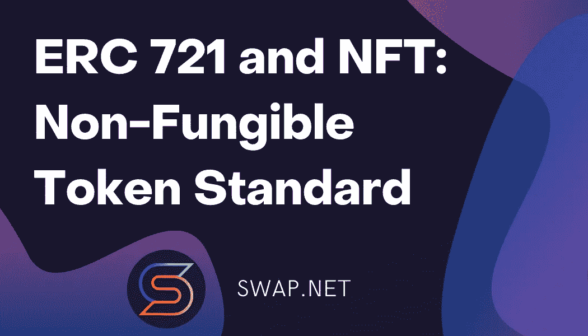

# ERC 721、EIP 721 和 NFT:不可替换的令牌标准

> 原文：<https://medium.com/coinmonks/erc-721-eip-721-and-nft-non-fungible-token-standard-6a083be6f3d4?source=collection_archive---------29----------------------->

## 关于使用 ERC20 的*可替换*令牌，我们已经讲得够多了，但是为什么不令牌化一些不寻常的东西呢？R **不动产**或**收藏品**，其中一些物品因其有用性、稀有性等而比其他物品更有价值。ERC721 是代表不可替代的*令牌所有权的标准，其中每个令牌都是唯一的。*



ERC721 是一个比 ERC20 更复杂的标准，具有多个可选扩展，并被划分为多个合同。

# EIP-721:不可替代的令牌标准

以下标准允许在智能合同中实现 NFT 的标准 API。该标准提供了跟踪和传输 NFTs 的基本功能。

NFT 可以代表数字或物理资产的所有权。资产类型多种多样，我们知道您会想到更多:

*   **实物财产** —住宅，独一无二的艺术品；
*   **虚拟收藏品** —小猫的独特照片，可收藏的明信片；
*   **具有“负值”的资产** —贷款、产权负担和其他负债。

总的来说，所有的家都不一样，没有两只小猫是一样的。NFT 是不同的，您必须单独跟踪每个 NFT 的所有权。

标准接口允许钱包/经纪人/拍卖应用程序与以太坊上的任何 NFT 一起工作。

该标准受 ERC-20 令牌标准的启发，建立在 EIP-20 创建以来两年的经验基础上。EIP-20 不足以跟踪 NFT，因为每项资产都是不同的**(不可替代)**，而每项令牌的数量都是相同的**(可替代)**。

# 规格

关键词**、【不得】、【要求】、【应】、【不应】、【不应】、【建议】、【可】、【可选】**应按照 RFC 2119 中的描述进行解释。

**每一个 ERC-721 兼容的合同都必须实现** `**ERC721**` **和** `**ERC165**` **接口**

```
**pragma** solidity **^**0.4.20;

*/// @title ERC-721 Non-Fungible Token Standard
/// @dev See https://eips.ethereum.org/EIPS/eip-721
///  Note: the ERC-165 identifier for this interface is 0x80ac58cd.* **interface** ERC721 */* is ERC165 */* {
    */// @dev This emits when ownership of any NFT changes by any mechanism.
*    *///  This event emits when NFTs are created (`from` == 0) and destroyed
*    *///  (`to` == 0). Exception: during contract creation, any number of NFTs
*    *///  may be created and assigned without emitting Transfer. At the time of
*    *///  any transfer, the approved address for that NFT (if any) is reset to none.
*    **event** Transfer(**address** **indexed** _from, **address** **indexed** _to, **uint256** **indexed** _tokenId);

    */// @dev This emits when the approved address for an NFT is changed or
*    *///  reaffirmed. The zero address indicates there is no approved address.
*    *///  When a Transfer event emits, this also indicates that the approved
*    *///  address for that NFT (if any) is reset to none.
*    **event** Approval(**address** **indexed** _owner, **address** **indexed** _approved, **uint256** **indexed** _tokenId);

    */// @dev This emits when an operator is enabled or disabled for an owner.
*    *///  The operator can manage all NFTs of the owner.
*    **event** ApprovalForAll(**address** **indexed** _owner, **address** **indexed** _operator, **bool** _approved);

    */// @notice Count all NFTs assigned to an owner
*    */// @dev NFTs assigned to the zero address are considered invalid, and this
*    *///  function throws for queries about the zero address.
*    */// @param _owner An address for whom to query the balance
*    */// @return The number of NFTs owned by `_owner`, possibly zero
*    **function** balanceOf(**address** _owner) **external** **view** **returns** (**uint256**);

    */// @notice Find the owner of an NFT
*    */// @dev NFTs assigned to zero address are considered invalid, and queries
*    *///  about them do throw.
*    */// @param _tokenId The identifier for an NFT
*    */// @return The address of the owner of the NFT
*    **function** ownerOf(**uint256** _tokenId) **external** **view** **returns** (**address**);

    */// @notice Transfers the ownership of an NFT from one address to another address
*    */// @dev Throws unless `msg.sender` is the current owner, an authorized
*    *///  operator, or the approved address for this NFT. Throws if `_from` is
*    *///  not the current owner. Throws if `_to` is the zero address. Throws if
*    *///  `_tokenId` is not a valid NFT. When transfer is complete, this function
*    *///  checks if `_to` is a smart contract (code size > 0). If so, it calls
*    *///  `onERC721Received` on `_to` and throws if the return value is not
*    *///  `bytes4(keccak256("onERC721Received(address,address,uint256,bytes)"))`.
*    */// @param _from The current owner of the NFT
*    */// @param _to The new owner
*    */// @param _tokenId The NFT to transfer
*    */// @param data Additional data with no specified format, sent in call to `_to`
*    **function** safeTransferFrom(**address** _from, **address** _to, **uint256** _tokenId, **bytes** data) **external** **payable**;

    */// @notice Transfers the ownership of an NFT from one address to another address
*    */// @dev This works identically to the other function with an extra data parameter,
*    *///  except this function just sets data to "".
*    */// @param _from The current owner of the NFT
*    */// @param _to The new owner
*    */// @param _tokenId The NFT to transfer
*    **function** safeTransferFrom(**address** _from, **address** _to, **uint256** _tokenId) **external** **payable**;

    */// @notice Transfer ownership of an NFT -- THE CALLER IS RESPONSIBLE
*    *///  TO CONFIRM THAT `_to` IS CAPABLE OF RECEIVING NFTS OR ELSE
*    *///  THEY MAY BE PERMANENTLY LOST
*    */// @dev Throws unless `msg.sender` is the current owner, an authorized
*    *///  operator, or the approved address for this NFT. Throws if `_from` is
*    *///  not the current owner. Throws if `_to` is the zero address. Throws if
*    *///  `_tokenId` is not a valid NFT.
*    */// @param _from The current owner of the NFT
*    */// @param _to The new owner
*    */// @param _tokenId The NFT to transfer
*    **function** transferFrom(**address** _from, **address** _to, **uint256** _tokenId) **external** **payable**;

    */// @notice Change or reaffirm the approved address for an NFT
*    */// @dev The zero address indicates there is no approved address.
*    *///  Throws unless `msg.sender` is the current NFT owner, or an authorized
*    *///  operator of the current owner.
*    */// @param _approved The new approved NFT controller
*    */// @param _tokenId The NFT to approve
*    **function** approve(**address** _approved, **uint256** _tokenId) **external** **payable**;

    */// @notice Enable or disable approval for a third party ("operator") to manage
*    *///  all of `msg.sender`'s assets
*    */// @dev Emits the ApprovalForAll event. The contract MUST allow
*    *///  multiple operators per owner.
*    */// @param _operator Address to add to the set of authorized operators
*    */// @param _approved True if the operator is approved, false to revoke approval
*    **function** setApprovalForAll(**address** _operator, **bool** _approved) **external**;

    */// @notice Get the approved address for a single NFT
*    */// @dev Throws if `_tokenId` is not a valid NFT.
*    */// @param _tokenId The NFT to find the approved address for
*    */// @return The approved address for this NFT, or the zero address if there is none
*    **function** getApproved(**uint256** _tokenId) **external** **view** **returns** (**address**);

    */// @notice Query if an address is an authorized operator for another address
*    */// @param _owner The address that owns the NFTs
*    */// @param _operator The address that acts on behalf of the owner
*    */// @return True if `_operator` is an approved operator for `_owner`, false otherwise
*    **function** isApprovedForAll(**address** _owner, **address** _operator) **external** **view** **returns** (**bool**);
}

**interface** ERC165 {
    */// @notice Query if a contract implements an interface
*    */// @param interfaceID The interface identifier, as specified in ERC-165
*    */// @dev Interface identification is specified in ERC-165\. This function
*    *///  uses less than 30,000 gas.
*    */// @return `true` if the contract implements `interfaceID` and
*    *///  `interfaceID` is not 0xffffffff, `false` otherwise
*    **function** supportsInterface(**bytes4** interfaceID) **external** **view** **returns** (**bool**);
}
```

钱包/经纪人/拍卖应用程序必须实现钱包接口，如果它将接受安全转移。

```
*/// @dev Note: the ERC-165 identifier for this interface is 0x150b7a02.* **interface** ERC721TokenReceiver {
    */// @notice Handle the receipt of an NFT
*    */// @dev The ERC721 smart contract calls this function on the recipient
*    *///  after a `transfer`. This function MAY throw to revert and reject the
*    *///  transfer. Return of other than the magic value MUST result in the
*    *///  transaction being reverted.
*    *///  Note: the contract address is always the message sender.
*    */// @param _operator The address which called `safeTransferFrom` function
*    */// @param _from The address which previously owned the token
*    */// @param _tokenId The NFT identifier which is being transferred
*    */// @param _data Additional data with no specified format
*    */// @return `bytes4(keccak256("onERC721Received(address,address,uint256,bytes)"))`
*    *///  unless throwing
*    **function** onERC721Received(**address** _operator, **address** _from, **uint256** _tokenId, **bytes** _data) **external** **returns**(**bytes4**);
}
```

**元数据扩展**对于 ERC-721 智能合约是可选的。这允许您的智能契约被询问其名称以及关于您的 NFT 所代表的资产的细节。

```
*/// @title ERC-721 Non-Fungible Token Standard, optional metadata extension
/// @dev See https://eips.ethereum.org/EIPS/eip-721
///  Note: the ERC-165 identifier for this interface is 0x5b5e139f.* **interface** ERC721Metadata */* is ERC721 */* {
    */// @notice A descriptive name for a collection of NFTs in this contract
*    **function** name() **external** **view** **returns** (**string** _name); */// @notice An abbreviated name for NFTs in this contract
*    **function** symbol() **external** **view** **returns** (**string** _symbol); */// @notice A distinct Uniform Resource Identifier (URI) for a given asset.
*    */// @dev Throws if `_tokenId` is not a valid NFT. URIs are defined in RFC
*    *///  3986\. The URI may point to a JSON file that conforms to the "ERC721
*    *///  Metadata JSON Schema".
*    **function** tokenURI(**uint256** _tokenId) **external** **view** **returns** (**string**);
```

这就是“ERC721 元数据 JSON 模式”。

```
{
    "title": "Asset Metadata",
    "type": "object",
    "properties": {
        "name": {
            "type": "string",
            "description": "Identifies the asset to which this NFT represents"
        },
        "description": {
            "type": "string",
            "description": "Describes the asset to which this NFT represents"
        },
        "image": {
            "type": "string",
            "description": "A URI pointing to a resource with mime type image/* representing the asset to which this NFT represents. Consider making any images at a width between 320 and 1080 pixels and aspect ratio between 1.91:1 and 4:5 inclusive."
        }
    }
}
```

对于 ERC-721 智能合同来说，**枚举扩展**是可选的(参见下面的“注意事项”)。这允许您的合同发布其完整的 NFT 列表，并使它们可被发现。

```
*/// @title ERC-721 Non-Fungible Token Standard, optional enumeration extension
/// @dev See https://eips.ethereum.org/EIPS/eip-721
///  Note: the ERC-165 identifier for this interface is 0x780e9d63.* **interface** ERC721Enumerable */* is ERC721 */* {
    */// @notice Count NFTs tracked by this contract
*    */// @return A count of valid NFTs tracked by this contract, where each one of
*    *///  them has an assigned and queryable owner not equal to the zero address
*    **function** totalSupply() **external** **view** **returns** (**uint256**); */// @notice Enumerate valid NFTs
*    */// @dev Throws if `_index` >= `totalSupply()`.
*    */// @param _index A counter less than `totalSupply()`
*    */// @return The token identifier for the `_index`th NFT,
*    *///  (sort order not specified)
*    **function** tokenByIndex(**uint256** _index) **external** **view** **returns** (**uint256**); */// @notice Enumerate NFTs assigned to an owner
*    */// @dev Throws if `_index` >= `balanceOf(_owner)` or if
*    *///  `_owner` is the zero address, representing invalid NFTs.
*    */// @param _owner An address where we are interested in NFTs owned by them
*    */// @param _index A counter less than `balanceOf(_owner)`
*    */// @return The token identifier for the `_index`th NFT assigned to `_owner`,
*    *///   (sort order not specified)
*    **function** tokenOfOwnerByIndex(**address** _owner, **uint256** _index) **external** **view** **returns** (**uint256**);
}
```

**0 . 4 . 20 Solidity 接口语法的表达能力不足以记录 ERC-721 标准。符合 ERC-721 的合同还必须遵守以下规定:**

*   可靠性问题#3412:上述接口包含了每个函数的显式可变性保证。可变性保证按照从弱到强的顺序是:`payable`、隐式不可支付、`view`和`pure`。您的实现必须满足该接口中的可变性保证，并且您可能会满足更强的保证。例如，这个接口中的一个`payable`函数可能在您的契约中被实现为不可支付的(没有指定状态可变性)。我们预计以后的 Solidity 版本将允许您更严格的契约从该接口继承，但是版本 0.4.20 的一个变通方法是，您可以在从您的契约继承之前编辑该接口以添加更严格的可变性。
*   可靠性问题#3419:实现了`ERC721Metadata`或`ERC721Enumerable`的合同也应该实现`ERC721`。ERC-721 实现了 ERC-165 接口的要求。
*   可靠性问题#2330:如果一个函数在本规范中显示为`external`，那么如果它使用了`public`可见性，那么它将是兼容的。作为版本 0.4.20 的一个变通方法，您可以在从您的契约继承之前编辑这个接口以切换到`public`。
*   Solidity 问题#3494，# 3544:Solidity 将`this.*.selector`的使用标记为警告，Solidity 的未来版本不会将其标记为错误。

# 基本原理

以太坊智能合约的许多用途都依赖于可识别资产的跟踪。现有或计划中的 NFT 的例子包括**分散之地**的土地、**加密朋克**的同名朋克，以及使用 **DMarket** 或 **EnjinCoin** 等系统的游戏内物品。未来的用途包括跟踪真实世界的资产，如房地产(如 **Ubitquity** 或 **Propy** 等公司)。在每一种情况下，非常重要的一点是，这些项目不能作为分类账中的数字**“集中在一起”，而是每一项资产都应该拥有自己的所有权，并被单独和自动地跟踪。无论这些资产的性质如何，如果我们有一个支持跨职能资产管理和销售平台的标准化界面，生态系统将会更加强大。**

## ****“NFT”字选择****

**“NFT”令几乎所有接受调查的人都感到满意，并广泛适用于各种不同的数字资产。我们认识到“契约”对于该标准的某些应用(特别是有形财产)非常具有描述性。**

***考虑的备选方案:* ***可区分的资产、所有权、代币、资产、股权、票据*****

## ****NFT 标识符****

**每台 NFT 都由 ERC-721 智能合约中唯一的`uint256` ID 标识。该识别号在合同有效期内不得改变。然后，对`(contract address, uint256 tokenId)`将成为以太坊链上特定资产的全球唯一且完全合格的标识符。虽然一些 ERC-721 智能合约可能会发现从 ID 0 开始并简单地为每个新的 NFT 增加 1 很方便，但调用者不应假设 ID 号有任何特定的模式，而必须将 ID 视为“黑盒”。还要注意，NFTs 可能会变得无效(被销毁)。请查看支持的枚举接口的枚举函数。**

**选择`uint256`允许各种各样的应用程序，因为 UUIDs 和 sha3 哈希可以直接转换成`uint256`。**

## ****传送机构****

**ERC-721 标准化了一个安全传递函数`safeTransferFrom`(重载和不重载`bytes`参数)和一个不安全函数`transferFrom`。转账可由以下人员发起:**

*   **NFT 的主人**
*   **NFT 的核准地址**
*   **NFT 当前所有者的授权操作者**

**此外，授权操作员可以为 NFT 设置批准的地址。这为钱包、经纪人和拍卖应用程序提供了一套强大的工具来快速使用*大量的*NFT。**

**transfer 和 accept 函数的文档只指定了事务必须抛出的条件。您的实现还可能引发其他情况。这允许实现获得有趣的结果:**

*   ****如果合同暂停，则不允许转让** —现有技术，CryptoKitties 部署合同，第 611 行**
*   ****阻止接收 NFT 的特定地址列表** —现有技术，CryptoKitties 部署合同，第 565、566 行**
*   ****不允许不安全的转移** — `transferFrom`抛出，除非`_to`等于`msg.sender`或者`countOf(_to)`不为零或者先前不为零(因为这种情况是安全的)**
*   ****向交易双方收取费用**——如果之前是零地址，则在使用非零地址`_approved`调用`approve`时要求付款，如果之前是非零地址，则在使用零地址调用`approve`时退还付款，在调用任何转账函数时要求付款，要求转账参数`_to`等于`msg.sender`，要求转账参数`_to`为 NFT 的批准地址**
*   ****只读 NFT 注册表** —总是从`unsafeTransfer`、`transferFrom`、`approve`和`setApprovalForAll`抛出**

**失败的事务将抛出，这是在 ERC-223、ERC-677、ERC-827 和 OpenZeppelin 的 SafeERC20.sol 实现中确定的最佳实践。ERC-20 定义了一个`allowance`功能，这在调用时导致了一个问题，后来修改为不同的数量，如 OpenZeppelin 问题#438。在 ERC-721，没有津贴，因为每个 NFT 是唯一的，数量是零或一。因此，我们获得了 ERC-20 的原始设计的好处，没有后来发现的问题。**

**本规范不包括 NFT 的产生(“铸造”)和 NFT 的销毁(“燃烧”)。您的合同可以通过其他方式实现这些。请参见`event`文档，了解您在创建或销毁 NFT 时的职责。**

## ****隐私****

**动机部分中确定的钱包/经纪人/拍卖人强烈需要确定所有者拥有哪些非金融资产。**

**考虑一个 NFT 不可枚举的用例可能会很有趣，比如私有的财产所有权注册，或者部分私有的注册。但是，隐私是无法获得的，因为攻击者可以简单地(！idspnonenote)攻击。)为每一个可能的`tokenId`调用`ownerOf`。**

## ****元数据选择****

**提供了一种将 NFTs 与 URIs 相关联的机制。我们预计许多实现将利用这一点为每个 NFT 提供元数据。图片尺寸推荐取自 Instagram，他们大概很懂图片可用性。URI 可能是可变的(即，它随时变化)。我们考虑了一个代表房屋所有权的 NFT，在这种情况下是关于房屋的元数据(图像、居住者等)。)自然可以改变。**

**元数据作为字符串值返回。目前这仅可用于从`web3`调用，不能从其他合同调用。这是可以接受的，因为我们没有考虑过区块链上的应用程序查询这种信息的用例。**

*****备选方案:将每个资产的所有元数据放在区块链上(太贵)，使用 URL 模板查询元数据部分(URL 模板并不适用于所有 URL 方案，尤其是 P2P URLs)，多地址网络地址(不够成熟)*****

# ****参考文献:****

1.  **[ERC-20](https://eips.ethereum.org/EIPS/eip-20) 令牌标准。**
2.  **[ERC-165](https://eips.ethereum.org/EIPS/eip-165) 标准接口检测。**
3.  **[ERC-173](https://eips.ethereum.org/EIPS/eip-173) 自有标准。**
4.  **[ERC-223](https://github.com/ethereum/EIPs/issues/223) 令牌标准。**
5.  **[ERC-677](https://github.com/ethereum/EIPs/issues/677) 令牌标准。**
6.  **[ERC-827](https://github.com/ethereum/EIPs/issues/827) 令牌标准。**
7.  **以太坊名称服务(ENS)。 [https://ens.domains](https://ens.domains)**
8.  **insta gram——图像分辨率是多少？[https://help.instagram.com/1631821640426723](https://help.instagram.com/1631821640426723)**
9.  **JSON 模式。[https://json-schema.org/](https://json-schema.org/)**
10.  **多地址。[https://github.com/multiformats/multiaddr](https://github.com/multiformats/multiaddr)**
11.  **RFC 2119 在 RFC 中用于表示要求级别的关键词。[https://www.ietf.org/rfc/rfc2119.txt](https://www.ietf.org/rfc/rfc2119.txt)**
12.  **[威廉·恩特里肯](https://github.com/fulldecent)、[迪特·雪莉](mailto:dete@axiomzen.co)、[雅各布·伊文思](mailto:jacob@dekz.net)、[纳斯塔西亚·萨克斯](mailto:nastassia.sachs@protonmail.com)、【EIP-721:不可替代令牌标准】、*以太坊改进提案*，第 721 期，2018 年 1 月。【网上连载】。可用:[https://eips.ethereum.org/EIPS/eip-721.](https://eips.ethereum.org/EIPS/eip-721.)**

## **本文将有一个续篇，涵盖与 ERC721 不可替换令牌标准相关的一系列接口、契约和实用程序**

# **交换。网队
官网—[https://swap.net/](https://swap.net/)
推特—[https://twitter.com/NFTSwapnet](https://twitter.com/NFTSwapnet)
不和—[https://t.co/uzz0Qt12tf](https://t.co/uzz0Qt12tf)
中—[https://medium.com/@NFTSwapnet](/@NFTSwapnet)
Docs&白皮书—[http://docs.swap.net](https://t.co/5qc7Mxt2p5)**

> **加入 Coinmonks [电报频道](https://t.me/coincodecap)和 [Youtube 频道](https://www.youtube.com/c/coinmonks/videos)了解加密交易和投资**

# **另外，阅读**

*   **[Bookmap 评论](https://coincodecap.com/bookmap-review-2021-best-trading-software) | [美国 5 大最佳加密交易所](https://coincodecap.com/crypto-exchange-usa)**
*   **最佳加密[硬件钱包](/coinmonks/hardware-wallets-dfa1211730c6) | [Bitbns 评论](/coinmonks/bitbns-review-38256a07e161)**
*   **[新加坡十大最佳加密交易所](https://coincodecap.com/crypto-exchange-in-singapore) | [购买 AXS](https://coincodecap.com/buy-axs-token)**
*   **[红狗赌场评论](https://coincodecap.com/red-dog-casino-review) | [Swyftx 评论](https://coincodecap.com/swyftx-review) | [造币厂评论](https://coincodecap.com/coingate-review)**
*   **[投资印度的最佳密码](https://coincodecap.com/best-crypto-to-invest-in-india-in-2021)|[WazirX P2P](https://coincodecap.com/wazirx-p2p)|[Hi Dollar Review](https://coincodecap.com/hi-dollar-review)**