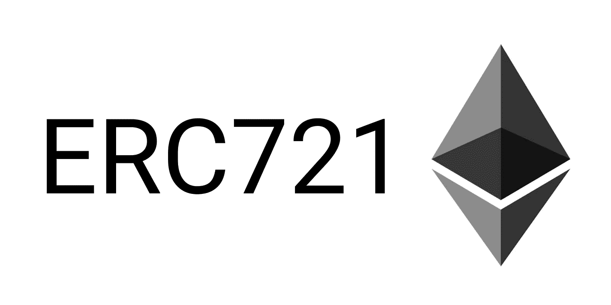

# ERC-721:NFT 令牌标准

> 原文：<https://medium.com/coinmonks/erc-721-the-nft-token-standard-12bd76ac2d62?source=collection_archive---------42----------------------->

# 它们与 Crypto 的 ERC-20 有何不同

NFT 是存储在区块链上的数字资产的令牌化。更具体地说，它们通常使用 ERC-721 标准存储在以太坊区块链上。让我们回顾一下令牌标准的历史，从 ERC-20 标准开始，一直到 ERC-721 标准。

ERC-20 创建于 2015 年，是创建加密货币等可替代令牌的标准。ERC-20 允许智能合约在以太坊区块链上存储比特币、以太和 USDT 等硬币。这个令牌标准很好地服务了它的目的，因为 crypto 是一个可替换的令牌，这意味着所有的硬币都是一样的，可以互相交换。例如，你可以用一个比特币交换另一个比特币，因为它们的价值相同。然而，当 NFTs 变得流行时，需要创建另一个令牌标准来支持 NFTs 的不可替代性。每个 NFT 都是不同的，从这个意义上说，你不能把一个 NFT 和另一个交换。因此，ERC-721 诞生了。

ERC-721 创建于 2018 年，其唯一目的是在以太坊区块链上存储 NFT。它与 ERC-20 令牌标准有何不同？它包括 TokenID。这一点很重要，因为它有助于区分不同的 NFT。ERC-721 还支持存储关于 NFT 的数据的元数据扩展，例如存储资产的 URL[(这里有更多信息)](/@shoomi/creating-your-nfts-minting-and-asset-storage-7ce2adceb138)和 NFT 的描述。ERC-721 允许每个 NFT 都是独一无二的，不可更换的。

> 加入 Coinmonks [电报频道](https://t.me/coincodecap)和 [Youtube 频道](https://www.youtube.com/c/coinmonks/videos)了解加密交易和投资

# 另外，阅读

*   [币安 vs FTX](https://coincodecap.com/binance-vs-ftx) | [最佳(SOL)索拉纳钱包](https://coincodecap.com/solana-wallets)
*   [如何在 Uniswap 上交换加密？](https://coincodecap.com/swap-crypto-on-uniswap) | [A-Ads 审查](https://coincodecap.com/a-ads-review)
*   [加密货币储蓄账户](/coinmonks/cryptocurrency-savings-accounts-be3bc0feffbf) | [YoBit 审核](/coinmonks/yobit-review-175464162c62)
*   [Botsfolio vs nap bots vs Mudrex](/coinmonks/botsfolio-vs-napbots-vs-mudrex-c81344970c02)|[gate . io 交流回顾](/coinmonks/gate-io-exchange-review-61bf87b7078f)
*   [CoinFLEX 评论](https://coincodecap.com/coinflex-review) | [AEX 交易所评论](https://coincodecap.com/aex-exchange-review) | [UPbit 评论](https://coincodecap.com/upbit-review)
*   [AscendEx 保证金交易](https://coincodecap.com/ascendex-margin-trading) | [Bitfinex 赌注](https://coincodecap.com/bitfinex-staking) | [bitFlyer 评论](https://coincodecap.com/bitflyer-review)