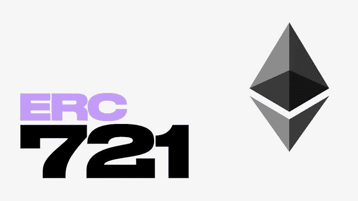

# ERC-721 令牌标准

> 原文：<https://medium.com/coinmonks/erc-721-tokens-b83d7fc3e740?source=collection_archive---------34----------------------->

ERC 代表以太坊征求意见。截至 2018 年 12 月，以太坊的最终意见征询有九个，分别是:ERC-20 票、ERC-55 票、ERC-137 票、ERC-162 票、ERC-165 票、ERC-181 票、ERC-190 票、ERC-721 票和 ERC-1167 票。

开发人员可以通过提交以太坊改进提案(EIP)来创建 ERC，但在被社区接受之前，它会经历一个审查和迭代的过程。一旦被接受，EIP 就变成了以太坊请求注解(ERC)，这是以太坊应用的一个标准。

在本文中，我们将重点介绍 ERC-721 令牌标准。

## 世卫组织创造了 ERC-721？

由于 ERC-20 接口能力不足，ERC-721 是由威廉·恩特里肯、迪特尔·雪莉、雅各布·埃文斯和纳斯塔西亚·萨克斯创造的。通过 2018 年 1 月 24 日创建的以太坊改进提案(EIP)。

> ERC-721 和 ERC-20 令牌的区别在于 ERC-721 令牌是不可替换的。

# ERC-721 令牌的定义和特征

ERC721 是以太坊上不可替换令牌的令牌标准(NFT)。可替换意味着可互换或可替换，例如比特币是可替换的，因为任何比特币都可以替换另一个比特币。另一方面，每一个 NFT 都是独一无二的。因此，一个 NFT 不能代替另一个，不可互换。

创建 ERC721 令牌时，这些令牌中有且仅有一个存在。这些不可替代的代币(NFT)在以太坊上传播了独特资产的概念和应用。

以太坊上现在有各种各样的 ERC721 代币。最受欢迎和众所周知的是 CryptoKitties，但也有许多其他的，可以在 NFT 市场交换或交易，如 [OpenSea、](https://opensea.io/) [Emoon](https://www.emoon.io/) 和 [Rare Bits](https://rarebits.io/) 。像 [MetaMask](https://decryptmedia.com/resources/metamask) 这样的钱包可以用来保存、转移和接收 ERC721 代币。

# ERC721 的用途

ERC721 令牌可用于多种用途。举个例子，

*   它们可以用来表示数字资产的所有权，如艺术品或游戏项目。NFTs 为用户提供了更安全的交换、交易和存储资产的方式。
*   它们还可以用来表示现实世界的资产，如财产或车辆。
*   令牌持有者可以在分散的交易所交易令牌，或者在支持 ERC721 标准的应用程序中使用令牌。

所有的 NFT 都有一个名为`tokenId`的`uint256`变量，所以对于任何 ERC-721 合约，这对`contract address, uint256 tokenId`必须是全球唯一的。

## 它们提供的功能；

*   将代币从一个帐户转移到另一个帐户
*   获取帐户的当前令牌余额
*   获取特定令牌的所有者
*   获取网络上可用令牌的总供应量
*   批准第三方账户可以转移账户中的一定数量的代币。

如果智能合约实现了以下方法和事件，它可以被称为 ERC-721 不可替换令牌合约，并且一旦部署，它将负责跟踪以太坊上创建的令牌。

来自 [EIP-721](https://eips.ethereum.org/EIPS/eip-721) :

## 方法

## 事件

## 结论——未来

ERC721 代币主要用作收藏品，其理念是随着时间的推移，每个 NFT 都会变得更加昂贵或更受欢迎。

资源

[什么是 ERC721 令牌？—密码图表](https://cryptochartis.com/what-is-an-erc721-token/)

[https://ether eum . org/en/developers/docs/standards/tokens/ERC-721/](https://ethereum.org/en/developers/docs/standards/tokens/erc-721/)

[https://4irelabs . com/articles/how-to-build-and-deploy-ERC-721-token/](https://4irelabs.com/articles/how-to-build-and-deploy-erc-721-token/)

 [## EIP-721:不可替代的令牌标准

### 不可替换令牌的标准接口，也称为契约。以下标准允许实施…

eips.ethereum.org](https://eips.ethereum.org/EIPS/eip-721) 

> 加入 Coinmonks [电报频道](https://t.me/coincodecap)和 [Youtube 频道](https://www.youtube.com/c/coinmonks/videos)了解加密交易和投资

# 另外，阅读

*   [Bookmap 评论](https://coincodecap.com/bookmap-review-2021-best-trading-software) | [美国 5 大最佳加密交易所](https://coincodecap.com/crypto-exchange-usa)
*   最佳加密[硬件钱包](/coinmonks/hardware-wallets-dfa1211730c6) | [Bitbns 评论](/coinmonks/bitbns-review-38256a07e161)
*   [新加坡十大最佳加密交易所](https://coincodecap.com/crypto-exchange-in-singapore) | [购买 AXS](https://coincodecap.com/buy-axs-token)
*   [红狗赌场评论](https://coincodecap.com/red-dog-casino-review) | [Swyftx 评论](https://coincodecap.com/swyftx-review) | [CoinGate 评论](https://coincodecap.com/coingate-review)
*   [投资印度的最佳密码](https://coincodecap.com/best-crypto-to-invest-in-india-in-2021)|[WazirX P2P](https://coincodecap.com/wazirx-p2p)|[Hi Dollar Review](https://coincodecap.com/hi-dollar-review)