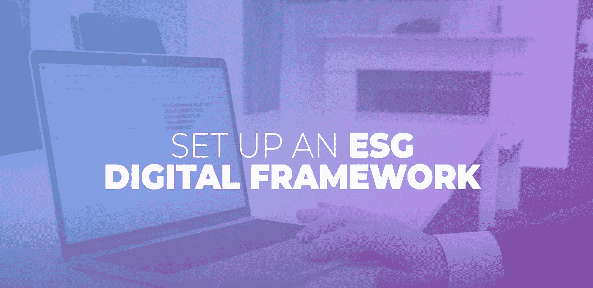

# ESG 问题、需求和愿望。在与许多 PE 公司交谈后，我们学到了什么？

> 原文：<https://medium.com/coinmonks/esg-problems-needs-and-wants-what-have-we-learned-after-speaking-with-many-pe-firms-e14d856c76a6?source=collection_archive---------46----------------------->

在过去的一年里，私募股权公司一直在实施更多的 ESG 项目和努力。ESG 投资作为一个相对较新的概念，正在获得私募股权公司的青睐，以协调普通合伙人和有限合伙人的偏好和报告义务。全科医生正在开发内部 ESG 运营能力，作为其主动价值创造工具箱[中的一个额外工具，以增加竞争优势并在融资方面更加成功。该行业采用 ESG 视角来扩展其尽职调查工作，捕捉重大 ESG 问题，然后指导其投资委员会捕捉稍纵即逝的价值创造机会。](https://www.hermesnet.co.uk/)

对每个公司来说，重要性是由行业、地点和规模决定的。Hermesnet 发现，有限合伙人对 ESG 的兴趣是由改善风险管理和保护普通合伙人声誉的愿望驱动的。

根据 Hermesnet 对行业参与者的多次采访，环境、社会和公司治理问题正得到越来越多的关注，这反映在越来越多的人致力于寻找一站式服务，以便能够轻松获取和报告被投资公司的环境、社会和公司治理数据。

最近， [Hermesnet](https://www.linkedin.com/company/hermesnet/?viewAsMember=true) 出现了私募股权竞购者因 ESG 担忧而退出拍卖的情况，导致卖家的市盈率降低，以及私募股权支持的公司推迟 IPO。因此，对于投资者实现高回报的最终目标而言，环境、社会和治理变得越来越重要，而这只有在企业能够在初始投资后五年内出售或上市的情况下才能实现。

私人股本投资者越来越坚持将环境、社会和治理政策的制定和实施作为一开始就与投资组合公司及其管理层达成的股东协议的一部分。许多保荐人在通常的薪酬、审计和合规委员会三人组中增加了一个“可持续发展委员会”，使 ESG 问题成为投资组合公司治理不可或缺的一部分。

尽管欧洲背景下的 SFDR 自 2021 年 3 月 10 日起就已经存在，但 ESG 指标仍然是普通合伙人和投资者之间的分歧问题。为了进行对 ESG 负责的投资，有限合伙人和普通合伙人需要知道这意味着什么。有限合伙人要求根据被投资公司和被投资的普通合伙人的投资策略定制传统的 ESG 指标。

企业不仅应该遵守最低标准，还应该发展壮大，树立远大志向，创造附加值，让资金为更大利益服务。对于有限合伙人、普通合伙人及其投资组合公司而言，仍需努力进行教育，以理解 ESG 的概念以及如何转换和实际实施。值得一提的是，一些公司采用了自愿框架和指南(TCFD、SASB、GRI 等)。).所有这些都有点不同，所以很难比较性能。

作为一个位于区块链的收集、监控和报告 ESG 和财务数据的平台，Hermesnet 致力于为欧洲和英国的私募股权公司和 gp 提供无缝、轻松的 ESG 数据报告。下面的视频解释了 Hermesnet 如何帮助您实现 ESG 之旅。

> *加入 Coinmonks* [*电报频道*](https://t.me/coincodecap) *和* [*Youtube 频道*](https://www.youtube.com/c/coinmonks/videos) *了解加密交易和投资*

# 另外，阅读

*   [3 商业评论](/coinmonks/3commas-review-an-excellent-crypto-trading-bot-2020-1313a58bec92) | [Pionex 评论](https://coincodecap.com/pionex-review-exchange-with-crypto-trading-bot) | [Coinrule 评论](/coinmonks/coinrule-review-2021-a-beginner-friendly-crypto-trading-bot-daf0504848ba)
*   [莱杰 vs n 格拉夫](/coinmonks/ledger-vs-ngrave-zero-7e40f0c1d694) | [莱杰纳诺 s vs x](/coinmonks/ledger-nano-s-vs-x-battery-hardware-price-storage-59a6663fe3b0) | [币安评论](/coinmonks/binance-review-ee10d3bf3b6e)
*   [加密交易机器人](/coinmonks/crypto-trading-bot-c2ffce8acb2a) | [Bingbon 评论](https://coincodecap.com/bingbon-review)
*   [Bybit Exchange 审查](/coinmonks/bybit-exchange-review-dbd570019b71) | [Bityard 审查](https://coincodecap.com/bityard-reivew) | [Jet-Bot 审查](https://coincodecap.com/jet-bot-review)
*   [3 commas vs crypto hopper](/coinmonks/3commas-vs-pionex-vs-cryptohopper-best-crypto-bot-6a98d2baa203)|[赚取加密利息](/coinmonks/earn-crypto-interest-b10b810fdda3)
*   最好的比特币[硬件钱包](/coinmonks/hardware-wallets-dfa1211730c6) | [BitBox02 回顾](/coinmonks/bitbox02-review-your-swiss-bitcoin-hardware-wallet-c36c88fff29)