# 市场结构要素——多重时间框架市场结构的关键

> 原文：<https://medium.com/coinmonks/essentials-to-market-structure-the-keys-to-multiple-time-frame-market-structure-21ccab52c5c2?source=collection_archive---------4----------------------->

## 多重时间框架市场结构的关键很简单。你应该把重点放在哪里？

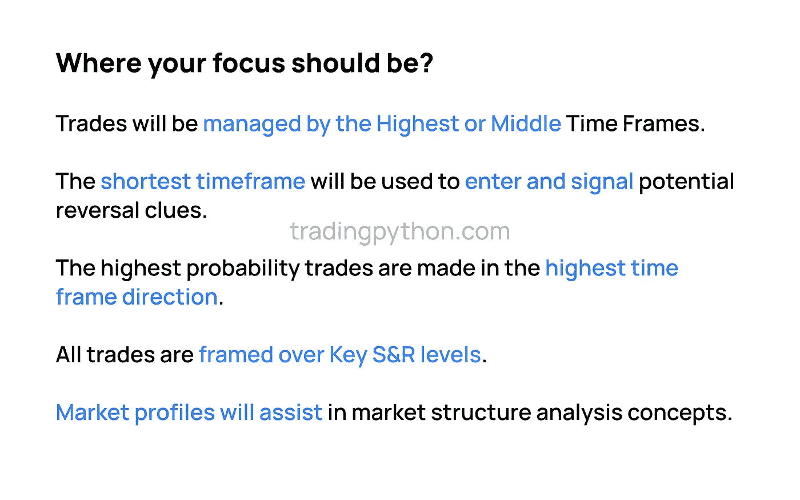

你的重点应该是三帧中最高的时间帧。交易将由最高或中等时间框架来管理，换句话说，如果你是一个摇摆不定的交易者，你将利用每日时间框架或 H4 图来管理你的交易，但每日时间框架将被用来促进交易前提和订单，这将给你方向偏差。

日线图上的市场结构框定了你的波动交易，一旦你开始交易，你将在 H4 时间框架内管理交易，你将使用我们在[前一篇文章](/@tradingpython/essentials-to-market-structure-determining-trade-direction-b0b69b66cc24)中谈到的各自的时间框架，然后你的 H1 图将用于计时。

所以摆动交易的最短时间框架是 M60 图。所以你的进场信号来自于对每日市场结构和 H4 的研究，然后你的 H1 图有助于具体的进场点，所以你知道你在 H1 图上做的进场概念和技术。

最有可能的交易是在更高的时间框架方向进行的，现在会有更高的时间框架前提可能是看涨的，但你正在接近一个关键的阻力位，所以可能会被击败。

所以，这就是我们要回到技术分析的核心要点，即支撑阻力胜过一切，如果不了解关键支撑阻力水平，无论你使用什么交易模型，头寸，日内交易，无论是什么，你都不会有方向偏差。如果它没有被框架在关键支撑阻力水平上，它可能也会成为你的一个挣扎点。所以，你必须回到我的概念的核心，完全正确的交易。

关键支撑阻力位是关键所在。如果没有这些，所有这些线和所有这些程序，我们将在这里讨论，或者我们将在后面的帖子中讨论，这对你没有好处，如果你不知道如何做到这一点，看看我以前关于摆动点的帖子。

所以你要明白什么是关键支撑位阻力位。因此，如果你正在寻找你的特定模型的最高时间框架，这将有希望吸引你的注意力，无论在价格行动的那个点上的支撑阻力水平，显然你总是可以上升到日线和周线，正如，如果你只是从支撑阻力的角度来看这些日线和周线，无论你在什么时间框架内交易，这些都会对你有帮助。

现在，我们来谈谈市场结构(再次？)

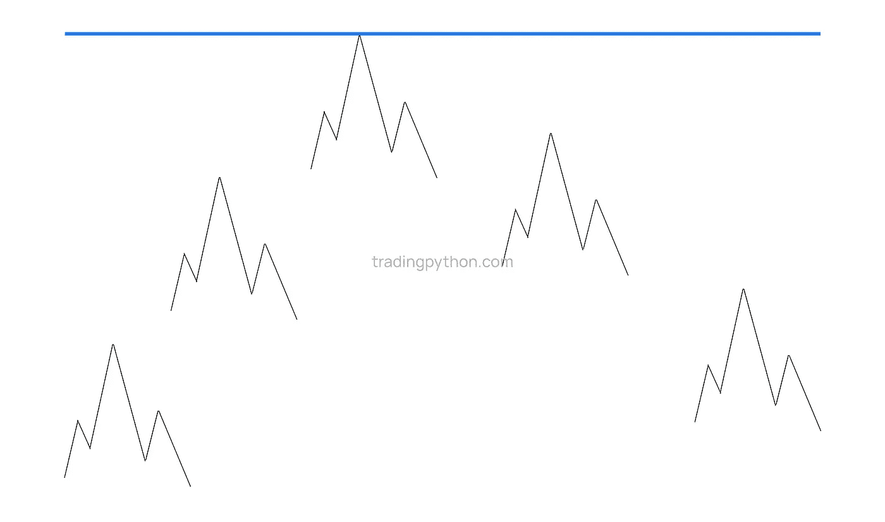

Market Structure

嗯，如果你看到价格上涨，然后价格触及主要阻力位，我们会假设这是你的最高时间框架，保持通用，因为你可以应用这种技术，即使你的更高时间框架是基于你的目标交易模型。

当价格上涨到我们认为的更高水平，关键阻力位时，价格永远不会直线移动，所以会有一个盘整，价格向上移动另一个盘整，价格向上移动，然后当价格进入这个阻力位时，我们将预期反转，所以市场结构会打破这里的短期波动低点，

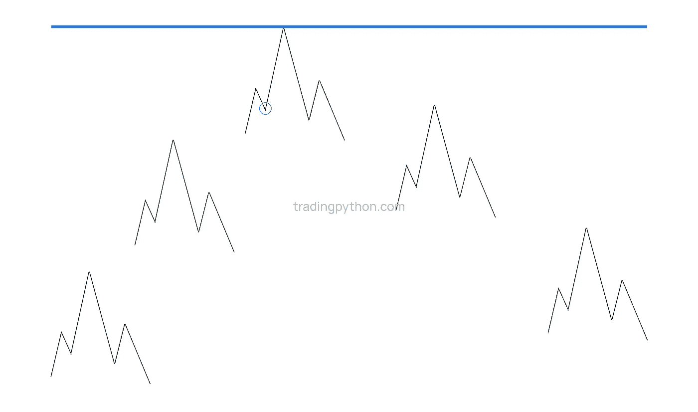

short term swing low before resistance

这种短期的低波动，当你的特定交易模型的最高时间框架，一旦打破，这将是你说好的催化剂，这可能是另一个交易入口，

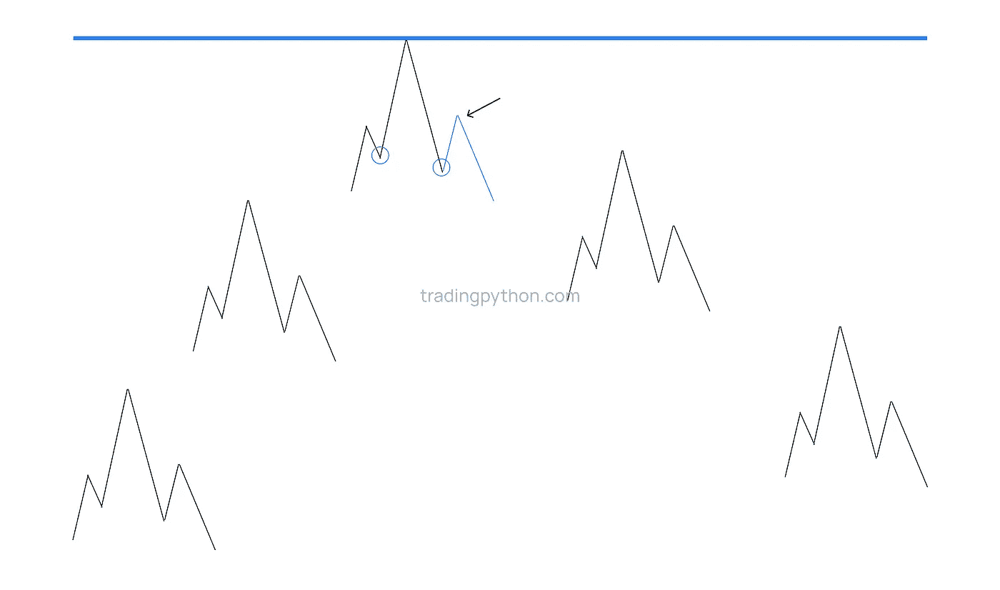

Optimal Trade Entry

根据你档案的时间表。

例如，让我们说这是月图，你正在寻找一个头寸交易，月图**像这样触及关键阻力位**，它的下跌带走了**一个月中的短期低点**，我们现在知道市场结构已经**打破**，所以我们这里有一个**市场结构转移**，

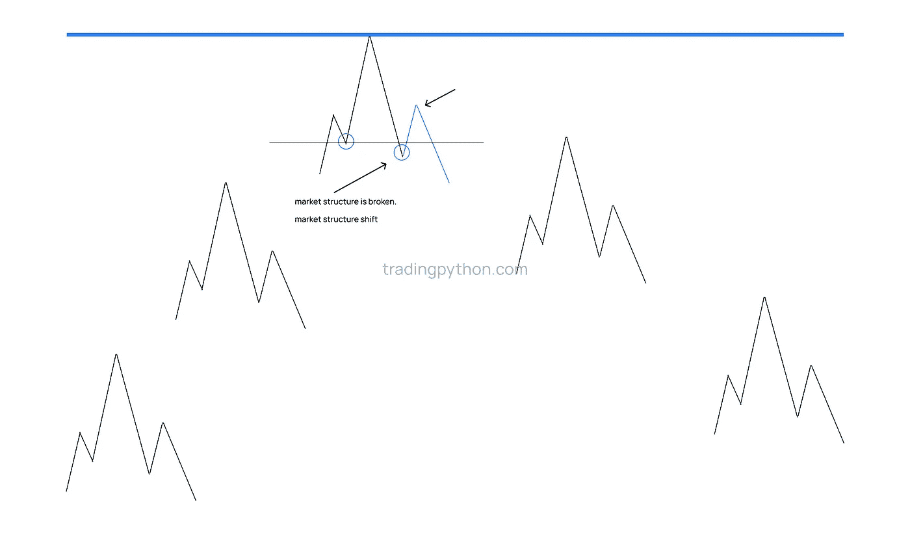

Market structure shift

一旦这个结构被打破，但随着价格开始反弹，**我们预计**科学不会突破这个阻力位，如果我们到达这个可能的阻力位，**我们将预期一个回撤**直到交易进入，但然后我们将放大这个区域，然后我们将**进入一个**周时间框架到一个**短期时间框架**价格水平，然后， 通过放大，我们可能会看到一个**短期最优交易进场**或相应的卖出模式**来说服我们**这可能会是一个卖出场景。

如果我们**向下进入日线**并看到类似的情况，你会得到所有这些隐含阻力水平的嵌套汇合点。一旦一个更高时间框架的市场结构被打破，那么我们将能够与**一个自上而下的市场结构方法同步定位。**

再一次，让我们看看图表，

市场结构就是这样建立的，这是价格的上涨和下跌。

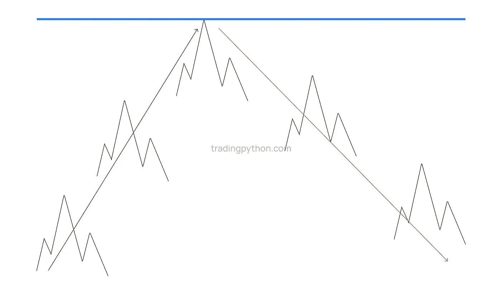

我们还有整合，

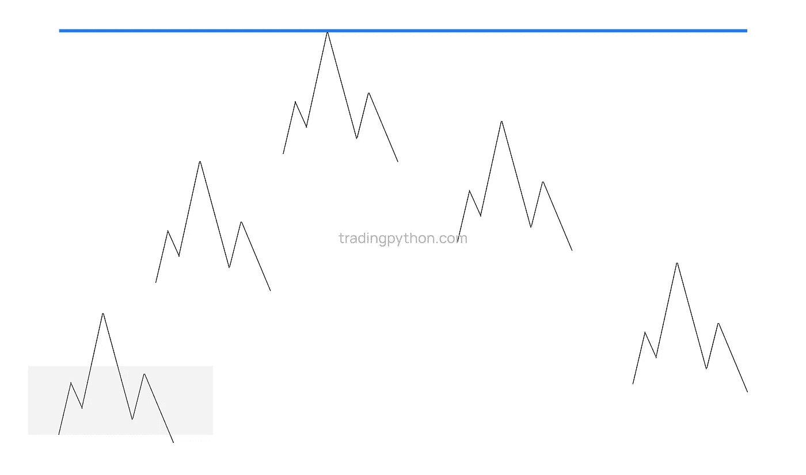

consolidation

如果我们希望在这里看到某种反弹，那就是看涨，我们希望在盘整区的底部得到支撑。

我们希望看到看涨，支撑被守住，阻力被打破，那就是我们希望看到的信号。

每次价格开始回调，回到这里，你要利用的市场结构概念就是寻找最佳的交易入口，

对于买入，你将寻找反射买入，你将寻找第二类趋势跟随，看涨情景，所以换句话说，在图表中，**你将寻找价格寻找支撑和阻力被打破。**这就是市场结构背后的整个框架。

好的，但是还有一个重要的注意事项，

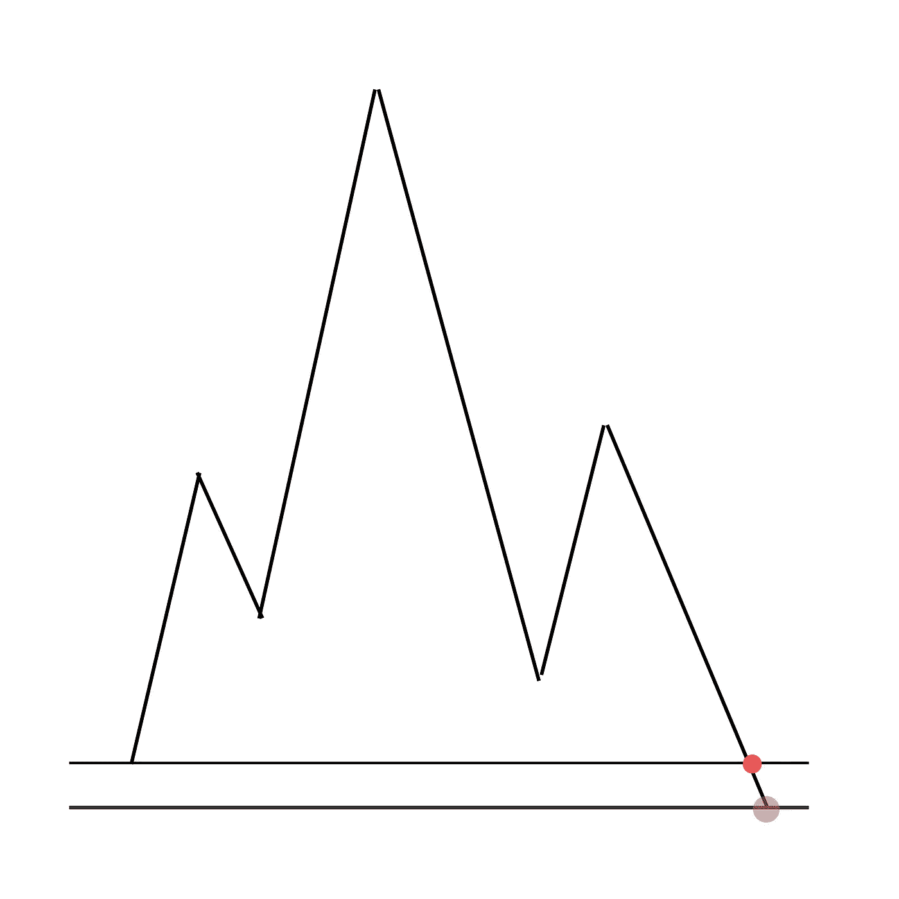

如果价格开始下跌，对价格回升并打破之前的低点感到满意(如上图红色)，可能有一个重要的负荷被打破，跟踪止损单将被拉低到这个特定的点，所以如果价格回落，所有要做的就是给你另一个做多的机会。

如果价格继续保持支撑并突破这里的所有短期高点，市场结构意味着我们可能会看到从低点到高点的一段路，在回撤时复制。

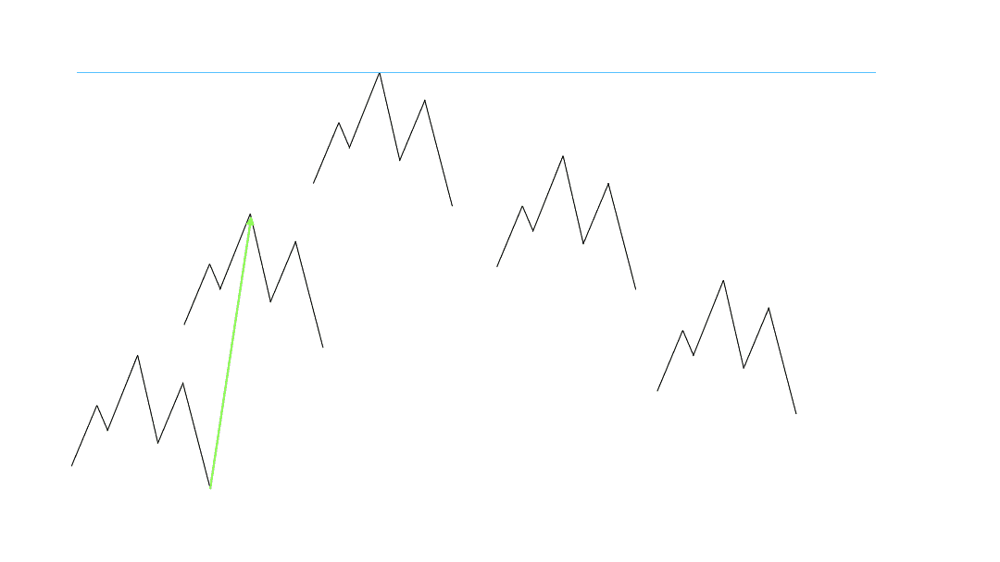

对于市场来说，同样的事情也可以说，下跌和反转持续很长时间，每次我们看到盘整，你都想研究这些，对于短期更动态的支撑阻力水平，这些区域更容易交易，因为它们有可识别的价格水平。它们非常清楚，我们不知道价格如何从这些盘整到下一次盘整，我们不知道，我们预计灰色区域，即上面图表中缺失的灰色部分，缺失，实际上这并不重要。

看涨的过程几乎是相同的。

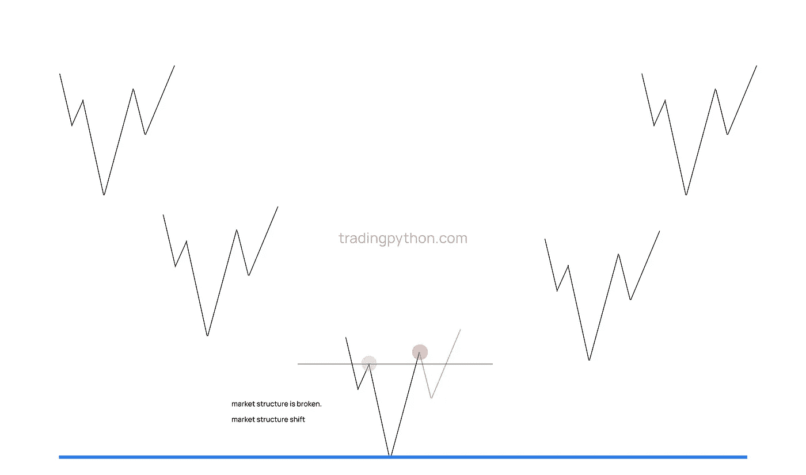

Bullish Scenario

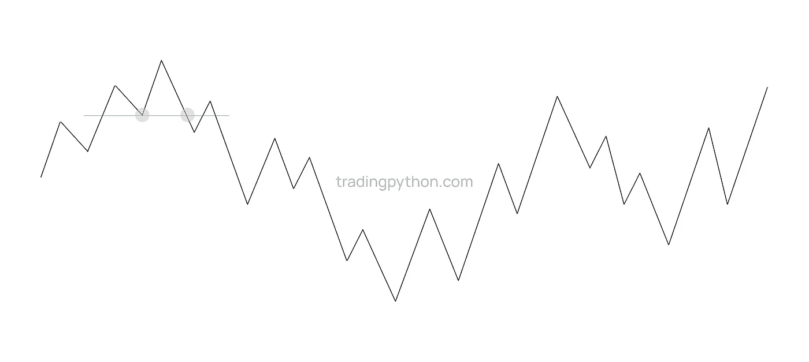

当价格每次开始回撤时，我们正在寻找新的卖出机会(如上图所示)

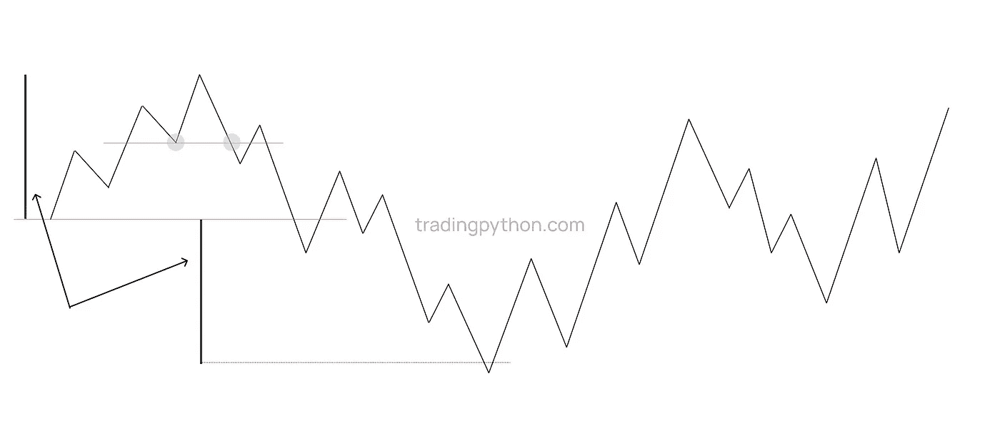

Swing Projection

但是，如果我们看到前面的波动，就像我们在红线中看到的，被剔除(分解)，如果我们得到一个回撤，或另一个额外的卖出信号，这就是我们使用**波动预测的地方。**

就价格而言，我们没有使用斐波纳契曲线，你可以，但只看简单的价格动作，从低到高，一旦它被打破，你可以开始采取相同的可测量的摆动(较高)并将其投射到较低的位置。

当我们看到中期高点和低点时，我们期待什么？

中期高点显然是一个两边都有较低高点的高点，

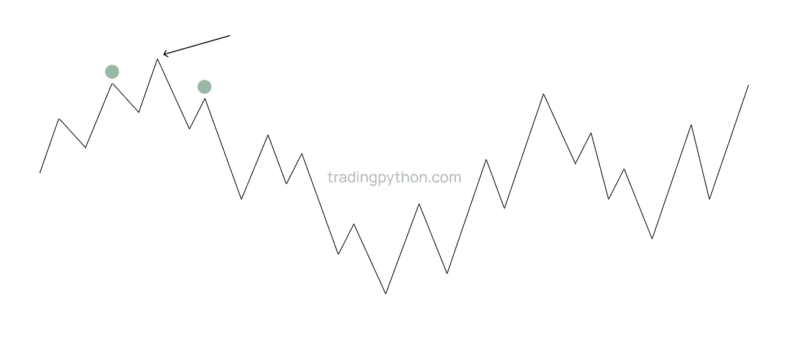

Midterm high

你可以得到中期低点，它的两边有两个更高的低点，

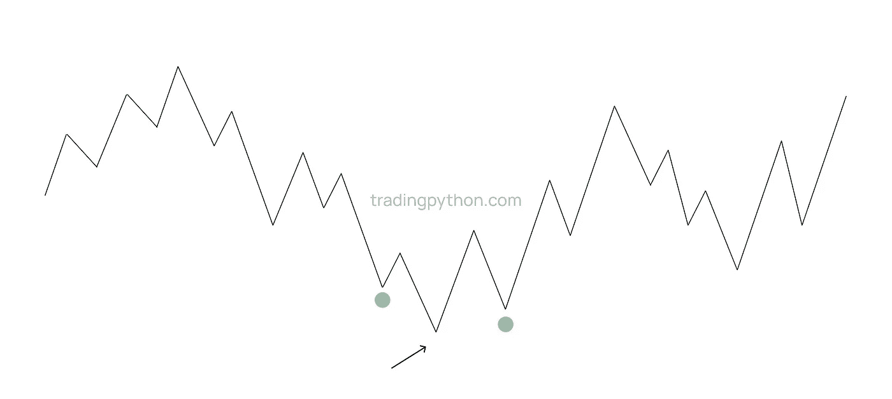

Mid-term low

这很容易看到，当你看到它们时，记下它们，不管你用什么来识别它，那是你的做法，但重要的是要明白它们在哪里，

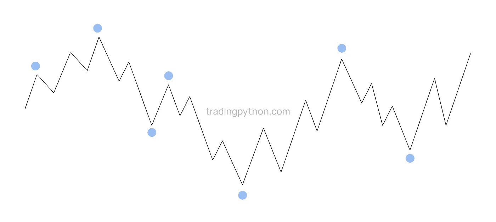

Midterm key points

当它们开始像这样嵌套时，你可以在中期进行分类，以了解长期情况，因为如果我们在它的两侧有较低的高点，这将被分类为长期高点，这也将允许你预期看到更长期的价格波动，所以通过嵌套并在各自的时间框架内标出你的波动高点和波动低点，你开始建立一个框架，如果你处于中期或短期价格波动中，并且在你的市场结构内，你需要能够下降。

我们也可以通过观察这些中期价格点来找到腿，

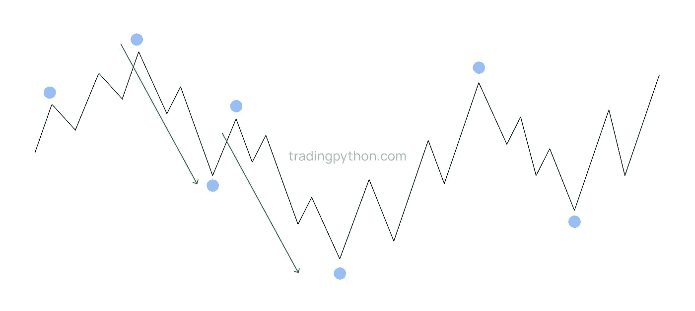

我们很容易看到它是复制的。

让我们在下一篇关于杀伤区的文章中再见吧——时间和价格理论。

> 加入 Coinmonks [电报频道](https://t.me/coincodecap)和 [Youtube 频道](https://www.youtube.com/c/coinmonks/videos)了解加密交易和投资

## 也阅读

 [## 杠杆代币[多头代币]终极指南

### 杠杆化令牌是具有杠杆化风险敞口的 ERC20 令牌，不考虑保证金、要求、管理…

medium.com](/coinmonks/leveraged-token-3f5257808b22)  [## 最佳加密交易所| 2022 年十大加密货币交易所| CoinCodeCap

### 哪一个是最好的加密交换？在本文中，我们将根据多种加密货币列出 10 大加密货币交易所

coincodecap.com](https://coincodecap.com/crypto-exchange)  [## 2021 年 6 大最佳硬件钱包|顶级加密硬件钱包[更新]

### 最好的加密货币硬件钱包是绝对必要的。我们将在 NGRAVE、Ledger Nano X 和…

medium.com](/coinmonks/the-best-cryptocurrency-hardware-wallets-of-2020-e28b1c124069)  [## 加密交易机器人——19 款最佳免费加密交易机器人

### 2022 年币安、比特币基地、库币和其他密码交易所的最佳密码交易机器人。四进制，位间隙…

medium.com](/coinmonks/crypto-trading-bot-c2ffce8acb2a)  [## 最佳 4 个加密交易信号电报通道

### 这是乏味的找到正确的加密交易信号提供商。因此，在本文中，我们将讨论最好的…

medium.com](/coinmonks/best-crypto-signals-telegram-5785cdbc4b2b)  [## 2022 年 2 月将购买的五大加密技术| CoinCodeCap

### 加密货币是不受任何中央机构监管的数字货币，并且不稳定。有些日子…

coincodecap.com](https://coincodecap.com/top-5-crypto-to-buy-in-february-2022)  [## Bitsgap 评论-交易机器人加密信号和套利 2022

### 这篇文章的重点是 Bitsgap 审查，这是一个最终的交易解决方案，并提供交易机器人，信号…

coincodecap.com](https://coincodecap.com/bitsgap-review)  [## 40 个最佳电报频道，用于加密、电影、表演和演讲| CoinCodeCap

### 免费下载所有电影。德国免费加密信号。下载讲座。CoinCodeCap 经典，网飞电影等。是……

coincodecap.com](https://coincodecap.com/best-telegram-channels)  [## Keevo 钱包点评:是最安全的硬件钱包吗？2022 | CoinCodeCap

### 在这篇 Keevo Wallet 评论中，我们将讨论他们如何改变我们看待硬件钱包的方式。基沃是…

coincodecap.com](https://coincodecap.com/keevo-wallet-review)