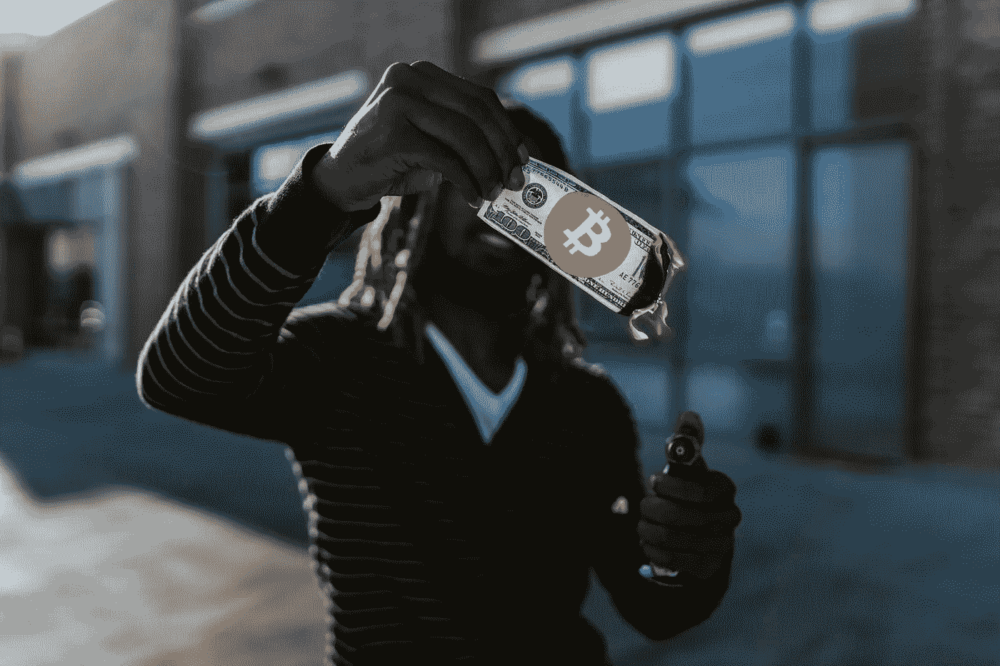

# ETH 燃烧价值 60 亿美元的以太坊。这是什么意思？

> 原文：<https://medium.com/coinmonks/eth-burns-6-billion-worth-of-ethereum-what-does-it-mean-f23385a823c0?source=collection_archive---------41----------------------->

## 以太坊如何做到这一点，为什么它很重要。

编辑注意:简单的语法修正

在最近的新闻中，以太坊烧掉了大量的供应。在我写关于以太坊 2.0 更新的文章时。一个对 crypto 很了解的家人也告诉了我一些我不知道的事情。比如说 crypto，不知道有多少普通人知道这个。尽管如此，一些密码实际上没有比特币那样的硬性上限。我认为他们都是一样的，只是有固定的供应。当我学习一些密码的时候，我很担心，因为以太坊会扰乱它的供应。

## 为什么重要？

我不是唯一一个担心以太坊没有上限的人。扰乱供应的诱惑总是存在的。2019 年，以太坊联合创始人 Vitalik 在 4 月 1 日 unironically 上提出，以太坊应该像比特币一样有一个硬封顶。我想这是一个知道多少是太多和太少的问题。有一个灵活的上限可以让以太坊自我监管，而不会像比特币一样成为囤积加密。与美元不同，以太坊很容易控制其货币的流动。

# 但是所有被摧毁的以太坊是怎么回事？

回到正题，以太坊已经烧完货源意味着什么。但是为什么呢？嗯，跟合并到以太坊 2.0 有关。我写了一篇文章解释以太坊 2.0 是什么，为什么它在这里很棒:

 [## 以太坊 2.0 将改变一切

### 如果你有以太坊，你很幸运。但是 2.0 的更新是什么呢？

medium.com](/coinmonks/ethereum-2-0-will-change-everything-cac01f24d56f) 

## 但是燃烧以太坊会对它的价值造成什么影响呢？

在短期内，它将增加以太坊的价值。我们真正应该问的问题是，燃烧以太坊的真正目的是什么？嗯，这是升级到以太坊 2.0 计划的一部分。该计划的一部分是削减加密矿工从每笔交易中赚取的金额。大约一年前，在一个旧系统中，以太坊开发者认为矿工可以通过垃圾交易来“欺骗系统”。这样做提高了最低费用，对每个人都不利。因此，如果他们不烧掉部分交易费，他们就可以用垃圾交易来填充这些区块，从而提高除了他们自己以外的所有人的最低成本。这将使他们成为唯一的受益者，只会赚钱。

*这就像在点对点视频游戏中落后一样。如果你落后了，你就有优势了，因为你只是在对手的屏幕上落后了。*

## 那么还有什么我们应该知道的吗？

还有一件事。当以太坊在今年夏天晚些时候完成“合并”时，如果它按时推出，我们将会看到更多的 burns。*“在‘合并’之后，ETH 的发行数量预计将下降 90%，这将导致类似的费用水平，从而使 Ether 的供应量每年减少多达 5%”*这是区块链一家分析公司在最近的时事通讯中引用的一段话。这让人们对合并感到兴奋，并准备购买更多以太坊。

*来源援引:*

[https://www . investopedia . com/news/why-ether eum-co founder-proposing-hard-cap/#:~:text = On % 20 April % 201% 2C % 20 ether eum % 20co，t%20a%20joke%20at%20all](https://www.investopedia.com/news/why-ethereum-cofounder-proposing-hard-cap/#:~:text=On%20April%201%2C%20ethereum%20co,t%20a%20joke%20at%20all) 。

 [## 以太坊故意摧毁了自己价值近 60 亿美元的加密货币。原因如下。

### 自 8 月份以来，乙醚的供应量下降了 65%，在备受期待的“合并”之后，预计还会有更多

fortune.com](https://fortune.com/2022/03/21/ethereum-destroyed-billions-in-ether-supply/) 

> 加入 Coinmonks [电报频道](https://t.me/coincodecap)和 [Youtube 频道](https://www.youtube.com/c/coinmonks/videos)了解加密交易和投资

# 另外，阅读

*   [XT.COM 评论](https://coincodecap.com/profittradingapp-for-binance)币安评论 |
*   [SmithBot 评论](https://coincodecap.com/smithbot-review) | [4 款最佳免费开源交易机器人](https://coincodecap.com/free-open-source-trading-bots)
*   [比特币基地僵尸程序](/coinmonks/coinbase-bots-ac6359e897f3) | [AscendEX 审查](/coinmonks/ascendex-review-53e829cf75fa) | [OKEx 交易僵尸程序](/coinmonks/okex-trading-bots-234920f61e60)
*   [如何在印度购买比特币？](/coinmonks/buy-bitcoin-in-india-feb50ddfef94) | [瓦济克斯审查](/coinmonks/wazirx-review-5c811b074f5b)
*   [隐翅虫替代品](/coinmonks/cryptohopper-alternatives-d67287b16d27) | [HitBTC 审查](/coinmonks/hitbtc-review-c5143c5d53c2)