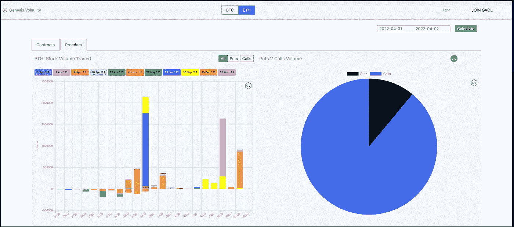

# ETH Calls 赢得了胜利

> 原文：<https://medium.com/coinmonks/eth-calls-won-the-day-3efcae70b4df?source=collection_archive---------51----------------------->

不要害怕，买电话。这是当天的基调，因为交易者严重倾向于以太坊在[范式](https://www.linkedin.com/company/paradigmco/)的场外流动性网络中的上行。瑞士联邦理工学院 5%以上的涨幅吸引了很多人的目光，而且有很多人在谈论瑞士联邦理工学院的表现如何优于 BTC。ETHBTC 对以 3 1/3%的幅度突破了 200 天移动平均线。

ETH 并没有主动采取行动。Solana road 取得了 11 . 5%的更好的收益。卡尔达诺、波尔卡多特和泰佐斯也有所回升，但没有达到瑞士联邦理工学院的要求。

至于比特币，BTC 度过了美好的一天。涨幅接近 2%。看涨/看跌图看起来远不如我们在 ETH 看到的那样乐观。今天的期权交易中，约三分之二是看涨期权。

> 加入 Coinmonks [电报频道](https://t.me/coincodecap)和 [Youtube 频道](https://www.youtube.com/c/coinmonks/videos)了解加密交易和投资

# 另外，阅读

*   [3 商业评论](/coinmonks/3commas-review-an-excellent-crypto-trading-bot-2020-1313a58bec92) | [Pionex 评论](https://coincodecap.com/pionex-review-exchange-with-crypto-trading-bot) | [Coinrule 评论](/coinmonks/coinrule-review-2021-a-beginner-friendly-crypto-trading-bot-daf0504848ba)
*   [莱杰 vs n rave](/coinmonks/ledger-vs-ngrave-zero-7e40f0c1d694)|[莱杰 nano s vs x](/coinmonks/ledger-nano-s-vs-x-battery-hardware-price-storage-59a6663fe3b0) | [币安评论](/coinmonks/binance-review-ee10d3bf3b6e)
*   [Bybit Exchange 审查](/coinmonks/bybit-exchange-review-dbd570019b71) | [Bityard 审查](https://coincodecap.com/bityard-reivew) | [Jet-Bot 审查](https://coincodecap.com/jet-bot-review)
*   [3 commas vs crypto hopper](/coinmonks/3commas-vs-pionex-vs-cryptohopper-best-crypto-bot-6a98d2baa203)|[赚取秘密利息](/coinmonks/earn-crypto-interest-b10b810fdda3)
*   最好的比特币[硬件钱包](/coinmonks/hardware-wallets-dfa1211730c6) | [BitBox02 回顾](/coinmonks/bitbox02-review-your-swiss-bitcoin-hardware-wallet-c36c88fff29)