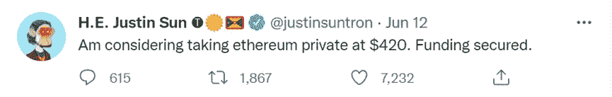

# ETH 崩盘，货币市场还能上涨吗？

> 原文：<https://medium.com/coinmonks/eth-crash-down-could-the-currency-market-still-rise-cdc41ddd0680?source=collection_archive---------24----------------------->

货币市场已经下跌了 12 周，它仍然……有一种主流货币让我如此疯狂，那就是以太坊。这两天出现了一批 alt 币的大跌，引发了币圈新一轮的恐慌……币圈很多人感慨，大熊市来了？让我们从小的角度来谈谈大的加密货币市场，市场出了什么问题？

**以太坊跌破 1000 美元**

2022 年 6 月 13 日，难忘的一天。

以太坊的 token Ether)在 Uniswap 上跌至 950 美元低点，而 ETH 在跌至 950 美元后大幅反弹，对 ETH/USD 的看跌延续设置可能是另一种态度。

当 Eth 出现一些极端波动和巨大波动时，也可以看到一些预兆。在 crypto lending service Celsius 宣布在“极端市场条件下”暂停提款后，投资者将出现恐慌性抛售。与此同时，这条新闻发生后，根据链上数据，一条匿名鲸鱼在 6 小时内以超过 1.2 亿美元的价格卖出了约 93,000 ETH。

**联邦理工学院的坏消息**

雪崩中没有一片雪花是无辜的。那么 ETH 的大跌和在座的各位无关。

Vitalik 是中国人，以太坊是中国项目。在维塔利克把中文名字改成了吞林之后。，当我在推特上看到这个消息的时候，我会说这完全是“一个开头的图，剩下的都是瞎编的。”消息一发布，哪里有潮流，哪里就有孙正义。马上声称要 420 亿美元私有化 ETH，钱够了。

**资本不再看好 ETH**

三箭资本创始人朱苏已将 ETH、AVAX、LUNA、SOL、NEAR、MINA 等加密货币从其推特个人资料中删除，目前仅保留“比特币”。这些鲸鱼和机构都跑了。个人还有必要留下来吗？一个行业的成功离不开方方面面的支持，而如果大家都开始追求利润，这就是一个行业衰落的开始。

除了三箭资本(Three Arrows Capital)，根据 WhaleStats 的数据，以太鲸平均买断了 151 个 AAVEs，价值 26262 美元，是过去 24 小时内以太鲸购买的第三大加密资产。同样是在 DeFi 领域，ETH whales 正在增持 Compound (COMP)，ETH 网络上一些比较有实力的玩家也在增持 Aave 和 Compound 等集中式 altcoins。

**市场环境不理想**

最近一周 ETH 的价格跌了不少，但大部分都是这两天发生的。原因之一是，美国劳工部报告称，5 月份通胀率达到 8.6%，为 1981 年 12 月以来的最高水平。CPI 上涨也加剧了投资者的担忧，进而迫使美联储继续加息。与此同时，政府削减了 9 万亿美元的资产负债表，这也抑制了投资股票和加密货币等风险更高的资产的兴趣。

不仅没有政府相应的支持，前微软创始人比尔·盖茨评论说:“我喜欢投资有价值的东西。公司的价值取决于它们生产优质产品的质量。加密货币的价值只是基于一个人决定另一个人会为它支付多少钱。”后来，沃伦·巴菲特不同意。

之后，由于未结束的俄乌战争和冠状病毒封锁后的全球经济压力，人们对加密市场失去了信心。

ETH 矿商即将变得无利可图

自 2020 年以来，对于许多与传统能源网络相连的矿商来说，ETH mining 首次变得无利可图。以太坊的价格不断下跌，而能源的价格却在暴涨。

因此，这意味着，为了盈利，代币的价格需要大幅上涨，或者降低能源价格，让矿商盈利，要让矿商盈利，价格至少需要升至 1400 美元以上。

**延伸阅读**

**以太坊区块链可能摧毁 ApeCoin**

最近，有一个关于 ApeCoin 刀是否应该留在区块链联邦理工学院的有趣投票。结果是 ApeCoin DAO 要搬出以太坊区块链网络，因为以太坊区块链开发者遇到了很多问题；投资者希望留下来并从以太坊 2.0 的额外新功能中受益，以便 NFT 可以获得二次增长率发展。

**写在最后**

最后回到前面的问题，货币市场还能涨吗？我一直相信区块链的未来是值得期待的。这一次，加密货币的崩溃不是一个孤立的事件，尽管未来可能会有进一步的下跌，但从历史上看，股市往往会在大幅下跌后反弹。熊市不是我们恐慌的理由，而是提醒我们可以适当分散投资组合，这是降低风险的好时机，也让我们知道我们可以承担多大的风险，需要多少时间来弥补损失。

> 加入 Coinmonks [电报频道](https://t.me/coincodecap)和 [Youtube 频道](https://www.youtube.com/c/coinmonks/videos)了解加密交易和投资

# 另外，阅读

*   [拥护卡审核](https://coincodecap.com/uphold-card-review) | [信任钱包 vs MetaMask](https://coincodecap.com/trust-wallet-vs-metamask)
*   [Exness 评测](https://coincodecap.com/exness-review)|[moon xbt Vs bit get Vs Bingbon](https://coincodecap.com/bingbon-vs-bitget-vs-moonxbt)
*   [如何开始通过加密贷款赚取被动收入](https://coincodecap.com/passive-income-crypto-lending)
*   [BigONE 交易所评论](/coinmonks/bigone-exchange-review-64705d85a1d4) | [电网交易机器人](https://coincodecap.com/grid-trading)
*   [氹欞侊贸易评论](https://coincodecap.com/anny-trade-review) | [CoinSpot 评论](https://coincodecap.com/coinspot-review)
*   [新加坡十大最佳加密交易所](https://coincodecap.com/crypto-exchange-in-singapore) | [购买 AXS](https://coincodecap.com/buy-axs-token)