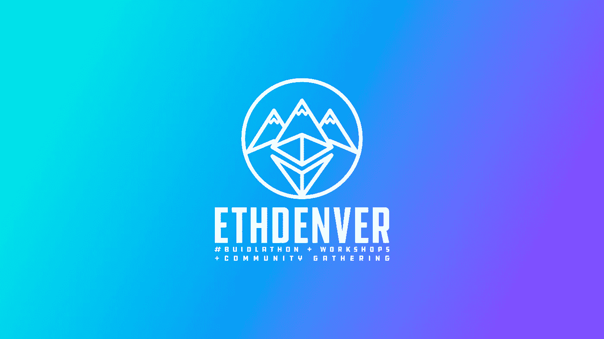
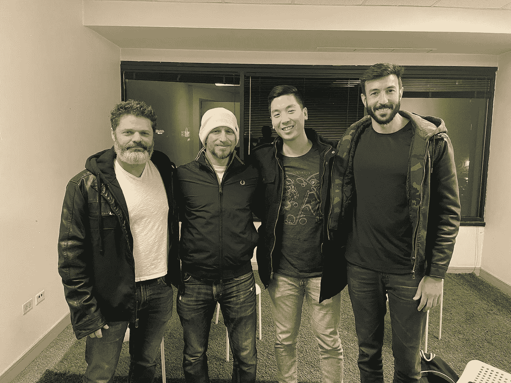
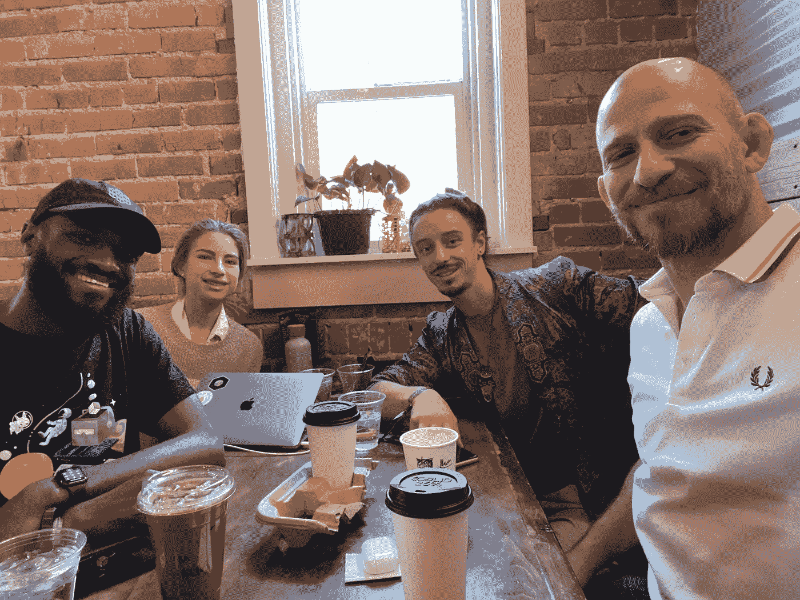
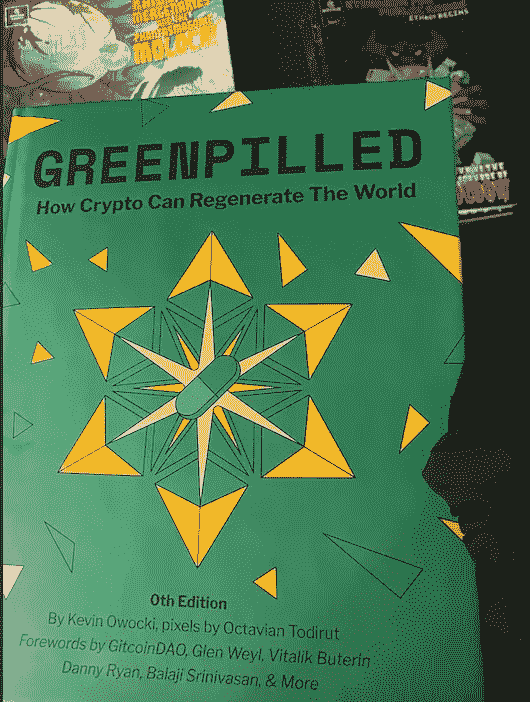
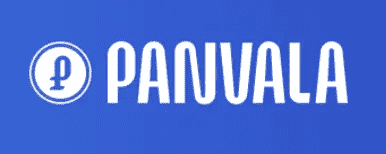
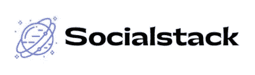
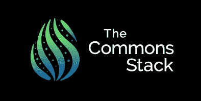

# Eth Denver、Web3 和分散式超级英雄联盟

> 原文：<https://medium.com/coinmonks/eth-denver-web3-and-the-decentralized-league-of-superheroes-432b29c061e3?source=collection_archive---------10----------------------->

我刚刚在丹佛联邦理工学院参加了一年一度的区块链会议，结束了将近一周的工作，回到了多伦多的家中。多么鼓舞人心的一周。虽然许多人在这样的活动中关注加密的财务方面，许多人关注技术方面，但也有越来越多的人关注影响方面——影响就像改变世界一样。我遇到了几十个这些令人惊讶的专家，并受到鼓舞、鼓励和授权。我想分享一些关于他们的东西，一部分是为了庆祝和纪念他们以及由 ETH Denver 提供的令人难以置信的空间和体验，但也是为了让其他关注影响力的人了解他们。与我交谈过的几乎每个人都有一个共识，那就是需要在关注社会影响的个人、团体和项目之间建立和加强更好的联系和合作。也许简单地了解一下他们会给你一些我所感受到的启发，也许还会给你带来一种可能的联系。

**Web3** 在开始之前，我想先分享一个重要的收获，特别是如果你不是很了解区块链/密码世界，你可能不会有这样的感觉——web 3 很神奇。这是真正的哈利波特。通过设计我们想要的世界，它给了我们改变世界的工具和能力。对于那些新手来说，可以把 Web 1.0 想象成一份在线报纸——有效的单向交流。相比之下，Web 2.0 让你不仅有机会拥有像脸书或 Twitter 账户这样的在线存在，还能分享你的声音，直接与他人互动。Web 3.0 为您提供了缰绳。它让你设计的不仅仅是网站和应用程序；它允许你设计组的内部工作。社会，看起来很复杂，只是一个由小团体组成的大团体。Web3 为我们提供了实际设计和建设一个可持续、公平、可再生和富足的社会的工具，这也是[全球团结](http://www.GlobalUnity.org)和大多数变革性影响努力的目标。我分享这些是为了提供一种可能性的感觉和我提到的一些人的一些背景。关于 web3 的更深入的介绍，请看我的朋友和 Liminal DAO 的创始人 Jared Lucas 的这篇文章。

超级英雄分散联盟
这里是我在丹佛联邦理工学院遇到的一些不可思议的人，他们似乎都在以不同的形式做着同样的努力。

**加里盛，civics 不插电&梦岛
哇。加里在《公民不插电》中创建了一所超级英雄学院。他在 web3 中以影响为重点培训 GenZs。超过 1200 个孩子参加了他为期 3 个月的项目，学习了这些技能，并成为他的在线社区的一部分。他还在制作一部关于新兴运动的纪录片，专注于使用这些新工具来建设一个更美好的世界，我、里基和阿莱杭德娜(见下)应邀成为其中的一员。感谢 Jared 的介绍。**

**Daniel Schmachtenberger，consistency Project** 我一直很钦佩 [Daniel](http://@danielschmach) 的工作和清晰的思路，所以能与他见面并真正交谈是丹佛联邦理工学院为数不多的亮点之一。丹尼尔正在从事[一致性项目](https://consilienceproject.org/)项目，旨在通过增加我们的集体感知能力和避免虚假信息和两极分化的陷阱来帮助社会。虽然在他与 GitCoin 创始人 Kevin Owocki 的采访/讨论结束后，我有几分钟时间与他在一起，但我很幸运地被邀请旁听他、Jared 和 Gary 的对话。碰巧的是，当我和 Gary、Benjamin Life(下)正在吃饭时，Daniel 进来取食物，谢天谢地，餐厅很慢，所以我们讨论了近一个小时的文明设计，其中大部分是关于全球团结的。真正的享受。

With Daniel, Gary, and Jared

**Rieki Cordon，创始人，SEEDS**
[Rieki](https://twitter.com/riekicordon) 是可再生农业根源的加密货币和社区的创始人， [SEEDS](https://www.joinseeds.com/) (播种生态、公平和去中心化的社会)。SEEDS 的社区有许多非常酷的动态，从奖励和投资再生农业活动，到他们的治理模式，但我最欣赏与 Rieki 会面的一点是他对连接运动的无私承诺。他与一些影响力领袖举行了一次禅会，讨论我们如何更好地联系和互通，以便共同建设一个更美好的世界，这让我认识了许多了不起的人。

With Rieki and his wife Cece

我在里基的会议上遇到的一个人是[马克西姆](https://www.linkedin.com/in/maxim-goeschen-72592417b/?originalSubdomain=de),[盖亚捐赠](https://gaia-gives.org/)的首席执行官，以前为大赦国际和联合国儿童基金会筹款。Gaia 不仅提供注重影响力的领导力培训，他们的新平台将大幅削减非营利组织的筹款成本，而且与区块链地区的其他类似组织不同，他们有一个“场外”计划——与银行建立关系，允许接受者将他们的加密捐款转化为法定货币(标准货币)。除了与全球团结一致的大规模影响之外，Gaia 给我的印象是，它似乎可以使用 web3 来真正加速无数的影响工作。

**本杰明生活** 也是在一年多前的里基会议上，我第一次通过俱乐部会所认识了本杰明。多亮的灯啊。凭借对健康共享、公平治理、本土智慧等背后的原则的深刻理解，Benjamin 在影响和再生空间中赢得了许多粉丝，并带来了超级接地气的存在。能够面对面交流，分享乐趣和见解真是太棒了。一个艺术家，思想家，梦想家，现在是黎明的兄弟。

Benjamin, Jared, and Daniel shining the light.

**贾里德·卢卡斯，液态人工智能&黎明道** 光的另一个兄弟，[贾里德](https://twitter.com/KapSlap)在使丹佛联邦理工学院成为一次不可思议的经历中发挥了重要作用。他一直在与物联网、M2M、产品 RFID 和 AutoID 的发明者 David L. Brock 博士一起研究动态智能。大卫开发了一种新的人工智能范式，与传统方法截然不同。Liquid Intelligence 与英伟达(NVIDIA)合作成立了 Anuranet，该公司正在推出一款家用智能电表，可以测量和奖励减少的能源使用。Jared 也是 LiminalDAO 的创始人，LiminalDAO 是一个不和谐服务器，希望发展成为一个分散的自治组织，致力于支持和奖励技术和社会前沿的先锋。在加入 Web3 空间之前，Jared 主要以 DJ 和音乐制作人的身份为人所知，以艺名“Kap Slap”表演。

**迈克尔·希利，Unit Ventures** 大约一年前，我通过 Clubhouse 认识了[迈克尔](https://www.instagram.com/michaelhealyco/)——我实际上是在全球统一电台的 System Changer Spotlight show 中采访他的——但这是我们第一次见面。Michael [Unit Ventures](https://www.unit.network/home) ，它不仅仅是一个 DAO builder，在某种意义上，它还是一个 tokenomics factory for good。他们希望通过使用 Web3 工具建立变革者、企业家和投资者社区来解决不平等问题。迈克尔相信，随着时间的推移，我们每个人都将有自己的令牌和单位已经建成，以促进这一过渡。

With Michael, right after Rieki’s Civilization Design Gathering

**Jeff Emmett，CommonsStack 和 Jessica Zartler，BlockScience** 我看到 [Jessica](https://twitter.com/JessicaZartler) 在 GitCoin 谢林点活动的一个关于再生密码经济学的小组讨论会上发言，后来，也是由于 Jared，在喵 Wolf——谢林点后派对举行的地方，被介绍给她和 [Jeff](https://twitter.com/jeffemmett) 。第二天，他们亲切地欢迎我进入 AirBNB，在那里我见到了许多其他名人。除了欢迎之外，我对他们的工作非常满意，包括帮助迷幻先锋保罗·史塔曼兹利用 Web3 资助和传播他的工作。我认为这是 BlockScience 和 CommonsStack 所做的不可思议的工作之外的事情(更多内容见下文)。

**(Michael) Zargham，block science** block science 是一家专注于复杂系统的工程、研发和分析公司，我听到了一些关于它的历史和 [Zargham 的](https://twitter.com/mZargham)令人信服的愿景。在聚会上听了他对他人运营的 impact 项目的解剖刀般的分析后，我渴望了解他对全球团结的看法，并没有失望——他分享了清晰、深刻、有用的思考和观点。

Benjamin Henretig，永远不要忘记这个医生。音乐家转型为电影制作人，[本杰明](https://www.instagram.com/benjaminhenretig/)正在制作一部 NFT 支持的互动纪录片，[永不忘记(NFT)——被解放的创作者的崛起](https://www.neverforgetthis.xyz/)，讲述 NFT 革命的人类故事。在与 Jared、Gary、Benjamin Life 和 Daniel Schmachtenberger 聊了一夜之后，我们去了 AirBNB 的一个派对，那里住着一些很棒的人。那里有一架钢琴，本杰明·H 一进来，就径直走向钢琴，奇迹发生了。Davida Sara 有一副好嗓子，本杰明·里弗(Benjamin Life)投入了他的精力，我们其余的人欣赏了一场有趣的、充满黎明歌曲的音乐会。我们将制作这首歌，一首 GameB (一场准乌托邦运动)的颂歌，一首 NFT。这是一个如此美妙的夜晚——除了达维德和本杰明，非常感谢所有帮助营造房间氛围的人，贾里德、[布莱恩·霍夫斯坦](https://twitter.com/BrianHoffstein)、[克里斯·艾迪](/@Chris_Eddy)、米乔和尼克。多好的夜晚啊。

An anthem for GameB

**阿莱杭德娜·博尔达，影响力制图员** 在我工作的最后一天，我在一家咖啡馆偶遇马克西姆，看到他和参加里基活动的[阿莱杭德娜](https://www.linkedin.com/in/alejandra-borda/)在一起。我们进行了一次令人难以置信的近 3 个小时的会议(Jordan 也参加了，如下)，介绍了我们每个人正在做的出色工作，并讨论了影响组织之间更大互联性的总体需求。阿莱杭德娜似乎是一个超级连接器，是许多影响组织的一部分，并在它们之间架起了桥梁。她创造了“影响力制图员”这个术语——绘制不同影响力组织和人物的人。我喜欢这个术语，许多人都同意，有目的的努力的图表和连接对于我们有效地前进是至关重要的。

**Jordan Lemmons，Web3 增长策略师** [Jordan](https://www.linkedin.com/in/jordan-lemmons-20aa3060/) 为 Web3 带来了两种重要的 Web2 技能——对销售渠道、个人资料开发等的理解——这些至关重要的技能常常被注重影响力的组织所忽视。更令人兴奋的是，他对如何利用 Web3 产生影响有很好的想法和愿景，特别是一个捐赠模型和一个新国家的众包(全球团结愿景中的战略之一，Balaji Srinivasan 对此做了很好的阐述)，以赋予非洲裔美国人政治和经济权力。

With Jordan, Alejandra, and Maxim

**Anne Connelly，区块链教育家** 我第一次见到 [Anne](https://twitter.com/Anne_Connelly) ，她在 12 月的 RadicalXChange 年度活动上在丹佛联邦理工学院演讲。除了是奇点大学的一员，她还在波士顿大学教授《区块链的力量》( the power of America for good ),并在区块链教育领域进行了令人难以置信的创新，创作了一本漫画书，用讲故事的方式向年轻人讲述 Web3。 [*信任*](https://www.trustgraphicnovel.com/) “讲述了一个年轻的肯尼亚女人了解了区块链并利用它改变了她的社区的故事。”

**吴弭——在我参加完一个聚会后回来的路上，我在酒店大厅遇见了米歇尔，我们在那里偶然开始聊起了社会影响。作为一名目前在大型科技公司工作、曾在联合国工作的人，她对多元化和让更多女性进入这个领域充满热情。她参与了多个以女性为中心的团体(例如 Surge、We3、Boys Club、BFF)让更多女性参与 web3 对话、建设和发展..**

**劳伦，吉维斯** 劳伦参加了一个名为“公共产品是好的”的小组讨论，她分享了许多弥合影响和加密的绝妙想法。后来我们简短地交谈了一下，这不仅进一步证实了在这个领域产生影响的可能性，而且也进一步证实了有人致力于实现这种可能性。

Kevin Owocki，GitCoin
虽然我在 RadicalXChange 的年会上见过 GitCoin 的创始人和公共产品倡导者，但我在 ETH Denver 并没有和他有太多的交流。我确实想让大家关注他的新书《绿色药丸:加密如何再生世界》，该书以建设再生世界的名义倡导协作。视觉上吸引人又有趣，这是我期待得到的东西——他们在活动中分发了它们，但很快就用完了——[考虑也拿一个](https://greenpill.party/)。

**突出组织** 还有更多出色的个人——不胜枚举——以及许多工作出色的组织。我可能和创始人见过面或说过话，但没有深入到可以分享的程度。然而，这些组织的工作相当鼓舞人心。

**潘瓦拉**

[Panvala](https://panvala.com/) 创始人 [Niran Babalola](https://twitter.com/niran) ，我之前曾通过 Human Systems’和 Joe Edelman 的 Social Design Club 见过他，他做了一个关于集体行动和社区所有权的演讲。Panvala 是一个社区网络，利用创新方法，利用捐赠基金和国家信托基金来增加社区行动和商业捐赠，以及其他以影响为导向的目标。

**GitCoin**

[GitCoin](https://gitcoin.co/) 举办了一整天的谢林点活动，其中包括许多我最喜欢的演讲。它们有三个主要分支——1)二次资金匹配池:二次资金是一种新颖、民主的资助公共产品的方式。他们已经通过它资助了超过 2000 万美元的开源项目。2)黑客马拉松——git coin 召集数百名开发人员进行短距离冲刺，快速编写有用的项目代码。3)Kernel——一个为期 8 周的点对点教育加速器，向多达 250 人的群组教授 web3。

**社交栈**

[Social Stack](https://www.socialstack.co/) 已经开发了一个似乎是即插即用的 impact 平台，如果不是 impact coin(全球 Unity 生态系统设计提案的基础部分之一)。许多 web3 项目面临的挑战之一是 UI——用户界面。要真正成长，这些加密项目必须易于使用。对于外行来说，Social Stack 的无代码平台看起来优雅而直观。他们已经与许多关注影响的组织合作，包括 Blue Tiki Token，该组织鼓励积极的气候行动，如海滩和海洋清洁、红树林种植以及参与社区活动和活动。

**赐**

[Giveth](https://giveth.io/) 是一名 DAO，他利用 Web3 使捐赠者能够直接向社会公益项目捐赠，而不收取额外费用。凭借区块链带来的全新透明度，Giveth 实现了分散捐赠和可持续协作。当项目可以表明它们提供了公共产品时，100%的捐赠将进入项目*并且*Giv 奖励捐赠者，Giv 是 Giv 的 DAO 中的治理令牌。

**通用堆栈**

通过与 Giveth 和复杂系统研究公司 BlockScience 的合作， [CommonsStack](https://commonsstack.org/) 提供了一个新的基础设施，根据 Jeff Emmett 的这篇文章[，它“将促进 commons initiatives 更像初创公司，通过会员投资寻求持续的资金，作为回报，在使用这些资金以有效实现社区目标方面提供共同所有权和共享决策。”很高兴看到尖端的 Web3 组织从公共资源的角度考虑问题，更不用说实际支持真正的项目了。](/giveth/introducing-the-commons-stack-scalable-infrastructure-for-community-collaboration-6886eb97413e)

除了会见这些令人难以置信的人和接触这些伟大的组织之外，还有美丽的艺术、美妙的音乐和高调英雄的演讲，如[杨安泽](https://twitter.com/AndrewYang)、[奥黛丽·唐](https://twitter.com/audreyt)、[维塔利克·布特林](https://twitter.com/VitalikButerin)和[格伦·维尔](https://twitter.com/glenweyl)。感谢丹佛联邦理工学院的组织者，他们创造了一个有影响力的涌现的空间。

附言:我们都很关注最近对乌克兰的袭击。全球统一智慧委员会的一名成员最近为任何希望使用加密技术支持地面人员的人发布了这个资源。

> *加入 Coinmonks* [*电报频道*](https://t.me/coincodecap) *和* [*Youtube 频道*](https://www.youtube.com/c/coinmonks/videos) *了解加密交易和投资*

# 另外，阅读

*   [3 商业评论](/coinmonks/3commas-review-an-excellent-crypto-trading-bot-2020-1313a58bec92) | [Pionex 评论](https://coincodecap.com/pionex-review-exchange-with-crypto-trading-bot) | [Coinrule 评论](/coinmonks/coinrule-review-2021-a-beginner-friendly-crypto-trading-bot-daf0504848ba)
*   [莱杰 vs n rave](/coinmonks/ledger-vs-ngrave-zero-7e40f0c1d694)|[莱杰 nano s vs x](/coinmonks/ledger-nano-s-vs-x-battery-hardware-price-storage-59a6663fe3b0) | [币安评论](/coinmonks/binance-review-ee10d3bf3b6e)
*   [Bybit Exchange 评论](/coinmonks/bybit-exchange-review-dbd570019b71) | [Bityard 评论](https://coincodecap.com/bityard-reivew) | [Jet-Bot 评论](https://coincodecap.com/jet-bot-review)
*   [3 commas vs Cryptohopper](/coinmonks/3commas-vs-pionex-vs-cryptohopper-best-crypto-bot-6a98d2baa203)|[赚取加密利息](/coinmonks/earn-crypto-interest-b10b810fdda3)
*   最好的比特币[硬件钱包](/coinmonks/hardware-wallets-dfa1211730c6) | [BitBox02 回顾](/coinmonks/bitbox02-review-your-swiss-bitcoin-hardware-wallet-c36c88fff29)
*   [block fi vs Celsius](/coinmonks/blockfi-vs-celsius-vs-hodlnaut-8a1cc8c26630)|[Hodlnaut 审核](/coinmonks/hodlnaut-review-best-way-to-hodl-is-to-earn-interest-on-your-bitcoin-6658a8c19edf) | [KuCoin 审核](https://coincodecap.com/kucoin-review)
*   [Bitsgap 审查](/coinmonks/bitsgap-review-a-crypto-trading-bot-that-makes-easy-money-a5d88a336df2) | [Quadency 审查](/coinmonks/quadency-review-a-crypto-trading-automation-platform-3068eaa374e1) | [Bitbns 审查](/coinmonks/bitbns-review-38256a07e161)
*   [加密复制交易平台](/coinmonks/top-10-crypto-copy-trading-platforms-for-beginners-d0c37c7d698c) | [Coinmama 评论](/coinmonks/coinmama-review-ace5641bde6e)