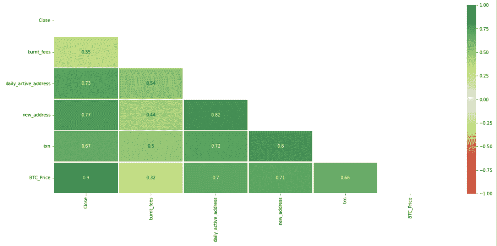
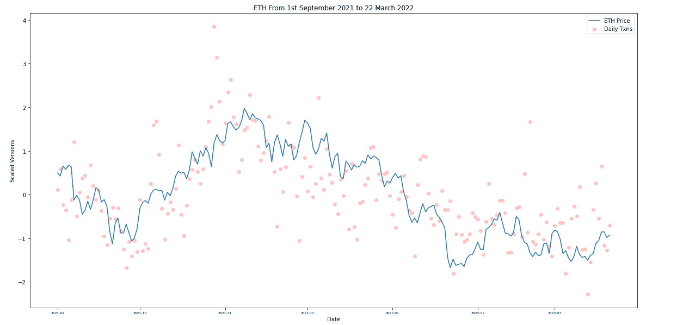

# ETH March 思想

> 原文：<https://medium.com/coinmonks/eth-march-thoughts-a71bae212812?source=collection_archive---------53----------------------->

过去的 6 个月对普通加密市场来说是一段坎坷的旅程。尤其是以太坊，见证了 11 月 7 日创下的 4812 美元的历史新高，然后在 2023 年 Q1 跌至 3000 美元以下。分析师们分享了一些他们一直在寻找的关键基本面指标，并解释了市场的每一次转折。因此，我很好奇，并决定探究这些因素对 ETH 价格的影响有多大:

*   日常交易
*   每日活动地址
*   每日新地址
*   BTC 价格
*   每天燃烧的乙醚数量

# 概观

从下面的相关性分析中可以看出一点端倪:

事实上，我们确实见证了某些指标与接近 0.9 的强相关性和大约 0.70 的其他指标之间的显著关系。

# 网络基础

由于 DAU，每日交易和每日新地址共享大于 0.7 的高相关性，我将只采用每日交易计数作为网络基础的代理。越来越多的用户在网络上交易=越来越多的需求，并可能影响以太网价格的上涨。不出所料，这些共享一个可见的关系。

# 通缩资产？—燃烧的乙醚

接下来，一个常见的假设是，燃烧的乙醚越多，一般来说乙醚的价格应该越高。许多人甚至把这比作一种通货紧缩资产，并附和说，随着时间的推移，价格会“飙升”到多高。

然而，有趣的是，它的相关性非常低，今年 1 月和 2 月之间观察到了巨大的差异。尽管在此期间 ETH 的燃烧量达到高峰，但事实上我们见证了价格的大幅下跌。

事实上，这是一个有趣的观察:

1.  ETH 价格下跌
2.  每日交易数量下降
3.  但是，每天都有玫瑰燃烧

然而，由于交易数量下降，不应该烧掉更少的 ETH 吗？

> 事实上，EIP-1559 提案实际上并不那么简单。对于该功能，必须考虑块大小的附加因素。因为较低的交易转换为较小的块大小，因此相应地调整费用。因此，当事务数量突然增加时，数据块大小的动态扩展不够快，反而会导致刻录率激增。

# BTC 仍然领先

下图可以很容易地打破 BTC 与替代硬币之间的脱钩叙述。不可否认的是，即使在 1 月抛售之前，BTC 实际上仍然对 ETH 的价格施加着重大影响。相反，根据过去 6 个月的情况，这两项资产在不久的将来可能实际上共享一个平行的轨迹。或许，应该注意的是，从今年 1 月中旬开始，两者的重叠线。

另一方面，观察 ETH/BTC 价格比是另一个值得研究的指标。从去年年底到现在，这一比率的下降表明，相对于 ETH，BTC 是一种更安全的加密资产。在去年 10 月至 11 月的平静时期，这一比率稳步提高。然而，当美联储可能加息和乌克兰-俄罗斯战争的消息爆发时，这一比例稳步下降至 10 月前的水平。因此，它再次证实了在悲观时期，可以看到向更安全的加密资产的转移。

# TVL 似乎有所增加

另一个值得注意的有趣观察是，从今年 1 月开始，随着价格下降，生态系统内的 ETH 令牌数量有所增加，表明在此期间有更大的积累。

# 思想

正如许多人声称的那样，另一个“隐秘的冬天”再次降临。仅从这张简短的图表中，我就注意到了一些关键的观察结果:

1.  网络基础对于提供其生态系统的底层健康和使用至关重要，例如 dApps、NFTs。由于 Opensea 上的 NFT 交易量占当前 ETH 交易量的 10%以上(截至本文撰写时),因此可以在每个类别中进行更细化的扩展，并了解这些交易量如何影响整体使用和情绪
2.  不可否认，BTC 和瑞士联邦理工学院有着紧密的联系，这驳斥了许多乐观的言论，即这些资产是独立的。事实上，令人震惊的是这些价格在这一时期是如何紧密跟随的。
3.  尽管它在 dApps 中被主流使用，但它仍被视为一种不稳定的资产。相对于 BTC，这些比率显示了每项资产的实力，以及 BTC 为何仍然受到青睐，尽管它除了储值之外没有其他实际用途。此外，我们都同意 ETH 的价格仍然非常容易受到美联储声明和任何导致价格剧烈波动的不可预见情况的影响。

展望未来，随着以太坊随着第二层的到来而扩展，并包括新的协议和 dApps，我希望这些能够稳定以太网的价格，并允许它在未来的时间内增长价值和效用。但与此同时，也许应该更详细地阐述对瑞士联邦理工学院和 BTC 大学之间密切关系的理解。

> 加入 Coinmonks [电报频道](https://t.me/coincodecap)和 [Youtube 频道](https://www.youtube.com/c/coinmonks/videos)了解加密交易和投资

# 另外，阅读

*   [CoinDCX 点评](/coinmonks/coindcx-review-8444db3621a2) | [加密保证金交易交易所](https://coincodecap.com/crypto-margin-trading-exchanges)
*   [红狗赌场评论](https://coincodecap.com/red-dog-casino-review) | [Swyftx 评论](https://coincodecap.com/swyftx-review) | [造币厂评论](https://coincodecap.com/coingate-review)
*   [Bookmap 评论](https://coincodecap.com/bookmap-review-2021-best-trading-software) | [美国 5 大最佳加密交易所](https://coincodecap.com/crypto-exchange-usa)
*   [如何在 FTX 交易所交易期货](https://coincodecap.com/ftx-futures-trading) | [OKEx vs 币安](https://coincodecap.com/okex-vs-binance)
*   [CoinLoan 审查](https://coincodecap.com/coinloan-review) | [YouHodler 审查](/coinmonks/youhodler-4-easy-ways-to-make-money-98969b9689f2) | [BlockFi 审查](https://coincodecap.com/blockfi-review)
*   [XT.COM 评论](https://coincodecap.com/profittradingapp-for-binance)币安评论 |