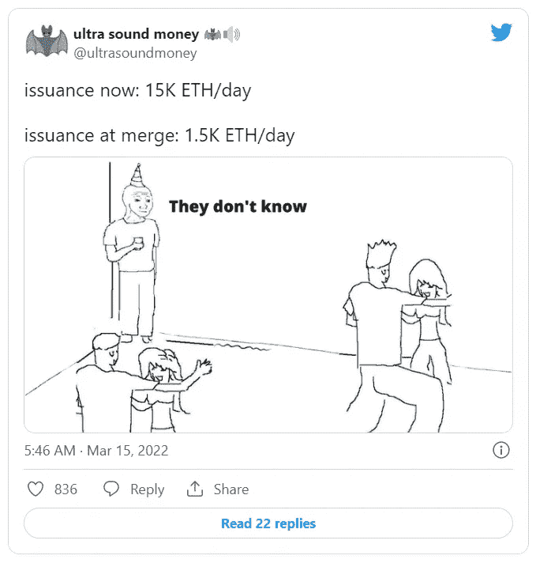
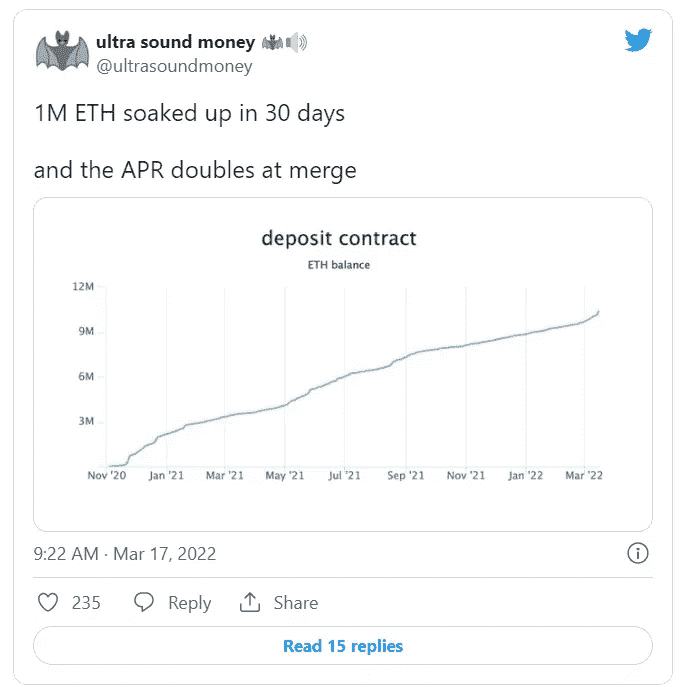

# ETH+合并= Altcoins Bull Run +道& NFT 生态系统#compound

> 原文：<https://medium.com/coinmonks/eth-merger-altcoins-bull-run-daos-nft-ecosystem-compound-3514c63941eb?source=collection_archive---------51----------------------->

短小，甜美，精明。我知道，如果你读这篇文章的深度够深的话，你的大脑已经塞满了太多的信息。迷路了？可能…但是，清晰正朝你走来。信息太多了，fomo/yolo 在普通消费者的观念中很强。不要上当！好了，现在该成长了！不是财务建议&做你自己的研究——否则你可能会失去所有的钱。GL #合十礼 

简单地说，以太坊即将合并。你可能知道这一点，他们正在改变网络到一个更加**生态友好的模式**。

*从 POW(工作证明)——>POS(利害关系证明)*

这是什么意思？？提供给**矿工**的**奖励**在缩水，**烧**还会继续。从而创造出***通缩机制*** (见下文发行)你能说……ba . ba . ba .看涨吗？

对于即将到来的合并，这不是唯一值得指出的事情。查看代表押记 ETH 的存款合同--说 whaa…看起来这些天人们不想放弃他们的 ETH。不知道这意味着什么，但你可以判断。

有一百个理由可以解释为什么这会导致 alt 硬币繁荣反弹。我建议你深入挖掘密码世界，找出原因！关注我即将到来的 Alt 硬币集会和更多的加密新闻！保持鼓掌长达 50 倍--在我的另一篇文章中找到阿尔法提示！(CT =加密推特)

> 加入 Coinmonks [电报频道](https://t.me/coincodecap)和 [Youtube 频道](https://www.youtube.com/c/coinmonks/videos)了解加密交易和投资

# 另外，阅读

*   [南非的加密交易所](https://coincodecap.com/crypto-exchanges-in-south-africa) | [BitMEX 加密信号](https://coincodecap.com/bitmex-crypto-signals)
*   [MoonXBT 副本交易](https://coincodecap.com/moonxbt-copy-trading) | [阿联酋的加密钱包](https://coincodecap.com/crypto-wallets-in-uae)
*   [Remitano 审查](https://coincodecap.com/remitano-review)|[1 英寸协议指南](https://coincodecap.com/1inch) | [购买 Floki](https://coincodecap.com/buy-floki-inu-token)
*   [MoonXBT vs Bybit vs 币安](https://coincodecap.com/bybit-binance-moonxbt) | [Arbitrum:第二层解决方案](https://coincodecap.com/arbitrum)
*   [买 PancakeSwap(蛋糕)](https://coincodecap.com/buy-pancakeswap)|[matrix export Review](https://coincodecap.com/matrixport-review)
*   [最佳免费加密信号](https://coincodecap.com/free-crypto-signals) | [YoBit 评论](/coinmonks/yobit-review-175464162c62) | [Bitbns 评论](/coinmonks/bitbns-review-38256a07e161)