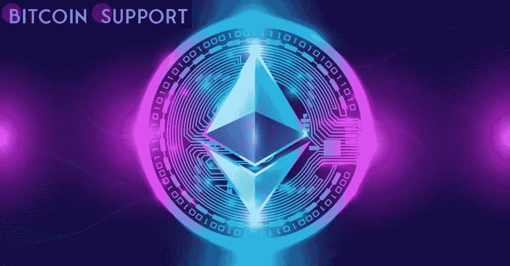

# 以太网链上分析:尽管价格下跌，以太坊活跃地址分歧仍然看涨

> 原文：<https://medium.com/coinmonks/eth-on-chain-analysis-despite-the-price-drop-the-ethereum-active-addresses-divergence-remains-90055f1ade4e?source=collection_archive---------37----------------------->

**Visit our website:-** [**https://bitcoinsupports.com/**](https://bitcoinsupports.com/)

在此前的两天里，以太坊(ETH)的价格已经从 2500 美元附近的支撑位上涨了近 8%。虽然价格在过去 24 小时内一直在波动，但目前在 2650 美元附近上涨了 4%。尽管价格波动平缓，但数据显示未来看涨。根据连锁测量公司 Santiment 的数据，尽管价格下跌，但 ETH 活跃地址背离仍维持在看涨背离范围内。此外，以太坊的每日活跃地址(DAA)和价格运动之间存在看涨背离，表明价格上涨是可能的。

**ETH 每日活跃地址正面展望**

3 月 16 日，Santiment 在一条推文中披露了以太坊每日活跃地址数据，为投资者提供预测。

**“以太坊公用事业在过去四个月保持稳定，尽管价格下跌了 35%。”随着 ETH 网络上相互作用的唯一地址的数量持平，“**

Santiment 解释道，并补充说 DAA 和价格将在 2022 年正向偏离。

[https://Twitter . com/santi mentfeed/status/1503947006925946884](https://twitter.com/santimentfeed/status/1503947006925946884)

此外，Santiment 录得一年来最低的鲸鱼交易，并不总是悲观的。这仅仅表明，主要利益相关者正在等待战争和通货膨胀的更多发展。以太坊背后的公司 ConsenSys 最近宣布，它打算将 4.5 亿美元转换为以太坊，它在价值 70 亿美元的 D 轮融资中筹集了这笔资金。ConsenSys 对以太坊生态系统的开发和工具化引起了 ParaFi Capital、淡马锡、软银愿景基金 2 和微软等投资者的兴趣。

以太坊联合创始人、ConsenSys 创始人乔鲁宾(Joe Lubin)表达了对以太坊的执着，他说:

**“本轮同时接受数字和菲亚特资产，并瞬间转换为 ETH。下一轮将是我们的“ETH 系列”，在这个系列中，我们将帮助投资者成为完全保密的人，并捐赠 ETH，作为他们致力于正在进行的范式转变的象征。”**

**以太坊在 NFT 市场的地位**

以太坊在 NFT 市场拥有约 80%的市场份额，是 NFT 和 DeFi 市场使用最广泛的区块链。因此，尽管 ETH 价格下降，但每日活跃地址保持不变。加密分析初创公司南森(Nansen)在 2 月份发布了六项指数来跟踪 NFT 市场。根据目前的研究，以太坊 NFT 的销售与加密市场成反比。

**访问我们的网站:-**[**【https://bitcoinsupports.com/】**](https://bitcoinsupports.com/)

**免责声明:这些是作者的观点，不应被视为投资建议。读者应该自己做研究。**

> 加入 Coinmonks [电报频道](https://t.me/coincodecap)和 [Youtube 频道](https://www.youtube.com/c/coinmonks/videos)了解加密交易和投资

# 另外，阅读

*   [印度最佳 P2P 加密交易所](https://coincodecap.com/p2p-crypto-exchanges-in-india) | [柴犬钱包](https://coincodecap.com/baby-shiba-inu-wallets)
*   [8 大加密附属计划](https://coincodecap.com/crypto-affiliate-programs) | [eToro vs 比特币基地](https://coincodecap.com/etoro-vs-coinbase)
*   [最佳以太坊钱包](https://coincodecap.com/best-ethereum-wallets) | [电报上的加密货币机器人](https://coincodecap.com/telegram-crypto-bots)
*   [交易杠杆代币的最佳交易所](https://coincodecap.com/leveraged-token-exchanges) | [购买 Floki](https://coincodecap.com/buy-floki-inu-token)
*   [3Commas 对 Pionex 对 Cryptohopper](https://coincodecap.com/3commas-vs-pionex-vs-cryptohopper) | [Bingbon 评论](https://coincodecap.com/bingbon-review)
*   [加密复制交易平台](/coinmonks/top-10-crypto-copy-trading-platforms-for-beginners-d0c37c7d698c) | [如何在 WazirX 上购买比特币](/coinmonks/buy-bitcoin-on-wazirx-2d12b7989af1)