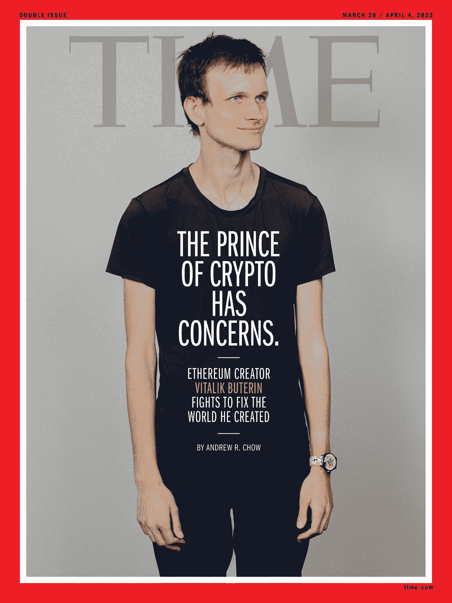
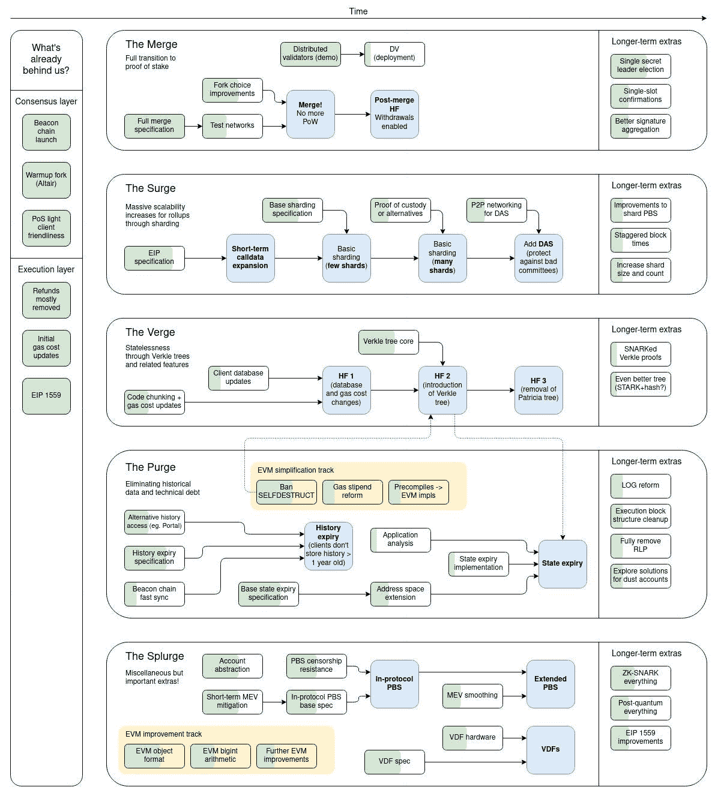

# ETH:冲动还是祸害？

> 原文：<https://medium.com/coinmonks/eth-urge-or-scourge-951d139e363a?source=collection_archive---------54----------------------->

***历史不重复，却押韵***

以太坊被不了解的人称为比特币的“数字黄金”,但这两种加密货币是非常不同的。比特币是一种真正的加密货币，而以太坊将这种代码转化为智能合约，即无论我们称之为未来的二进制位——“web 3”、“元宇宙”——都将在其上出现。第一名没有真正的竞争对手，而第二名有一群“以太坊杀手”在蚕食它的市场份额。国王加密公司的创始人中本聪是匿名的，而维塔利克·布特林登上了*时代*的封面:

This issue is now an NFT, because of course it is.

今年，两者将进一步分离。虽然比特币仍然与本月差点被欧盟禁止的高能耗工作证明系统相结合，但以太坊的区块链将融合为一个从“以太坊 2.0”更名而来的利益证明系统，因为拜托，现在已经不是 1997 年了 [*(或者是？)*T9*。*相反，Eth2 现在将被分成五个独立的阶段，称为——不是开玩笑——合并、激增、濒临、净化和挥霍](https://en.wikipedia.org/wiki/Surge_(drink))。

Flowcharts make me glurge.

我无法解释这些，也不需要解释。但是，随着 3 月 14 日窑炉测试网的上线，他们已经达到了预期目标。

这些变化给以太坊的支持者带来了勇气，他们声称过渡将几乎消除排放，将收益率提高一倍甚至三倍，甚至将以太币变成通缩资产。

但是从来没有人尝试过如此大规模的项目，一些开发者认为这太复杂了，难以管理。

ETH 目前徘徊在 3000 美元左右，较历史高点下跌了约 38%。但是自从在丹佛的大会结束以来，它在过去的一个月左右的时间里上涨了 16%[(它被宣传为“世界上第一个 NFT 烟枪”，因为](https://www.ethdenver.com/)[它当然做到了](https://www.theverge.com/2022/3/3/22958406/ethereum-ethdenver-crypto-vitalik-buterin-parties)。自去年 8 月的 EIP-1559，也就是“伦敦硬叉”以来，它也上涨了 22%

如果消息继续利好，ETH 应该会继续对美元和 BTC 的上涨，也可能会扭转对其一级竞争对手如 SOL、AVAX 和 ADA 的趋势。

然而，五人组没有解决的一个挥之不去的问题是持续高昂的天然气费用，这意味着 ETH 的任何收益也可能是 MATIC 和 LRC 等二级令牌的好消息。

此外，ETH 投资者已经为最初的 Eth2 赌注合同锁定了总计 1000 万枚硬币，这一金额现在价值 300 亿美元。当这些被解锁时，由于一些投资者选择流动性，价格可能会下跌。

但在此之前，感到迫切的买家或许应该扣动扳机。

(声明:我拥有 ETH，并为 Eth2 锁定了一些。)

> 加入 Coinmonks [电报频道](https://t.me/coincodecap)和 [Youtube 频道](https://www.youtube.com/c/coinmonks/videos)了解加密交易和投资

# 另外，阅读

*   [霍比审核](https://coincodecap.com/huobi-review) | [OKEx 保证金交易](https://coincodecap.com/okex-margin-trading) | [期货交易](https://coincodecap.com/futures-trading)
*   [麻雀交换评论](https://coincodecap.com/sparrow-exchange-review) | [纳什交换评论](https://coincodecap.com/nash-exchange-review)
*   最好的[加密税务软件](/coinmonks/best-crypto-tax-tool-for-my-money-72d4b430816b) | [CoinTracking 评论](/coinmonks/cointracking-review-a-reliable-cryptocurrency-tax-software-5114e3eb5737)
*   [Stackedinvest 评论](https://coincodecap.com/stackedinvest-review) | [北海巨妖评论](/coinmonks/kraken-review-6165fc1056ac) | [bitFlyer 评论](https://coincodecap.com/bitflyer-review)
*   最佳[加密借贷平台](/coinmonks/top-5-crypto-lending-platforms-in-2020-that-you-need-to-know-a1b675cec3fa) | [杠杆代币](/coinmonks/leveraged-token-3f5257808b22)