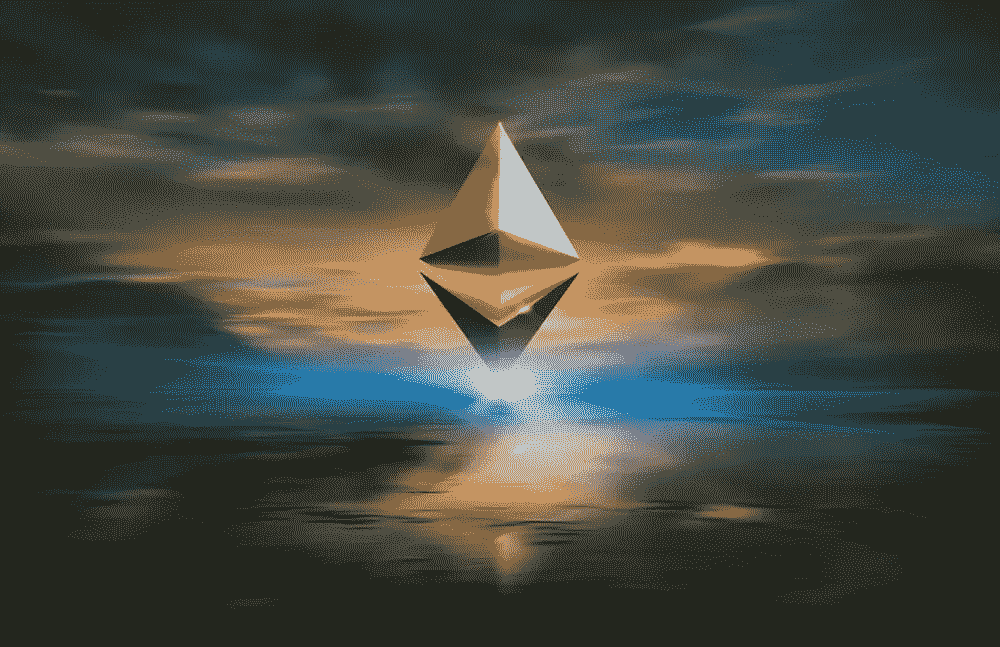
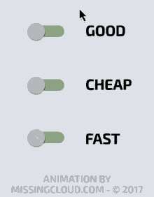
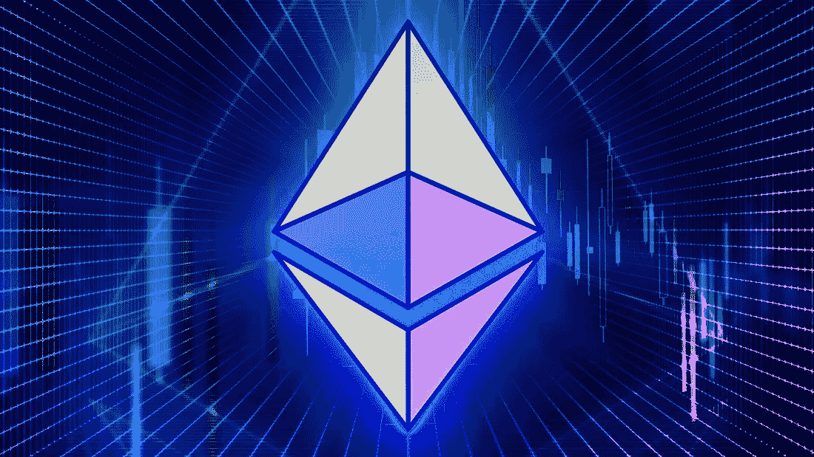
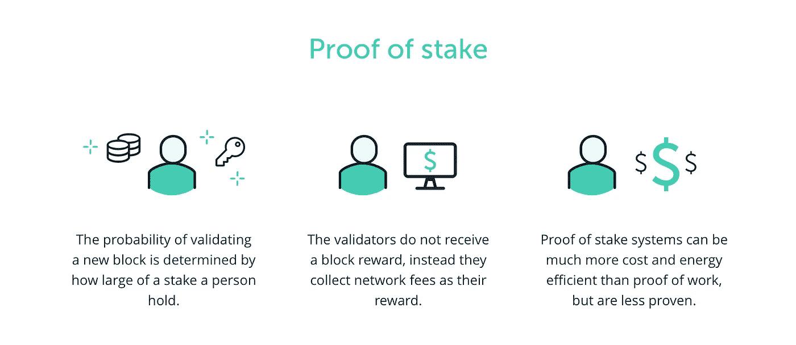
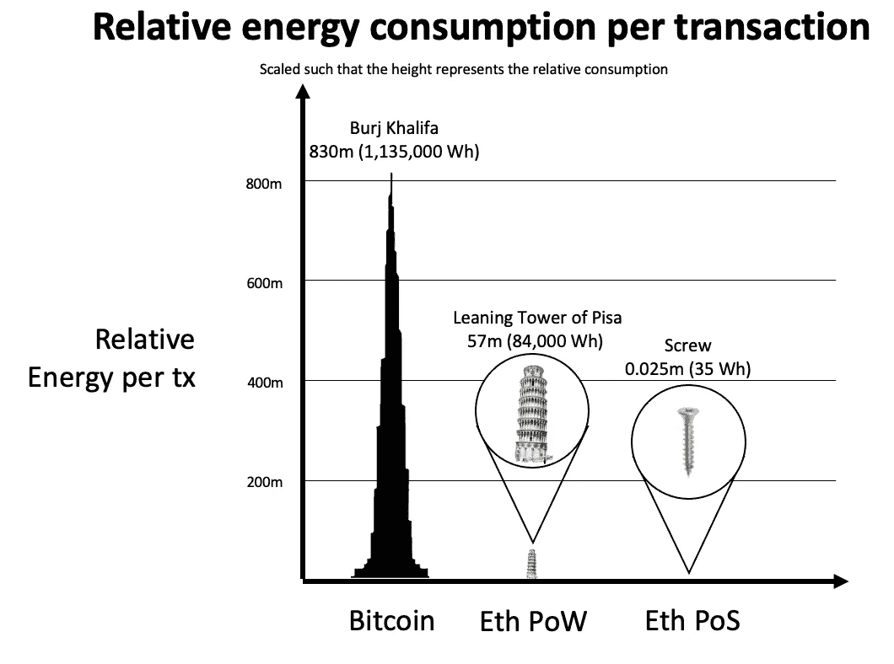
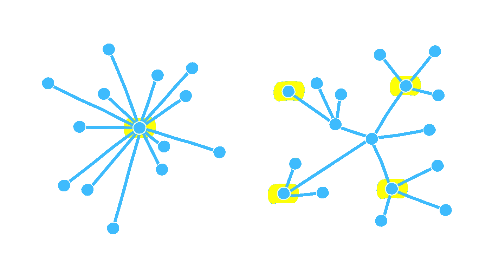

# ETH v/s ETH 2.0

> 原文：<https://medium.com/coinmonks/eth-v-s-eth-2-0-81bc93b1d381?source=collection_archive---------31----------------------->

## 工作证明与利益证明的根本区别以太坊及其可持续性

嘿，你好👋读者们，我希望你们一切都好

考虑到以太坊合并(将 ETH 硬分支到 ETH 2.0)即将到来，我写一些关于它的东西并尽可能简化它是公平的，这样我的读者就可以及时了解重大事件。

简而言之，在合并之后，ETH 将不再是可开采的，并且将释放大量的散列能力和它为保持网络启动和运行所消耗的相应能量，并且将被验证者所取代，验证者将不得不占有一定量的 ETH(最小 32)以便参与共识的形成。

要完全理解这一点，我们首先需要更深入地了解 ETH 以及它是如何产生的

**快速历史课的时间到了**

## 是什么让 eth 如此特别？

BTC 是去中心化的一个重大突破，然而，由于其相对较老(BTC 被认为是第一代加密货币)，它缺乏任何与去中心化应用程序(Dapps)交互的功能，或以任何可行的方式在区块链上部署逻辑的能力，从而阻碍了社区内的大规模采用。

以太坊是有史以来第一个图灵完全区块链，这意味着它可以做几乎任何正常计算机可以做的事情。从 BTC 转到瑞士联邦理工学院是一个重大转变，让人想起一个范式转变。现在，有一种方法可以让人们以智能合约的形式开发更复杂的公共且不可变(不能更改)的应用程序。一种新的编程语言被明确地为 ETH 智能合约构建，命名为“Solidity”。它是由 Gavin wood 在 2014 年提出的，后来由 eth 核心贡献者团队构建。

*有趣的事实:SWIFT 部署了一个使用 Solidity 发送和接收国际支付的概念验证。*

> 如果你想对 crypto 有更深入的了解，请阅读此文:[https://medium . com/@ dev . anky . b/complete-we b-3-0-for-dummies-4 e 84 E4 C5 fc 3c](/@dev.anky.b/complete-web-3-0-for-dummies-4e84e4c5fc3c)

但是正如他们所说，你不可能得到一切。有一种东西叫做第一层(L1)三元悖论:

◉ *安全*

◉ *分权*

◉可扩展性

*(任选两项)*

Eth 牺牲了可扩展性来实现卓越的去中心化和安全性

这就是多边形、乐观或 ZK 卷等 L2 缩放解决方案派上用场的地方

它们提高了交易成本和交易率(参见[“本”)](/@dev.anky.b/complete-web-3-0-for-dummies-4e84e4c5fc3c))中的第 2 层)

ETH 2.0 旨在实现本机可扩展性，这并非不可能，但上次他们尝试做一些激烈的事情时，他们给了我们 EIP-1559 来控制天然气价格，但我们都知道那是怎么回事💀

这很好，但是他们打算如何合并呢？

他们将投票表决一项提案(EIP ),将以太坊硬分叉到以太坊 2.0，他们需要多数票才能成功。

**但是什么是硬叉子呢？**

Hard-Fork 是对网络协议的彻底改变，它拥有改变一切的权力，从分类账到底层区块链及其工作方式。

> 参见[本](https://youtu.be/Bu1GcyyFZ7w)

**以太坊之前有硬分叉过吗？**

是的，在 2016 年 DAO hack 之后，以太坊网络被硬分叉，旧版本被命名为以太坊经典，新的区块链是我们所知道的 Eth。

他们基本上逆转了道黑客所做的交易，并向每个人返还了他们的资金，但这是一个非常有争议的举动，因为他们违反了加密原教旨主义者所坚持的原则“代码就是法律”和“没有集中控制”，但该提案获得通过，没有任何问题。

> **我很想在评论中听到你对 ETH hard fork 的看法**

## 话虽如此，你可能会问什么是工作证明？

image : capital.com

*“工作证明”只不过是一种加密证明的形式，其中一方向其他方证明已经花费了一定量的特定计算工作。这是以哈希速率(H/s)来衡量的。核查人员随后可以毫不费力地确认这笔支出。*

*工作验证方案的一个关键特征是它们的不对称性:工作和计算必须适度困难(但可行)但易于验证。这种想法也被称为 CPU 成本函数。另一个共同特征是一个内置的激励结构，以金钱的形式奖励分配给网络的计算能力，或者在这种情况下是交易费的一部分。*

**这就是以太坊网络如何激励矿工为区块链提供安全，以换取金钱激励。基本上，你挖掘解决方案，然后获得报酬。**

> *在工作证明中，矿商通过消耗能源来证明他们的资本处于风险之中。*

## ***现在我们将讨论工作证明的电源和硬件要求***

**

*到目前为止，以太坊在当前大约 1.2 PH/s 的网络哈希速率下每年使用大约 120 terra 瓦。 ***那可是很大的电量，*** 事实上，相当于荷兰一整年用的电量。*

*据估计，一笔交易的用电量相当于一个普通美国家庭一天的用电量。*

*还有它的可持续性方面，因为大部分能源来自碳密集型来源。尽管我们很想，但他们还没有想出办法来制造小型的、临时的核裂变发电站，我可以在我的后院安装它，或者制造出可以工作的核聚变反应堆。*

> *可以理解的是，水电并非随处可见，风力涡轮机效率极低，杀死的鸟比你叔叔每月打猎杀死的鸟还多，廉价制造的太阳能电池板(很容易获得，很难区分)在 4-5 年前就会损坏，含有比核废料更糟糕的物质，因为它的毒性不会随着时间的推移而降低(砷不会在环境中分解成更简单的物质)*

*所有的计算都是由 GPU 完成的，其执行所需计算的能力以其哈希速率来衡量。根据其规格和配置，每个 GPU 都有不同的哈希速率。*

*此外，如果没有适当的调整，它会增加您的显卡损坏的风险，从而产生另一个问题，即电子垃圾问题，这是一个较难处理的问题，因为这些产品在设计时从未考虑到可持续性。*

## *在继续之前，让我们看一下股权证明*

**

*利害关系证明是区块链使用的一种共识机制，用于实现分布式共识或同意交易是否有效。在股权证明中，验证者明确地将以太形式的资本投入到以太坊的智能合约中。如果验证者的行为不诚实，这个被支撑的以太就会作为抵押品被销毁。然后，验证器负责检查通过网络传播的新块是否有效，并偶尔自己创建和传播新块*

> *在利害关系证明中，验证者通过标记本地令牌来证明他们有资本风险，如果用户恶意操作，本地令牌可能会被销毁。*

*这基本上表明你有“利益在内”,你不会有不诚实行为的金钱或其他动机，否则你的赌注资本将处于风险之中。*

## *弄清楚这一点后，我们将弄清楚证明以太坊的能源和硬件要求*

**

*Earth’s from the POV of a Satellite*

*Eth 2.0 的预计能耗将比其对应的利益证明低 99.95%，并使其接近 600 千兆瓦/年，这更易于管理*

*作为验证者的硬件要求将是一台高效但顶级的 pc，具有专用电源和互联网设备，以便正常运行时间接近 100%，并且对单个验证者数量的需求也将大幅减少。*

*这将导致哈希速率大量迁移到其他通常较小的工作证明项目中，并且不会像最初认为的那样离线。*

*以太网的能源足迹将大幅减少，但对于整个加密来说，它将保持不变，因为卡仍然在线，这有点扫兴。*

## *比较两种方法的可持续性*

**

*以太坊组织声称，以太坊升级将减少高达 99.95%的能源需求。与工作证明共识机制相比，这是 2000 倍的变化，是一个显著的减少。*

*合并后以太坊的能量需求估计约为 600 千兆瓦。*

*如上所述，以太坊升级对环境影响的差异非常显著，不容忽视，这无疑有助于打击加密货币在环境上不可持续的观念。*

## *从 ETH 过渡到 ETH 2.0*

**

*当埋在地下的难度炸弹爆炸后，采矿会变得更加困难，直到一点利润都没有，这让矿工们望而却步。然而，这可能会在短期内显著降低以太坊的安全性，所以他们需要在过渡时期让矿工们开心。*

*如果“合并”提议被批准，升级将开始滚动到以太坊主网上。它目前正在测试网络中进行严格测试，以绝对确保没有任何危及整个网络的重大安全漏洞。*

> *这导致了漫长但至关重要的延误。合并预计将在本月进行*

*然而，我认为他们应该慢慢来，不要操之过急，因为如果他们不小心，结果可能会很糟糕。*

## *合并是否会集中以太坊？*

**

*这个问题发人深省，我想知道你对此的真实想法*

*以太坊基金会现在有权撤销他们认为不合适或恶意的交易。你认为这违反了加密货币的核心原则吗？*

*此外，要成为验证者，你至少需要下注 32 以太币，这远远超出了普通人的承受能力。这一举措是否从个人手中夺走了权力，并将它们交给了机构投资者？*

> *我真的很想听到这一切，如果你喜欢的话，把你的想法发邮件给我，@dev.anky.b@gmail.com。*

*今天就到此为止，直到我们再次相见😌*

**

**注意:我最初写这篇文章是出于对可持续性的考虑，但是因为它看起来合适，所以我决定也加入一些其他的东西。希望你喜欢这个，干杯！🍻**

> *加入 Coinmonks [电报频道](https://t.me/coincodecap)和 [Youtube 频道](https://www.youtube.com/c/coinmonks/videos)了解加密交易和投资*

# *另外，阅读*

*   *[Bookmap 评论](https://coincodecap.com/bookmap-review-2021-best-trading-software) | [美国 5 大最佳加密交易所](https://coincodecap.com/crypto-exchange-usa)*
*   *最佳加密[硬件钱包](/coinmonks/hardware-wallets-dfa1211730c6) | [Bitbns 评论](/coinmonks/bitbns-review-38256a07e161)*
*   *[新加坡十大最佳密码交易所](https://coincodecap.com/crypto-exchange-in-singapore) | [收购 AXS](https://coincodecap.com/buy-axs-token)*
*   *[红狗赌场评论](https://coincodecap.com/red-dog-casino-review) | [Swyftx 评论](https://coincodecap.com/swyftx-review) | [CoinGate 评论](https://coincodecap.com/coingate-review)*
*   *[投资印度的最佳加密软件](https://coincodecap.com/best-crypto-to-invest-in-india-in-2021)|[WazirX P2P](https://coincodecap.com/wazirx-p2p)|[Hi Dollar Review](https://coincodecap.com/hi-dollar-review)*
*   *[加拿大最好的加密交易机器人](https://coincodecap.com/5-best-crypto-trading-bots-in-canada) | [库币评论](https://coincodecap.com/kucoin-review)*