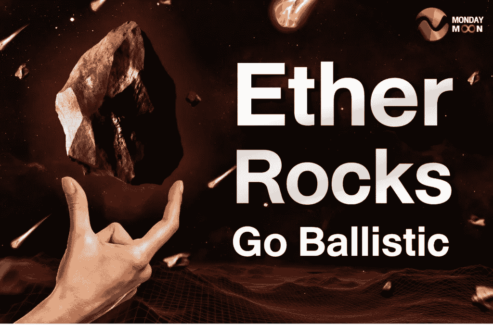
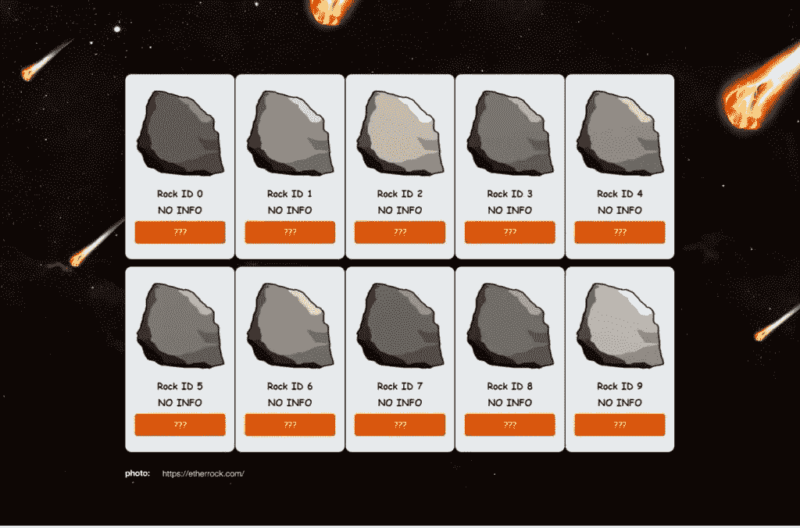

# 以太岩石会爆炸

> 原文：<https://medium.com/coinmonks/ether-rocks-go-ballistic-96c224014c33?source=collection_archive---------48----------------------->

什么是 NFT，为什么这么贵？两个很好的问题。但是，你一直住在哪里，在岩石下面吗？很明显，不可替代代币(NFT)现在非常流行，随着越来越多的投资者加入这股潮流，一些加密艺术品的价格飙升。例证:以太岩石或以太岩石。这些 NFT 中只有 100 个是在 2017 年 12 月铸造的，具体是谁还不清楚。

这些岩石是基于从灰色岩石矢量(671)剪贴画网站获取的基本图像，每个 NFT 都是相同的岩石，但颜色和结构略有不同。早在大多数人对秘密艺术有任何兴趣之前，第一批石头就在区块链以太坊低调生产和铸造。在此期间，石头缺乏宣传，价格很难达到几百美元。Cryptopotato.com 声称，第一块石头“卖了 0.0999 埃特，当时价值 300 美元”，而其他石头的出价在 0.1 埃特到 0.36 埃特之间。

从 2017 年 12 月推出到 2020 年 1 月，现有的 100 块石头中约有 20%被购买。只有少数几个早期投资者给了石头任何可信度，因为由 CryptoPunks 等知名艺术家创作的大多数其他 NFT 都占据了头条新闻。然后在 2021 年 8 月，不知从哪里冒出来的，白俄罗斯裔美国企业家和互联网名人加里·维纳查克在推特上向他的数百万粉丝发布了关于以太岩石的消息，突然间它们的价格飙升。

在 Vaynerchuk 的推文发布后的几天和几周内，以太岩石的价格从不到 1000 美元迅速上涨到近 10 万美元。现在，创造 100 个宠物石头的网站[Etherrock.com](https://etherrock.com/)声明:“这些虚拟的石头除了可以买卖，给你一种强烈的自豪感，让你成为游戏中仅有的 100 个石头中的一个的主人之外，没有任何用途”，然而它们确实在卖。因为大量的金钱和不断上涨的价格。

以太岩石市场的价格历史表明，当百万富翁科技企业家和加密货币平台 TRON Justin Sun 的创始人购买他的股票时，价格从 10 万美元飙升至 50 万美元，到 2021 年 8 月的 220 万美元，然后在 2021 年 12 月的匿名买家手中超过 350 万美元。在写这篇文章的时候(2022 年 1 月 24 日)，open sea([https://open sea . io](https://opensea.io/))只有八块石头要拍卖，价格从岩石编号 61 的 100 ETH(293，000 美元)到岩石编号 70 的 690 ETH(1，650，921 美元)不等。

好运如果你是拥有宠物石的 100 个幸运儿之一，你显然已经领先了。

请继续关注更多 NFT 的更新。与此同时，如果您想联系我们，请拨打[investment@mondaymoonmarket.com](mailto:investment@mondaymoonmarket.com)与我们联系。