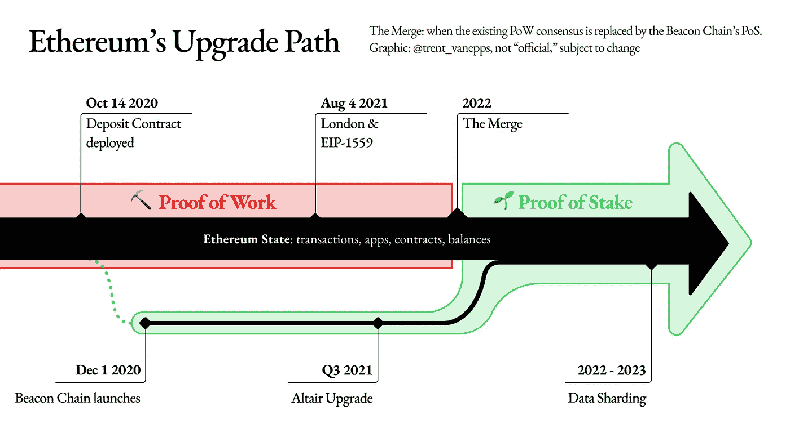

# 以太坊 2.0

> 原文：<https://medium.com/coinmonks/ethereum-2-0-a55dc3e3e696?source=collection_archive---------80----------------------->

## 通过提高可扩展性、安全性和高能效来改变现状。

以太坊 2.0 是网络的主要多阶段升级之一。随着 NFT 越来越受欢迎和被采用，世界超级计算机正面临着规模挑战。煤气费很高，大多数用户负担不起。

> 交易新手？试试[加密交易机器人](/coinmonks/crypto-trading-bot-c2ffce8acb2a)或者[复制交易](/coinmonks/top-10-crypto-copy-trading-platforms-for-beginners-d0c37c7d698c)

以太坊 2.0 增加了网络的可扩展性和安全性，同时减少了网络的碳足迹。它正在将共识机制从 PoW(工作证明)转变为 PoS(利益证明)。PoS 是节能的，因为它不需要采矿设备来验证交易，减少了网络的碳足迹。此外，当以太坊 2.0 完成时，它将通过将 TPS 从 30 增加到大约 100，000 来解决可伸缩性和拥塞问题。此外，这将使其更加安全和分散，因为将有 min 16384 验证器作为抵押铸造块。攻击该链也将变得非常昂贵，因为恶意验证者所押的抵押品将会丢失。此次升级分为 3 个主要阶段:

**信标链:**本次升级完成于 2020 年 12 月。创建了另一个链，称为信标链，它运行在 PoS 机制上。信标链将协调碎片和桩的扩展网络，但它不会像以太坊的主要执行层。它不能处理帐户或智能合同。

PoS 使用验证器而不是挖掘器来验证交易。验证器需要 stake ETH (min 32 ETH)来创建一个块或进行验证。块的创建取决于一种算法，该算法基于定位量和自定位以来的时间。一旦添加了新的块，其他验证者需要证明他们已经看到了该块。经过足够的证明块可以添加到区块链。验证者因一个成功的块命题而被奖励。这个过程被称为铸造或锻造。如果有一些可疑的活动，其他验证者可以挑战该块，并因表现良好而获得奖励。另一方面，如果该块被证明是恶意的，那么创建该块的验证者和所有验证该恶意块的人都将受到惩罚。对于攻击，至少 1/3 的验证器需要支持恶意块，因此攻击没有经济意义。

目前，信标链是一个独立的链，并且在该链中只有本地定位可用。人们可以在信标链上下注，并在合并阶段后获得下注奖励。

**EIP-1559 或伦敦叉**已经实施并改变了开采交易的天然气费用。早些时候，所有的天然气费用都由矿工分摊。现在汽油费是基础费+小费的组合。矿工们只收到处理交易的小费。基础费会被网络烧掉，导致**通缩机制**发挥作用。

**合并:**本次升级信标链将与主链合并，共识机制转移到 PoS。整个以太坊 2.0 是网络升级，不是新链。这是在安全性方面的一次重大升级，也将是对 eth 开发人员能够将重大开发推向主链的一次考验。为了避免 Eth1 和 Eth2 混淆，并停止诈骗，核心发展和以太坊基金会已经改变了术语，因为没有新的链。

- Eth1 →执行层-这是智能合约和规则所在的位置

- Eth2 →共识层-它确保网络中的设备按照执行层中设置的规则运行

-执行层+共识层=以太坊

Merge 计划于 2022 年在 Q2 发布，但没有确定的日期，因为这取决于迁移准备就绪的时间。此升级不会解决可扩展性问题。下一阶段将通过引入分片来解决。目前，我们不得不依赖于其他第二层网络 Matic、Starknet、Arbitrium、optimission、dydx 等。为了更快更便宜的交易。

碎片链:引入碎片将是一个多阶段的升级，以提高以太坊的可扩展性和容量。分片是水平分割数据库以分散负载的过程。它将通过创建被称为“碎片”的新链来减少网络拥塞并增加每秒交易量。提出了 64 个分片，其中所有操作将被共享，Eth1 或执行层将是“分片 0”。

由于数据分布在多个链上，管理运行节点的硬件将会更容易，因为需要存储在单台机器上的数据更少。因此，这将增加网络参与，并变得更加分散。此外，并非所有碎片都有能力处理智能合约，而是充当数据仓库。此次升级的预计日期是 2023 年，合并升级后会更加清晰。