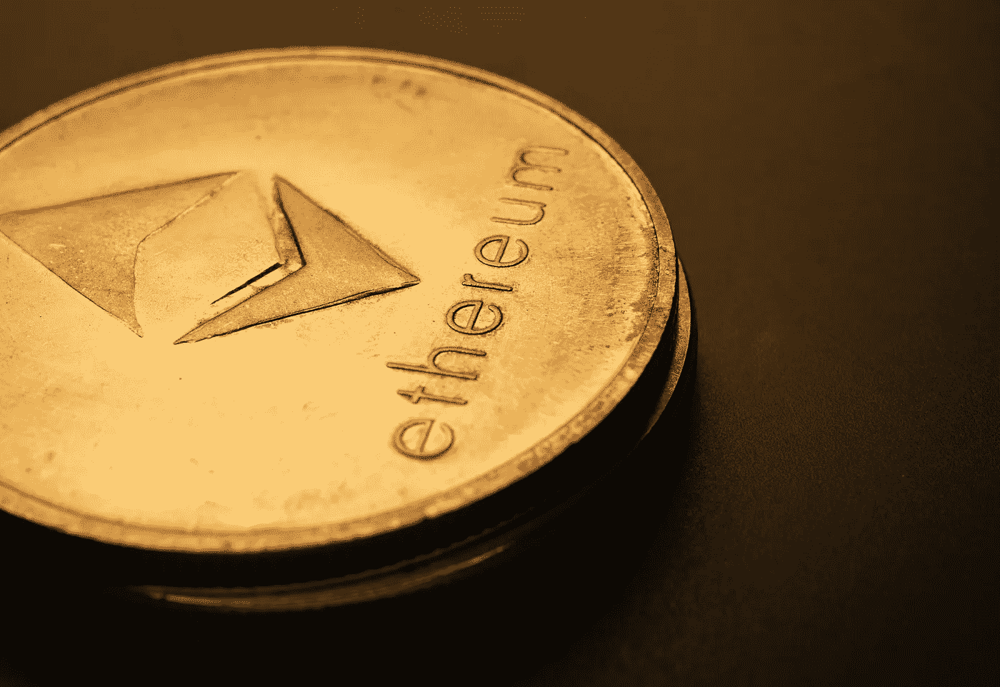
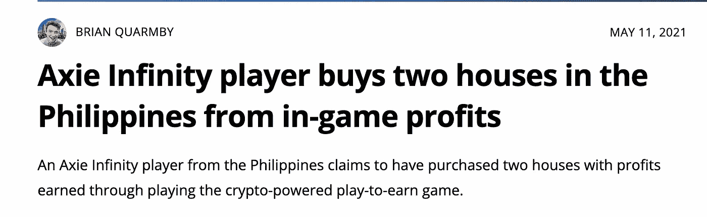
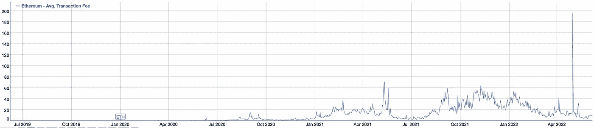

# 以太坊 2.0

> 原文：<https://medium.com/coinmonks/ethereum-2-0-e5f0dee5a73f?source=collection_archive---------25----------------------->

Photo by [Jievani](https://www.pexels.com/photo/silver-round-lid-on-black-surface-8175415/)

以太坊 2.0 将于 2022 年到来，对于以太坊区块链的投资者、验证者、开发者和项目来说，这将是激动人心的一年。

因此，在本文中，我们将讨论什么是以太坊 2.0，以太坊 1.0 现在面临的问题，网络上已经发生和未来将发生的变化，它们如何解决以太坊当前的问题，以及作为投资者，我们可以做些什么来利用网络上发生的所有变化。

# **我们为什么需要以太坊 2.0？**

当我们谈论比特币时，我们想到的都是钱，对吗？

仅此而已。它是一种数字美元，可以用来从一个地方转移到另一个地方，而不需要像银行这样的中间人的干预。

以太坊区块链使用以太作为区块链的货币。以太网就像比特币，我们可以将它从一个人转移到另一个人，但我们需要支付的费用越来越昂贵，这是以太坊目前最大的问题之一。

但是当我们想到以太坊时，我们也认为它是公司用来建立新程序的账本技术。

事实上，截至 2021 年初，以太坊区块链上创建了超过 3000 个去中心化的应用程序(又名 dapps)。

除此之外，以太坊的技术背后还有一个强大的支持，那就是所谓的[企业以太坊联盟](https://entethalliance.org/)。这是一群财富 500 强公司，他们一起学习并建立在以太坊的区块链技术上，也称为“智能合约”技术，这意味着极其复杂的应用程序可以通过智能合约在区块链上实现自动化。

如你所见，以太坊不仅改变了世界各地的公司，也改变了像你我这样的普通人的游戏规则。人们甚至通过玩建造在以太坊区块链上的游戏来买房子。

# 当前以太网的问题

**1/高昂的费用:**想想互联网，当有太多的设备同时在同一个网络上使用时，这将使网络拥塞，并使网络变慢。

除此之外，没有其他方法可以改善这种情况，除非我们支付更昂贵的方案来获得更好的网速，或者花更多的钱购买更好的调制解调器，以确保上传和下载速度与我们支付的方案相适应。

不管你选择什么方法，你都要花更多的钱。

以太坊网络也是这样工作的。当以太坊上有太多项目正在建设，太多人使用以太网从一个人转移到另一个人时，网络将不可避免地变得拥挤。

只有愿意支付额外费用的人，他们的交易才会被优先处理。

事实上，根据 Bitinfocharts 的数据，截至 2021 年 11 月初，以太坊的平均交易费用为 51.57 美元，作为比较，2020 年底的平均交易费用为 5 美元。

**2/电力的过度使用:**以太坊使用工作共识证明机制，要求矿工使用高计算能力来竞争解决复杂问题。

当他们能够解决这些问题时，他们将在 Eth 获得奖励。

因此，矿工受到激励，让他们的电脑尽可能强大，这导致了太多的电力消耗。

目前，一笔以太坊交易消耗的电力相当于一个普通美国家庭一周的用电量——其碳足迹相当于 140893 笔 [Visa](https://fortune.com/company/visa) 信用卡交易或 10595 小时观看 [YouTube](https://fortune.com/company/youtube) 。这就是工作证明共识机制带来的巨大问题。

所以以太坊面临两个问题，收费高，能耗过大。让我们看看以太坊的开发者是如何试图解决这些问题的。

# 以太坊 2.0 的 3 个重要支柱

为了让这些问题消失，他们需要让以太坊 2.0 成为一个更加安全、可扩展和可持续的网络。

**1/可扩展性:**

可扩展的网络每秒可以处理更多的事务，而不会增加网络中节点的大小。

增加节点大小是不切实际的，因为只有那些拥有强大而昂贵的计算机的人才能做到。

所以为了有效地扩展，以太坊需要更多的节点来增加网络上每秒的交易量。目标是每秒 1000 个事务。这不仅能帮助 Eth 用户，还能使网络上的应用程序使用起来更快更便宜。

此外，使用更多的节点将使网络变得更加分散，更不容易受到攻击。

**2/安全:**

为了使网络更加安全，以太坊 2.0 使用了利害关系证明共识机制。这将把挖掘器变成验证器。

为了被选中验证交易，他们将需要赌注 Eth，而不是竞争解决计算问题。他们下注越多，被选中的机会就越大。

从工作证明到利害关系证明的转变意味着以太坊协议对攻击有更大的抑制作用。因为有了利害关系证明，保证网络安全的验证者必须在协议中加入大量的 ETH。

如果他们试图攻击网络，该协议可以自动摧毁他们的以太网。这意味着毁掉他们的钱，除非他们疯了，否则没人想这么做。

**3/可持续性:**

为了网络的持续发展，以太坊需要更加环保。

如前所述，由于工作证明系统中的挖掘活动，以太坊使用了过多的能量来挖掘新块。

以太坊正在过渡到的利益证明系统将消除这个问题。事实上，研究人员 Carl Beekhuizen 最近的一项估计表明，ETH 2.0 将比目前的以太坊区块链少消耗 99%的能源。

(TLDR:以太坊 2.0 的愿景是更高的每秒交易量，更安全的网络，以及更低的能耗和利益一致机制的证明。)

# 它将如何到达那里？

整个过程分为不同的阶段。第一阶段或 0 阶段实际上已经在 2020 年 12 月开始。

它引入了信标链:这是将利益证明引入以太网的链；然而，在第一阶段之前，它不会改变我们今天使用的以太坊网络。

根据 Coinmarket Cap 的说法，信标链的关键功能是管理[利益证明](https://coinmarketcap.com/alexandria/article/proof-of-work-vs-proof-of-stake)协议和所有的[碎片链](https://coinmarketcap.com/alexandria/glossary/sharding)。具体来说，它管理验证器和它们的[利益](https://coinmarketcap.com/alexandria/glossary/staking)；将验证者组织成委员会，对提议的区块进行投票；应用共识规则；并对验证者进行奖励和惩罚。

重要的一点是，信标链不能运行[智能契约](https://coinmarketcap.com/alexandria/glossary/smart-contract)，这就是碎片链的用途。

**尽管 0 期工程已经启动了一年多，但 1 期工程直到 2022 年的 Q1 才准备就绪。这个阶段被称为合并。**

名字基本上告诉你它会做什么。当前的以太坊链将与信标链合并，然后以太坊网络将完全消除工作证明，并完全过渡到利益证明。

此次合并将把以太坊网络智能合约的运行能力纳入信标链的利益证明系统，加上以太坊的全部历史和当前状态，以确保所有 ETH 持有人和用户的平稳过渡。

至此，以太坊将离实现其[以太坊 2.0 愿景](https://ethereum.org/en/eth2/vision/)中概述的可扩展性、安全性和可持续性更近一步。

**合并之后，我们进入第二阶段。第二阶段将在今年的某个时候发货，这将取决于第一阶段之后工作进展的速度。**

在这个阶段，将引入碎片链。他们将网络的负荷分散到 64 条新的链条上；通过保持较低的硬件要求，它们使运行节点变得更加容易。

有了碎片链，验证者只需要存储或运行他们正在验证的碎片的数据，而不是整个网络。

这大大加快了速度，并允许人们在他们的个人电脑或手机上使用以太坊。

因此，更多的人能够参与进来，并在一个分片以太坊中运行客户端。

这将增加安全性，因为更多的人加入网络将使网络更加分散，并降低网络受到攻击的机会，因为每个人都有自己的利益。

# 现在我们知道了以太坊区块链发生的所有变化。让我们谈谈作为投资者，我们如何利用这些变化？

有几种方法可以做到这一点。第一种方式是，我们可以通过建立自己的节点成为网络上的验证者，将我们拥有的 Eth 作为赌注，并通过验证网络上的交易来赚取更多的 Eth。

然而，在这样做的时候，你需要记住一些事情。为 Eherum 运行我们的验证器节点需要 365 天的锁定期和 32ETH 的最低余额，在撰写本文时大约值 57，600 美元。

你还需要一台 100%时间都在线的速度非常快的电脑。如果你的网络连接失败，你可能会失去你的存款。

如果您的验证者在线并被选中，您将获得一定数量的 ETH 作为奖励，但如果您的验证者在您被选中时离线，您将因错过它而受到处罚。

因此，虽然这听起来像是一个赚取一些被动收入的好方法，但它有很多要求，并且仅仅因为我们的互联网连接失败而损失近 58，000 美元是我们不希望看到的。

此外，您被选中验证交易的几率非常低，因为在利害关系证明模型中，您需要尽可能多的承诺才能有更高的被选中的几率。

除非你有一个专门做这个的公司，否则如果你只用一台电脑和 32eth 自己做这个是不会盈利的。

因此，另一个在 Eth 赚更多钱的方法是加入 Defi 应用程序的赌注池。

这是一个简单得多的获得 Eth 的方法。没有需要遵循的硬件要求，不需要运行自己的节点，也不需要提交 32eth。

加入赌注池为你解决了这一切。

您可以加入其他赌注者，并在池中下注低至 0.01 Eth，每次您的池被选中验证交易时，您将因下注而获得一些 Eth。

这确实是赚取被动收入的好方法。你所要做的就是设立一个钱包，转移你的 Eth，坐下来，放松，等着钱落入你的口袋。

另一种赚取更多 Eth 的方法是在交易所下注。像比特币基地或币安这样的交易所也为他们的用户提供赌注选项。这个过程比在 Defi 应用上下注更简单，你只需要在你选择的交易所创建一个账户，将你的以太坊转移或购买到交易所的钱包中，然后下注。

回报可能因交易所而异，并且会随着时间的推移而变化。例如，目前，比特币基地提供高达 4.5%的 Eth 年利率，币安高达 20%，北海巨妖在 4%到 7%之间，Crypto.com 高达 8.5%。每个平台都有自己的要求和锁定期，以便您获得赌注奖励。

*赌博不仅能为你赚钱，也是参与提高网络安全性的一种好方法，有助于生态系统的发展，当它能够发展时，更多的人会信任它，这反过来会增加支持网络的硬币的价值。*

*本文仅供参考。不应将其视为财务或法律建议。并非所有信息都是准确的。在做任何重大财务决定之前，先咨询财务专家。*

> 加入 Coinmonks [电报集团](https://t.me/joinchat/Trz8jaxd6xEsBI4p)，了解加密交易和投资