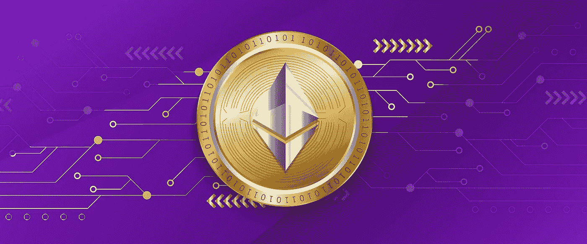

# 以太坊 2.0。就在眼前，这里是你应该知道的

> 原文：<https://medium.com/coinmonks/ethereum-2-0-is-around-the-corner-heres-what-you-should-know-about-it-223f0fb3df6?source=collection_archive---------44----------------------->

Image by [Satheesh Sankaran](https://pixabay.com/users/satheeshsankaran-11196627/?utm_source=link-attribution&utm_medium=referral&utm_campaign=image&utm_content=6928106) from [Pixabay](https://pixabay.com/?utm_source=link-attribution&utm_medium=referral&utm_campaign=image&utm_content=6928106)

2015 年，以太坊联合创始人 Vitalik Buterin 提出了一项区块链升级，该升级将提高可扩展性并减少加密货币开采的环境影响。

## 如今，七年过去了，以太坊 2.0 已经接近完成。

以太坊团队将其命名为 Serenity，俗称 ETH 2.0，这是对网络的一次重大改革，将显著改善交易吞吐量和能耗，同时保留与现有应用程序和智能合约的向后兼容性。

以太坊 2.0 是一个区块链，这使得它比旧的区块链更加环保。

与其前身不同，以太坊 2.0 将支持分片和侧链，这是以太坊 2.0 让开发者和投资者如此兴奋的两个重要特性。

以太坊 2.0 网络将是一个可扩展的、分散的、利益相关的区块链，应该能够每秒处理数千笔交易。

这个新系统将解决过去困扰以太坊的许多问题，并使其充分发挥作为智能合约平台的潜力。

以太坊 2.0 仍处于早期阶段，但有几个项目已经在研究利用这项技术的方法，包括 Uniswap，该项目正在为以太坊 2.0 上的 ETH/ERC-20 令牌创建一个开源的分散式交换(DEX)，名为 [UniDex](https://unidex.exchange) 。

> 加入 Coinmonks [电报频道](https://t.me/coincodecap)和 [Youtube 频道](https://www.youtube.com/c/coinmonks/videos)了解加密交易和投资

# 另外，阅读

*   [南非的加密交易所](https://coincodecap.com/crypto-exchanges-in-south-africa) | [BitMEX 加密信号](https://coincodecap.com/bitmex-crypto-signals)
*   [如何在 WazirX 上购买柴犬(SHIB)币？](https://coincodecap.com/buy-shiba-wazirx)
*   [MoonXBT 副本交易](https://coincodecap.com/moonxbt-copy-trading) | [阿联酋的加密钱包](https://coincodecap.com/crypto-wallets-in-uae)
*   [MoonXBT vs Bybit vs 币安](https://coincodecap.com/bybit-binance-moonxbt) | [硬件钱包](/coinmonks/hardware-wallets-dfa1211730c6)
*   [雷米塔诺评论](https://coincodecap.com/remitano-review)|[1 英寸协议指南](https://coincodecap.com/1inch)
*   [十大最佳加密货币博客](https://coincodecap.com/best-cryptocurrency-blogs) | [YouHodler 评论](https://coincodecap.com/youhodler-review)