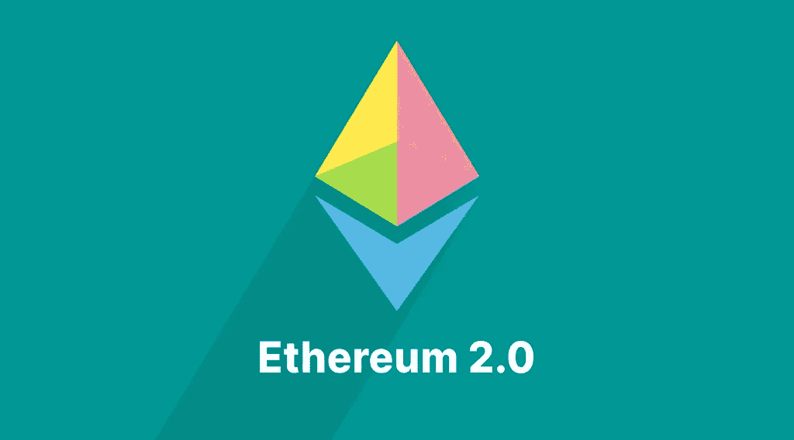

# 以太坊 2.0 发布日期:两年后我们在哪里？

> 原文：<https://medium.com/coinmonks/ethereum-2-0-release-date-where-are-we-two-years-later-86b8c8d06aac?source=collection_archive---------34----------------------->

以太坊 2.0 本质上是什么？2015 年推出的[以太坊](https://stealthex.io/coin/ethereum)协议在全球范围内获得了难以置信的成功。然而，以太坊社区总是期望需要几个密钥更新来释放加密货币的全部潜力。首先，密码爱好者需要解决它的可扩展性。区块链的速度远远不能容纳大量的用户。

高需求增加了交易费用，这使得以太坊区块链方式对于普通用户来说过于昂贵。此外，运行客户端所需的磁盘空间也在快速增长。而让以太坊变得安全、去中心化的底层算法，对环境有着巨大的影响。

以太坊做了什么来应对这些问题？嗯，ETH 路线图包括几个非常重要的更新，很快就会发布。2020 年 6 月，我们写了关于即将实施的[更新](https://stealthex.io/blog/2020/06/30/ethereum-2-0-why-how-and-then/)，你可以阅读更多相关内容。

## ETH 2.0 是新硬币吗？

不，它不是新令牌，不会改变用户持有的以太坊数量。这只是一个升级，以改善区块链联邦理工学院。

简而言之，通常被称为 Eth2 的是一组更新，用于解决不断增长的区块链所面临的这些和许多其他问题。这组更新最初被称为 Serenity，自 2014 年以来，它一直是一个活跃的研发领域。

那么，2020 年 6 月以来，都做了些什么呢？已经实施了哪些计划和阶段来使区块链完美运行并变得更加方便用户？

## 柏林更新:2021 年 4 月 15 日

2020 年 12 月 1 日，以太坊 2.0，也被称为信标链，推出了它的零阶段。该链基于利益相关共识机制运行，具有显著更高的性能，这意味着它每秒可以处理大量事务。也就是说，Eth2 的全面推出仍需等待。

路线图的下一阶段是 2021 年 4 月 15 日进行的柏林更新，包括四项建议(EIP)来改进区块链，作为其升级到 2.0 版的一部分。更具体地说，硬分叉包括:

*   EIP-2565
*   EIP-2929
*   EIP-2930
*   EIP-2718

对于那些一直在问“eth 2.0 会不会降低燃气费？”EIP-2565 降低了提案的气体成本，使其与执行其他操作的成本一致，而 EIP-2929 增加了状态访问操作码的气体成本。

EIP-2930 背后的主要想法是解决现有合同的突破性变化，并减轻一些天然气成本的增加，而 EIP-2718 引入了新的交易类型。

柏林的更新迎合了当前以太坊 1.0 网络的需要，该网络雇佣拥有视频卡的矿工。它将遵循伊斯坦布尔和穆尔冰川的先前更新，这两次更新分别发生在 2019 年 12 月和 2020 年 1 月。

在柏林更新前夕，ETH 的价格达到了 2480 美元的历史最高水平。柏林更新标志着以太坊发展的一个重要里程碑。虽然事实上更新是更大改进的中间步骤，但目前它被认为是最相关的。

# 接下来是什么:ETH 2.0 什么时候发布？会发生什么？

最初的以太坊主网(工作证明模型)将与 2020 年末开发的新的利益证明模型合并。这将标志着以太坊工作证明的结束，以及向风险证明的全面过渡。[在这里，在我们之前关于预定以太坊阶段的文章](https://stealthex.io/blog/2022/04/13/when-is-the-ethereum-merge-transition-from-pow-to-pos/)中，你可以找到关于这个阶段的详细分析。

预计合并将在 2022 年第一或第二季度进行。

# 以太坊 2.0 发布日期:Eth 2.0 什么时候出来？

还有 ETH 2.0 发布日期是什么时候？以太坊基金会表示，以太坊 2.0 的全面升级预计将在 2023 年完成。

# ETH 2.0 出来后 ETH 会怎么样？

Eth 2.0 的初始结构将有 64 个碎片。以太坊 1.0 链将成为这 64 个碎片中的一个，在被称为“合并”的过程中组成新的区块链版本整个数据历史将被保留。对于 ETH 持有者来说，什么都不会改变，你不需要把你的 ETH 密码从 1.0 链转移到 2.0 链。

接下来是什么？最后一期什么时候排，ETH 2.0 什么时候取代 ETH？ETH 2.0 的最后阶段将是所谓的“碎片链”，这些将在 2023 年的某个时候合并。分片是一个多阶段升级，旨在提高以太坊的可扩展性和容量。新的更新有一件令人难过的事情会让矿工们失望。随着 hashrate ETH 的数量现在达到 1 PH/s，可以想象开采更有利可图的硬币的难度会大大增加。然而，在以太坊 2.0 之后，由矿工来决定开采什么，因为有大量的加密令牌可以成为开采的好选择。

当 ETH 2.0 推出时，网络将立即体验到各方面的好处。由于分片，在一个领先的区块链上交易和铸造 NFT 将会更便宜。由于 eWASM 的实现，以太坊开发人员将更容易构建 DApps 和编译智能合约。最后，以太坊转向股权证明将使网络比以往任何时候都更容易访问。

如果想参与 ETH 项目的未来命运，可以使用 [StealthEX](https://stealthex.io/) 服务购买以太坊。我们提供了 400 多种硬币供选择，这个列表会不断更新，因为我们以最低的费用提供最大的选择。

## 如何瞬间买到以太坊？

只需进入 StealthEX 并遵循以下简单步骤:

*   选择兑换的货币对和金额。比如，[的 BTC](https://stealthex.io/coin/bitcoin) 到[的 ETH](https://stealthex.io/coin/ethereum) 。
*   提供硬币将被转移到的收件人地址。
*   移动你的加密货币进行交易。
*   接受你的联邦理工学院硬币！

确保在[媒体](https://stealthex-io.medium.com/)、[推特](https://twitter.com/Stealthex_io)、[电报](https://t.me/StealthEX)、 [YouTube](https://www.youtube.com/channel/UCeES_XBesX76ge7xf1meuSw) 和 [Reddit](https://www.reddit.com/user/Stealthex_io) 上关注我们，获取 [StealthEX.io](https://stealthex.io/) 更新和关于加密世界的最新消息。

*请确保在投资前始终研究任何加密货币并评估风险。*

*原载于 2022 年 5 月 13 日*[*https://stealthex . io*](https://stealthex.io/blog/2022/05/13/ethereum-2-0-release-date-where-are-we-two-years-later/)*。*

> *加入 Coinmonks* [*电报频道*](https://t.me/coincodecap) *和* [*Youtube 频道*](https://www.youtube.com/c/coinmonks/videos) *了解加密交易和投资*

# 另外，阅读

*   [Bookmap 评论](https://coincodecap.com/bookmap-review-2021-best-trading-software) | [美国 5 大最佳加密交易所](https://coincodecap.com/crypto-exchange-usa)
*   最佳加密[硬件钱包](/coinmonks/hardware-wallets-dfa1211730c6) | [Bitbns 评论](/coinmonks/bitbns-review-38256a07e161)
*   [新加坡十大最佳加密交易所](https://coincodecap.com/crypto-exchange-in-singapore) | [收购 AXS](https://coincodecap.com/buy-axs-token)
*   [红狗赌场评论](https://coincodecap.com/red-dog-casino-review) | [Swyftx 评论](https://coincodecap.com/swyftx-review) | [CoinGate 评论](https://coincodecap.com/coingate-review)
*   [投资印度的最佳加密软件](https://coincodecap.com/best-crypto-to-invest-in-india-in-2021)|[WazirX P2P](https://coincodecap.com/wazirx-p2p)|[Hi Dollar Review](https://coincodecap.com/hi-dollar-review)
*   [加拿大最佳加密交易机器人](https://coincodecap.com/5-best-crypto-trading-bots-in-canada) | [库币评论](https://coincodecap.com/kucoin-review)