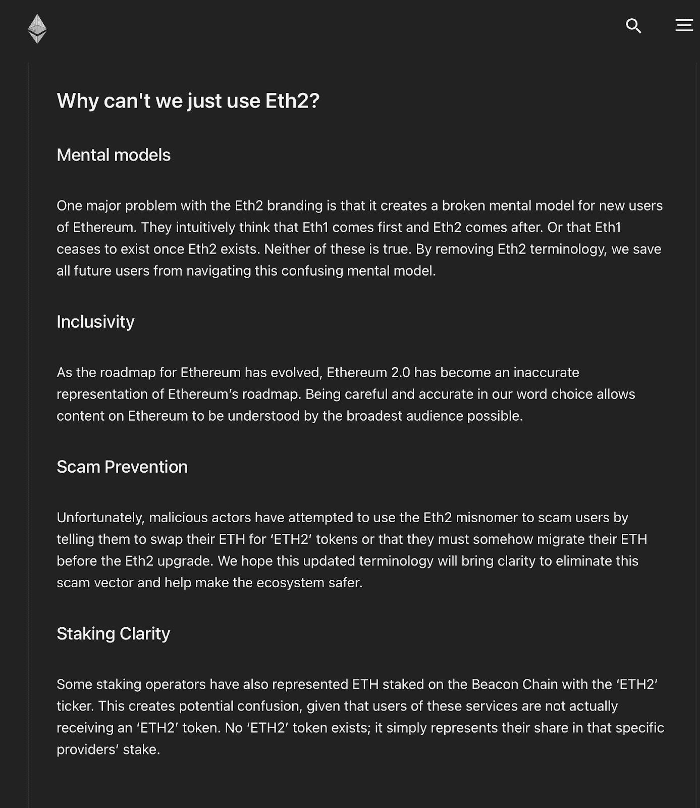
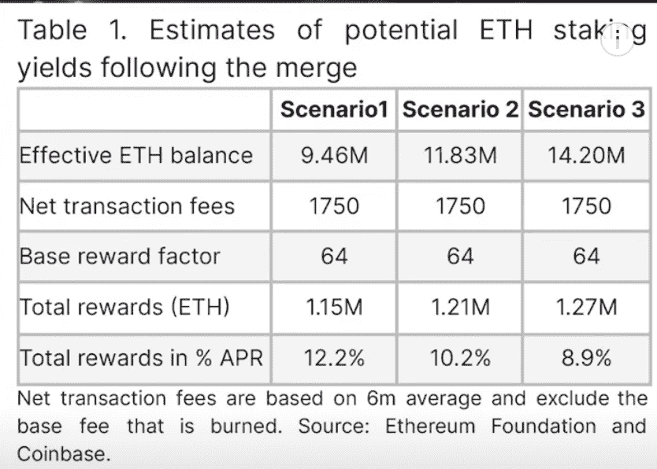

# 以太坊 2.0 更新:关于“合并”你需要知道的一切

> 原文：<https://medium.com/coinmonks/ethereum-2-0-update-everything-you-need-to-know-about-the-merge-6c077c5e7fc5?source=collection_archive---------23----------------------->

如果你已经在加密货币领域呆了一段时间，你一定已经听说了以太坊网络即将到来的更新，或者“合并”。这一更新已经部分进行，并将对以太坊和其他加密货币领域产生重大影响。新以太坊网络的最终发布预计将于 2022 年在 Q2 完成。因此，最近以太坊网络受到越来越多的炒作和关注，因为投资者蜂拥至 ETH token，为“合并”后 ETH 的价值即将上升做准备。这篇文章将解释以太坊更新涉及的内容，它对以太坊网络的影响，并澄清一些关于更新的误解。

**什么是‘合并’？**

最重要的是，以太坊“合并”指的是将现有的以太坊工作证明(POW) mainnet 与以太坊利益证明(POS)链(也称为信标链)合并。现在的以太坊 mainnet，嵌入了以太坊的智能合约和网络规则，将成为“执行层”。POS 链将成为“共识层”，其中交易通过利益相关共识机制验证。这是从现有 POW 模型的过渡。但是，将不会发行新的令牌，所有现有的 ETH 令牌仍可在以太坊网络上使用。

以太坊基金会已经去掉了 Eth 2.0 这个名字。这是由于对更新的困惑，并防止骗子创建假的 ETH2 令牌和诈骗不知情的用户。详细原因可以从以太坊基金会网站上找到。

这种从权力系统到发布共识机制转变具有许多含义。我们将在下面讨论这些。目前，什么是权力和地位？

比特币使用 POW 来验证交易并确保网络的安全性和去中心化是出了名的。本质上，矿工利用硬件计算能力来解决数学猜测和检查问题，以找到代表新的事务“块”的唯一的 256 位散列。一旦一个挖掘器找到了答案，这个答案就被广播给其余的挖掘器，以便每个节点都将相同的事务“块”添加到区块链中。矿工将获得“块奖励”，有效地利用获得的每个正确散列挖掘新的比特币。

另一方面，POS 的工作方式不同。对于 POS 来说，不是矿工使用计算能力，用户可以把他们的 ETH 令牌放在“赌注”上，成为验证者。赌注 ETH 允许选择一些验证者向区块链提出新的交易(赌注 ETH 越多，赌注期越长，他们被选中的概率就越高)。然后，其他验证器可以“证明”该块的有效性。有了足够的证明(超过⅔或所有 ETH 股份的 66%，称为“绝大多数”)，新区块将被添加到区块链。验证者将获得整体奖励，也称为“铸造”或“锻造”。

如果一个验证者被发现通过伪造交易篡改一个新的块，他或她将失去他们的一部分赌注。现在，一个人要成为验证者，最低需要下注 32 ETH，这是一笔很大的损失(今天超过 10 万美元)。当然，较小的投资者可以加入赌注池，将少量的 ETH 放在一起，组成 32 个 ETH。

除了从 POW 过渡到 POS 之外，以太坊还计划在 2023 年底(合并后)引入分片。这包括将以太坊网络分解成 64 个更小的组，称为“碎片”。参与以太坊网络的每个节点将被分配存储和运行仅一个碎片的数据，而不是整个网络。因此，网络现在可以一前一后处理 64 个事务(而现在是一次处理一个事务)。这加快了交易速度，也允许整个以太坊网络容纳更多的数据。下面讨论利弊。

**利害关系证明与工作证明**

与 POW 机制相比，POS 共识机制有许多优势，其中一些优势很少被提及。乍看之下，POS 在某些方面更安全，更环保，对 tokenomics 的巨大改进，并且可以说更加分散化和抗审查。但是，POS 也可能在其他方面削弱了安全性。

首先，POS 比 power 更安全。要对战俘区块链实施攻击，需要控制 51%或更多的参与节点。在比特币的例子中，这可能是一大笔钱，这阻止了恶意行为者这样做。然而，对于区块链邮政来说，攻击者必须控制超过 66%的 ETH 股份，这对于今天的以太坊来说相当于超过 300 亿美元(超过 1000 万 ETH)。这是因为，如前所述，要将一个区块添加到以太坊区块链，需要绝对多数的证明，其数量超过所有以太坊的⅔。因此，恶意攻击者需要控制 ETH 的数量，甚至篡改新的块。还有像比特币一样 51%攻击的选项。Vitalik Buterin 在 2018 年计算出，对于恶意攻击者来说，POW 赚 1 美元需要 486 美元，但 POS 赚 1 美元需要 2189 美元。因此，成为以太坊网络的非恶意积极参与者将使每个人受益。从这个意义上说，POS 无疑比 BTC 更安全。

此外，ETH 的 tokenomics 将大幅改善，这将对价格产生直接的积极影响。由于以前授予矿工的整体奖励将转移到赌注者，赌注 APY 将增加，预计数字从 8%到 12%不等。这比现在的 5%要大很多。随着合并，一个被称为“三减半”的更新将被实施，块奖励将从每天 12800 ETH 削减到 1280 ETH。这将 ETH 供应的年通货膨胀率从 4.3%降低到 0.43%，减少了 90%，相当于通货膨胀率减半 3 倍。这一点，加上最近的 EIP-1559 升级(部分 ETH 交易费被烧掉，代币退出流通)，将使 ETH 的供应出现通缩。事实上，假设燃烧率保持不变，据计算，更新后每年将燃烧 500，000 ETH，相当于 0.5%的负发行。作为参考，BTC 目前的年通胀率为 1.77%。这无疑会对 ETH 的价格产生巨大的正面影响。

ETH staking yields calculation

从 POW 到 POS 的过渡消除了对破坏环境的采矿钻机的需求。这将使区块链以太坊在未来变得更加环保。重要的是，随着全球变暖和环境破坏的加剧，机构投资者和政府越来越关注 ESG(环境、社会和治理)投资。因此，与 POW 区块链相比，以太坊将使投资者更加放心(事实上，欧盟最近几乎通过了一项法案，禁止使用所有 POW 区块链)。随着越来越多的投资者愿意投资以太坊，对以太坊的需求将会激增，这再次有利于整个以太坊网络。

值得注意的是，有了 POS，Ethereum 将能够在契约层(还不是执行层)实现分片。以太坊将把契约层分解成 64 个可以并行处理交易的碎片。仅仅这一点可能无法解决以太坊的可扩展性问题，但通过 Polygon 或乐观等第二层扩展解决方案，预计以太坊的每秒交易量将增加到 100，000 次，并大幅降低汽油费。

最后，由于不需要强大而昂贵的采矿设备，POS 可以说比 POW 更加分散。要成为以太坊验证者，只需要一台笔记本电脑和至少 32 个 ETH，不需要经常性成本和资金支出(你的 ETH 不会被拿走)。大门向每个人敞开，特别是那些以前由于高硬件要求和能源使用和维护设备的经常性成本而无法开采以太坊的人。这降低了准入门槛，让更多原本无法参与的个人得以参与。所以以太坊会变得更加去中心化。

当然，有些人担心 POS 可能会导致持有大量股份的验证者对交易验证产生过大的影响。有了大量的 ETH，这些验证器可能在验证哪些事务上有更大的发言权。因此，这可以降低网络的分散性。

此外，一些人担心一旦合并发生，可能会有不可预见的灾难导致以太坊网络出现故障。这也是一个合理的担忧。然而，以太坊基金会的开发人员已经测试了多次合并，包括去年 12 月在 Kintsugi testnet 上的 testnet 合并和今年 3 月在窑 Testnet 上的 Testnet 合并。对于 Kintsugi Testnet，有几个错误已经修复。因此，最近的 testnet 合并是成功的。窑试验网合并是正式以太坊合并之前的最后一次试验网合并。这为合并的成功描绘了一个光明的前景。

**结论:**

总而言之，以太坊合并是开发者无数个小时的汗水和努力的结果，以造福以太坊网络的每一个人。这一合并将对以太坊网络产生深远的影响，巩固以太坊作为第一层智能合约平台领导者的地位。有了 POS，以太坊将离解决区块链三难问题更近一步，即去中心化、安全性和可扩展性。但是，请注意，即使在此次更新之后，以太坊网络仍有需要改进的地方，例如以太坊基础执行层的可伸缩性问题。也就是说，以太坊的未来看起来光明而有希望。请在下面分享你对即将到来的以太坊更新的想法和意见。

> 加入 Coinmonks [电报频道](https://t.me/coincodecap)和 [Youtube 频道](https://www.youtube.com/c/coinmonks/videos)了解加密交易和投资

# 另外，阅读

*   [如何在 FTX 交易所交易期货](https://coincodecap.com/ftx-futures-trading) | [OKEx vs 币安](https://coincodecap.com/okex-vs-binance)
*   [CoinLoan 评论](https://coincodecap.com/coinloan-review) | [YouHodler 评论](/coinmonks/youhodler-4-easy-ways-to-make-money-98969b9689f2) | [BlockFi 评论](https://coincodecap.com/blockfi-review)
*   [XT.COM 评论](https://coincodecap.com/profittradingapp-for-binance)币安评论 |
*   [SmithBot 评论](https://coincodecap.com/smithbot-review) | [4 款最佳免费开源交易机器人](https://coincodecap.com/free-open-source-trading-bots)
*   [比特币基地僵尸程序](/coinmonks/coinbase-bots-ac6359e897f3) | [AscendEX 审查](/coinmonks/ascendex-review-53e829cf75fa) | [OKEx 交易僵尸程序](/coinmonks/okex-trading-bots-234920f61e60)