# 以太坊 2.0 —期待什么？

> 原文：<https://medium.com/coinmonks/ethereum-2-0-what-to-expect-3150d8d4e2c5?source=collection_archive---------2----------------------->

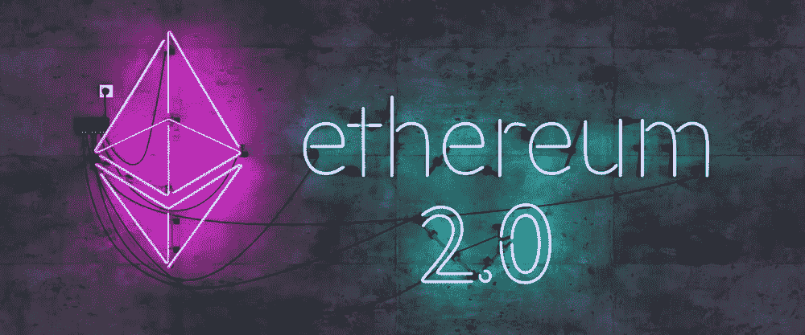

*forkast.news — canva*

# 介绍

期待已久的以太坊 2.0 就要到了。

多阶段升级试图通过对基础设施进行重大更改来提高以太网的可扩展性和安全性，最明显的是从工作证明(PoW)共识机制切换到利益证明(PoS)。

本文将讨论以太坊的合并及其未来潜力。

# 以太坊 2.0 是什么？

以太坊 2.0 是以太坊区块链的升级版。此次升级旨在提高以太坊网络的速度、效率和可扩展性，以便它能够处理更多的交易并缓解瓶颈。

首先，以太坊开发者已经放弃了“以太坊 2.0”的标签，转而使用“共识层”。这样做是为了最大限度地减少误解，并强调这样一个事实，即以前被称为“以太坊 2.0”更多的是一个网络升级，而不是一个全新的网络。

相反，以太坊由作为执行层的“以太坊 1.0”和作为共识层的“以太坊 2.0”组成，两者集成在一起。

# 以太坊 2.0 何时发生？

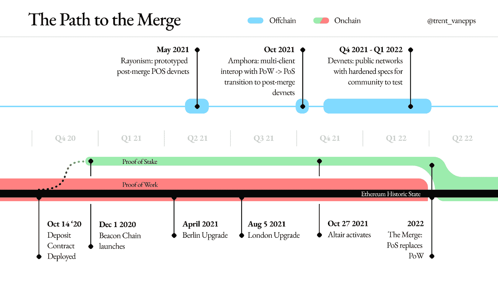

*图片来源:banklesshq.com*

以太坊升级是一个包含几个阶段的多阶段过程。信标链阶段于 2020 年 12 月 1 日开始运行。信标链向以太坊区块链添加了本地堆栈，这是网络向 PoS 共识机制过渡的基本组件。顾名思义，它是与以太坊主网不同的**区块链**。

第二阶段被称为“合并”，将于 2022 年第二或第三季度开始，将涉及信标链与以太坊主网的集成。

**Kintsugi** ，一个公共测试网，在 2021 年 12 月进行了测试网合并，让应用开发者和客户适应合并后的以太坊环境。测试网络的大量使用将允许客户和以太坊开发者发现任何潜在的问题并减轻它们。虽然有一些问题需要解决，但它为即将到来的窑炉测试网提供了重要的准备。

**窑**试验网合并基本成功。这是今年晚些时候转换到股权证明之前的最后一次公开测试。

最后一个阶段是碎片链，它将在以太坊网络的扩展中发挥关键作用。碎片链不是将所有操作都放在一个区块链上，而是将这些操作分散到 64 个新的链上。分片将使以太坊 2.0 成为高效和可扩展的区块链。

# 以太坊 2.0:期待什么

重要的是要明白，合并将是对共识层的升级。在这一层，将不再是矿工传播块，而是桩验证器。*执行层*保持不变。

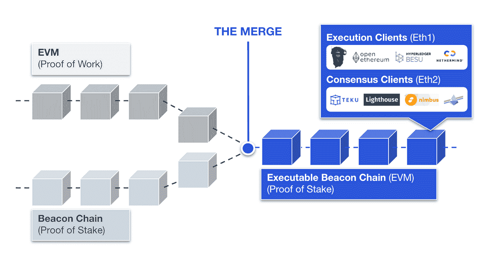

*图片来源:consensys.net*

*   **执行层:**负责事务捆绑、执行、状态管理。
*   **共识层:**负责验证块，也称为信标链。到目前为止，这个共识层已经顺利运行了 329，006 个验证器，总共标记了 11，043，496 个 ETH。

以太坊的可扩展性将从每秒 30 个交易提升到每秒 100，000 个交易，这将通过碎片链的实现来实现。这是因为当前以太坊的设置有一个由连续块组成的单链区块链。这是安全的，但是非常慢且效率低下。随着碎片链的引入，区块链将被拆分，使事务能够在并行链中处理，而不是在连续链中处理。这将加快网络的速度，并使其更容易扩展。

以太坊 2.0 将包括以下内容:

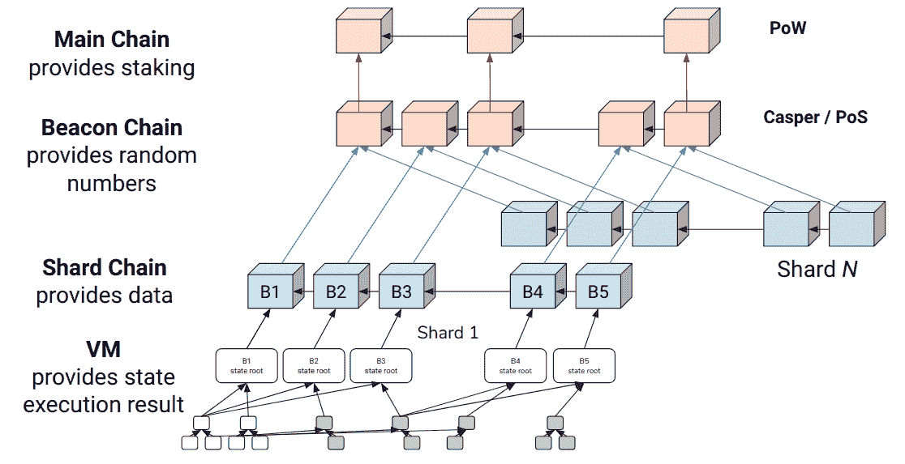

*图片来源:萧-王巍和以太坊*

*   **灯塔链:**全新的、经得起考验的区块链。它充当碎片链和主链之间的桥梁，提供赌注激励。信标链将跟踪历史碎片链参考点。
*   **分片链:**由于分片用于可伸缩性，每个分片链都必须以唯一的状态和独立的事务历史彼此独立地运行。碎片之间的主要链接将被记录在信标链上。
*   **eWASM:** 从以太坊虚拟机(EVM)过渡到 eWASM 以太坊 2.0(以太坊 web 组装机)。eWASM 将有助于创建一个快速、可扩展和灵活的生态系统，鼓励开发人员在以太坊 2.0 协议的基础上构建复杂的智能合约。

# 合并后的记号学含义

**供应**

目前，每年乙醚的排放量约为 540 万乙醚，通货膨胀率为 3.3%。考虑到以太坊的燃烧机制，也称为 EIP-1559，其中一小部分 ETH 气体进料，即基础进料，被燃烧，从而永久从循环中移除。目前，这种燃烧率为每年 150 万 ETH。见下文:

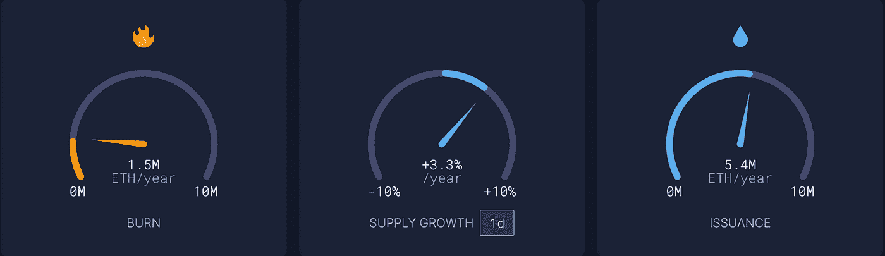

*图片来源:ultrasound.money*

合并后，乙醚的排放量将大大下降。具体来说，目前每年的以太网发行量为 540 万以太网，预计将降至每年约 500，000 以太网，加上烧钱机制，这将使以太网通货紧缩。见下文:

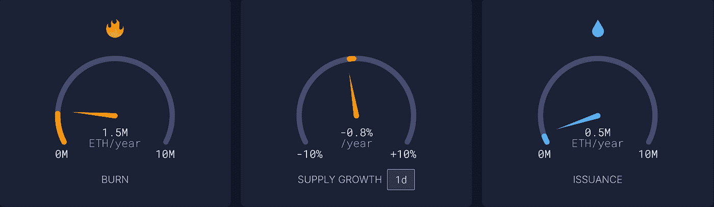

*图片来源:ultrasound.money*

这种动态很重要，因为根据供求定律，在需求不变的情况下，供应下降将导致价格上涨。

**需求**

根据最近的链上测量，2022 年见证了一些最高的以太坊外流。加密交易所持有的乙醚数量已降至 2018 年 9 月以来的最低水平。

根据 Glassnode 的数据，仅今年一年，就有近 550，000 个 ETH(约 16.1 亿美元)离开了集中式交易平台。

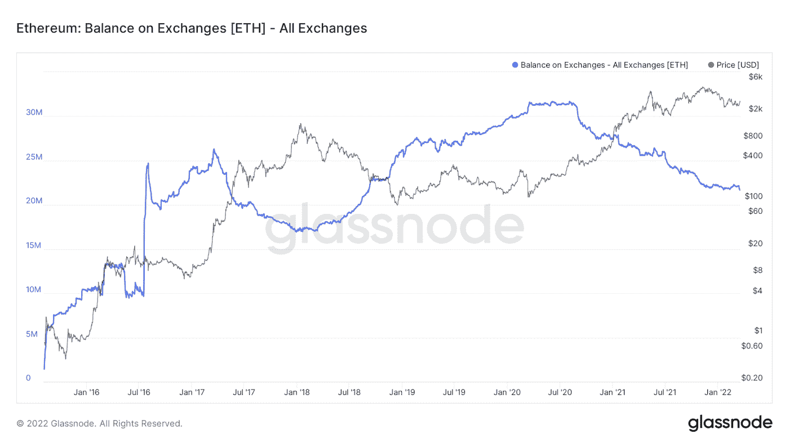

*图片来源:glassnode.com*

Chainalysis 显示了类似的数据，显示本周平均每天约有 120，000 个以太令牌离开交易所。

当以太坊从交易所移除时，它可以用于 DeFi 协议或存放在 ETH staking 合同中。后者似乎是事实，因为记录显示以太持有者到今天为止为以太坊 2.0 合同贡献了超过 1100 万 ETH。

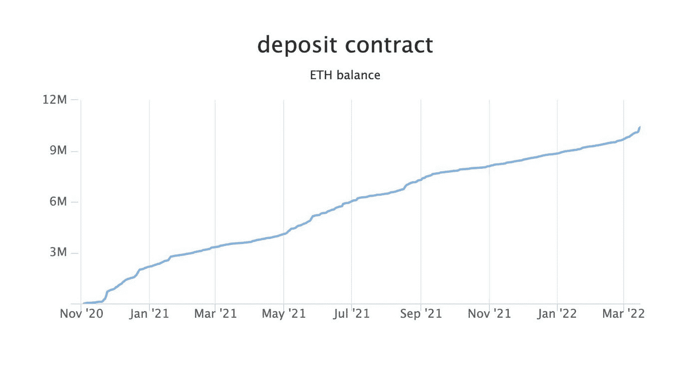

*图片来源:twitter @ultrasoundmoney*

# 重视以太坊 2.0

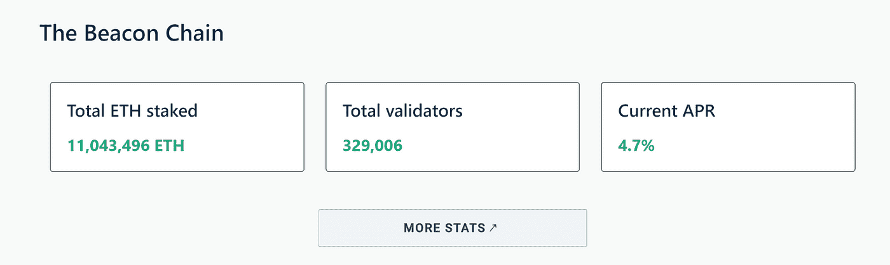

【launchpad.ethereum.org】图片来源:T4

**合并后的抛售压力？**

合并后所有被锁定的 ETH 将会怎样？验证者会出售所有这些 ETH 吗？首先，退出速率将被限制为每个时期 4 个验证器，一个时期持续 6.4 分钟。

根据以太坊的 beacon chain explorer，目前有超过 329，000 个验证器，涉及超过 1，100 万个 ETH，相当于平均每个验证器 33 个 ETH(beacon scan . com)。

假设每个验证器决定出售，每个时期 4 个验证器意味着 900 个验证器每天只能用 33 个 ETH 退出，导致每天最多出售 29，700 个 ETH。以太坊目前的日交易量约为 500 万瑞士法郎，这相当于目前日交易量的 0.57%，以及 1.2018 亿瑞士法郎总流通量的 0.024%。

即使每个验证器都出售，我们相信这不会对以太坊的价格产生重大影响。事实上，一旦合并成功完成，越来越多的机构、鲸鱼和矿工将开始入股。这是因为，围绕押记 ETH 的最大担忧之一是提款期缺乏可见性，对于许多机构投资者来说，在不确定何时能够收回的情况下押记 ETH 股份可能是一个挑战，即使收益率本身很有吸引力。

此外，由于以太坊区块链正在从工作证明(PoW)迁移到股份证明(PoS ),以前被迫出售设备以支付运营成本的矿工将不再需要这样做，因为在 PoS 上维护验证器节点要便宜得多。考虑以下数据:

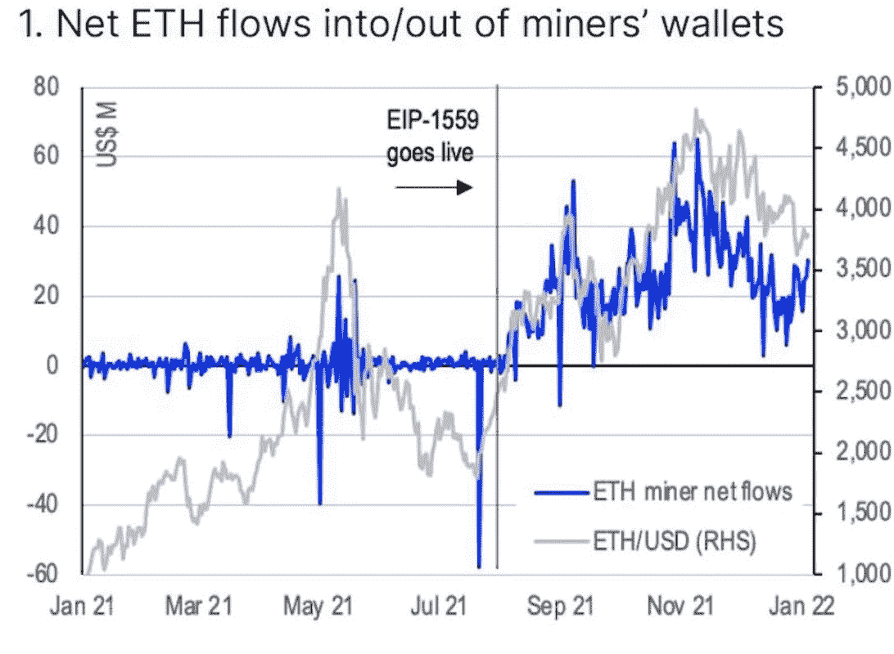

*图片来源:比特币基地分析*

根据比特币基地的说法，自 EIP-1559 引入(ETH 费用燃烧机制)以来，矿商似乎正在积累 ETH，因为矿商钱包中的 ETH 净流入量主要为正数。这可能意味着，矿商正等待合并，以验证者的身份移交他们的钻机和迁移，使他们能够继续保护网络，并获得回报。这意味着市场上将会有更少的 ETH，这将导致减少的销售压力和有利的价格行为。

**第二层解决方案？**

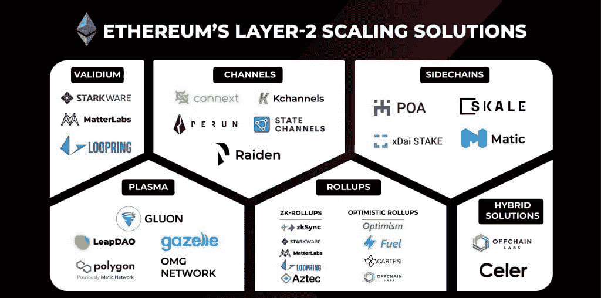

【coin68.com】图片来源:T2

以太坊主链的分片将增加第二层的可扩展性。这是因为第二层解决方案(Polygon、Arbitrum、乐观)采用汇总，这些汇总解决方案将能够充分利用增加的以太坊块空间。从长远来看，这对于以太坊网络潜在地扩展到数十亿用户是至关重要的。

**需求岗位合并？**

以太坊及其扩展解决方案占据了 55%的 DeFi TVL 生态系统，90%的 NFT 市场，以及快速崛起的元宇宙市场，花旗银行最近预测该市场将成为一个拥有 50 亿用户的 13 万亿美元市场，该市场主要在区块链以太坊上开发和运营。预计这一趋势将持续下去，导致合并后对 ETH 的需求增加。

**环境、社会和治理**

代表环境、社会和治理的 ESG 正在影响投资策略，大型资产管理公司越来越多地将这些非金融因素纳入其研究过程以发现机会。

围绕工作证明挖掘的看法，如合并前的比特币和以太坊，对环境有害，这意味着许多大型机构投资者远离此类加密货币。既然以太坊过渡到比工作证明更有效的利益证明，因为它消除了对采矿钻机的需求，以太坊需要的电力将是现在的一小部分。具体来说，电力消耗将减少 99%以上，使其成为“绿色”。见下文:

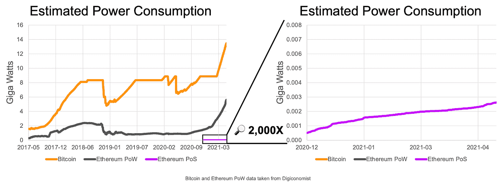

*图片来源:blog.ethereum.org*

ESG，加上 tokenomics 中概述的供给减少，将使大型资产管理公司非常有理由收购一项资产，这也将让他们获得赌注激励。这可能会吸引数十亿美元的机构资本，尤其是在通胀上升和股市估值过高的环境下。

此外，许多 SNP500 公司必须将 ESG 纳入其公司政策，如果他们希望在其运营或支付中采用以太坊的技术，成为 PoS 或“绿色”将非常有利。

**风险**

合并是以太坊正在经历的最大升级。即使它已经过彻底的测试，也不能保证它能在带电的交换机上正常工作。任何严重的缺陷都可能危及以太坊的声誉，值得一提的是，已经有高度可扩展的区块链与以太坊竞争，如 Solana、Avalanche、Fantom 和 Cardano，它们不需要“过渡”或第二层解决方案就能实现高效。

此外，不能确定合并是否会在未来几个月进行，因为合并已经被推迟了几次。

**价格**

根据平稳过渡，有利的市场条件，2.0 合同中保留 staked ETH，合并将导致以太坊变得通缩，结合 EIP-1559 燃烧机制，以及主要金融实体因其 ESG 而参与的可能性，我们估计可能的价格范围为每 ETH 5，000 美元至 7，000 美元。

*免责声明:本文包含的信息仅用于教育目的，不构成 Wheatstones 的任何形式的建议或推荐，也不打算供用户在做出(或避免做出)任何投资决定时依赖。*

> 加入 Coinmonks [电报频道](https://t.me/coincodecap)和 [Youtube 频道](https://www.youtube.com/c/coinmonks/videos)了解加密交易和投资

# 另外，阅读

*   [Bookmap 评论](https://coincodecap.com/bookmap-review-2021-best-trading-software) | [美国 5 大最佳加密交易所](https://coincodecap.com/crypto-exchange-usa)
*   最佳加密[硬件钱包](/coinmonks/hardware-wallets-dfa1211730c6) | [Bitbns 评论](/coinmonks/bitbns-review-38256a07e161)
*   [新加坡十大最佳加密交易所](https://coincodecap.com/crypto-exchange-in-singapore) | [购买 AXS](https://coincodecap.com/buy-axs-token)
*   [红狗赌场评论](https://coincodecap.com/red-dog-casino-review) | [Swyftx 评论](https://coincodecap.com/swyftx-review) | [CoinGate 评论](https://coincodecap.com/coingate-review)
*   [投资印度的最佳密码](https://coincodecap.com/best-crypto-to-invest-in-india-in-2021)|[WazirX P2P](https://coincodecap.com/wazirx-p2p)|[Hi Dollar Review](https://coincodecap.com/hi-dollar-review)