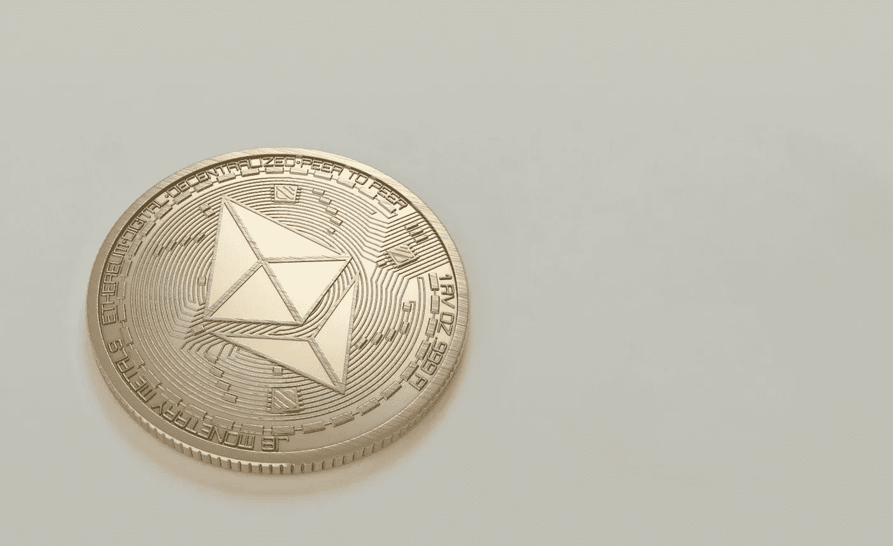

# 以太坊 2.0—eth 2 何时推出？(2022)

> 原文：<https://medium.com/coinmonks/ethereum-2-0-when-is-eth2-coming-out-2022-375d0d07361e?source=collection_archive---------16----------------------->

以太坊 2.0 是什么？现在真的值得投资吗？对以太坊的未来意味着什么？

[这篇文章来自我们的网站 Portfolio Hub](http://www.portfolio-hub.co.uk)

以太坊 2.0 是以太坊网络的下一个版本，是最大的加密货币之一。新协议将于 2022 年发布。这意味着新版本将在 7 年后推出…