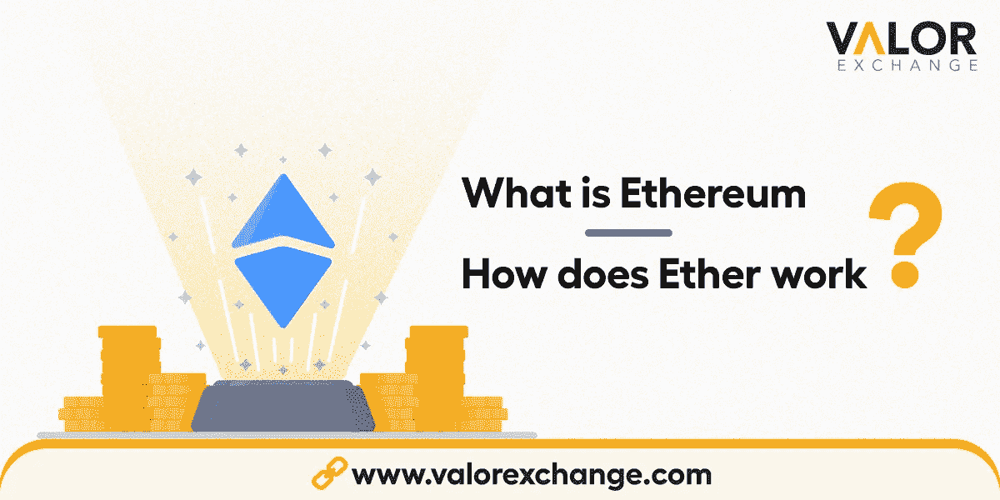

# 以太坊是什么，以太是如何工作的？

> 原文：<https://medium.com/coinmonks/ethereum-a-beginners-guide-to-ether-how-it-works-and-why-b0156551ac97?source=collection_archive---------101----------------------->

你知道比特币，也就是革命，货币的未来，世界上最著名的加密货币，但你想知道以太坊或以太是什么？

如果你想知道如何让你的密码更有价值，或者你真的想看看以太坊是如何工作的，那么这篇文章就是为你准备的。我们将看看以太坊区块链，它是如何产生的，你可以用它做什么，以及你如何将你的以太兑换成奈拉、比索、卢比等，反之亦然。

您可以通过 Telegram 加入我们的[社区，开始您的加密之旅，获取最新工具、资源、最新新闻等。多亏了加密技术，我们已经全球化了。所以，你在哪个国家并不重要，因为不管怎样，你都可以加入我们来学习。](https://t.me/valorexchangecommunity)

**以太坊:简史。**

在 2009 年推出[比特币](https://valorexchange.com/blog/post?slug=what-is-bitcoin-a-brief-introduction)后，许多人不想将他们的美元或奈拉兑换成比特币。人们猜测它，因为它几乎没有痕迹，罪犯经常使用它。

幸运的是，一些人看到了加密货币在犯罪活动之外的潜力。一个对加密货币感兴趣的人名叫 Vitalik Buterin，他是一名出生于俄罗斯的加拿大程序员和作家。他后来成为区块链以太坊的创始人之一。他是你可以在 [ValorExchange 上用奈拉交换乙醚或任何有价值的东西的部分原因。](https://account.valorexchange.com/signup)

布特林被比特币迷住了。在 2019 年接受 Business Insider 采访时，他表示，“我认为(比特币)是令人兴奋的东西。我开始越来越多地融入社区。”

2012 年，布特林将与人合作创建一份名为“比特币杂志”的杂志出版物。他会在世界各地旅行，会见比特币开发者，并开始构思更好的比特币，一种功能更多的新比特币。这是区块链以太坊的基础。2013 年，布特林参加了一个比特币会议，这次会议说服他退学，全职研究加密货币。

2013 年末，布特林将发布以太坊区块链白皮书，详细介绍智能合约、去中心化应用(DAP)和自动化不可变语句。他当时 19 岁。

尽管 DAP 已经存在，Buterin 希望统一他们的工作和互动方式，以提高采用率。

布特林、他的联合创始人加文·伍德、约瑟夫·卢宾、查尔斯·霍斯金森、米哈伊·阿利斯、安东尼·迪·伊奥里奥、杰弗里·威尔凯和阿米尔·切特里特将举行以太代币预售来筹集资金，总共将筹集 18，439，086 美元。这将在可预见的未来资助以太坊的活动。

随着时间的推移，更多的开发人员带着他们分散的想法加入了这个团队。建立了一个系统，在这个系统中，多数人必须对网络上的变化进行投票，而不是将所有的权力都放在一个 CEO 身上。

不幸的是，黑客后来从 DAO 的资产中窃取了超过 4000 万美元。这将导致所有以太坊活动被转移到一个新的、更安全的同名协议中。这个新升级的系统将被称为以太坊，而原来的网络将被称为以太坊经典。

创始人将继续创建以太坊基金会来维护和创建网络。

**以太坊是如何运作的？**

以太坊存在于一个去中心化的网络中，意味着它不存在于一个地方。没有集中的服务器，这使得它不会完全崩溃。以太坊有一种叫以太的货币，你可以用它来进行支付、转账等。以太坊与一个名为以太坊虚拟引擎的分散式计算引擎一起工作，该引擎处理区块链上的数百万个项目。

当人们在以太坊区块链上进行交易时，交易必须经过被称为矿工的特殊人员的验证。这些矿工的努力和昂贵的设备必须得到补偿，因此每笔交易都要收取特定的费用。这些费用被称为燃气费。

所以每当你用乙醚买一只鞋或钱包或进行转账时，油费就会加到总额中。

当交易被成功验证并添加到区块链时，负责的矿工也会因为他们的工作而被网络奖励更多乙醚。这就是[工作证明(POW)](https://valorexchange.com/blog/post?slug=proof-of-stake-and-proof-of-work-a-beginner-s-guide) 共识的运作方式。

**以太坊 2.0 是什么？**

以太坊正在升级到更好的版本。这种即将到来的集成将有助于解决以太坊的扩展问题，并使用另一种被称为[利益证明](https://valorexchange.com/blog/post?slug=proof-of-stake-and-proof-of-work-a-beginner-s-guide)的共识机制。

人们相信，有了股权证明，区块链运营将能够以更低的油费更快地进行。

**以太坊的用途**

**去中心化应用(DAPs)** :以太坊托管了广泛的去中心化应用，用于游戏、投资、P2P 转账、社交媒体等等。

**智能合同**:当合同的条款或条件得到满足时自动执行的合同。它们主要在以太网上运行，在农业、法律等行业有着广泛的应用。

不可替代代币(NFTs) :由以太坊区块链支持的 NFTs 允许艺术家、作家、音乐家等使用。在区块链网络上出售他们的艺术作品。

**去中心化金融(Defi):** 这是一项正在发展的金融技术。它旨在直接向那些需要的人提供分散的金融服务。以太坊网络上有上千个 Defi 项目。

**货币:**以太，以太坊的货币，可用于支付，国际转账，储蓄以资助商业想法等 [ValorExchange。](https://account.valorexchange.com/)

**我如何得到乙醚**

很简单，要想进入以太，你需要一个交换。我们已经告诉你所有你可以用 ValorExchange 做的事情。但是你知道吗，你也可以在 ValorExchange 上把你的法定货币换成比特币、以太或者系绳。

你需要做的就是免费创建一个账户，剩下的就是历史了。

**结论**

以太坊区块链是令人难以置信的和快速增长的。关于这个主题有太多需要了解或学习的东西，我们有一个社区，可以告知这个行业每天发生的事情。我们在[我们的 Telegram 社区](https://t.me/valorexchangecommunity)上分享文章、资源、工具等。所以，如果你有点好奇或者真的想了解更多关于密码世界的知识，加入我们吧。