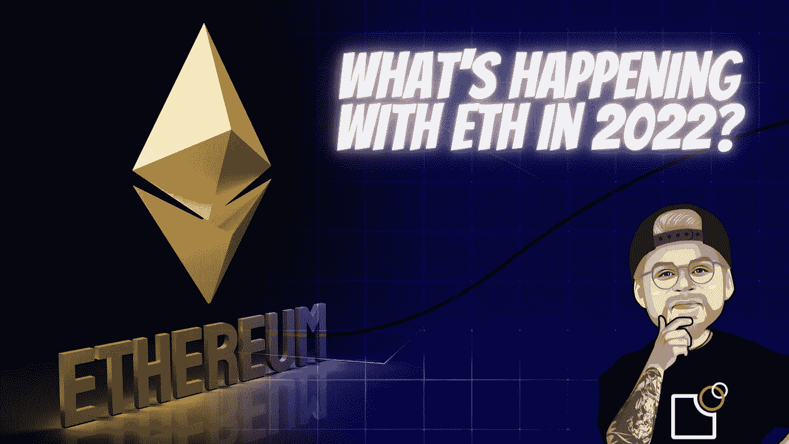

# 以太坊作为 DeFi 之王有危险吗？

> 原文：<https://medium.com/coinmonks/ethereum-as-king-of-defi-in-danger-7bb456bbe98d?source=collection_archive---------10----------------------->

altcoin 空间只有一个无可争议的王者，它的名字叫以太坊。更有甚者，领先的 altcoin 在 DeFi 领域占据主导地位，是分散融资的关键。难怪，让我们考虑一下 Uniswap、Sushiswap、Aave、Compound、CREAM 以及 DeFi 领域的许多大品牌都将以太燃料区块链(ETH)称为家园。

# 但是这种优势也是建立在…