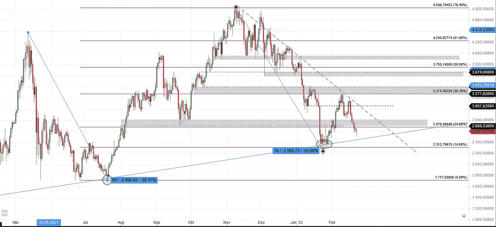

# 以太坊大图(22.02.2022)

> 原文：<https://medium.com/coinmonks/ethereum-big-picture-22-02-2022-d96511875864?source=collection_archive---------29----------------------->

Ethereum Daily Chart — Big Picture

# 看看每日以太坊图表

从金融和技术的角度来看，以太坊可能是最有潜力的加密资产之一。毫无疑问，目前以太坊受到了很多关注，随着当前技术的变化，以太在未来可能会获得更多的关注。

当 2021 年 11 月将价格带到 ATH 时，技术图表反映了这种关注。但目前，以太走在忍受修正和遭受崩溃之间的狭窄道路上。我们能发现我们是否处于崩溃中吗？

# 整体情况

我喜欢大图分析，因为它有助于记住我们从哪里来，我们今天在哪里。

## 主要趋势

长期主要趋势是上升趋势。这可以通过观察一个接一个的高低点来确定，并可以通过绘制趋势线(灰色圆圈)来连接:

Higher-lows on the Ethereum daily chart, connected by drawing a trendline

在这个主要趋势中，我们已经看到了两个大的价格缺陷(60%和 53.6%)。

但是只要价格保持在蓝色趋势线之上，当前的主要趋势是完整的。

## 次要趋势

第二个趋势是下降趋势，因为我们可以在图表上看到一系列较低的低点，伴随着较低的高点(灰色箭头标记的较低的低点):

Ethereum technical chart showing the secondary trend

每种证券和资产都不可能永远上涨，所以价格开始回调只是时间问题。自 2021 年 11 月 ATH 以来，价格从 4870 英镑下跌至 2170 英镑，跌幅约为 54%。

一个大问题是:这还是一次健康的调整，还是我们已经面临崩盘？

# 崩溃还是修正？

根据福布斯目录，崩盘是指从上次高点下跌 10-20%。但在我写这篇文章的时候，我怀疑他们已经发现了加密资产，在这种情况下，高波动性和强烈波动是很常见的。20%的“修正”通常被认为是加密领域的下跌，许多交易员和投资者认为这是买入的机会。

目前，我们处于超过 50%的修正水平，因此，如果这已经走得太远，我们看到的实际上是一场崩溃，这是一个有效的问题。

再次缩小有助于确定当前状态。是的，有一个快速的下跌，但是正如在主要趋势部分提到的，从长期来看，图表仍然有有效的高点。下跌在蓝色趋势线处停止，并向上反弹，在第三趋势中形成更高的低点(蓝色箭头):

Etherum chart showing the tertiary trend

但一些人称之为复苏的开始，结果却是一次看跌的回调。在第二个高点-低点之后，价格未能克服最近的高点-高点，并在其下方停止。从那以后，我们已经看到了连续 6 天的下跌。现在重要的是，这种下跌要在蓝色趋势线附近或上方停止，不要突破这个水平。只要这是 cas，e，主要趋势是完整的，自上次 ATH 以来的大幅下跌是一次修正。

但是，如果价格跌破这条蓝色趋势线，从而在大时间框架内形成一个更低的低点，我们可能会进入崩盘，抛售压力可能会增加。不过，如果价格从 2021 年 7 月起停在 1720 英镑左右的前期高点，还是有希望的。

# 如果你想进入一个新的行业或投资，你需要寻找什么

目前，还不清楚价格是否会进一步下跌，因此目前进行交易或投资存在巨大风险。检查图表中可能的顺周期信号是有意义的。为了确定触发此类信号必须达到的相关水平，我们必须再次查看图表:

ETH/USD chart with important support and resistance areas

灰色的横线标志着非常重要的区域，因为它们在过去曾作为支撑和阻力。紫色水平线标志着当前的斐波纳契水平，世界各地的许多交易者和投资者通常会考虑这个水平。

查看最近的图表模式、价格发展和上述水平，应该很容易确定两个可能的区域，在这两个区域做多可以被认为比现在风险更低(灰色椭圆):

Ethereum: Possible entries for a long trade/investment

这些领域是:

*   3410 美元以上
*   4000 美元以上

我说的“高于”是指日线必须收在这些标记之上，才能触发顺周期信号。

如果价格到达其中一个区域，并不意味着下一轮反弹有保证。这只是意味着，如果你等待一个长期的交易或投资，直到这些信号被触发，亏损的风险比目前的情况要低。

通常情况下，顺周期区域是大量资金流入资产的区域，你可能会成为这股浪潮中的一员。

在当前形势下，进入反周期头寸很有诱惑力，但也非常冒险。没有办法知道价格是否会进一步下跌，所以首要任务应该是保护你的钱，而不是赌趋势线会再次快速反弹。

不是财务顾问。自行承担风险。

> 加入 Coinmonks [电报频道](https://t.me/coincodecap)和 [Youtube 频道](https://www.youtube.com/c/coinmonks/videos)了解加密交易和投资

# 另外，阅读

*   [Bookmap 评论](https://coincodecap.com/bookmap-review-2021-best-trading-software) | [美国 5 大最佳加密交易所](https://coincodecap.com/crypto-exchange-usa)
*   [如何在 FTX 交易所交易期货](https://coincodecap.com/ftx-futures-trading) | [OKEx vs 币安](https://coincodecap.com/okex-vs-binance)
*   [CoinLoan 评论](https://coincodecap.com/coinloan-review) | [YouHodler 评论](/coinmonks/youhodler-4-easy-ways-to-make-money-98969b9689f2) | [BlockFi 评论](https://coincodecap.com/blockfi-review)
*   [XT.COM 评论](https://coincodecap.com/profittradingapp-for-binance) | [币安评论](https://coincodecap.com/xt-com-review)
*   [SmithBot 评论](https://coincodecap.com/smithbot-review) | [4 款最佳免费开源交易机器人](https://coincodecap.com/free-open-source-trading-bots)
*   [比特币基地僵尸工具](/coinmonks/coinbase-bots-ac6359e897f3) | [AscendEX 审查](/coinmonks/ascendex-review-53e829cf75fa) | [OKEx 交易僵尸工具](/coinmonks/okex-trading-bots-234920f61e60)
*   [如何在印度购买比特币？](/coinmonks/buy-bitcoin-in-india-feb50ddfef94) | [瓦济克斯评论](/coinmonks/wazirx-review-5c811b074f5b)