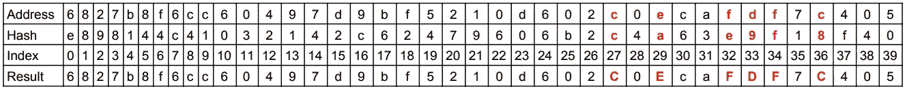
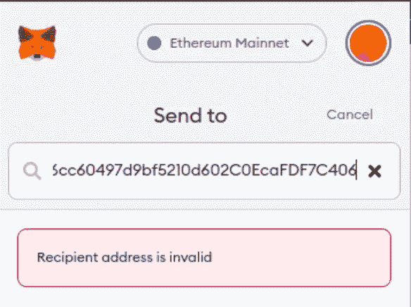

# 以太坊校验和地址、重要性和实现

> 原文：<https://medium.com/coinmonks/ethereum-checksummed-addresses-importance-and-implementation-eef74aa3ae18?source=collection_archive---------21----------------------->

校验和地址是包含一些验证其完整性的数据的地址。

校验和是从其他数据中获得的一小段数据，用于检测数据在网络传输过程中的错误，或者由于用户操作错误而导致的错误。

在区块链，计算地址校验和并以某种方式将校验和附加到地址本身是一种常见的做法。这样，当我们使用该地址向其发送资金时，钱包、区块链客户端或区块链本身就有办法检查该地址的完整性，以检测错误并防止资金损失。

# 以太坊

以太坊现在支持校验和地址。以太坊最初并不支持校验和地址，而是使用原始的十六进制地址。这是一个问题，因为以太坊客户端无法检查地址的完整性，如果地址不正确，用户可能会损失资金。

以太坊改进提案(EIP)提交了一种以向后兼容的方式给以太坊地址添加校验和的方法。参见 [EIP-55](https://github.com/ethereum/EIPs/blob/master/EIPS/eip-55.md) 。

在 EIP-55 之前，以太坊地址通常是这样的:

```
0x6827b8f6cc60497d9bf5210d602c0ecafdf7c405
```

十六进制地址的所有字符都是小写的。

现在，使用 EIP-55，以太坊地址看起来像这样:

```
0x6827b8f6cc60497d9bf5210d602C0EcaFDF7C405
```

低位和高位字符的混合，对以太坊客户端(如 Metamask 和 Web3js)可以检测和检查正确性的校验和进行编码。

我们仍然可以将资金发送到一个全小写的地址(一个没有校验和的地址)，以太坊客户端和以太坊协议将接受它并锁定资金，而不验证其正确性(因为没有办法验证其完整性)，潜在地将资金锁定在一个无效的地址，并永远失去资金。

在向该地址发送资金之前，请务必使用校验和地址。

**EIP-55 如何工作**

要为以太坊地址创建校验和:

1.  我们需要以小写形式计算地址的 Keccack-256 哈希，不带前缀“0x”。
2.  比较地址和哈希的第 I 个字符，如果地址的第 I 个字符是字母，哈希十六进制值的第 I 个字符大于或等于 8，则将地址的第 I 个字符设置为大写。

这将打印出如下内容:

```
e898144c41032142c62479606b2c4a63e9f18f4023297d6673d4eeb13cafdb50
```

让我们把地址和散列一个放在另一个下面:

```
6827b8f6cc60497d9bf5210d602c0ecafdf7c405
e898144c41032142c62479606b2c4a63e9f18f4023297d6673d4eeb13cafdb50
```

我们只需要散列的前 20 个字节(40 个字符),忽略其余的，因为以太坊地址是 20 个字节。

如果我们比较地址和散列的第 I 个索引处的每个字符，并检查上面提到的条件，我们会观察到以下字符匹配这些条件，用红色突出显示:



索引 27 处的地址字符是 c，是一个字母，索引 27 处的哈希字符是 c，十六进制值大于 8，所以，我们将索引 27 处的地址字母设置为大写，如结果行所示。我们在索引 29、32、33、34 和 36 处找到匹配的字符，所以只有这些字符被设置为大写。

当以太坊客户端获得校验和地址并想要验证它时，它会复制它，将其设置为小写并运行与上述相同的步骤，并将结果与它收到的校验和地址进行比较，如果它们不匹配，则地址无效并引发错误。

改变地址，哪怕是一点点，都会产生完全不同的 keccack256 哈希，校验和也会不同。

> 交易新手？试试[加密交易机器人](/coinmonks/crypto-trading-bot-c2ffce8acb2a)或者[复制交易](/coinmonks/top-10-crypto-copy-trading-platforms-for-beginners-d0c37c7d698c)

这里有一个工具可以在线尝试不同的哈希算法: [emn178.github.io](https://emn178.github.io/online-tools/keccak_256.html)

这里有一小段代码来展示如何实现它:

这将打印:

```
6827b8f6cc60497d9bf5210d602C0EcaFDF7C405
true
```

如果您使用元掩码，您会看到它默认显示校验和地址。如果您尝试修改校验和地址，哪怕只是一点点，它都会抱怨地址无效。让我们将示例地址的最后一位数字从 5 改为 6，并尝试使用元掩码向其发送资金:



此外，如果你进入 e [therscan.io](https://etherscan.io/) 并在搜索栏中粘贴一个没有校验和的地址，然后点击 enter，它会显示带有校验和的地址:


给以太坊地址添加校验和的简单方法！

# 结论

我们已经看到以太坊客户端如何给以太坊地址添加校验和。其他区块链也对其地址进行校验和编码，以减少向无效地址发送资金的机会。

还提出了一种不同的方法来标准化带有内置校验和的以太坊地址，称为 [ICAP](https://eth.wiki/ideas/inter-exchange-client-address-protocol-icap) (Interexchange 客户端地址协议)，它基于 IBAN(国际银行帐号)格式。这不常用。

以太坊地址从一开始就没有被添加校验和和编码，因为它们不应该被直接使用，而是来自区块链的一个域名，带有以太坊名称服务(ENS)，在 [EIP-137](https://eips.ethereum.org/EIPS/eip-137) 中引入。因此，用户可以使用一个内部指向其地址的域，而不是使用原始的十六进制地址。类似于:jeremythen.eth

以太坊名称服务的开发没有在预期的时间内完成，现在使用原始的十六进制地址是规范。