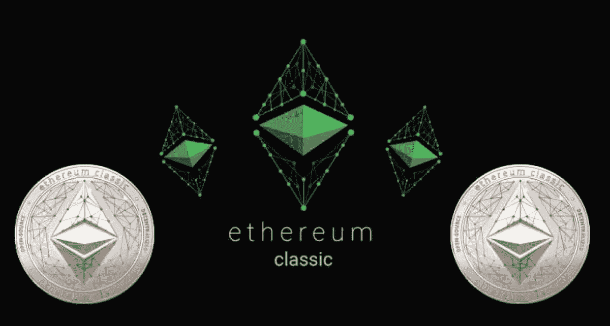

# 以太坊经典价格分析 2022–2026

> 原文：<https://medium.com/coinmonks/ethereum-classic-price-analyse-2022-2026-71e1e80f984b?source=collection_archive---------26----------------------->

Source photo [ethereum classic — Bing images](https://www.bing.com/images/search?view=detailV2&ccid=2LjRfybV&id=B000DEA116D1832A3649B28F73F76B09E3D92F51&thid=OIP.2LjRfybV2y_TAKdHGDAeIgHaD9&mediaurl=https%3a%2f%2fwww.namecoinnews.com%2fwp-content%2fuploads%2f2019%2f10%2fEthereum-Classic.jpg&cdnurl=https%3a%2f%2fth.bing.com%2fth%2fid%2fR.d8b8d17f26d5db2fd300a74718301e22%3frik%3dUS%252fZ4wlr93OPsg%26pid%3dImgRaw%26r%3d0&exph=642&expw=1200&q=ethereum+classic&simid=608050842659208702&FORM=IRPRST&ck=5EB0F3926A13B66C1A0FB95FF1C1DA7F&selectedIndex=8&ajaxhist=0&ajaxserp=0)

2022 年，ETC 价格达到 33.92 美元，延续了前一年的下降趋势。到 1 月 10 日，数字资产的价格已经跌至 27.41 美元。尽管 1 月 19 日曾短暂跌至 32.83 美元，但长期趋势仍是积极的。1 月 22 日，加密货币的价值跌至创纪录的 21.77 美元。