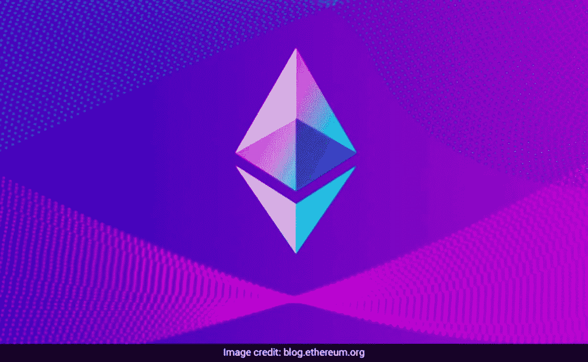

# 以太坊联合创始人讨论加密崩溃

> 原文：<https://medium.com/coinmonks/ethereum-co-founder-discusses-crypto-crash-b7481fd30542?source=collection_archive---------27----------------------->

以太坊的联合创始人加文·伍德(Gavin Wood)表示，在市场崩溃导致加密货币持有价值减少超过 8000 亿美元之后，投资者需要更加关注他们投资的基础资产。

“我希望当人们参与到一个社区、生态、经济中时，他们会更密切地关注货币绰号的背后是什么，”伍德在瑞士阿尔卑斯山度假胜地达沃斯世界经济论坛的间隙告诉路透社记者。

今年的商业和政治领导人会议见证了加密和区块链公司的强大存在，尽管该市场最近已经消亡，第八大硬币 Luna 几乎变得一文不值。

第一次出席的伍德是一位英国计算机科学家，他在那里宣布了波尔卡多特和弗兰克·迈考特的“自由计划”之间的新关系。

像加密货币一样，区块链是记录所有计算机网络交易的分散式公共账本。

伍德认为，合法性是主权政府定义的东西，因此互联网对此毫无概念。

据 CEO 克里斯·伍德称，去中心化的网络控制和为用户提供更多的数据控制权是新合作的目标

“这项技术不能防止人们犯错误，但它可以帮助那些想更好地理解世界的事实，他们正在购买什么，”伍德说。

Web3 这个名字是由这位 42 岁的以太坊联合创始人创造的，他还创建了 Web3 基金会，以支持网络重组，远离谷歌的所有者 Alphabet 等大公司。

尽管市场在活动前几周急剧下跌，第八大硬币 Luna 几乎变得一文不值，但 crypto 和区块链企业在今年的企业和政治领导人聚会上表现突出。

更多秘密故事请关注我→ [阿卜杜勒·拉希德](https://medium.com/u/be5857f1ba5e?source=post_page-----b7481fd30542--------------------------------)

> 加入 Coinmonks [电报频道](https://t.me/coincodecap)和 [Youtube 频道](https://www.youtube.com/c/coinmonks/videos)了解加密交易和投资

# 另外，阅读

*   [德国最佳加密交易所](https://coincodecap.com/crypto-exchanges-in-germany) | [Arbitrum:第二层解决方案](https://coincodecap.com/arbitrum)
*   [币安交易机器人](/coinmonks/binance-trading-bots-d0d57bb62c4c) | [OKEx 审查](/coinmonks/okex-review-6b369304110f) | [阿塔尼审查](https://coincodecap.com/atani-review)
*   [最佳加密交易信号电报](/coinmonks/best-crypto-signals-telegram-5785cdbc4b2b) | [MoonXBT 评论](/coinmonks/moonxbt-review-6e4ab26d037)
*   [如何在 Bitbns 上购买柴犬(SHIB)币？](https://coincodecap.com/buy-shiba-bitbns) | [购买 Floki](https://coincodecap.com/buy-floki-inu-token)
*   [CoinFLEX 评论](https://coincodecap.com/coinflex-review) | [AEX 交易所评论](https://coincodecap.com/aex-exchange-review) | [UPbit 评论](https://coincodecap.com/upbit-review)
*   [十大最佳加密货币博客](https://coincodecap.com/best-cryptocurrency-blogs) | [YouHodler 评论](https://coincodecap.com/youhodler-review)