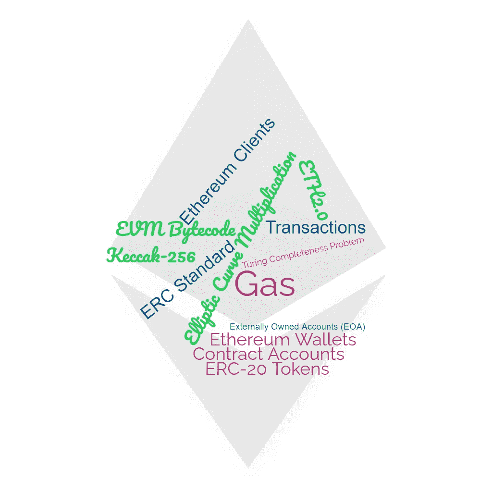

# 以太坊用简单的方式解释复杂的概念

> 原文：<https://medium.com/coinmonks/ethereum-complicated-concepts-explained-in-an-easy-way-72cafad4f89c?source=collection_archive---------10----------------------->

## 每个以太坊迷需要知道的 10 个基本概念

许多人认为以太坊是“世界计算机”。这无疑是迄今为止开发的最有前途的分布式分类帐之一。

如果你想更好地了解这个区块链，你必须开始了解一些关于…