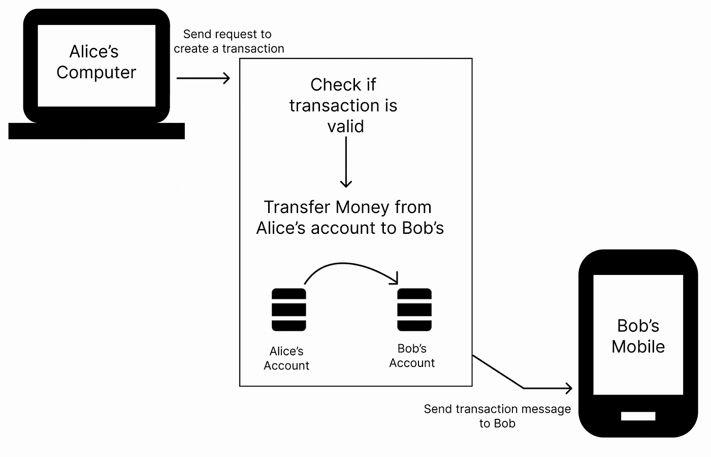
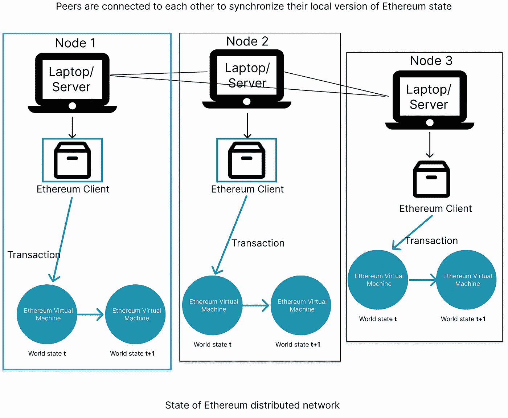

# 以太坊概念模型

> 原文：<https://medium.com/coinmonks/ethereum-conceptual-model-bb02f8cbf6a1?source=collection_archive---------43----------------------->

概念模型可能是学习中最重要的方面。人们很难理解区块链和分布式账本协议的原因之一可能是因为它们的概念模型与我们迄今为止熟悉的传统集中式系统非常不同。

在我们深入以太坊的概念模型之前，让我们谈一谈我们对普通计算机的心理模型。传统电脑是我们餐桌上的设备/机器。只要您在计算机附近并具有所需的访问权限，您就可以对计算机进行更改，如添加文件、更改背景等(比如更改计算机的状态)。如果您的计算机连接到互联网，您将能够访问世界上另一台计算机(服务器)上的信息，并在服务器**允许**的情况下向服务器添加信息。

下面是一个非常高级的模型，告诉你如何使用互联网转账:

所以使用互联网，如果爱丽丝想给鲍勃汇钱，爱丽丝必须用她的电脑向银行的服务器(电脑)发送请求，将钱从她的账户转移到鲍勃的账户。银行将在其服务器(计算机)上执行一系列检查，如果 Alice 通过了所有这些检查，银行将把钱从 Alice 的帐户转移到 Bob 的帐户，并向 Bob 的计算机(或者说，移动电话)发送消息，表明钱已被添加到他的帐户中。请注意，当资金从 Alice 的帐户转移到 Bob 的帐户时，银行服务器(计算机)中的信息也发生了变化。

以下是以太坊高级工作原理的概念模型:

以太坊本质上是一台大型分布式计算机。您不必向银行服务器发送请求来创建交易，因为在这种情况下，您自己的计算机或多或少就是银行的服务器。所以如果 Alice 想把 ether 发给 Bob，她要做的就是用 Ethereum 客户端创建一个事务。这个以太坊客户端向其计算机中的以太坊虚拟机发送一个事务，如果该事务有效，以太坊的状态就会改变。这种状态的改变被传达给连接到 Alice 的计算机的所有对等体，因此它们也可以将它们的以太坊(的实例)更新到最新的状态。

这差不多就是以太坊的概念模型。
下次见！

> 加入 Coinmonks [Telegram group](https://t.me/joinchat/Trz8jaxd6xEsBI4p) ，了解加密交易和投资