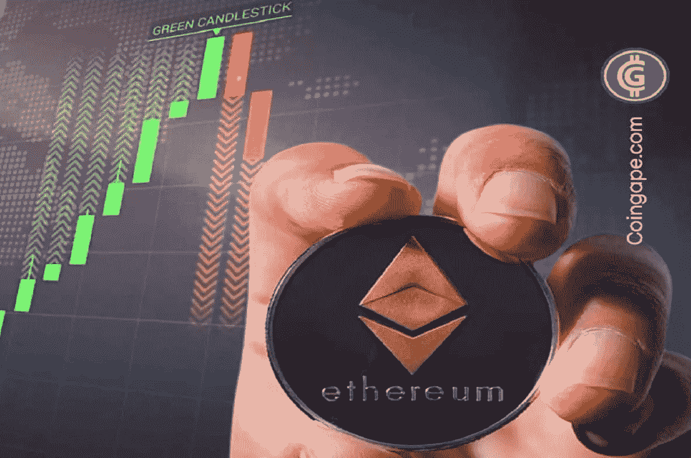

# 以太坊(ETH)因合并延迟崩溃 10%，1200 美元在望吗？

> 原文：<https://medium.com/coinmonks/ethereum-eth-crashes-10-on-merge-delay-is-1200-in-sight-b003669a3055?source=collection_archive---------33----------------------->

根据[**coinmarketcap.com**](https://coinmarketcap.com/currencies/ethereum/)的数据，第二大加密货币暴跌超过 10%，至 1588.57 美元，为 2021 年 3 月以来的最低水平。这种代币今年下跌了约 56%，表现远不如规模更大的同行比特币。

以太坊最近的亏损是由几个因素引发的。计划难度炸弹 中的 [**延迟，意在最终淘汰产业链上的采矿，是最近的下行压力来源。**](https://coingape.com/ethereum-developers-decide-to-delay-the-difficulty-bomb-why-its-bad-for-the-merge-upgrade/)

周五高于预期的美国通货膨胀数据也引起了加密市场的恐慌。

# 以太坊合并可能延迟

尽管本周在 Ropsten testnet 上成功部署了 merge，以太坊开发者还是决定推迟一个计划好的难度炸弹。

此举可能会推迟逐步退出采矿的计划，引发人们对合并延期的担忧。

这也对创始人 Vitalik Buterin 的预测提出了质疑，他预测合并最早可能在 8 月 16 日、17 日、19 日发生。

这一合并是今年 crypto 最受期待的事件之一，因为它将使第二大区块链完全成为股东。

此举预计将使以太坊更容易为散户和机构投资者所接受，并预计将增加社区在链中的参与，从而提振代币价格。

# ETH 跌至 1200 美元？

根据技术指标，以太坊价格正在上演一个下降的三角形模式，在短期内可能会跌至 1200 美元。

这个预测是由 [**传奇分析师彼得·勃兰特**](https://twitter.com/PeterLBrandt/status/1533975783210815488?s=20&t=IV8EHmw2dnomP3LL-ndN_w) 提出的。

今年早些时候，对合并的预期导致以太坊价格大幅上涨，令牌价格高达 3500 美元。但这一事件的任何延迟都有可能抵消这些收益。上个月一次合并测试网 的轻微中断也导致以太坊价格大幅下跌。

[**以太坊**](https://coingape.com/this-ethereum-token-steth-could-become-the-next-terrausd/)【stETH】的一个赌注变种的亏损，也引发了人们对以太坊 DeFi 生态系统价格冲击的担忧。

> 加入 Coinmonks [电报频道](https://t.me/coincodecap)和 [Youtube 频道](https://www.youtube.com/c/coinmonks/videos)了解加密交易和投资

# 另外，阅读

*   [有哪些交易信号？](https://coincodecap.com/trading-signal) | [Bitstamp vs 比特币基地](https://coincodecap.com/bitstamp-coinbase) | [买索拉纳](https://coincodecap.com/buy-solana)
*   [ProfitFarmers 点评](https://coincodecap.com/profitfarmers-review) | [如何使用 Cornix 交易机器人](https://coincodecap.com/cornix-trading-bot)
*   [西班牙 5 大最佳文案交易平台](https://coincodecap.com/copy-trading-spain)
*   [Pionex 双重投资](https://coincodecap.com/pionex-dual-investment) | [AdvCash 审查](https://coincodecap.com/advcash-review) | [支持审查](https://coincodecap.com/uphold-review)
*   [面向开发者的 8 个最佳加密货币 API](https://coincodecap.com/best-cryptocurrency-apis)