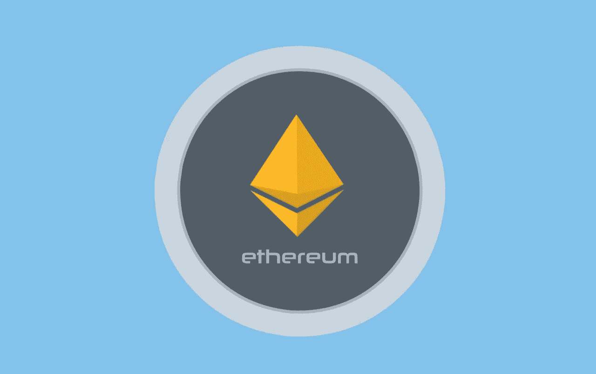

# 以太坊 60 秒讲解

> 原文：<https://medium.com/coinmonks/ethereum-explained-in-60-seconds-604af45aec62?source=collection_archive---------40----------------------->

以太坊是市值仅次于比特币的第二大加密货币。它也是一个开源的、公共的、基于[区块链](https://www.thecryptopie.com/post/blockchain-explained-in-60-secs)的分布式计算平台和操作系统，具有智能合约功能。

以太坊本质上是一台“世界计算机”，可以用来构建去中心化的应用。它使用代码语言来创建智能合同——自动执行的合同，双方之间的协议条款用代码编写。

它是由 Vitalik Buterin 创建的，他想为没有任何中央控制的应用程序建立一个分散的平台。以太坊着手建立一种新的全球化、去中心化的计算平台，该平台利用区块链的安全性和开放性，并将这些属性扩展到广泛的应用中。以太坊在[分散金融(DeFi)](https://www.thecryptopie.com/post/decentralized-finance-defi-explained-in-60-secs) 宇宙中不可或缺。

 [## 你准备好迎接加密经济了吗？加密派

### 每次你打开新闻，阅读报纸，或者浏览你的推特，你很可能会看到一些故事…

www.thecryptopie.com](https://www.thecryptopie.com/) 

> 加入 Coinmonks [电报频道](https://t.me/coincodecap)和 [Youtube 频道](https://www.youtube.com/c/coinmonks/videos)了解加密交易和投资

# 另外，阅读

*   [Remitano 审查](https://coincodecap.com/remitano-review)|[1 英寸协议指南](https://coincodecap.com/1inch) | [购买 Floki](https://coincodecap.com/buy-floki-inu-token)
*   [MoonXBT vs Bybit vs 币安](https://coincodecap.com/bybit-binance-moonxbt) | [Arbitrum:第二层解决方案](https://coincodecap.com/arbitrum)
*   [买 PancakeSwap(蛋糕)](https://coincodecap.com/buy-pancakeswap)|[matrix export Review](https://coincodecap.com/matrixport-review)
*   [最佳免费加密信号](https://coincodecap.com/free-crypto-signals) | [YoBit 评论](/coinmonks/yobit-review-175464162c62) | [Bitbns 评论](/coinmonks/bitbns-review-38256a07e161)
*   [OKEx 回顾](/coinmonks/okex-review-6b369304110f) | [Kucoin 交易机器人](/coinmonks/kucoin-trading-bot-automate-your-trades-8cf0ca2138e0) | [期货交易机器人](/coinmonks/futures-trading-bots-5a282ccee3f5)
*   [AscendEx Staking](https://coincodecap.com/ascendex-staking)|[Bot Ocean Review](https://coincodecap.com/bot-ocean-review)|[最佳比特币钱包](https://coincodecap.com/bitcoin-wallets-india)
*   [霍比审核](https://coincodecap.com/huobi-review) | [OKEx 保证金交易](https://coincodecap.com/okex-margin-trading) | [期货交易](https://coincodecap.com/futures-trading)