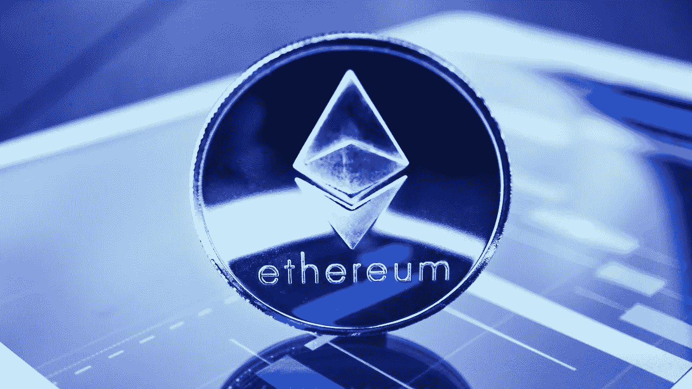
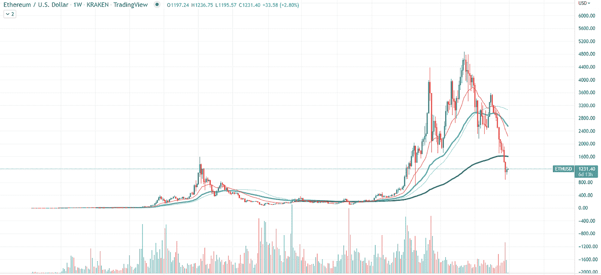

# 以太坊在图表上找到新的技术支持

> 原文：<https://medium.com/coinmonks/ethereum-finds-new-technical-support-on-chart-983f286e69b0?source=collection_archive---------56----------------------->

根据彭博的一篇文章，市场上第二大加密货币已经找到了逆转的基础。乙醚跌至 880 美元，导致市场上出现一系列大规模清算，这给资产的表现带来了更大的压力。

6 月 19 日，ETH 在周日成功反弹至 1，279 美元，然后回撤至 1，200 美元，这仍然是 ETH 的关键支撑区。方便的是，200 WMA 正好位于上述价格，这就是为什么第二大加密货币在过去 4 天内巩固。

正如文章所言，代币已经“脱离了一周前的最差水平”，现在显示出一些稳定的迹象。U.Today 之前提到了 Dogecoin 在加密货币市场上的成功，因为 meme currency 在过去 24 小时内成功地成为了市值最高的 100 种加密货币中最赚钱的资产。

但是，尽管该资产舒适地位于支撑位，但加密货币市场没有足够的购买力来推高第一个通常很弱的 21 天移动平均线。

成交量指标还表明，乙醚在市场上表现不佳，因为流入该资产的资金仍处于低水平，形成了成交量下降的趋势，这是即将发生熊市反转的第一个信号。

不幸的是，以太坊要被视为逆转甚至巩固的资产还有很长的路要走，因为它自 4 月以来一直处于急剧下降趋势，需要在 200 WMA 以上站稳脚跟。

点击这里关注我们了解更多故事[。](http://t.me/etellworld)

> 加入 Coinmonks [电报频道](https://t.me/coincodecap)和 [Youtube 频道](https://www.youtube.com/c/coinmonks/videos)了解加密交易和投资

# 另外，阅读

*   [Bitsgap 审查](/coinmonks/bitsgap-review-a-crypto-trading-bot-that-makes-easy-money-a5d88a336df2) | [Quadency 审查](/coinmonks/quadency-review-a-crypto-trading-automation-platform-3068eaa374e1) | [Bitbns 审查](/coinmonks/bitbns-review-38256a07e161)
*   [密码本交易平台](/coinmonks/top-10-crypto-copy-trading-platforms-for-beginners-d0c37c7d698c) | [Coinmama 审核](/coinmonks/coinmama-review-ace5641bde6e)
*   [印度的加密交易所](/coinmonks/bitcoin-exchange-in-india-7f1fe79715c9) | [比特币储蓄账户](/coinmonks/bitcoin-savings-account-e65b13f92451)
*   [OKEx vs KuCoin](https://coincodecap.com/okex-kucoin) | [摄氏替代度](https://coincodecap.com/celsius-alternatives) | [如何购买 VeChain](https://coincodecap.com/buy-vechain)
*   [币安期货交易](https://coincodecap.com/binance-futures-trading)|[3 commas vs Mudrex vs eToro](https://coincodecap.com/mudrex-3commas-etoro)