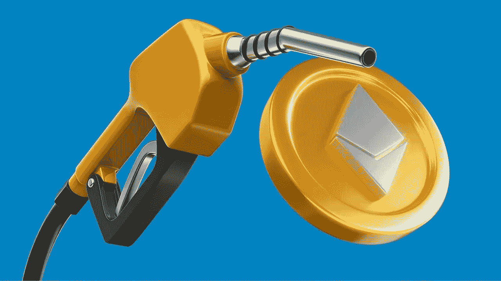

# 以太坊燃气费 60 秒讲解

> 原文：<https://medium.com/coinmonks/ethereum-gas-fees-explained-in-60-seconds-bba98f3844e8?source=collection_archive---------60----------------------->

当您看到一个在钱包中转移乙醚的交易，并看到执行该操作需要收费时，您可能会感到困惑。这笔费用被称为“汽油”

那么什么是气体，它有什么作用呢？气体是一种加密燃料，在以太坊区块链进行交易时需要支付。

如果你想在以太坊上转账、交易或执行任何其他操作，你需要向网络支付一小部分以太，或者换句话说，气体。

天然气价格用 gwei 表示，gwei 本身是 ETH 的一个单位；每个 gwei 等于 0.000000001 ETH。例如，不要说你的汽油值 0.000000001 乙醚，你可以说你的汽油值 1 gwei。“卫”这个词本身的意思是“十亿卫”，它等于十亿卫。卫本身就是联邦理工学院的最小单位。

气不仅仅是一些没有意义的度量，也不需要你盲目的去遵循。它本质上是一种对网络上的事务进行优先级排序的机制。

 [## 你准备好迎接加密经济了吗？加密派

### 每次你打开新闻，阅读报纸，或者浏览你的推特，你很可能会看到一些故事…

www.thecryptopie.com](https://www.thecryptopie.com/) 

> 加入 Coinmonks [电报频道](https://t.me/coincodecap)和 [Youtube 频道](https://www.youtube.com/c/coinmonks/videos)了解加密交易和投资

# 另外，阅读

*   [SmithBot 评论](https://coincodecap.com/smithbot-review) | [4 款最佳免费开源交易机器人](https://coincodecap.com/free-open-source-trading-bots)
*   [比特币基地僵尸程序](/coinmonks/coinbase-bots-ac6359e897f3) | [AscendEX 审查](/coinmonks/ascendex-review-53e829cf75fa) | [OKEx 交易僵尸程序](/coinmonks/okex-trading-bots-234920f61e60)
*   [如何在印度购买比特币？](/coinmonks/buy-bitcoin-in-india-feb50ddfef94) | [瓦济克斯审查](/coinmonks/wazirx-review-5c811b074f5b)
*   [隐翅虫替代品](/coinmonks/cryptohopper-alternatives-d67287b16d27) | [HitBTC 审查](/coinmonks/hitbtc-review-c5143c5d53c2)
*   [CBET 评论](https://coincodecap.com/cbet-casino-review) | [库科恩 vs 比特币基地](https://coincodecap.com/kucoin-vs-coinbase)
*   [折叠 App 审核](https://coincodecap.com/fold-app-review) | [Kucoin 交易机器人](/coinmonks/kucoin-trading-bot-automate-your-trades-8cf0ca2138e0) | [Probit 审核](https://coincodecap.com/probit-review)
*   [如何匿名购买比特币](https://coincodecap.com/buy-bitcoin-anonymously) | [比特币现金钱包](https://coincodecap.com/bitcoin-cash-wallets)