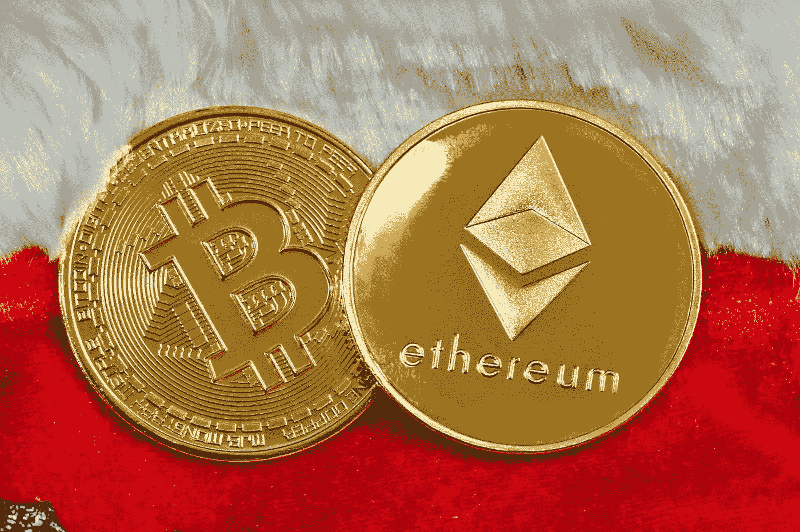

# 以太坊正处于低谷——是时候投入进去了

> 原文：<https://medium.com/coinmonks/ethereum-is-at-a-trough-time-to-dive-in-749876d8897e?source=collection_archive---------13----------------------->

## Cryptos

## 以太坊位于 1000 美元的重要心理价位附近，是买入的时候了

Photo by [Quantitatives](https://unsplash.com/@quantitatives?utm_source=medium&utm_medium=referral) on [Unsplash](https://unsplash.com?utm_source=medium&utm_medium=referral)

*   **以太坊(**[**)^ethusd**](https://www.barchart.com/crypto/quotes/%5EETHUSD)**)**截至 6 月 21 日，过去 30 天下跌超过 43%。
*   这是一场认证的血战——不分青红皂白的销售将以太坊推得比其他任何主要的密码都要糟糕…