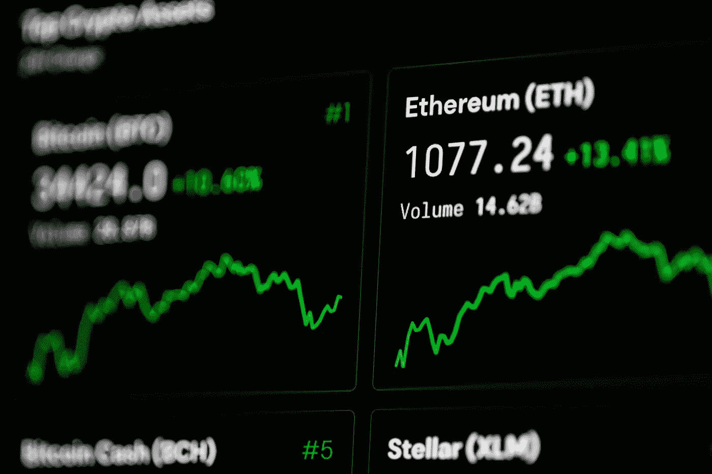

# 以太坊很可能会反弹

> 原文：<https://medium.com/coinmonks/ethereum-is-likely-to-rebound-53e449c3e0c5?source=collection_archive---------2----------------------->

## Cryptos

## 尽管存在问题，加密货币仍然非常受欢迎

Photo by [Bram van Oosterhout](https://www.pexels.com/@bram-van-oosterhout-18650409?utm_content=attributionCopyText&utm_medium=referral&utm_source=pexels) from [Pexels](https://www.pexels.com/photo/close-up-shot-of-computer-screen-6478886/?utm_content=attributionCopyText&utm_medium=referral&utm_source=pexels)

**以太坊** (ETH-USD)在 1 月底触底后，目前正在反弹。在 11 月 7 日达到 4812.09 美元的峰值后，ETH crypto 在 1 月 24 日跌至 2211.01 美元的低点。但自那以后，截至 2 月 4 日周五，以太坊的价格回升至略低于 3000 美元(合 2988.55 美元)。