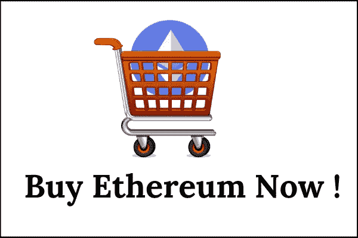
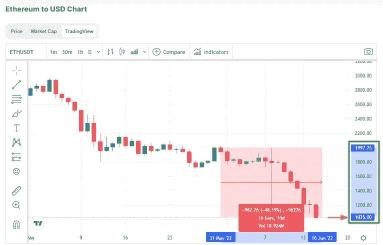
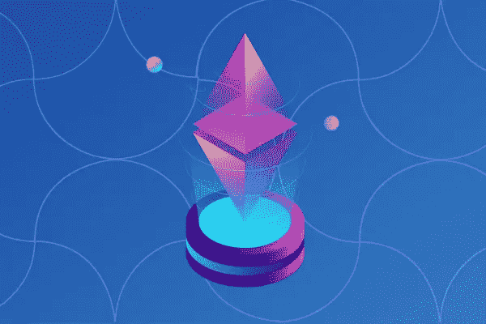
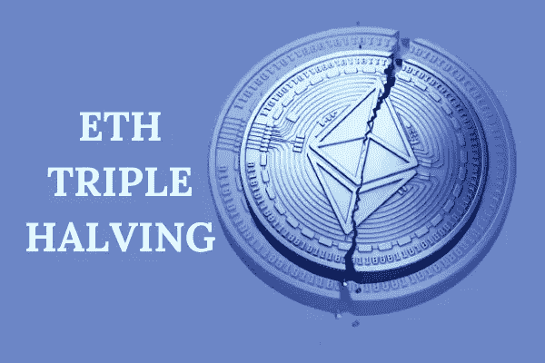
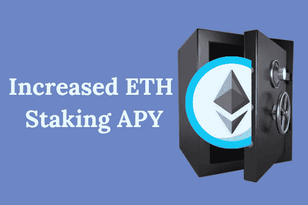
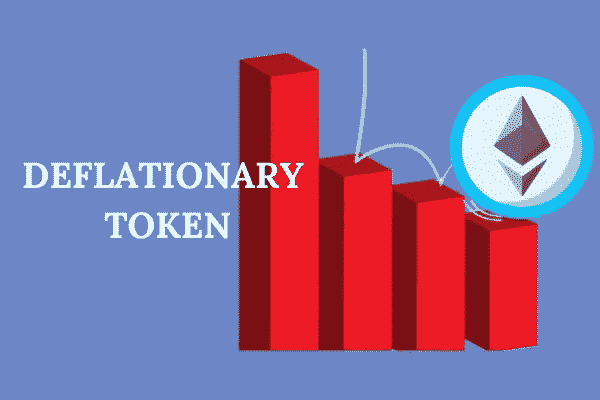
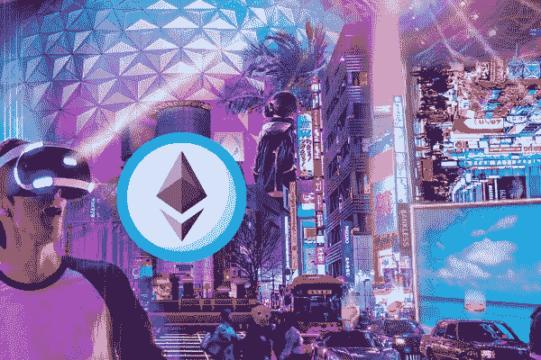
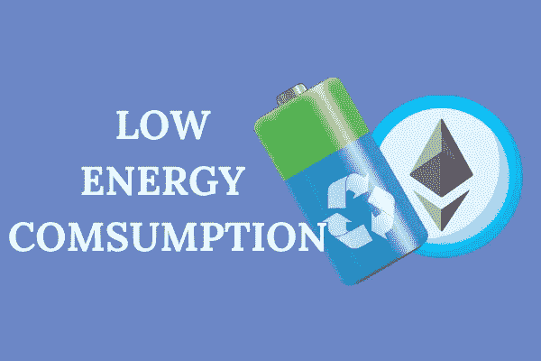
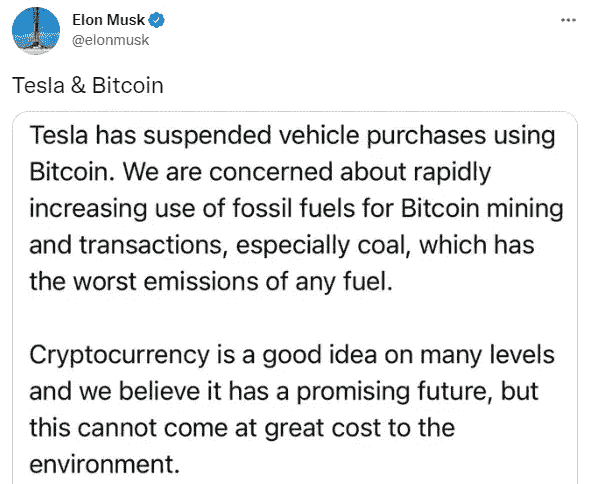

# 以太坊正在成为趋势——以下是你现在应该购买以太坊的 5 个理由！

> 原文：<https://medium.com/coinmonks/ethereum-is-trending-here-are-5-reasons-why-you-should-buy-eth-now-73e81174bf7e?source=collection_archive---------74----------------------->

Buy Ethereum

在这篇文章中，我分享了你现在应该购买 ETH 的 5 个理由。

由于对 ETH 2.0 发布的期待，以太坊最近出现在新闻中。

ETH 2.0 承诺为目前区块链以太坊面临的问题带来持久的解决方案。

有趣的是，专家们猜测，更新完成后，以太坊的表现将超过比特币。

*嗯…* 如果发生这种情况，那么这是一个堆积 ETH 的好时机(尤其是在这次下跌中)。

Charts Price Movement

你准备好知道为什么你现在应该买 ETH 了吗？让我们进入正题。

# 首先，让我们谈谈合并…

The Merge

合并是以太坊区块链从工作证明共识机制过渡到[利益证明](https://www.nigeriabitcoincommunity.com/pow-vs-pos/)共识机制的通俗说法。

目标是让区块链更快更节能。

此外，它将为用户提供更低的交易费用。

这令人兴奋，因为这将有助于以太坊更快地扩大规模，并赋予其更多竞争优势。

难怪许多人猜测以太坊可能会超过比特币(比特币仍然使用 PoW 协议)。

合并目前处于三个阶段的第二阶段，预计将于 2022 年 8 月完成。

*惊艳！*

***【建议阅读:*** [*工作证明与利害关系证明——哪个是更好的共识机制？*](https://www.nigeriabitcoincommunity.com/pow-vs-pos/)

*继续，让我们看看你应该开始堆积以太坊的 5 个理由。*

**继续读！**

# *你现在应该购买 ETH 的 5 个理由*

# *1.ETH 三等分*

**

*ETH Triple Halving*

*减半是指在一段时间后减少矿工的块奖励。*

*通常减少一半。并且它以均匀的频率发生，直到达到硬币的最大供应量。*

*减半有助于实现新硬币供应量的减少。*

*这导致了稀缺性，并最终增加了硬币的价值。*

*现在，比特币在减半的硬币名单中名列前茅。*

*自推出以来，已经有 3 个比特币半。*

*最初，比特币矿工的奖励是 50 BTC，但现在是 6.25 BTC。*

*3 减半导致比特币矿工奖励数量减少 87.5%。*

*至于以太坊，合并后矿工作为奖励获得的以太数量将减少 90%。*

*这相当于 3 个比特币减半，因此，它被称为三倍减半。*

> *交易新手？试试[加密交易机器人](/coinmonks/crypto-trading-bot-c2ffce8acb2a)或者[复制交易](/coinmonks/top-10-crypto-copy-trading-platforms-for-beginners-d0c37c7d698c)*

***为什么这很重要？***

*从历史上看，每次比特币减半，都会在几个月内创下历史新高。*

*因此，以太坊的三倍减半极有可能导致历史新高。*

*考虑到这一点，这可能是一个明智的时间来积累以太坊，看看你的钱包在未来几个月膨胀。*

****【建议阅读:****[*比特币减半正在改变加密——这是减半的硬币的完整列表*](https://www.nigeriabitcoincommunity.com/coins-that-halve/)*】***

# **2.增加了 APY 的 ETH 赌注**

****

**ETH APY**

**你现在应该购买以太坊的第二个原因是 APY 增加了以太坊的赌注。**

**通常，工作证明协议中的矿工通过两种方式赚钱:我前面提到的整体奖励和交易费。**

**合并之后，交易费将不再流向以太坊矿商，而是流向赌注者。**

**这将潜在地增加[赌注回报](https://www.stakingrewards.com/earn/ethereum-2-0/)从目前 4%的 APY 到 9-12%的 APY。*哇！***

**同样，工作证明矿工被迫出售他们的 ETH 来支付电费和维护他们的硬件。**

**但是有了利害关系证明，就没有硬件可以维护了。**

**因此，在 PoS 协议中成为验证者的矿工只需要以 9-12% APY 的利率来获得更多的 ETH。**

**如果你担心之前的 ETH 股东会在合并完成后立即卖掉它，导致硬币价格暴跌，那就不用担心了！**

**因为在合并后，赌注者不能取消他们的 ETH，直到在合并后几个月发生的[额外升级](https://cryptoslate.com/will-26b-staked-in-eth-2-0-be-unlocked-and-sold-after-the-merge/)之后。耶！**

**因此，APY 和对 ETH 需求的增加，以及合并后没有卖出压力是开始增持 ETH 的重要原因。**

# **3.合并后，瑞士联邦理工学院将变得通货紧缩**

****

**Deflationary Nature**

**你现在应该购买 ETH 的另一个原因是，合并后它将成为通货紧缩的象征。**

**当一枚硬币的总流通供应量不断减少时，它就是通货紧缩的。**

**可以通过烧硬币或者用木桩固定来实现。**

**这个想法是，减少的供应和增加的需求将导致硬币价格的上升。**

**对于以太坊来说，三重 having、无法收回赌注的 ETH 和 [EIP-1559 标准](https://selfkey.org/eip-1559-all-you-need-to-know/#:~:text=EIP%2D1559%20is%20a%20core,congestion%20of%20the%20Ethereum%20network.)(旨在提高 ETH 的开采速度并激励它)的结合，将把通缩引入以太坊令牌组学。**

*****下面介绍:*****

**该网络预计每年生产 100 万 ETH(目前约为 1300 万 ETH ),每年燃烧 310 万 ETH。**

**这已经是燃烧净减少 210 万。**

**很酷，是吧？**

*****【建议阅读:****[*通缩令牌—完整列表(2022) |什么是通缩令牌？*](https://www.nigeriabitcoincommunity.com/deflationary-tokens/)***

# ***4.ETH 可以在元宇宙发挥重要作用***

******

***Metaverse***

***元宇宙是当今最热门的投资话题之一。***

***你已经知道开发者可以在以太坊上构建从 DeFi 应用到 NFT 等等的任何东西。***

***元宇宙主要擅长这些类型的应用。***

***不用说，以太坊是这个领域最大的玩家之一。***

***事实上，元宇宙、分散地和[沙盒](https://www.nigeriabitcoincommunity.com/sandbox-review/)中的两个环头都是在以太坊区块链建造的。***

***随着合并的到来，以太坊可能会成为整个元宇宙的力量。***

***尽管元宇宙目前仍处于推测阶段，但如果它真的成功了，以太坊将是一个主要的贡献者。***

***此外，随着以太坊向股权证明的过渡，更多的应用可能会部署在其上。***

***你知道吗？这意味着如果你现在开始累积以太坊，你将赢得更多。*超赞！****

*****【建议阅读:*** [*GameFi 讲解——如何从区块链游戏中赚钱*](https://www.nigeriabitcoincommunity.com/gamefi-explained/)*】***

# **5.降低能耗**

****

**Low energy consumption**

**最后，你应该现在就买 ETH，因为合并会导致能源消耗的减少。**

**研究表明，以太坊过渡到股权证明将减少 99%以上的电力消耗。**

**这是因为以太坊网络不需要比笔记本电脑更多的电力。**

**因此，以太坊将变得环保。**

**如果你一直在关注新闻，你会注意到近年来投资者只想把钱投在环保公司。**

**还记得 Elon Musk 曾经在这方面发了一条推文，他说，“特斯拉已经暂停使用比特币购买车辆”，因为比特币采矿对环境造成了危害。**

****

**Elon’s Tweet**

**随着以太坊过渡到股权证明，这将不再是一个问题。**

**因此，让关心环境的机构更容易在以太坊上投资和建设。**

**当然，这将导致需求增加，最终导致价格上涨。耶！**

**这就是你现在应该购买以太坊的 5 个理由。**

**但是我们还没完。**

***继续读！***

# **现在购买以太坊的最佳方式**

**我建议你使用 [DCA](https://www.nigeriabitcoincommunity.com/dollar-cost-averaging/) 策略购买这枚硬币，即美元成本平均法。**

**这意味着你将定期购买一定数量的 ETH，以获得一个平均的好价格。**

**一个很好的地方，你可以这样做是在币安汽车投资。**

**在这里，硬币会自动以你的名义购买并下注，这样你就可以从中赚取利息。**

**我们有关于 DCA 和币安汽车投资公司的综合文章。**

**你可以点击下面的链接阅读它们，更清楚地了解我在说什么:**

*   **[什么是成本平均法(DCA)？|为什么你应该开始使用这种投资策略](https://www.nigeriabitcoincommunity.com/dollar-cost-averaging/)**
*   **[币安自动投资—停止猜测，开始赚取加密！](https://www.nigeriabitcoincommunity.com/auto-invest-binance/)**

**尽管如此，我不是一个金融顾问，在投资任何硬币之前都要做尽职调查。**

# **密码交易变得简单！**

****

**Ctmastery**

# **结论**

**这就是我们要在这里拉窗帘的地方。我希望你喜欢读它。**

**现在，我很想听听你的意见。你对合并有什么看法，你现在会收购 ETH 吗？**

**请在下面的评论区告诉我。**

**此外，使用下面的社交媒体图标与您的朋友分享这篇文章。**

***谢谢！***

***最初发表于*[*https://www.nigeriabitcoincommunity.com*](https://www.nigeriabitcoincommunity.com/buy-eth-now/)**

> **加入 Coinmonks [电报频道](https://t.me/coincodecap)和 [Youtube 频道](https://www.youtube.com/c/coinmonks/videos)了解加密交易和投资**

# **另外，阅读**

*   **[最佳加密交换平台](https://coincodecap.com/best-crypto-swap-platforms) | [最佳加密交易所](https://coincodecap.com/crypto-exchange)**
*   **[购买比特币印度](/coinmonks/buy-bitcoin-in-india-feb50ddfef94) | [Pionex 评论](/coinmonks/pionex-review-exchange-with-crypto-trading-bot-1e459d0191ea) | [加密交易机器人](/coinmonks/crypto-trading-bot-c2ffce8acb2a)**
*   **[n 平均零点评审](/coinmonks/ngrave-zero-review-c465cf8307fc) | [Phemex 评审](/coinmonks/phemex-review-4cfba0b49e28) | [PrimeXBT 评审](/coinmonks/primexbt-review-88e0815be858)**
*   **最佳[区块链分析](https://bitquery.io/blog/best-blockchain-analysis-tools-and-software)工具| [赚比特币](/coinmonks/earn-bitcoin-6e8bd3c592d9)**
*   **[Cloudbet 赌场评论](https://coincodecap.com/cloudbet-casino-review) | [点火赌场评论](https://coincodecap.com/ignition-casino-review)**